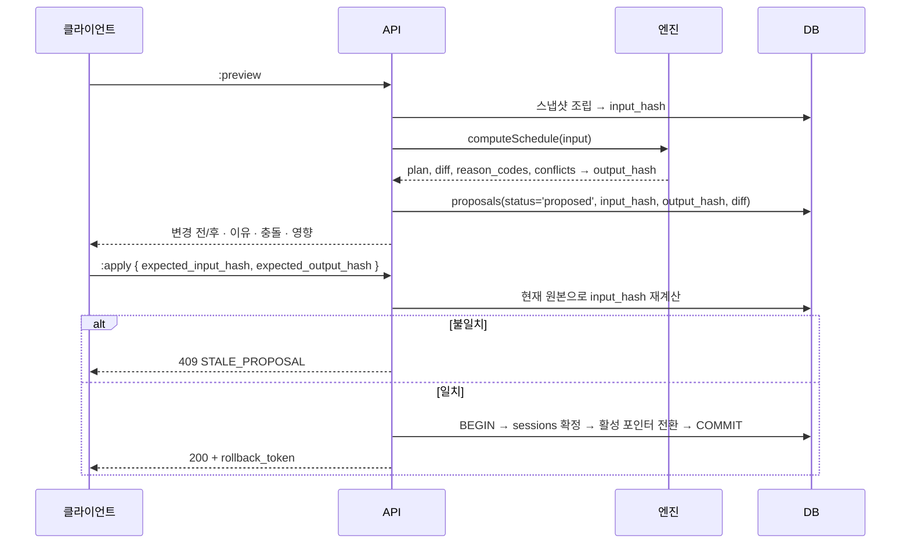

# ADR-0007 — 일정 엔진의 결정론과 버전 관리

| 항목 | 값 |
|---|---|
| 상태 | **채택됨** (2026-07-31) |
| 관련 | [sequences.md](../phase0/sequences.md) S-1·S-2 · [state-machines.md](../phase0/state-machines.md) · [api-contract.md](../phase0/api-contract.md) 5.2 |

---

## 맥락

수맥의 노스스타는 "선생님이 수업 준비와 일정 재작성에 쓰는 시간을 줄이는 것"이다. 일정 엔진이 제품의 심장이다.

동시에 가장 위험한 컴포넌트다. 잘못된 일정을 대량 생성하면([failure-modes.md](../phase0/failure-modes.md) F-04) 수천 명의 학습 계획이 한 번에 망가진다. 골프롬프트가 요구하는 것:

| 요구 | 근거 |
|---|---|
| 같은 입력 스냅샷·엔진 버전·시드 → 같은 결과 해시 | 불변 조건 I-12 |
| 완료된 과거 일정은 재계산하지 않음 | 불변 조건 I-05 |
| 하드 제약 위반 불가 | 불변 조건 I-06 |
| preview → apply, 그 사이 원본이 바뀌면 적용 거부 | 골프롬프트 2G |
| 전역 잠금 금지, 범위 lease 사용 | 골프롬프트 2H |
| 자동 결정은 이유·영향·되돌리기와 함께 | 제품 원칙 6 |

"결정론"을 요구하는 실질적 이유는 셋이다.

1. **재현**: 사고 시 같은 입력으로 같은 결과를 만들어 원인을 찾는다.
2. **검증**: preview에서 본 것이 apply에서 그대로 나온다는 보장.
3. **신뢰**: 교사가 같은 조건에서 같은 답을 얻는다.

## 결정

### 1. 엔진은 순수 함수다

```ts
// packages/core/src/scheduling/engine.ts
export function computeSchedule(input: ScheduleInput): ScheduleOutput;
```

`ScheduleInput`은 **불변 스냅샷**이며 다음을 전부 포함한다.

| # | 입력 | 형태 |
|---|---|---|
| 1 | 루트 버전 | `RouteVersionSnapshot` (노드 배열, `content_hash` 포함) |
| 2 | 수업 달력 버전 | `CalendarSnapshot` (`calendar_rules` + `holidays` + `teacher_availabilities`) |
| 3 | 학습 그룹 소속 스냅샷 | `GroupMembershipSnapshot` |
| 4 | 학생 오버라이드 | `StudentOverride[]` (버전 포함) |
| 5 | 완료 진도 기준 시각 | `baselineAt: Date` |
| 6 | 평가·학습량 정책 버전 | `PolicySnapshot` |
| 7 | 워크스페이스 시간대 | `timezoneId: string` (IANA) |
| 8 | 엔진 버전 | `engineVersion: string` |
| 9 | 난수 시드 | `seed: string` |
| 10 | 기존 미래 일정 | `ExistingSession[]` (잠금·완료 표시 포함) |

**엔진 내부에서 금지되는 것**:

| 금지 | 강제 |
|---|---|
| `Date.now()`, `new Date()` (인자 없음) | ESLint `no-restricted-globals` (`packages/core/**`) |
| `Math.random()`, `crypto.randomUUID()` | 동일 |
| `process.env` | 동일 |
| `fetch`, DB 접근 | `packages/core`는 `packages/db`를 import 불가 (ESLint 경계 B-3) |
| 정렬되지 않은 컬렉션 순회 | 모든 입력 배열은 조립 시 정렬. `Map`·`Set` 순회 전 명시 정렬 |
| 부동소수점 누적 비교 | 시간·학습량은 정수(분) 단위 |

### 2. 시드 사용 규약

난수가 필요한 곳(동점 항목 선택, 균등 분배 타이브레이커)은 시드 기반 PRNG를 쓴다.

```ts
// xoshiro128** — 결정론적, 플랫폼 독립
const rng = createSeededRng(`${input.seed}:${scopeId}:${phase}`);
```

시드 파생은 `H(seed, scopeId, phase)`로 한다. 같은 계산의 다른 단계가 같은 난수열을 쓰지 않게 한다.

### 3. 해시 계약

```
input_hash  = SHA256( canonicalJson(ScheduleInput) )
output_hash = SHA256( canonicalJson(ScheduleOutput.plan) )
```

`canonicalJson`: 객체 키 정렬, 배열 순서 유지, 숫자는 정수·고정 소수점, 날짜는 ISO 8601 UTC, `undefined` 제거.

**보장**: `(input_hash, engineVersion, seed)`가 같으면 `output_hash`도 같다. 속성 테스트 1,000회로 검증한다.

### 4. 제약 분류 (확정)

| 하드 제약 (위반 결과 생성 불가) | 소프트 제약 (비용 함수) |
|---|---|
| 휴일·수업 불가일 | 선호 요일 |
| 잠금(`is_locked`)·완료(`status='completed'`) | 균등한 학습량 |
| 교사 시간 충돌 | 버퍼 차시 확보 |
| 학습 그룹 시간 충돌 | 목표 종료일 근접 |
| 학생 시간 충돌 | **기존 미래 일정 변경 최소화** |
| 수업 가능일(`calendar_rules`) | 확인테스트 간격 균등 |
| 하루 학습량 상한(`max_daily_load_minutes`) | 복습 예산 준수 |
| 선수 관계(강한 `PREREQUISITE`) 순서 | 개인 분기 길이 최소화 |

하드 제약은 **생성 단계에서 필터**하고, DB의 `EXCLUDE USING gist` 제약이 최종 차단한다. 소프트 제약은 가중 비용 함수로 평가하며, 가중치는 `PolicySnapshot`에 담긴다(코드 상수 아님).

**소프트 제약 기본 가중치**:

| 제약 | 가중치 |
|---|---|
| 기존 미래 일정 변경 최소화 | 100 (가장 큼 — 불필요한 변경을 만들지 않는다) |
| 목표 종료일 초과 | 60 |
| 하루 학습량 편차 | 40 |
| 선호 요일 위반 | 20 |
| 버퍼 소진 | 15 |
| 개인 분기 길이 | 10 |

### 5. preview → apply



**둘 다 일치할 때만 적용한다.** `input_hash`만 검사하면 저장된 결과가 손상됐을 때를 못 잡고, `output_hash`만 검사하면 원본 변경을 못 잡는다.

### 6. 동시성 — 범위 lease

**전역 잠금을 쓰지 않는다.**

```sql
CREATE TABLE compute_leases (
  organization_id uuid NOT NULL,
  scope_type      text NOT NULL,     -- learning_group | student
  scope_id        uuid NOT NULL,
  period_from     date NOT NULL,
  period_to       date NOT NULL,
  holder          text NOT NULL,
  expires_at      timestamptz NOT NULL,
  PRIMARY KEY (organization_id, scope_type, scope_id, period_from)
);
```

| 항목 | 값 |
|---|---|
| lease 범위 | 계획 범위(학습 그룹 또는 학생) × 기간 단위 |
| lease 기간 | 5분. 워커가 30초마다 갱신 |
| 획득 실패 | `409 SCOPE_BUSY` + `Retry-After` |
| 만료 처리 | `expires_at < now()`면 다른 워커가 획득 가능 |

서로 다른 학습 그룹의 재계산은 **동시에 진행된다.** 이것이 전역 잠금을 피하는 이유다.

### 7. 결과 구조

```ts
interface ScheduleOutput {
  plan: SessionPlan[];              // 해시 대상
  diff: {
    created: SessionRef[];
    moved: { ref: SessionRef; from: Iso8601; to: Iso8601 }[];
    cancelled: SessionRef[];
    unchanged_locked: SessionRef[]; // 잠금·완료로 건드리지 않은 것
  };
  reasonCodes: ReasonCode[];         // ABSENCE_MAKEUP, PREREQUISITE_GAP, DAILY_LOAD_REBALANCE, ...
  conflicts: Conflict[];             // 해결하지 못한 하드 제약
  affected: { studentIds: Uuid[]; endDateBefore: Date; endDateAfter: Date };
  metrics: { softCost: number; iterations: number; durationMs: number };
}
```

**변경 이유 코드**는 화면과 감사 로그에 그대로 표시된다. "왜 이 수업이 옮겨졌나"에 답할 수 있어야 한다.

### 8. 엔진 버전 관리

| 항목 | 규칙 |
|---|---|
| 형식 | `YYYY.MM.N` (예: `2026.07.3`) |
| 증가 조건 | **결과가 달라질 수 있는 모든 변경.** 리팩터링도 결과가 같음을 골든 테스트로 증명하지 못하면 증가 |
| 저장 | `schedule_change_proposals.engine_version` |
| 병행 | 새 버전 배포 후에도 기존 `proposed` 제안은 **원래 버전으로 계산된 결과**를 유지. apply 시 버전 불일치면 재계산 요구 |
| 승격 | ① 골든 시나리오 200건 회귀 ② 그림자 실행(shadow) 7일 — 신·구 결과 diff 기록 ③ 카나리 10% ④ 전면 |
| 롤백 | 환경변수 `SCHEDULE_ENGINE_VERSION` 고정으로 즉시 이전 버전 |

**골든 시나리오 200건**: 실제 운영에서 나온 입력 스냅샷을 익명화해 고정한다. 각 시나리오는 `(input, expectedOutputHash, expectedDiff)`를 가진다.

### 9. 성능 목표

| 규모 | 목표 (SLO O-03) |
|---|---|
| 학생 50명 · 미래 일정 1,000건 | 95% 60초, 99% 5분 |

계산 시간이 목표를 넘으면 **순서**: ① 하드 제약 사전 필터 강화 ② lease 범위 세분화(학습 그룹 → 학생) ③ 소프트 제약 반복 횟수 상한 ④ 워커 병렬(범위별). 엔진을 비결정론적으로 만드는 최적화는 **하지 않는다**.

## 대안

| 대안 | 장점 | 채택하지 않은 이유 |
|---|---|---|
| **A. 비결정론적 휴리스틱 (현재 시각·랜덤 사용)** | 구현 단순, 빠름 | ① preview와 apply 결과가 달라진다 — 교사가 본 것과 다른 일정이 적용됨 ② 사고 재현 불가 ③ 불변 I-12 위반 |
| **B. 제약 프로그래밍 솔버 (OR-Tools 등)** | 최적해, 표현력 | ① Python·C++ 런타임 추가 → ADR-0002의 S-3 조건 발생 ② 솔버 버전에 따라 결과가 달라질 수 있음(결정론 보장이 어려움) ③ 타임아웃 시 부분해 처리가 복잡 ④ 수맥의 제약은 솔버가 필요할 만큼 복잡하지 않다 |
| **C. LLM 기반 일정 생성** | 자연어 설명 가능 | ① 비결정론 ② 하드 제약 위반 가능 ③ AI 공급자 장애가 핵심 기능을 멈춤(F-01 위반) ④ 재현 불가 |
| **D. 규칙 기반 + 결정론 (채택)** | 재현·검증·설명 가능. 외부 런타임 없음 | — |
| **E. preview 없이 즉시 적용** | 단계 하나 절약 | 교사가 영향을 모른 채 적용. 제품 원칙 6("변경 전후와 되돌리기") 위반 |
| **F. 전역 잠금으로 동시성 해결** | 구현 단순 | 조직 하나가 재계산 중이면 다른 조직도 대기. 골프롬프트 2H가 명시적으로 금지 |
| **G. 낙관적 동시성만 (lease 없음)** | 잠금 없음 | 같은 범위를 여러 워커가 동시 계산 → 낭비 + apply 경합. lease가 낭비를 막는다 |
| **H. 엔진 버전 없이 항상 최신** | 단순 | 배포 중 preview는 v1, apply는 v2로 계산되어 결과가 달라진다. stale 검사가 무의미해짐 |

## 비용

| 항목 | 비용 |
|---|---|
| 개발 | 순수 함수 제약, 스냅샷 조립, 해시 계약, lease 관리 (약 2,500줄) |
| 테스트 | 속성 테스트 6종 + 골든 시나리오 200건. 실행 시간 약 90초 |
| 스냅샷 조립 | 계산 전 10개 입력 조회. 대형 그룹에서 약 300ms |
| 저장 | `schedule_change_proposals`의 `diff` jsonb. 제안당 평균 12 KB. 1일 1,200건 = 14 MB/일 |
| 성능 제약 | 최적화 옵션이 제한됨(비결정론적 기법 사용 불가) |
| **얻는 것** | 재현 가능한 사고 조사, preview 신뢰, 안전한 엔진 업그레이드 |

## 실패 방식

| # | 어떻게 실패하는가 | 조기 신호 | 대응 |
|---|---|---|---|
| F-1 | 무심코 `Date.now()`·`Math.random()` 유입 | ESLint 실패 | CI 게이트. 속성 테스트가 2차 방어 |
| F-2 | 정렬되지 않은 컬렉션 순회로 비결정론 | 결정성 속성 테스트 간헐 실패 | 입력 조립 시 전부 정렬. `Map` 순회 전 `[...map].sort()` |
| F-3 | 부동소수점 누적으로 해시 불일치 | 같은 입력에 다른 `output_hash` | 시간·학습량은 정수(분). 비용 함수만 부동소수점이고 결과에 들어가지 않음 |
| F-4 | 잘못된 일정 대량 생성 | `mass_schedule_change` > 5,000건/시간 | `auto_reschedule` kill switch. 이전 활성 일정은 유지되므로 rollback_token으로 복구 |
| F-5 | 하드 제약 위반 결과가 생성됨 | DB EXCLUDE 제약 위반(`23P01`) | apply가 실패하고 이전 일정 유지. 속성 테스트가 사전 검출 |
| F-6 | stale preview가 적용됨 | 없음 — 이것이 위험 | `input_hash` **재계산** 후 비교. 저장값 비교만 하면 안 됨 |
| F-7 | lease 만료 중 계산 완료 → 두 결과 경합 | 같은 범위에 `proposed` 2건 | apply 시 `output_hash` 검증이 걸러냄. 나중 것이 409 |
| F-8 | 계산 시간이 SLO 초과 | O-03 위반 | 범위 세분화 → 반복 상한 → 병렬. 결정론은 유지 |
| F-9 | 엔진 버전 업그레이드가 기존 제안을 깨뜨림 | apply 시 버전 불일치 409 급증 | 배포 후 기존 `proposed` 제안 일괄 무효화 + 재계산 안내 |
| F-10 | 골든 시나리오가 실제 케이스를 못 덮음 | 운영에서 새 유형 오류 발견 | 새 실패를 **최소 재현 시나리오**로 골든에 추가. 특정 그룹 ID를 하드코딩한 예외 규칙은 만들지 않는다 |

## 되돌리기

| 방향 | 방법 | 비용 |
|---|---|---|
| 소프트 제약 가중치 조정 | `PolicySnapshot` 변경 — **배포 없이** | 매우 낮음 |
| 엔진 버전 롤백 | `SCHEDULE_ENGINE_VERSION` 환경변수 | 낮음 (즉시) |
| 적용된 일정 되돌리기 | `rollback_token`의 역방향 제안 apply | 낮음 |
| 대량 잘못 적용 복구 | RB-02 런북. 최악의 경우 PITR | 중간~높음 |
| 결정론 포기 | **되돌리지 않는다.** preview 신뢰가 무너진다 | — |
| 순수 함수 → DB 접근 허용 | **되돌리지 않는다.** 테스트·재현이 불가능해진다 | — |
| 솔버 기반으로 전환 | `computeSchedule` 시그니처 유지하고 내부만 교체. 결정론 보장은 별도 검증 필요 | 높음 |

`computeSchedule(input): output` 순수 함수 시그니처가 이 ADR의 되돌리기 여지다. 내부 알고리즘은 언제든 바꿀 수 있고, 골든 시나리오 200건이 안전망이 된다.
