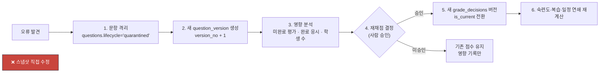

# ADR-0008 — 루트·평가·문항 스냅샷

| 항목 | 값 |
|---|---|
| 상태 | **채택됨** (2026-07-31) |
| 관련 | [erd.md](../phase0/erd.md) · [state-machines.md](../phase0/state-machines.md) · [ADR-0009](./0009-grading-mastery-regrade.md) · [ADR-0013](./0013-renderer-versions-and-publish-gate.md) |

---

## 맥락

문항은 살아 있는 데이터다. 오타가 고쳐지고, 정답이 정정되고, 개념 매핑이 개선되고, 정규화 규칙이 바뀌고, KaTeX 버전이 올라간다.

시험은 죽어 있어야 한다. 8월 5일에 학생이 본 문항은 8월 20일에 교사가 채점 이력을 열었을 때 **글자 하나까지 같아야** 한다.

이 둘이 같은 행을 참조하면 반드시 사고가 난다.

| 시나리오 | 참조만 있을 때 |
|---|---|
| 시험 후 문항 오타 수정 | 학생이 본 문제와 채점 근거가 달라진다 |
| 정답 정정 | 이미 채점된 답안의 근거가 소급 변경된다 |
| KaTeX 업그레이드 | 과거 시험의 수식 모양이 바뀐다 |
| 정규화 규칙 개선 | 과거 시험의 수식 의미가 바뀔 수 있다 |
| 개념 매핑 변경 | 과거 숙련도 증거의 가중치가 소급 변경된다 |
| 교육과정 릴리스 | 과거 루트가 새 버전으로 자동 재매핑된다 |
| 문항 격리 | 이미 응시한 시험에서 문항이 사라진다 |

골프롬프트 2I가 요구하는 것: 평가 게시 시 **12가지를 고정**한다.

## 결정

**게시 = 스냅샷 생성. 게시된 것은 불변이다.**

### 1. 3계층 불변성

| 계층 | 대상 | 불변 시점 | 저장 방식 |
|---|---|---|---|
| **루트** | `route_versions` + `route_nodes` | `status='published'` | 새 `version_no`로만 수정 |
| **평가** | `assessment_questions` | `assessment_instances.status='published'` | **내용 사본**(`content_snapshot` jsonb) |
| **문항** | `question_versions` | `status='published'` | 새 `version_no`로만 수정 |

**핵심 차이**: 루트·문항은 **버전 체인**(참조는 최신을 가리키지 않고 특정 버전을 가리킴), 평가는 **내용 사본**(참조조차 하지 않음).

평가만 사본을 뜨는 이유: 문항 버전은 격리·권한 철회로 **접근이 차단될 수 있다.** 참조만 있으면 이미 응시한 시험을 열 수 없게 된다. 사본이 있으면 감사·재채점이 가능하다(불변 I-13: "과거 감사·응시 기록을 조용히 삭제하지 않는다").

### 2. 평가 게시 스냅샷 — 고정 항목 (골프롬프트 2I 12종)

```sql
-- assessment_questions (게시 시 INSERT, 이후 UPDATE/DELETE 금지)
question_version_id      uuid        -- ① QuestionVersion 참조 (역추적용)
content_snapshot         jsonb       -- 구조화 블록 전체 사본
content_checksum         text        -- ② 렌더링 payload 체크섬
answer_key_snapshot      jsonb       -- ③ 정답
rubric_snapshot          jsonb       -- ③ 채점 루브릭
max_score                numeric     -- ③ 배점
concept_weights_snapshot jsonb       -- ④ 개념별 기여 가중치
selection_reason         text        -- ⑤ 문항 선택 이유
renderer_version         text        -- ⑩ 렌더러 버전
katex_version            text        -- ⑩
normalizer_version       text        -- ⑩

-- assessment_instances
policy_version           integer     -- ⑥ 평가 정책 버전
generation_seed          text        -- ⑦ 생성 시드
mastery_snapshot_id      uuid        -- ⑧ 당시 숙련도 스냅샷
evidence_cutoff_at       timestamptz -- ⑧ 증거 cutoff
route_version_id         uuid        -- ⑨ 루트 버전
curriculum_release_id    uuid        -- ⑨ 교육과정 버전
ai_model_version         text        -- ⑫ AI 관여 시 모델
ai_prompt_version        text        -- ⑫ 프롬프트·파서 버전
snapshot_hash            text        -- 전체 스냅샷의 결정론적 해시
```

`snapshot_hash = SHA256(canonicalJson(assessment_questions 정렬 배열 + 위 메타))`

### 3. 불변성 강제 — DB 트리거

```sql
CREATE OR REPLACE FUNCTION assert_assessment_snapshot_immutable() RETURNS trigger
LANGUAGE plpgsql AS $$
DECLARE v_status text;
BEGIN
  SELECT status INTO v_status FROM assessment_instances
  WHERE id = COALESCE(NEW.assessment_instance_id, OLD.assessment_instance_id);

  IF v_status IN ('published','open','closed','grading','finalized') THEN
    RAISE EXCEPTION 'assessment snapshot is immutable (instance status=%)', v_status
      USING ERRCODE = '23514';
  END IF;
  RETURN COALESCE(NEW, OLD);
END $$;

CREATE TRIGGER assessment_questions_immutable
BEFORE UPDATE OR DELETE ON assessment_questions
FOR EACH ROW EXECUTE FUNCTION assert_assessment_snapshot_immutable();
```

같은 방식으로 `route_versions`(게시 후 `status`·`superseded_by` 외 변경 금지), `question_versions`(게시 후 경험 통계 컬럼 외 변경 금지), `responses`·`attempts`(제출 후 변경 금지)에 트리거를 건다.

**애플리케이션에도 같은 검사가 있지만, DB 트리거가 최종 방어선이다.** 한쪽만 있으면 우회 가능하다.

### 4. 활성 버전 포인터의 원자적 전환

```sql
BEGIN;
  UPDATE route_versions SET status='published', published_at=now() WHERE id=$new;
  UPDATE route_versions SET status='superseded', superseded_by=$new
   WHERE id=(SELECT active_version_id FROM route_plans WHERE id=$plan);
  UPDATE route_plans SET active_version_id=$new WHERE id=$plan;
  INSERT INTO outbox_events (...RoutePublished...);
COMMIT;
```

같은 패턴을 `curriculum_releases`(활성 릴리스)에도 적용한다. **읽는 쪽은 항상 포인터를 따라간다.** 전환 중간 상태를 볼 수 없다.

### 5. 오류 정정 절차

게시 후 오류를 발견했을 때의 **유일한 경로**:



**절대 하지 않는 것**: 게시된 `assessment_questions`의 `answer_key_snapshot` 수정. 그렇게 하면 학생이 본 시험과 채점 근거가 달라진다.

### 6. 스냅샷 크기 관리

문항 30개 시험의 `content_snapshot` 합계는 평균 120 KB다. 1일 16,667 시험 × 120 KB = 2.0 GB/일.

| 최적화 | 적용 |
|---|---|
| 자산(도형 SVG·이미지)은 사본이 아니라 **참조 + 체크섬** | 적용. 자산은 `question_assets`에 불변으로 남고 경로가 바뀌지 않음 |
| `content_snapshot` jsonb 압축 | PostgreSQL TOAST 자동 압축 (약 3.5:1) |
| 렌더 산출물(HTML)은 스냅샷에 포함하지 않음 | 적용. `renderer_version`으로 **재생성**한다 |
| 같은 문항이 여러 시험에 들어갈 때 중복 | **허용한다.** 정규화하면 불변성이 깨진다 |

실질 저장: 2.0 GB/일 ÷ 3.5 = 570 MB/일, 3년 = 620 GB. [assumptions.md](../phase0/assumptions.md) 3.8의 문항·콘텐츠 187 GB와 별개로 계상한다.

### 7. 자산 불변성

`question_assets`(도형 SVG, 원본 크롭, 해설 이미지)는 **경로가 절대 재사용되지 않는다.**

| 규칙 | 구현 |
|---|---|
| 경로에 `question_version_id` 포함 | `{org}/questions/{question_version_id}/{asset_id}.svg` |
| 자산 수정 = 새 `question_version` | 기존 자산은 그대로 남음 |
| 응시 시작 전 체크섬 검증 | 불일치 시 `422 SNAPSHOT_ASSET_CHECKSUM_MISMATCH`, 시험 시작 차단 |
| 권한 철회 시 | 서명 URL 폐기. **파일은 보존 정책까지 유지**(재채점·감사) |

## 대안

| 대안 | 장점 | 채택하지 않은 이유 |
|---|---|---|
| **A. 참조만 (외래키)** | 저장 절약, 정규화 | ① 문항 수정이 과거 시험을 바꾼다 ② 격리·권한 철회 시 과거 응시를 열 수 없다 ③ 불변 I-08 위반 |
| **B. 버전 참조 (특정 `question_version_id`만 고정)** | 저장 절약, 불변성 일부 확보 | ① 격리·권한 철회가 여전히 과거 응시 접근을 막는다 ② 정규화 규칙·렌더러 변경이 표시를 바꾼다(`content_snapshot` 없으면 재렌더가 최신 규칙 적용) ③ **평가에만 사본을 쓰는 이유가 이것** |
| **C. 전체 이벤트 소싱** | 완전한 재현, 시점 조회 | ① 골프롬프트 2B가 명시적으로 배제 ② 읽기 복잡도 폭증 ③ 필요한 것은 4개 영역(루트·채점·숙련도·일정)의 이력뿐 |
| **D. 시간 여행 테이블 (temporal table)** | 표준적, 모든 변경 추적 | ① PostgreSQL 네이티브 지원 없음(확장 필요) ② 모든 테이블에 적용하면 저장 폭증 ③ 필요한 것은 특정 시점의 **불변 사본**이지 전체 이력이 아님 |
| **E. 게시 시 별도 읽기 전용 테이블로 복사** | 물리적 분리 | 사실상 채택안과 같다. `assessment_questions`가 그 테이블이다 |
| **F. 렌더 산출물(HTML)도 스냅샷에 저장** | 재렌더 불필요, 완전한 고정 | ① 저장 3배 증가 ② 재생성 가능한 것을 원본으로 취급하는 실수 ③ `renderer_version` 고정으로 충분히 결정론적 |
| **G. 트리거 없이 애플리케이션만으로 불변성 보장** | 단순 | PostgREST 직결·마이그레이션 스크립트·수동 SQL로 우회 가능. eywa 실사고 1의 교훈 |

## 비용

| 항목 | 비용 |
|---|---|
| 저장 | 스냅샷 570 MB/일(압축 후), 3년 620 GB |
| 쓰기 | 평가 게시 시 문항 수만큼 INSERT (30문항 = 30행, 약 40 ms) |
| 개발 | 사본 생성 로직, 트리거 5종, 해시 계산 |
| 운영 | 스냅샷 크기 모니터링, 정정 절차 교육 |
| 유연성 손실 | **게시 후 수정 불가.** 오타 하나도 새 버전이 필요하다 — 의도된 비용 |

## 실패 방식

| # | 어떻게 실패하는가 | 조기 신호 | 대응 |
|---|---|---|---|
| F-1 | 스냅샷 생성 누락(참조만 저장) | `content_snapshot IS NULL` 행 | NOT NULL 제약 + 게시 게이트 |
| F-2 | 트리거를 우회한 직접 UPDATE | 불변 I-02 검증 쿼리 위반 | 트리거는 `BEFORE UPDATE OR DELETE`로 소유자 롤에도 적용. 마이그레이션에서 임시 비활성 시 감사 필수 |
| F-3 | 자산 경로 재사용으로 과거 시험의 도형이 바뀜 | 체크섬 불일치 | 경로에 `question_version_id` 포함(구조적 방지) |
| F-4 | 스냅샷 크기 폭증 | `assessment_questions` 테이블 증가율 | 자산은 참조, 렌더 산출물 제외. 초과 시 오래된 시험의 `content_snapshot`을 Storage로 오프로드(메타·해시 유지) |
| F-5 | 정정을 스냅샷 수정으로 처리하려는 압력 | "오타 하나인데" 요청 | 절차를 문서화하고 UI에서 스냅샷 편집 경로 자체를 제공하지 않는다 |
| F-6 | 활성 포인터 전환이 원자적이지 않음 | 두 버전이 동시에 `published` | 같은 트랜잭션 + `UNIQUE ... WHERE status='published'` 부분 인덱스 |
| F-7 | `snapshot_hash`가 재현되지 않음 | 재계산 결과 불일치 | `canonicalJson` 규약(키 정렬·숫자 형식) 속성 테스트 |
| F-8 | 격리된 문항의 스냅샷이 학생에게 계속 노출 | 격리 후에도 응시 가능 | 격리는 **미완료 배정**만 막는다. 진행 중 응시는 문항 차단 + 답안 보존(설계대로) |
| F-9 | 교육과정 릴리스가 게시된 루트를 자동 재매핑 | 활성 루트의 `curriculum_release_id` 변경 | `route_versions.curriculum_release_id`는 게시 시 고정. 릴리스 발행은 **영향 분석만** 생성 |

## 되돌리기

| 방향 | 방법 | 비용 |
|---|---|---|
| 스냅샷에 필드 추가 | 새 게시분부터 적용. 기존은 `NULL`로 남고 조회 시 기본값 | 낮음 |
| 스냅샷 필드 제거 | 조회 코드에서 무시. **데이터는 지우지 않는다** | 낮음 |
| 잘못 게시한 평가 취소 | 응시 0건이면 `cancelled` 전환. 응시가 있으면 취소 불가(설계) | 낮음 |
| 잘못된 스냅샷 수정 | **불가.** 새 평가를 만들고 기존은 `cancelled` 또는 `invalidated` | 중간 |
| 사본 → 참조로 전환 | **되돌리지 않는다.** 격리·권한 철회 시 과거 응시를 잃는다 | — |
| 트리거 완화 | 마이그레이션으로 가능하지만 불변 조건 위반. **하지 않는다** | — |

이 ADR의 결정은 의도적으로 되돌리기 어렵다. **불변성은 되돌릴 수 있으면 불변이 아니다.**
