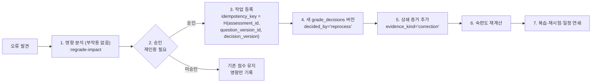

# ADR-0009 — 채점·숙련도·재채점 정책

| 항목 | 값 |
|---|---|
| 상태 | **채택됨** (2026-07-31) |
| 관련 | [sequences.md](../phase0/sequences.md) S-4·S-5 · [erd.md](../phase0/erd.md) 7·8장 · [ADR-0008](./0008-route-assessment-question-snapshots.md) |

---

## 맥락

기존 프로젝트 감사에서 나온 사실:

| 문제 | 출처 |
|---|---|
| 숙련 기준 60%, 70%, 80%, 90%가 서로 다른 위치에 **코드 상수로** 혼재 | `math_test`, `mathlab` |
| 한 번 `is_mastered`가 되면 **영구 유지** | `math_test` |
| 정답률 하나로 숙련 판정 | 여러 프로젝트 |

골프롬프트 2M·20장이 요구하는 것:

- 한 번의 점수만으로 숙련·미숙련을 단정하지 않는다. 복수 증거와 불확실성을 함께 다룬다
- 학생 능력·문항 난이도·콘텐츠 품질을 분리한다
- 초기에는 **설명 가능한 규칙 기반 또는 단순 확률 모델**을 쓴다. 검증 데이터 없이 정교한 지식 추적 모델이 정확하다고 주장하지 않는다
- 임계값을 서비스 코드 곳곳에 두지 않는다. 학년군·개념·평가 목적별 **정책 버전**으로 관리한다
- 정책이 바뀌어도 과거 결과를 임의로 다시 쓰지 않는다
- `MasteryEvidence`는 불변, `ConceptMastery`는 정책 버전과 cutoff로 다시 만들 수 있는 **파생 결과**
- 불확실한 자동 판정을 최종 점수·숙련도에 즉시 반영하지 않는다

## 결정

### 1. 채점 7계층 (확정)

| 계층 | 이름 | 대상 | 신뢰도 | 자동 확정 |
|---|---|---|---|---|
| 1 | `exact` | 객관식 — 선택지 ID 정확 일치 | 1.00 | O |
| 2 | `normalized` | 단답형 — 정규화 후 비교 | 0.95~1.00 | O (≥ 0.95) |
| 3 | `normalized` | 분수·소수·부호·단위·허용 표현 정규화 | 0.90~1.00 | O (≥ 0.95) |
| 4 | `equivalence` | 수학식 기호적 동치 검증 | 0.70~1.00 | O (≥ 0.95) |
| 5 | `partial` | 복수 빈칸 부분 점수 | 계층별 최솟값 | 조건부 |
| 6 | `rubric` | 서술형 루브릭 기반 | 0.40~0.90 | **X** |
| 7 | `manual` | 손글씨·OCR·AI 불확실 | — | **X** |

**자동 확정 임계**: `confidence >= 0.95`. 미만은 전부 `grading_exceptions`로 간다.

**동치 판정의 안전 범위**(계층 4):

| 자동 허용 | 사람에게 보냄 |
|---|---|
| 다항식 전개·정리 후 계수 일치 | 정의역이 다를 수 있는 변형 (`x/x = 1`) |
| 분수 약분, 유리화 | 분기가 있는 표현 (절댓값, 조각함수) |
| 삼각함수 기본 항등식 | 로그 밑 변환에서 정의역 축소 |
| 지수·로그 법칙 (양수 전제 명시 시) | 근호의 부호 선택 |
| 단위 환산 (승인된 표) | 근사값 비교(허용 오차 미지정) |

동치 검사는 **가정을 명시**한다. 모호하면 사람에게 보낸다.

### 2. 채점 결정은 append-only 버전 체인

```sql
-- grade_decisions
version           integer   -- 1부터 증가
is_current        boolean   -- UNIQUE (response_id) WHERE is_current
decided_by        text      -- auto | teacher | reviewer | reprocess
grading_tier      text      -- exact | normalized | equivalence | partial | rubric | manual
score             numeric
confidence        numeric
rationale         jsonb     -- 루브릭 항목별 판단
normalized_answer jsonb
policy_version    text
correction_reason text
```

**완료 상태를 과거로 되돌리지 않는다.** 정정은 새 버전 INSERT + 이전 행의 `is_current = false`. UPDATE·DELETE는 트리거로 차단.

### 3. 학생 피드백과 숙련도 증거를 분리

| 대상 | 내용 |
|---|---|
| **학생 피드백** | 정오, 점수, 해설, 힌트, 재도전 안내. 정책에 따라 제출 직후 또는 전체 마감 후 |
| **숙련도 증거** | `score_ratio`, `mapping_confidence`, `cognitive_demand`, `representation_kind`, `item_difficulty`, `hint_count`, `retry_count`, `elapsed_seconds`, `observed_on` |

학생에게 "이 개념 숙련도 62%"를 보여주지 않는다. 증거는 교사 판단과 시스템 계획을 위한 것이다.

### 4. 숙련도 — 정책 버전 기반 규칙 모델 v1

**임계값·가중치는 전부 `mastery_policy_versions.thresholds`·`weights` jsonb에 있다.** 코드 상수 금지.

```jsonc
// mastery_policy_versions 예시 (purpose_scope='formative', grade_band='중1-3')
{
  "algorithm_id": "weighted-evidence-v1",
  "thresholds": {
    "exploring":          { "point_estimate_min": 0.00 },
    "partial":            { "point_estimate_min": 0.55, "evidence_count_min": 2 },
    "stable":             { "point_estimate_min": 0.78, "evidence_count_min": 4,
                            "distinct_days_min": 2, "uncertainty_max": 0.15 },
    "transfer_confirmed": { "point_estimate_min": 0.85, "evidence_count_min": 6,
                            "distinct_days_min": 3, "transfer_evidence_min": 1,
                            "delayed_check_days_min": 7 }
  },
  "evidence_requirements": {
    "min_evidence": 2,
    "min_distinct_days": 2,
    "delayed_check_interval_days": 7,
    "recency_window_days": 60
  },
  "dimension_requirements": {
    "stable": ["conceptual", "procedural"],
    "transfer_confirmed": ["conceptual", "procedural", "problem_solving"]
  },
  "weights": {
    "base_score": 1.00,
    "item_difficulty": 0.35,        // 어려운 문항 정답에 가중
    "recency_halflife_days": 45,    // 지수 감쇠
    "hint_penalty_per_hint": 0.12,
    "retry_penalty_per_retry": 0.08,
    "representation_diversity_bonus": 0.15,
    "distinct_day_bonus": 0.10,
    "transfer_bonus": 0.20,
    "mapping_confidence_multiplier": 1.00,
    "teacher_observation_weight": 0.60
  },
  "teacher_approval_required": false
}
```

**계산 (`weighted-evidence-v1`)**:

```
w_i = mapping_confidence_i
    × exp(-ln2 × age_days_i / recency_halflife_days)
    × (1 + item_difficulty_weight × (difficulty_i - 0.5))
    × (1 - hint_penalty × hint_count_i - retry_penalty × retry_count_i)

point_estimate = Σ(w_i × score_ratio_i) / Σ(w_i)
                 + representation_diversity_bonus × min(1, distinct_representations/3)
                 + distinct_day_bonus × min(1, distinct_days/3)
                 + transfer_bonus × (transfer_evidence > 0 ? 1 : 0)
                 [0, 1]로 클램프

uncertainty = 1 / sqrt(Σ(w_i) + 1)     -- 증거가 많고 신뢰도가 높을수록 감소
```

상태는 `thresholds`를 위에서 아래로 평가해 **가장 높은 만족 상태**를 취한다. 어느 것도 만족하지 않으면 `no_evidence`.

**`recheck_needed` 판정** (별도 규칙): `next_check_due_on < today` 또는 최근 증거가 이전 상태보다 2단계 이상 낮음.

### 5. 영구 숙련 금지

```sql
-- concept_masteries
next_check_due_on date  -- state가 'stable' 이상이면 NOT NULL
```

| 상태 | 다음 확인 간격 |
|---|---|
| `partial` | 7일 |
| `stable` | 21일 |
| `transfer_confirmed` | 60일 |

경과하면 일 배치가 `recheck_needed`로 전환하고 `review_items`를 만든다. **한 번 숙련이 영구가 되지 않는다.**

### 6. 재현성

```
computed_hash = SHA256(canonicalJson({
  policy_version_id, evidence_cutoff_at, algorithm_id,
  evidence_ids: [정렬된 mastery_evidence id 목록]
}))
```

같은 입력 → 같은 `computed_hash`와 같은 `point_estimate`. 속성 테스트로 검증한다(불변 I-11).

### 7. 정책 변경이 과거를 다시 쓰지 않는다

`concept_masteries`는 `(student_id, canonical_concept_id, policy_version_id)`로 **다중 행**을 허용한다.

| 상황 | 동작 |
|---|---|
| 새 정책 발행 | 기존 행은 그대로. 새 정책으로 **새 행** 생성 |
| 화면 표시 | 조직의 활성 정책 버전 행을 표시 |
| 과거 리포트 | 생성 당시 정책 버전 행을 표시 |
| 정책 롤백 | 이전 정책 행이 이미 있으므로 즉시 복귀 |

### 8. 교사 수동 판정

```sql
teacher_overridden boolean
overridden_by      uuid
override_reason    text
```

| 규칙 | 내용 |
|---|---|
| 우선순위 | 교사 판정이 자동 계산을 덮어쓴다 |
| 유효 기간 | 다음 `next_check_due_on`까지. 이후 새 증거가 있으면 자동 계산 재개(교사가 고정 선택 시 유지) |
| 되돌리기 | 언제든 해제 가능. 자동 계산으로 복귀 |
| 감사 | `audit_events`에 변경 전후·사유 |
| 증거 | `mastery_evidences`에 `evidence_kind='teacher_observation'`으로 기록 (가중치 0.60) |

**자동 상태 변경의 원인과 사용한 증거를 교사가 열람하고 되돌릴 수 있어야 한다.**

### 9. 재채점



| 규칙 | 내용 |
|---|---|
| 자동 재채점 | **하지 않는다.** 항상 사람 승인 |
| 영향 분석 | 영향 학생 수, 점수 변화 분포, 숙련도 변화, 확인테스트 통과 여부 변경, 재계산될 일정 수 |
| 증거 처리 | 기존 `mastery_evidences`를 **삭제하지 않고** 상쇄 증거 추가 (append-only) |
| 멱등성 | 같은 재채점 요청 반복 → 1회만 |
| 감사 | 변경 전후를 `audit_events`에 |
| 학생 통지 | 점수가 변경된 학생에게 알림 (사유 포함) |

### 10. 채점 예외 유형별 기본 담당·기한

| 유형 | 담당 | 기한 |
|---|---|---|
| `low_confidence_ocr`, `format_mismatch` | 평가 조교·채점자 | 24h |
| `multiple_answers`, `answer_conflict` | 선생님 | 24h |
| `partial_credit` | 선생님 | 48h |
| `question_error` | 콘텐츠 검수자 (에스컬레이션) | 4h |
| `missing_scan`, `unidentified`, `resubmit_needed` | 선생님 | 24h |
| `answer_key_changed` | 수학 프로그램 책임자 | 4h |

## 대안

| 대안 | 장점 | 채택하지 않은 이유 |
|---|---|---|
| **A. 누적 정답률만** | 가장 단순, 설명 쉬움 | 문항 난이도·최근성·힌트·표상 다양성을 무시. 골프롬프트 2M이 명시적으로 배제. 기존 프로젝트의 실패 |
| **B. BKT (Bayesian Knowledge Tracing)** | 학술적 근거, 확률 해석 | ① 파라미터(learn·guess·slip) 추정에 대량 데이터 필요 — 초기에 없다 ② "정교한 모델이 정확하다고 주장하지 않는다"는 요구 위반 ③ 설명 가능성 낮음 |
| **C. DKT (Deep Knowledge Tracing)** | 예측 성능 우수 | ① 학습 데이터 없음 ② 완전한 블랙박스 — 교사가 이유를 볼 수 없음 ③ 재현성 보장 어려움 ④ 초기 단계에 부적절 |
| **D. IRT (문항반응이론)** | 능력·난이도 분리, 검증된 이론 | ① 문항 파라미터 추정에 대량 응답 필요 ② 초기 문항의 `empirical_sample_size`가 작다 — "표본이 작은 경험 통계를 안정된 난이도로 표시하지 않는다" ③ **v2 후보로 남긴다** |
| **E. 규칙 기반 가중 증거 (채택)** | 설명 가능, 데이터 불필요, 정책으로 조정 | — |
| **F. 임계값을 코드 상수로** | 단순 | 기존 프로젝트가 정확히 이렇게 실패했다(60/70/80/90 혼재). 학년군·목적별 차이를 표현 못 함 |
| **G. 정책 변경 시 과거 재계산** | 일관된 기준 | "정책이 바뀌어도 과거 결과를 임의로 다시 쓰지 않는다" 위반. 학생·교사가 이유 없이 상태가 바뀐 것을 본다 |
| **H. 자동 재채점** | 빠른 정정 | 대량 성적이 예고 없이 바뀐다. 재인증 + 영향 분석 + 승인이 필요한 이유 |
| **I. AI 채점에 최종 권한 부여** | 인력 절감 | 골프롬프트 원칙 8 위반. AI는 근거·루브릭 항목별 판단·신뢰도를 반환하되 **최종 권한을 갖지 않는다** |

## 비용

| 항목 | 비용 |
|---|---|
| 계산 | 응시당 평균 3개념 × 증거 집계. 1일 480,000 응시 → 1,440,000 계산/일 = 17/초 평균 |
| 저장 | `mastery_evidences` 1일 144만 행 × 0.6 KB × 2.2 = 1.9 GB/일. 180일 핫 = 313 GB |
| `concept_masteries` 다중 정책 행 | 정책 버전 수만큼 배수. 활성 1 + 이전 2 = 3배 |
| 개발 | 채점 7계층, 동치 판정, 정책 엔진, 재채점 연쇄 (약 3,000줄) |
| 검수 인력 | 예외율 15% 가정 시 1일 72,000건 — **이것이 예외 임계 0.95의 실질 비용** |
| 골드셋 유지 | 1만 건 채점 골드셋. 모델·정규화기·정책 변경마다 실행 |

## 실패 방식

| # | 어떻게 실패하는가 | 조기 신호 | 대응 |
|---|---|---|---|
| F-1 | 임계값이 다시 코드로 스며듦 | `grep -rnE "0\.[5-9][0-9]?" packages/core/src/mastery` 게이트 테스트 실패 | CI 게이트. 모든 숫자는 `policy`에서 온다 |
| F-2 | 자동 채점 정확도 하락 | 골드셋 < 99.99% (SLO O-09) | `auto_grading` kill switch → 수동 채점. RB-12 |
| F-3 | 예외율 폭증으로 검수 마비 | `grading_exception_rate` > 15% | 원인 분류(정규화 실패 vs 문항 품질 vs 모델). 문항 품질이면 격리 |
| F-4 | 동치 판정이 틀린 답을 맞다고 함 | 골드셋 회귀, 교사 신고 | 안전 범위를 좁힌다. 모호하면 사람에게 |
| F-5 | 숙련도가 재현되지 않음 | `computed_hash` 불일치 | 정렬·정규화 규약 속성 테스트. 부동소수점은 소수 6자리 반올림 후 해시 |
| F-6 | 한 문항 오답으로 광범위한 하위 개념이 미숙련 처리 | 교사 신고, 상태 급락 | `min_evidence`·`min_distinct_days` 요구가 방어. 개념별 가중치(`concept_weights_snapshot`)로 영향 제한 |
| F-7 | 한 번 정답으로 선수 단계 전부 건너뜀 | 선수 결손 미검출 | `transfer_confirmed`는 `delayed_check_days_min` 7일 + 전이 증거 필요 |
| F-8 | 재채점 연쇄가 폭주 | `mass_schedule_change` 발동 | 재채점은 사람 승인. 영향 분석에서 연쇄 규모를 사전 표시 |
| F-9 | 정책 버전이 계속 늘어 조회가 느려짐 | `concept_masteries` 행 수 급증 | 비활성 정책 버전 행은 1년 후 삭제(A-40) |
| F-10 | 교사 판정이 자동 계산에 계속 덮임 | 교사 불만 | `teacher_overridden` 우선. 해제는 명시적 행동으로만 |

## 되돌리기

| 방향 | 방법 | 비용 |
|---|---|---|
| 임계값·가중치 조정 | 새 `mastery_policy_versions` 행 — **배포 없이** | 매우 낮음 |
| 정책 롤백 | 이전 버전을 `active`로. 기존 계산 행이 남아 있어 즉시 | 매우 낮음 |
| 자동 확정 임계 조정 | 정책 변경 | 매우 낮음 |
| 채점 계층 추가·제거 | `grading_tier` enum 확장. 기존 결정은 그대로 | 낮음 |
| 알고리즘 교체 (v1 → IRT v2) | 새 `algorithm_id` + 새 정책 버전. **기존 결과는 보존**되고 병행 표시 가능 | 중간 |
| 재채점 되돌리기 | `is_current`를 이전 버전으로 되돌리는 새 버전 생성 | 낮음 |
| 증거 삭제 | **되돌리지 않는다.** append-only | — |
| 자동 재채점 허용 | **되돌리지 않는다.** 대량 성적 변경은 항상 승인 | — |

`algorithm_id` + `policy_version_id`가 이 ADR의 되돌리기 여지다. 알고리즘을 통째로 바꿔도 과거 결과는 자기 정책 버전으로 계속 재현된다.
