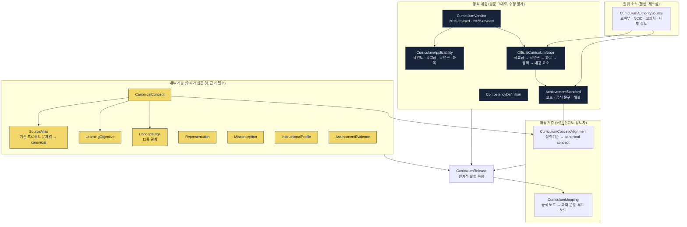

# ADR-0011 — 교육과정 권위 소스·canonical concept·릴리스 정책

| 항목 | 값 |
|---|---|
| 상태 | **채택됨** (2026-07-31) |
| 관련 | [erd.md](../phase0/erd.md) 3장 · [state-machines.md](../phase0/state-machines.md) 5절 · [ADR-0008](./0008-route-assessment-question-snapshots.md) |

---

## 맥락

골프롬프트 2K의 핵심 요구:

> 교육과정 데이터는 AI가 기억으로 생성한 단원 목록이 아니라 **권위 있는 원문을 사람이 검증해 발행한 버전 데이터**다.

기존 프로젝트 감사에서 확인된 문제:

| 문제 | 결과 |
|---|---|
| 목차 데이터에 교육과정 버전·공식 성취기준 코드·안정 ID가 일관되지 않음 | 같은 이름의 다른 개념이 섞임 |
| `mathgen-ai`는 이름 기반 문자열 계층만 보유 | 출처 추적 불가 |
| `mathg-gen`의 `topic`이 이름 문자열 | 매핑 신뢰도 없음 |
| `math_test`의 문자열 ID 체계 | 버전 간 충돌 |

동시에 한국 교육과정은 **전환기**가 있다. 2015 개정과 2022 개정이 학년별로 다른 시기에 적용된다. 학생 A는 2015, 학생 B는 2022 기준일 수 있다.

그리고 **성취기준 ≠ 개념**이다. 하나의 성취기준이 여러 개념을 포함하고, 하나의 개념이 여러 성취기준·학년·과목에서 다른 깊이로 재등장한다.

## 결정

### 1. 3층 모델 — 공식 / 내부 / 매핑



**화면과 API에서 공식과 내부를 구분한다.** 내부 선행 관계나 오개념을 "공식 성취기준"처럼 표시하지 않는다.

### 2. 권위 소스 등록부

| 우선순위 | 소스 | 용도 |
|---|---|---|
| 1 | 교육부 2022 개정 교육과정 확정·발표 | 개정 취지, 적용·고시의 최상위 근거 |
| 1 | 교육부 수학과 교육과정 별책 8 고시 자료 | 내용 체계, 성취기준, 해설의 기준 |
| 1 | 국가교육과정정보센터(NCIC) | 학교급·과목별 원문과 공식 자료 |
| 2 | 교육부 2022 개정 수학과 시안 요약 | 영역 통합·학교급 연계·수업 방향 설명 |
| 3 | 검정 교과서·교사용 지도서·평가 자료 | 성취기준을 차시·표상·문항으로 세분화하는 보조 근거 |
| 4 | 내부 교사 검토·수업 데이터 | 오개념, 권장 선행 관계, 예상 시간·난이도 보정 |

각 소스가 보유하는 것: `source_id`, 문서명, 발행 기관, 고시 번호, 원본 URL, **파일 체크섬(sha256)**, 취득 시각, 효력 시작·종료일, 적용 대상, 페이지·조항 위치(`source_locator`), 검토 상태.

**원문이 교체되어도 이전 체크섬과 해석을 삭제하지 않는다.** 새 소스 행을 추가하고 이전 것을 `superseded`로 표시한다.

**재배포 정책(Q-02)**: 원문 전문을 저장·재배포하지 않는다. 체크섬·인용 위치·요약·공식 코드와 문구만 저장하고, 화면에는 원문 링크를 제공한다.

### 3. 10대 규칙 (골프롬프트 2K 이행)

| # | 규칙 | 구현 |
|---|---|---|
| 1 | 공식 명칭·성취기준 코드·문구는 원문에 추적 가능 | `source_id`·`source_locator`·`checksum` NOT NULL (불변 I-16) |
| 2 | 교육과정 버전 / 교과서 판본 / 내부 개념 체계를 같은 버전 번호로 뭉개지 않는다 | 3개 독립 테이블·독립 버전 |
| 3 | 공식과 내부를 화면·API에서 구분 | DTO 타입 분리. `origin` 필드 |
| 4 | OCR로 읽은 교육과정 문구는 원문 대조·사람 승인 전 게시 불가 | 릴리스 `expert_review` 단계 필수 |
| 5 | 적용 학년·시기를 코드 상수로 박지 않는다 | `CurriculumApplicability` 규칙 테이블 |
| 6 | 2015·2022 동시 운영 전환기 지원 | `curriculum_versions` 다중 `active` 허용, `applicabilities`로 판정 |
| 7 | 학생·반의 적용 버전 명시. 없으면 일정·평가 생성 입력 불가 | `students.curriculum_applicability_id` NOT NULL, 생성 시 검증 |
| 8 | 권위 소스 갱신 시 차이·영향·재검토 대상 계산 | `curriculum-impact` 소비자가 영향 분석 생성 |
| 9 | 접근 실패·해석 미확정은 AI 추론으로 메우지 않고 `검토 필요` 표시 | `review_status='unreviewed'` 유지. 릴리스 차단 |
| 10 | 발행 절차 = 가져오기 → 구조 비교 → 매핑 → 전문가 검토 → 시험 공간 검증 → 발행 | `curriculum_releases` 상태 머신 7단계 |

### 4. Canonical Concept + SourceAlias

**모든 개념 참조는 `canonical_concept_id` UUID다.** 문자열 이름으로 참조하지 않는다.

```sql
-- 기존 프로젝트의 문자열을 canonical에 연결하는 유일한 통로
CREATE TABLE source_aliases (
  id                   uuid PRIMARY KEY,
  canonical_concept_id uuid NOT NULL,
  source_system        text NOT NULL,   -- mathg-gen | edutrix | math_test | mathlab | textbook | mathgen-ai
  raw_label            text NOT NULL,
  raw_id               text,
  confidence           numeric NOT NULL,
  resolution           text NOT NULL,   -- confirmed | candidate | rejected
  reviewed_by          uuid,
  ...
);
```

| 규칙 | 내용 |
|---|---|
| 직접 매핑 금지 | 기존 문자열을 `canonical_concepts.slug`로 바로 쓰지 않는다 |
| 기본 상태 | `candidate`. `confirmed`는 사람 검토 후 |
| 자동 계획 사용 | `resolution='confirmed'`인 별칭만 |
| 충돌 보고서 | 같은 `raw_label`이 여러 canonical에 연결되면 충돌 목록 생성 |
| 교재 목차 동일 ≠ 동등 | "교재 목차만 같다는 이유로 자동 동등 매핑하지 않는다" |

**모든 내부 개념은 최소 하나의 근거(`evidence`)와 검토 상태를 가진다.**

### 5. ConceptEdge 11종과 DAG 제약

| 관계 | 의미 |
|---|---|
| `PART_OF` | 상위·하위 |
| `PREREQUISITE` | **성공적 학습에 필요한 선수** (강한) |
| `SOFT_PREREQUISITE` | 유용하지만 절대 조건 아님 |
| `EXTENDS` | 더 넓은 범위·깊이로 확장 |
| `SPECIAL_CASE_OF` | 일반 개념의 특수 사례 |
| `EQUIVALENT_TO` | 다른 표기·분류에서 사실상 같음 |
| `CONTRASTS_WITH` | 혼동하기 쉬워 비교 필요 |
| `REPRESENTED_BY` | 표·식·그래프·도형·언어 표상 |
| `MISCONCEPTION_OF` | 오개념 ↔ 올바른 개념 |
| `ASSESSED_BY` | 평가 증거 연결 |
| `TRANSFER_TO` | 다른 영역·실생활 전이 |

**강한 `PREREQUISITE` 부분 그래프는 DAG여야 한다.** 발행 전 재귀 CTE로 순환을 검사하고, 1건이라도 있으면 발행을 차단한다(불변 I-17).

**수학 학습 전체를 하나의 엄격한 선형 순서로 강제하지 않는다.** 상호 보완적 개념과 여러 진입 경로는 `SOFT_PREREQUISITE`·`CONTRASTS_WITH`·`REPRESENTED_BY`로 표현한다.

각 선수 관계가 기록하는 것: 왜 필요한가(`why_needed`), 어느 깊이의 선행 숙련이 필요한가(`required_depth`), 미숙련이어도 동시 학습 가능한가(`concurrent_ok`), 적용 학교급·과목·교육과정 버전, 근거(`evidence`), 합의 수준(`confidence`)과 검토일.

### 6. AI 제안은 승인 전 자동 계획에 사용 불가

```sql
-- 자동 계획 쿼리는 이 뷰만 사용한다
CREATE VIEW approved_concept_edges AS
SELECT * FROM concept_edges
WHERE review_status = 'approved'
  AND (valid_to IS NULL OR valid_to >= current_date);
```

`origin='ai_suggested' AND review_status<>'approved'`인 간선은 **초안일 뿐**이다. 화면에서도 사람 승인 관계와 시각적으로 구분한다(불변: "AI 제안 관계가 사람 승인 관계로 가장되지 않음").

### 7. 릴리스 = 원자적 발행 묶음

상태: `imported → parsed → mapped → expert_review → validated → published → superseded`

**품질 게이트 6종 (전부 0건이어야 `validated`)**:

| # | 게이트 | 검증 쿼리 |
|---|---|---|
| 1 | 공식 성취기준 코드 중복·누락 | `GROUP BY standard_code HAVING count(*)>1` + 원문 코드 목록 대조 |
| 2 | 강한 선수 관계 순환 | 재귀 CTE 사이클 탐지 |
| 3 | 고아 매핑 (존재하지 않는 버전·노드) | FK 존재 검증 |
| 4 | 근거·검토 상태 없는 내부 개념 | `evidence IS NULL OR reviewed_by IS NULL` |
| 5 | 문항의 개념 연결이 적용 범위와 모순 | `question_alignments` × `applicabilities` 교차 검증 |
| 6 | 권위 소스 역추적 누락 | `source_id IS NULL OR checksum IS NULL` |

발행:

```sql
BEGIN;
  UPDATE curriculum_releases SET status='published', published_at=now() WHERE id=$new;
  UPDATE curriculum_releases SET status='superseded', superseded_by=$new WHERE id=$old;
  INSERT INTO outbox_events (...CurriculumReleasePublished...);
COMMIT;
```

`UNIQUE (organization_id, curriculum_version_id) WHERE status='published'` — 활성 릴리스는 버전당 1개.

### 8. 이미 운영 중인 루트를 자동 재매핑하지 않는다

**핵심 규칙**. `CurriculumReleasePublished` 소비자(`curriculum-impact`)는 **영향 분석만** 만든다.

| 산출 | 내용 |
|---|---|
| 버전 비교 | 추가·삭제·이동·분할·통합된 노드 |
| 영향 대상 | 영향받는 교재, 문항, 루트, 평가 청사진 |
| 마이그레이션 초안 | 별도 제안. 사람이 검토·적용 |
| 폐기 개념 사용 탐지 | `deprecated` 개념을 쓰는 활성 루트·평가 |
| 시뮬레이션 | 그래프 변경 전후의 선수 공백, 평가 커버리지, 일정 영향 |

`route_versions.curriculum_release_id`는 게시 시 고정되므로(ADR-0008), 새 릴리스가 발행되어도 게시된 루트는 원래 릴리스를 계속 참조한다.

### 9. 적용 판정

```sql
-- 학생의 적용 교육과정을 판정하는 유일한 경로
SELECT ca.curriculum_version_id
FROM students s
JOIN curriculum_applicabilities ca ON ca.id = s.curriculum_applicability_id
WHERE s.id = $1
  AND ca.applies_from <= current_date
  AND (ca.applies_to IS NULL OR ca.applies_to >= current_date);
```

**적용 버전이 없는 학생은 일정·평가 생성의 입력이 될 수 없다.** 온보딩에서 필수 입력이며, 미설정 시 `422 CURRICULUM_APPLICABILITY_MISSING`.

### 10. 영역 이름 주의

교육부 설명 자료의 초·중 통합 영역(`수와 연산`, `변화와 관계`, `도형과 측정`, `자료와 가능성`)은 **해당 공식 버전·학교급에만** 적용한다. 다른 교육과정 버전이나 고등학교 과목에 이 네 영역을 무조건 덮어씌우지 않는다. 영역은 `official_curriculum_nodes`에 버전별로 저장되며 코드 상수가 아니다.

## 대안

| 대안 | 장점 | 채택하지 않은 이유 |
|---|---|---|
| **A. 단일 깊은 트리** | 단순, 탐색 쉬움 | 성취기준 ≠ 개념. 하나의 개념이 여러 학년·과목에 다른 깊이로 재등장하는 것을 표현 못 함 |
| **B. 공식 계층만 (내부 개념 없음)** | 출처 명확 | 성취기준은 수업·문항·숙련도 계산 단위로 너무 크다. "일차방정식의 활용"을 성취기준 하나로 다루면 숙련도 판정이 무의미 |
| **C. 내부 개념만 (공식 계층 없음)** | 유연 | 권위 소스 역추적 불가(불변 I-16). "교육과정 정렬 완료"를 주장할 수 없다 |
| **D. AI가 교육과정 구조 생성** | 빠름 | 골프롬프트가 명시적으로 배제. 사실성 보장 불가 |
| **E. 문자열 이름으로 개념 참조** | 구현 단순, 사람이 읽기 쉬움 | 기존 프로젝트의 실패 원인. 같은 이름 다른 개념, 버전 간 충돌 |
| **F. 버전 없이 최신만 유지** | 단순 | 전환기(2015·2022 동시 운영) 지원 불가 |
| **G. 릴리스 없이 개별 노드 발행** | 점진적 반영 | 부분 발행 중간 상태에서 계획이 만들어진다. 원자성 필요 |
| **H. 새 릴리스 발행 시 활성 루트 자동 재매핑** | 항상 최신 기준 | 제품 원칙 13 위반. 학기 중에 학생 계획이 예고 없이 바뀐다 |
| **I. 순환 허용 (선수 관계에 사이클)** | 상호 의존 개념 표현 가능 | 일정 엔진의 위상 정렬이 불가능해진다. 상호 의존은 `SOFT_PREREQUISITE`·`CONTRASTS_WITH`로 표현 |

## 비용

| 항목 | 비용 |
|---|---|
| 데이터 구축 | 2022 개정 수학과 전 학년 성취기준 입력·검증. 초기 약 3인월 |
| 내부 개념 정의 | 개념 약 1,200개 × 근거·검토. 초기 약 4인월 |
| 별칭 매핑 | 기존 프로젝트 문자열 약 3,000건 검토 |
| 릴리스 절차 | 발행마다 전문가 검토 필요 (자동화 불가 — 의도됨) |
| 저장 | 교육과정 전체 약 46 GB (권한·수업·루트 포함) |
| 개발 | 그래프 탐색, 품질 게이트 6종, 영향 분석 (약 2,500줄) |
| 운영 | 권위 소스 갱신 감시, 체크섬 검증 |

## 실패 방식

| # | 어떻게 실패하는가 | 조기 신호 | 대응 |
|---|---|---|---|
| F-1 | 권위 소스 URL이 바뀌거나 사라짐 | 수집 실패 3회 연속 | 체크섬으로 이전 사본 유지. 활성 릴리스는 읽기 전용으로 계속 동작(F-14) |
| F-2 | 원문 개정으로 성취기준 코드가 바뀜 | 체크섬 불일치 | 새 소스 행 + 새 릴리스. 이전 것은 `superseded`. 영향 분석 |
| F-3 | 선수 관계 순환이 발행 후 발견 | 일정 엔진 위상 정렬 실패 | 발행 전 게이트가 막는다. 그래도 발생하면 릴리스 롤백(RB-09) |
| F-4 | AI 제안 간선이 승인 없이 계획에 사용 | `approved_concept_edges` 뷰 우회 | 자동 계획 쿼리가 뷰만 사용하도록 코드 리뷰 + 통합 테스트 |
| F-5 | 별칭 매핑이 잘못되어 엉뚱한 개념에 연결 | 문항 커버리지 이상, 교사 신고 | `resolution='candidate'` 기본값. 검토 없이 자동 사용 불가 |
| F-6 | 학생의 적용 버전 미설정 | `422 CURRICULUM_APPLICABILITY_MISSING` | 온보딩 필수 입력. 마이그레이션 시 기본값 지정 요구 |
| F-7 | 릴리스 발행이 활성 루트를 깨뜨림 | 폐기 개념 사용 탐지 | 발행은 영향 분석만. 루트는 자기 릴리스를 계속 참조 |
| F-8 | 공식과 내부의 구분이 화면에서 흐려짐 | 사용자 혼동, 문의 | DTO 타입 분리 + 시각적 구분(공식=실선, 내부=별도 모양) |
| F-9 | 초·중 4영역을 고등학교에 잘못 적용 | 매핑 검수에서 발견 | 영역은 `official_curriculum_nodes`에 버전·학교급별로 저장. 코드 상수 아님 |
| F-10 | 매핑 일괄 승인으로 오매핑 대량 유입 | 커버리지 이상 | 500건 초과 승인 시 재인증 + 표본 검토 필수 + 영향받는 루트·평가 수 표시 |

## 되돌리기

| 방향 | 방법 | 비용 |
|---|---|---|
| 개념·간선 수정 | 새 버전(`valid_to` 설정 + 새 행). 릴리스 미발행 상태면 직접 수정 | 낮음 |
| 별칭 재매핑 | `resolution='rejected'` + 새 별칭 | 낮음 |
| 릴리스 롤백 | 이전 릴리스를 `published`로, 새 것을 `superseded`로. **활성 포인터 전환만** | 낮음 (RB-09) |
| 릴리스 삭제 | 하지 않는다. `superseded`로 남긴다 | — |
| 권위 소스 교체 | 새 행 추가. 이전 체크섬·해석 보존 | 낮음 |
| canonical concept 폐기 | `status='deprecated'` + `deprecated_by`. 사용 중인 루트·평가를 영향 분석으로 탐지 | 중간 |
| 3층 모델 → 단일 트리 | **되돌리지 않는다.** 역추적·전환기 지원을 잃는다 | — |
| 문자열 참조로 회귀 | **되돌리지 않는다.** 기존 프로젝트의 실패 | — |

릴리스가 원자적 발행 단위이므로 롤백이 포인터 전환 하나로 끝난다. 이것이 릴리스 개념의 가장 큰 실용적 가치다.
