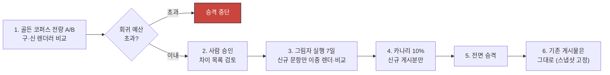

# ADR-0013 — KaTeX·PDF·HWP/HWPX 렌더러 버전과 게시 게이트

| 항목 | 값 |
|---|---|
| 상태 | **채택됨** (2026-07-31) |
| 관련 | [erd.md](../phase0/erd.md) 5장 · [ADR-0012](./0012-structured-math-content-and-latex.md) · [ADR-0008](./0008-route-assessment-question-snapshots.md) · [RB-10](../runbooks/10-formula-render-rollback.md) |

---

## 맥락

수맥의 제품 약속 중 가장 엄격한 것:

> 학생에게 게시되는 문제·해설·PDF에는 원시 LaTeX, `katex-error`, 빈 수식 자리 또는 회색 폴백이 **한 건도** 없어야 한다.

SLO O-11: 게시 콘텐츠의 원시 LaTeX·`katex-error`·필수 수식 누락 **0건**.

세 렌더러가 있고 각각 다른 방식으로 실패한다.

| 렌더러 | 실패 방식 |
|---|---|
| KaTeX (web) | 파싱 실패, `katex-error` 클래스, 빈 노드, 미지원 명령 |
| Chromium (PDF) | 폰트 늦은 로드, 분수·근호 상하 잘림, 페이지 경계 분리, 클리핑 |
| HWPX | 수식 객체 폭 0, 잘못된 기준선, 옆 글자 겹침, 글꼴 대체, ZIP 손상 |

그리고 **렌더러는 업그레이드된다.** KaTeX 0.16.11 → 0.17이 과거 시험의 수식 모양을 바꾸면 안 된다.

## 결정

### 1. 렌더러 버전 3종을 명시적으로 고정한다

| 대상 | 버전 필드 | 초기값 |
|---|---|---|
| KaTeX (web) | `katex_version` | `0.16.11` |
| 정규화기 | `normalizer_version` | `2026.07.1` |
| 매크로 정책 | `macro_policy_version` | `3` |
| PDF (Chromium) | `renderer_version` | `chromium-131` |
| HWPX 생성기 | `renderer_version` | `hwpx-2026.07.0` |

**게시 시점에 스냅샷에 복사한다**(ADR-0008). 이후 렌더러가 올라가도 게시된 시험은 원래 버전으로 재생성된다.

```sql
-- assessment_questions (게시 스냅샷)
renderer_version   text NOT NULL
katex_version      text NOT NULL
normalizer_version text NOT NULL
```

### 2. 게시 게이트 10조건 (확정)

문항·시험·해설이 게시되려면 **전부 통과**해야 한다.

| # | 조건 | 검사 방법 | 실패 시 상태 |
|---|---|---|---|
| G-01 | 미닫힌 수식 구분자 0건 | 토큰화 단계 균형 검사 | `formula_review_required` |
| G-02 | 불균형 괄호·중괄호·환경 0건 | 동일 | `formula_review_required` |
| G-03 | 허용되지 않은 명령·외부 자원 0건 | `macro_policy_version` 허용 목록 | `formula_review_required` |
| G-04 | `katex-error`·빈 KaTeX 노드·원시 LaTeX 노출 0건 | 렌더 결과 DOM 검사 | `formula_review_required` |
| G-05 | 의미 변경 가능 보정 0건 **또는** 사람 승인 | `math_expressions.has_semantic_risk` + `review_status` | `formula_review_required` |
| G-06 | 본문·선택지·표·조건 박스·도형의 참조 누락 0건 | 블록 `ref_id` 교차 검증 | `layout_review_required` |
| G-07 | 모바일(360px)·인쇄(A4)에서 잘림·겹침·가로 스크롤 0건 | 시각 회귀 스냅샷 | `layout_review_required` |
| G-08 | PDF·HWPX 변환 실패 0건 | `math_render_artifacts.validation_status` | `layout_review_required` |
| G-09 | 정답·해설 수식의 의미 지문 불일치 0건 | web·pdf·hwpx `semantic_fingerprint` 비교 | `formula_review_required` |
| G-10 | 스크린리더 대체 표현 누락 0건 | MathML 존재 + `alt_text` NOT NULL | `layout_review_required` |

```sql
CREATE VIEW question_publish_gate AS
SELECT qv.id AS question_version_id,
  bool_and(me.parse_status = 'parsed')                                  AS g01_g02_g03,
  NOT EXISTS (SELECT 1 FROM math_expressions x WHERE x.question_version_id = qv.id
              AND (x.has_semantic_risk AND x.review_status <> 'approved')) AS g05,
  (SELECT count(DISTINCT mra.target) FROM math_render_artifacts mra
   WHERE mra.expression_id IN (...) AND mra.validation_status = 'passed') = 3 AS g08,
  ...
FROM question_versions qv ...;
```

**게이트가 실패하면 CSS로 숨기거나 빨간색만 제거해 통과시키지 않는다.** 격리하고 원본·정규화본·오류 위치·화면 캡처·추천 수정안을 제공한다.

### 3. 3-target 렌더 산출물 필수

```sql
-- math_render_artifacts
target             text    -- web | pdf | hwpx
renderer_version   text
artifact_hash      text
metrics            jsonb   -- width_pt, height_pt, baseline_pt
validation_status  text    -- pending | passed | failed
validation_report  jsonb   -- clipping | overlap | missing_glyph
```

`content-gatekeeper`는 **3개 target 모두** `passed`이고 `semantic_fingerprint`가 전부 일치할 때만 `publish_gate_status='passed'`로 전환한다.

### 4. KaTeX 설정 (보안·정확성)

| 항목 | 값 | 이유 |
|---|---|---|
| `throwOnError` | `false` **이되 오류를 명시적으로 수집** | `false`만 믿고 성공으로 간주하면 `katex-error`가 학생에게 나간다 |
| `trust` | `false` | 임의 URL·HTML·스타일·클래스·이미지 로드 차단 |
| `macros` | 허용 목록만, 사용자 정의 실행 금지 | 매크로 폭탄 방지 |
| 매크로 수 상한 | 64 | 자원 고갈 방지 |
| 중첩 깊이 상한 | 32 | 동일 |
| 입력 길이 상한 | 8,192자 | 동일 |
| 렌더 시간 상한 | 200 ms | 동일 |
| `output` | `htmlAndMathml` | 접근성 |
| 주입 | KaTeX 산출물만 `dangerouslySetInnerHTML` | ESLint 규칙으로 그 외 전면 금지 |

### 5. PDF (Chromium 인쇄 CSS)

| 규칙 | 구현 |
|---|---|
| 폰트·KaTeX 자산 준비 완료 후 캡처 | `document.fonts.ready` + KaTeX CSS 로드 확인 후 `page.pdf()` |
| 용지·여백·머리말·쪽 번호·제본 여백 명시 | A4 기본, 여백 20/15/20/15 mm, 제본 여백 5 mm |
| 분수·근호·대형 연산자·다행 수식 상하 잘림 0 | 렌더 후 요소 바운딩 박스 검사 |
| 문항 번호-첫 줄, 선택지 번호-식, 도형 캡션-도형 분리 금지 | `break-inside: avoid` + 구조 검사 |
| 문항이 쪽을 넘길 때 분할 지점 | `PageBreakHint` 블록의 `priority` 순 |
| 답안지·해설지 문항 참조가 시험지 버전과 일치 | `snapshot_hash` 대조 |
| 브라우저·OS·프린터 차이 허용 오차 | 위치 ±2 pt, 크기 ±1.5% |
| PDF 텍스트 레이어·읽기 순서 보존 | 수식이 저해상도 스크린샷으로만 남지 않게 — 텍스트 추출 검증 |

### 6. HWPX 변환

`D:\시험지 한글화`의 실측을 어댑터로 활용한다(ADR-0001).

| 단계 | 내용 |
|---|---|
| 1 | 표준 `normalized_latex`를 **버전된 LaTeX→HWP 문법 변환기**로 |
| 2 | 분수·근호·첨자·합/적분/극한·자동 크기 구분자·행렬·단위·기하 라벨의 **명시적 매핑** |
| 3 | **HWP 네이티브 수식 객체 우선.** 폭 0·잘못된 기준선·옆 글자 겹침 금지 |
| 4 | HYhwpEQ 등 대상 렌더러의 **글꼴 메트릭과 골든 문서**로 폭·높이·기준선 보정 |
| 5 | 수식 이미지 폴백이 필요하면 **접근성·편집 가능성 저하를 표시**하고 검수 대상으로 |
| 6 | **이미지 생성까지 실패한 LaTeX를 `[원문]` 형태로 학생 문서에 내보내지 않는다. 산출물 전체를 실패시킨다** |
| 7 | 실제 대상 앱에서 재열기 검사 — 누락 객체, 손상 ZIP, 잘림, 겹침, 글꼴 대체, 페이지 수 |
| 8 | web·PDF·HWP의 각 수식이 같은 `expression_id`와 의미 지문을 가져 역추적 가능 |

**7단계의 대체 검증(C-14)**: 실제 한글 앱 재열기는 실환경 전용이므로, 자동 검증은 ① HWPX ZIP 구조 무결성 ② XML 스키마 통과 ③ 수식 객체 수 = `math_expressions` 수 ④ 폭 0 객체 0건 ⑤ 기준선 오차 ≤ 2 pt ⑥ 골든 문서 대비 폭·높이 편차 ≤ 3%로 대체하고, **수동 재열기 체크리스트 스크립트**를 함께 제공한다.

대상 앱 범위(Q-07): 한글 2020 이상 + 한컴오피스 뷰어. `.hwp` 바이너리는 미지원.

### 7. 렌더러 업그레이드 절차 (필수)



| 항목 | 값 |
|---|---|
| 골든 코퍼스 회귀 예산 | **치명적 차이 0건.** 비치명(픽셀 ±2, 위치 ±1 pt) 5% 이내 |
| 그림자 실행 | 7일. 신·구 결과 diff를 `math_render_artifacts`에 별도 기록 |
| 카나리 | 신규 게시 10% |
| 롤백 | 환경변수 `KATEX_VERSION`·`PDF_RENDERER_VERSION`·`HWPX_RENDERER_VERSION` 즉시 전환 |
| **기존 게시물** | **변하지 않는다.** 스냅샷의 버전으로 재생성 |

**"조용한 업그레이드" 금지**: 의존성 자동 업데이트(Renovate 등)가 KaTeX 버전을 올리지 못하게 잠근다. 렌더러 관련 패키지는 수동 PR + 위 절차 필수.

### 8. 골든 코퍼스

익명화되고 사용 권한이 확인된 실제 실패 사례 + 합성 사례.

**17개 범주** (골프롬프트 2Q): 자연수·정수·유리수·소수·순환소수 / 분수·대분수·복분수·근호 / 부호·절댓값·연립방정식·부등식 / 다항식·인수분해·함수·좌표 / 지수·로그·삼각함수 / 수열·합·수학적 귀납 / 극한·미분·적분 / 경우의 수·확률·통계·분포 / 벡터·행렬 / 집합·논리·조각함수·다행 환경 / 각·호·선분·평행·수직 등 기하 표기 / 단위·한글 설명과 수식 혼합 / 5지선다의 짧은 식·긴 식·다행 식 / 원시 HTML 표·Markdown 표·병합 셀 / SVG 도형·좌표 그래프·원본 이미지 폴백 / JSON 백슬래시 손상·중첩 구분자·미지 명령·악성 입력 / 웹·모바일·PDF·HWPX의 동일 문항.

각 사례가 가지는 것: 입력, 기대 정규화본, 파싱 결과, 의미 지문, 예상 DOM/MathML 특성, 기준 이미지, 허용 픽셀 차이, PDF/HWPX 기대치.

| 규칙 | 내용 |
|---|---|
| 편중 측정 | 학년·영역별 커버리지를 표시 |
| 새 실제 오류 | **최소 재현 사례**로 추가한 뒤 수정 |
| 하드코딩 예외 금지 | 특정 문항 번호를 하드코딩한 예외 규칙을 만들지 않는다 |
| 출시 목표 | 검수 완료 골든 문항 **10,000건**에서 치명적 렌더 실패·원시 LaTeX 노출·의미 변경 0건 |
| 초기 코퍼스 | 크기를 속이지 않고 **현재 표본 수와 영역 커버리지를 표시**하며 단계별 확장 |

### 9. 관측 지표

렌더러 버전·교육과정·학년·영역·콘텐츠 출처·출력 형식별로 집계한다. **학생 ID나 수식 원문을 메트릭 레이블에 넣지 않는다.**

수식 파싱 실패율 / 자동 무손실 보정률과 규칙별 사용 횟수 / 사람 검수 전환율과 승인·수정·폐기율 / 지원되지 않은 명령 상위 목록 / `katex-error` 탐지 수 / web·PDF·HWP 불일치율 / 레이아웃 클리핑·오버플로 탐지율 / 수식·도형당 렌더 지연과 타임아웃 / 렌더러 업그레이드의 골든 회귀 수 / 콘텐츠 소스·OCR 모델별 수식 오류율.

**치명적 수식 오류는 단순 로그가 아니라 게시 차단 이벤트와 운영 알림을 만든다.**

## 대안

| 대안 | 장점 | 채택하지 않은 이유 |
|---|---|---|
| **A. MathJax** | 더 많은 LaTeX 지원, MathML 입력 | ① 서버 사전 파싱이 KaTeX보다 느림(약 6배) ② mathg-gen 노하우가 KaTeX 기반 ③ 필요한 문법은 허용 목록으로 제한하므로 커버리지 차이가 실질적이지 않음 |
| **B. 서버 렌더 없이 클라이언트 KaTeX** | 서버 부하 없음 | ① 게시 게이트를 통과했는지 서버가 알 수 없음 ② 학생 기기에서 실패하면 그때 발견 ③ SSR 불가, LCP 악화 |
| **C. 수식을 이미지로 사전 렌더** | 모든 환경에서 동일 | ① 접근성 상실(스크린리더 불가) ② 확대 시 흐림 ③ 복사 불가 ④ 저장 폭증 ⑤ **PDF 텍스트 레이어 요구 위반** |
| **D. PDF를 LaTeX 엔진(XeLaTeX)으로** | 조판 품질 최고 | ① 웹과 다른 렌더러 → 의미·배치 차이 ② TeX 배포판 설치·유지 ③ 구조화 블록 → TeX 변환기를 별도 작성 ④ 웹과 동일 CSS를 쓰는 것이 일치 보장에 유리 |
| **E. HWPX 대신 HWP 바이너리** | 구버전 호환 | ① 비공개 바이너리 포맷 ② 검증 도구 없음 ③ HWPX(XML+ZIP)는 스키마 검증 가능 |
| **F. HWP 변환을 외부 서비스에 위임** | 개발 비용 절감 | ① 수식 객체 품질 제어 불가 ② `시험지 한글화`의 실측 메트릭을 활용 못 함 ③ 데이터 외부 전송 |
| **G. 실패 시 이미지 폴백 후 게시** | 산출물이 나옴 | 골프롬프트 명시적 금지 — 이미지 폴백은 검수 대상, 실패는 산출물 전체 실패 |
| **H. 게이트 없이 게시 후 모니터링** | 빠른 게시 | 학생이 깨진 수식을 본다. SLO O-11(0건) 위반 |
| **I. 렌더러 버전 고정 없이 항상 최신** | 유지 단순 | 업그레이드가 과거 시험을 바꾼다. 불변 조건 I-19 위반 |

## 비용

| 항목 | 비용 |
|---|---|
| 렌더 CPU | 피크 3.9 코어([assumptions.md](../phase0/assumptions.md) 3.5). 4 vCPU × 2 인스턴스 |
| 렌더 시간 | 문항당 KaTeX 6 ms + PDF 45 ms + HWPX 12 ms = 63 ms × 3.5 수식 |
| 저장 | `math_render_artifacts` 메타 + PDF/HWPX 산출물 (90일 보존 10.9 TB) |
| 개발 | HWPX 생성기·메트릭 보정·게이트 10종·골든 하네스 (약 5,000줄) |
| 골든 코퍼스 | 1만 건 구축·검수. 약 3인월 |
| 업그레이드 | 렌더러 버전 올릴 때마다 A/B + 그림자 7일 + 카나리 |
| 검수 인력 | 수식 검수 전환율 12% 가정 |

## 실패 방식

| # | 어떻게 실패하는가 | 조기 신호 | 대응 |
|---|---|---|---|
| F-1 | 게이트를 통과했는데 학생 화면에서 깨짐 | `formula_broken_in_student_view` (SEV1) | RB-10. 렌더러 롤백. **게시 스냅샷은 불변**이라 과거 시험은 영향 없음 |
| F-2 | 렌더러 업그레이드 회귀 | `render_regression` — 골든 실패 > 0 | 승격 중단, 이전 버전 유지 |
| F-3 | 의존성 자동 업데이트가 KaTeX를 올림 | 버전 불일치 | 렌더러 패키지를 Renovate 무시 목록에. 수동 PR 필수 |
| F-4 | HWPX가 실제 앱에서 안 열림 | 수동 체크리스트 실패 | 자동 검증 6종을 강화. 실패 사례를 골든에 추가 |
| F-5 | PDF 폰트 늦은 로드로 수식 깨짐 | 시각 회귀 실패 | `document.fonts.ready` 대기. 타임아웃 시 렌더 실패 처리 |
| F-6 | 3-target 중 하나만 실패해 게시 지연 | 검수 대기 증가 | 실패 target과 원인을 검수 화면에 명시. 재시도 우선 |
| F-7 | 게이트가 너무 엄격해 게시가 안 됨 | 검수 전환율 > 40% | 원인 분류: 규칙 문제면 `macro_policy_version` 조정, 콘텐츠 품질이면 OCR 개선 |
| F-8 | 골든 코퍼스가 실제 케이스를 못 덮음 | 운영에서 새 유형 발견 | 최소 재현 사례로 추가. 특정 문항 하드코딩 금지 |
| F-9 | 렌더 워커 CPU 고갈 | `queue_wait_exceeded` (render) | 워커 증설. `document_export` kill switch로 출력 우선순위 하향 |
| F-10 | 의미 지문 불일치가 상시 발생 | G-09 실패율 상승 | `canonicalizeSemantics` 무시 목록 조정. 렌더러별 정규화 차이 흡수 |

## 되돌리기

| 방향 | 방법 | 비용 |
|---|---|---|
| 렌더러 버전 롤백 | 환경변수 3종 | **즉시** |
| 게이트 조건 조정 | 게이트 뷰 수정. 신규 게시부터 적용 | 낮음 |
| 게이트 일시 우회 | **하지 않는다.** 우회 경로를 만들지 않는다 | — |
| 자동 보정 규칙 중단 | `formula_auto_repair` kill switch | 즉시 |
| 출력 형식 중단 | `document_export` kill switch. **온라인 응시는 유지** | 즉시 |
| 특정 문항 재렌더 | `raw_source`가 보존되어 있어 언제든 | 낮음 |
| 전체 재렌더 | 배치 작업. 1,000만 문항 × 63 ms = 175 CPU-시간 | 중간 |
| HWPX 지원 중단 | 게이트에서 hwpx target 제외. **기존 산출물은 유지** | 낮음 |
| KaTeX → MathJax | `renderMath()` 내부만 교체. 골든 코퍼스가 안전망 | 높음 |

`renderMath()` 단일 함수와 골든 코퍼스가 이 ADR의 되돌리기 여지다. 렌더러를 통째로 바꿔도 1만 건의 기대 결과가 검증해 준다.
