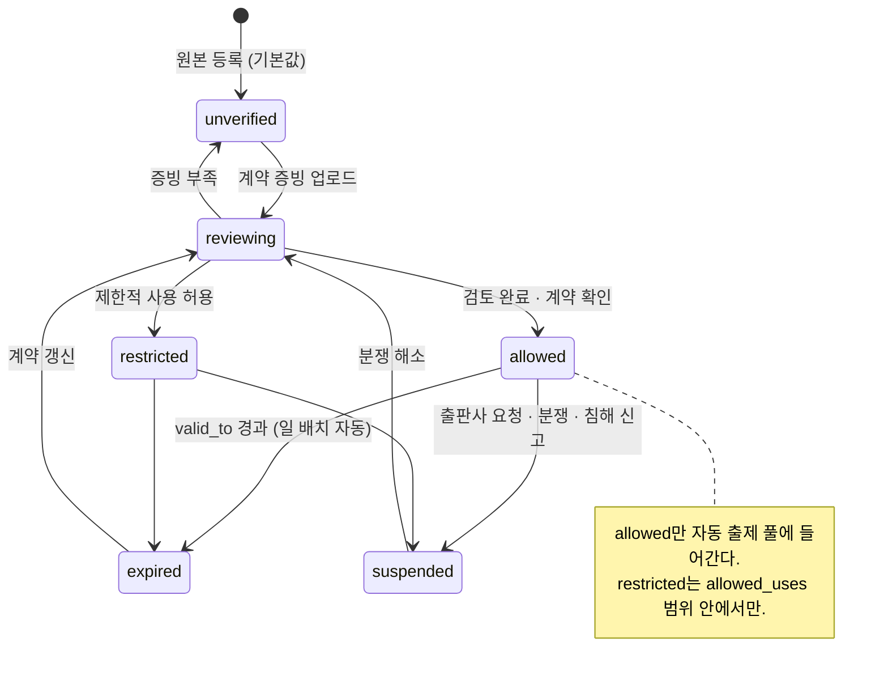

# ADR-0014 — 콘텐츠 출처와 사용 권한 집행

| 항목 | 값 |
|---|---|
| 상태 | **채택됨** (2026-07-31) |
| 관련 | [threat-model.md](../phase0/threat-model.md) 9장 · [sequences.md](../phase0/sequences.md) S-8 · [RB-08](../runbooks/08-content-rights-emergency-stop.md) |

---

## 맥락

수맥의 문제은행은 **출판사 교재를 스캔·OCR해 데이터화**하는 것을 전제로 한다. 이것은 저작권 문제를 정면으로 안는다.

법적 위험의 형태:

| 위험 | 결과 |
|---|---|
| 권한 없는 교재로 시험 출제 | 저작권 침해. 고객사에 법적 책임 전가 |
| 계약 만료 후 계속 사용 | 계약 위반 |
| 출판사 삭제 요청에 대응 못 함 | 신뢰 상실, 소송 |
| AI 변형 문항의 원본 계보 불명 | 침해 여부 판단 불가 |
| 허용 범위 밖 사용 (인쇄만 허용인데 온라인 배포) | 계약 위반 |

골프롬프트 원칙 9: **"출처와 사용 권한이 확인되지 않았거나 품질 검수를 통과하지 못한 문항은 자동 출제하지 않는다."**

그리고 명확한 한계: **"적용 법률과 출판사 계약의 최종 판단은 법률 검토 대상이며 시스템이 권리 확보 자체를 보증한다고 표현하지 않는다."**

## 결정

### 1. 권한 상태 6종과 자동 출제 자격



```sql
CREATE VIEW eligible_question_versions AS
SELECT qv.*
FROM question_versions qv
JOIN questions q       ON q.id = qv.question_id
JOIN content_rights cr ON cr.id = qv.content_right_id
WHERE qv.status = 'published'
  AND qv.publish_gate_status = 'passed'
  AND q.lifecycle = 'active'
  AND cr.status = 'allowed'
  AND (cr.valid_to IS NULL OR cr.valid_to >= current_date)
  AND EXISTS (SELECT 1 FROM question_alignments qa
              WHERE qa.question_version_id = qv.id AND qa.review_status = 'approved');
```

**문항 선정은 이 뷰만 사용한다.** 다른 경로로 문항을 고르는 코드를 만들지 않는다.

### 2. 출처 메타데이터 (필수)

모든 원본과 문항에 연결한다.

| 항목 | 컬럼 |
|---|---|
| 출판사 | `publishers.name` |
| 교재명 | `books.title` |
| ISBN | `books.isbn` |
| 개정판·쇄 | `book_editions.edition_label` |
| 발행 연도 | `book_editions.published_year` |
| 원본 파일 해시 | `source_files.sha256` |
| 원본 페이지 | `source_pages.page_no` |
| 인쇄 문항 번호 | `questions.printed_number` |
| 업로드 조직·작업자 | `source_files.organization_id`, `uploaded_by` |
| 취득 경로 | `source_files.acquisition_path` |
| 권리자 | `content_rights.rights_holder` |
| 계약 증빙 | `content_rights.contract_ref`, `contract_evidence_path` |
| 허용 용도 | `content_rights.allowed_uses` jsonb |
| 허용 범위 | `content_rights.allowed_scope` jsonb (조직·지역) |
| 유효 기간 | `valid_from`, `valid_to` |
| 원본 보관 정책 | `source_files` 보존 규칙 (A-45) |

### 3. `allowed_uses` 구조 (확정)

```jsonc
{
  "print":      true,    // 인쇄 시험지·해설지 출력
  "online":     true,    // 온라인 응시 화면 노출
  "derive":     false,   // 변형 문항 생성 (숫자 변경 등)
  "ai_process": true,    // AI로 OCR·구조화·분류
  "export":     false    // 조직 외부로 내보내기
}
```

각 기능이 실행 전 해당 플래그를 검사한다.

| 기능 | 검사 |
|---|---|
| 반입 파이프라인 시작 | `ai_process` |
| 온라인 배정 | `online` |
| PDF·HWPX 출력 | `print` |
| 변형 문항 생성 | `derive` |
| 리포트 외부 내보내기 | `export` |

`restricted` 상태는 `allowed_uses`의 일부만 true인 경우다.

### 4. `allowed_scope` 구조

```jsonc
{
  "organizations": ["01J..."],       // 빈 배열 = 업로드 조직만
  "regions": ["KR"],
  "max_students": 500                // 계약상 학생 수 상한 (있는 경우)
}
```

조직 간 문항 공유는 `allowed_scope.organizations`에 명시된 경우에만 가능하다. **기본은 업로드 조직 전용**이다.

### 5. 만료 자동 처리

```sql
-- 일 배치 (04:00 KST)
UPDATE content_rights
SET status = 'expired', updated_at = now()
WHERE status IN ('allowed','restricted')
  AND valid_to IS NOT NULL AND valid_to < current_date;
-- → ContentRightsRevoked 이벤트 발행
```

**만료 30일 전 경고 알림**을 콘텐츠 관리자에게 보낸다. 만료 당일에 시험 생성이 실패하면 늦다.

### 6. 철회 시 영향 범위 차단 (S-8 시퀀스)

`ContentRightsRevoked` 소비 시 순서:

| # | 조치 | 대상 |
|---|---|---|
| 1 | 자동 출제 풀 제외 | 뷰가 자동 반영 |
| 2 | 미완료 평가에서 문항 제외·대체 | `assessment_instances.status IN ('generating','draft','ready')` |
| 3 | **활성 서명 URL 폐기** | Storage 객체 정책 갱신 |
| 4 | **캐시된 출력 산출물 삭제** | `document_exports` 객체 삭제. **메타·체크섬은 보존** |
| 5 | 검색 인덱스에서 제외 | 읽기 모델 갱신 |
| 6 | 콘텐츠 관리자에게 SEV2 알림 | 영향 요약 포함 |

**보존하는 것**: 이미 완료된 응시의 **점수·감사·출처 식별 기록**. 게시 스냅샷(ADR-0008)이 있으므로 과거 응시는 계속 열람·재채점 가능하다.

**원본 파일**: `suspended` 확정 후 30일에 파기(A-45). 그 전까지는 분쟁 대응·재검토를 위해 보존한다.

### 7. AI 변형 문항의 계보

```sql
-- question_versions
derived_from_version_id uuid    -- 원본 문항 버전
derivation_similarity   numeric -- 0.0 ~ 1.0
ai_model_version        text
ai_prompt_version       text
reviewed_by             uuid    -- 검수자
```

| 규칙 | 내용 |
|---|---|
| 계보 필수 | AI 변형 문항은 `derived_from_version_id` NOT NULL |
| 유사도 기록 | `derivation_similarity` — 의미 지문 + 구조 비교 |
| 권한 상속 | 변형 문항의 `content_right_id`는 **원본과 동일**. 원본 권한이 철회되면 변형도 철회 |
| `derive` 플래그 | `allowed_uses.derive = false`면 변형 생성 자체가 차단 |
| 유사도 임계 | 0.85 이상이면 "실질적 동일"로 간주해 검수자에게 경고 |
| 검수자 필수 | 변형 문항은 사람 검수 없이 게시 불가 |

### 8. 침해 신고 창구 (Q-14)

| 항목 | 값 |
|---|---|
| 창구 | `/content-policy` 페이지 + 접수 폼 |
| 접수 정보 | 신고자, 권리 근거, 대상 교재·문항, 요청 조치 |
| **초기 대응 기한** | **24시간 내 `suspended` 전환** |
| 이후 | 법률 검토 → `reviewing` → 해소 시 `allowed` 복귀 또는 영구 `suspended` |
| 기록 | `content_rights.suspend_reason` + `audit_events` |

**신고를 받으면 먼저 차단하고 나중에 검토한다.** 반대 순서는 위험이 크다.

### 9. 시스템이 보증하지 않는 것 (명시)

제품 문구·UI·계약서에 다음을 명확히 한다.

> 수맥은 콘텐츠 출처와 사용 권한을 **기록하고 집행**한다. 권리 확보 자체를 보증하지 않는다. 적용 법률과 출판사 계약의 최종 판단은 조직의 법률 검토 대상이다.

UI 표현:

| 하지 않는 표현 | 하는 표현 |
|---|---|
| "저작권 문제 없음" | "사용 권한: 사용 가능 (계약 증빙 확인됨, 2027-02-28까지)" |
| "합법적으로 사용 가능" | "이 판본의 등록된 허용 용도: 인쇄, 온라인" |
| "권리 검증 완료" | "권리 상태 검토자: 홍길동, 검토일: 2026-08-01" |

### 10. 골든 데이터셋 규칙

**실제 권리 미확인 문제집을 회귀 데이터로 사용하지 않는다.** 권한이 있는 샘플 또는 합성 데이터로 고정된 골드셋을 만든다.

`시험지 한글화`의 실제 HWP 수식 실측·골든 회귀는 **출력 어댑터의 기준**으로 사용하되, 원본 시험지·학생 데이터는 가져오지 않는다.

## 대안

| 대안 | 장점 | 채택하지 않은 이유 |
|---|---|---|
| **A. 권한 관리 없음 (조직 책임)** | 개발 비용 0 | ① 원칙 9 위반 ② 조직이 실수로 권한 없는 문항을 출제하면 막을 방법이 없다 ③ 삭제 요청 대응 불가 |
| **B. 권한을 문항 단위로 관리** | 세밀한 제어 | ① 1,000만 문항 × 권한 검토 = 비현실적 ② 계약은 판본 단위로 이루어짐 ③ 판본 단위가 실제 계약 구조와 일치 |
| **C. 권한 상태 2종 (허용/불허)** | 단순 | ① 만료와 중지를 구분 못 함 — 대응이 다르다 ② 검토 중 상태가 없어 업로드 후 즉시 사용 가능 ③ 제한적 사용(인쇄만) 표현 불가 |
| **D. 만료 시 자동 삭제** | 깔끔 | ① 과거 응시·감사 기록 파괴(불변 I-13 위반) ② 계약 갱신 시 재업로드 필요 ③ 분쟁 시 증거 소실 |
| **E. 권한 검사를 애플리케이션에서만** | 유연 | 검사 누락 경로가 생긴다. 뷰(`eligible_question_versions`)로 강제하는 것이 안전 |
| **F. 변형 문항을 독립 문항으로** | 계보 관리 불필요 | ① 원본 권한 철회 시 변형이 남는다 ② 침해 판단 불가 ③ 골프롬프트가 명시적으로 계보 요구 |
| **G. 신고 시 검토 후 차단** | 오탐 방지 | 법적 위험이 크다. 먼저 차단하고 나중에 복구하는 것이 안전 |
| **H. "저작권 보증" 마케팅** | 판매에 유리 | 허위 표시. 법적 책임을 수맥이 지게 된다 |

## 비용

| 항목 | 비용 |
|---|---|
| 개발 | 권한 상태 머신, 뷰, 철회 전파, 계보 추적, 신고 창구 (약 1,500줄) |
| 운영 | 계약 증빙 검토 인력. 판본당 약 30분 |
| 저장 | 계약 증빙 문서. 판본당 평균 2 MB |
| 기능 제약 | `unverified` 원본은 반입 파이프라인 진입 불가 — 초기 도입 마찰 |
| 알림 | 만료 30일 전 경고 운영 |
| 법률 | 계약 표준 문구 검토 (Q-03), 신고 대응 절차 (Q-14) |

## 실패 방식

| # | 어떻게 실패하는가 | 조기 신호 | 대응 |
|---|---|---|---|
| F-1 | 권한 검사를 우회한 문항 선정 경로 | 통합 테스트 실패 | `listEligibleQuestions()`가 유일한 선정 소스. 코드 리뷰 + 뷰 강제 |
| F-2 | 만료 직전 대량 시험 생성 | 만료 후 문항 부족 | 30일 전 경고. 만료 임박 판본의 문항 사용률 대시보드 |
| F-3 | 철회 후 서명 URL이 살아 있음 | 보안 테스트 실패 | 철회 시 Storage 정책 갱신. 만료 15분이 2차 방어 |
| F-4 | 캐시된 PDF가 계속 다운로드됨 | 접근 로그 | `document_exports` 객체 삭제 + CDN 무효화 |
| F-5 | 변형 문항이 원본 권한과 분리됨 | 계보 검증 쿼리 위반 | `content_right_id`를 원본에서 상속. FK 제약 |
| F-6 | 조직이 권한 없는 교재를 업로드 | `unverified` 상태 누적 | 반입 파이프라인 진입 차단(`RIGHTS_NOT_ALLOWED`) |
| F-7 | 계약 증빙이 형식적으로만 확인됨 | 분쟁 발생 | 검토자·검토일 기록. 조직 책임 명시. 법률 검토 안내 |
| F-8 | 침해 신고 대응 지연 | 24시간 경과 | 신고 접수 시 자동 SEV2 + 담당자 배정 |
| F-9 | 대량 철회로 문제은행이 비어 자동 출제 실패 | `INSUFFICIENT_QUESTIONS` 급증 | 영향 분석에서 사전 표시. 대체 문항 확보 안내 |
| F-10 | 골드셋에 권리 미확인 문제집 유입 | 감사 | 골드셋 등록 시 `content_rights.status='allowed'` 또는 합성 데이터임을 검증 |

## 되돌리기

| 방향 | 방법 | 비용 |
|---|---|---|
| 권한 상태 전환 | `reviewing` → `allowed` 복귀 | 낮음 |
| 철회 취소 | `suspended` → `reviewing` → `allowed`. **철회 중 삭제된 캐시는 재생성**(스냅샷 결정론) | 낮음 |
| `allowed_uses` 조정 | 즉시 반영. 뷰가 자동 갱신 | 매우 낮음 |
| 만료 기간 연장 | `valid_to` 수정 + 감사 | 낮음 |
| 격리된 문항 복구 | `lifecycle='active'` 복귀 | 낮음 |
| 파기된 원본 복구 | **불가** (30일 후 파기됨). 재업로드 필요 | 높음 |
| 권한 모델 제거 | **되돌리지 않는다.** 법적 위험 복귀 | — |
| 판본 단위 → 문항 단위 | 마이그레이션으로 가능하나 검토 비용 폭증 | 매우 높음 |

원본 파기(30일)만 되돌릴 수 없다. 그래서 파기 전에 2인 승인과 영향 확인을 요구한다.
