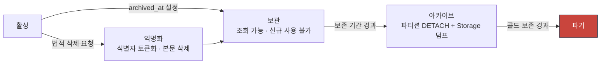
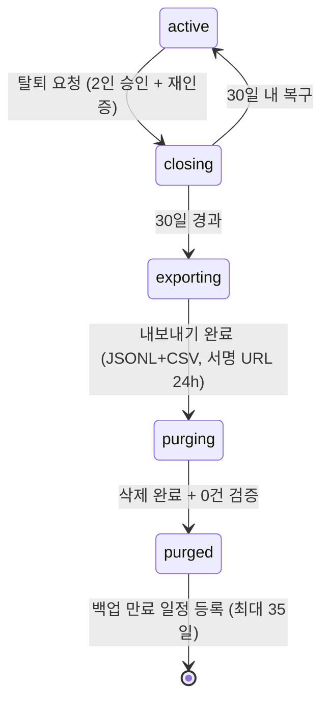

# ADR-0015 — 데이터 보존·삭제와 감사 로그

| 항목 | 값 |
|---|---|
| 상태 | **채택됨** (2026-07-31) |
| 관련 | [erd.md](../phase0/erd.md) 10장 · [backup-recovery.md](../phase0/backup-recovery.md) · [threat-model.md](../phase0/threat-model.md) 8장 |

---

## 맥락

수맥은 **미성년자 개인정보**를 다룬다. 동시에 학습 증거·채점 이력·감사 로그는 **오래 보존**해야 한다. 두 요구가 충돌한다.

| 보존해야 하는 이유 | 삭제해야 하는 이유 |
|---|---|
| 숙련도 재현(불변 I-11) | 개인정보보호법상 목적 달성 후 파기 |
| 채점 정정 시 원본 대조 | 삭제 요청권 |
| 감사·분쟁 대응 | 조직 탈퇴 |
| 재채점 영향 분석 | 저장 비용 |
| 학습 진행 리포트 | 미성년자 데이터 최소화 원칙 |

그리고 세 번째 축이 있다. **감사 로그는 아무도 지울 수 없어야 한다.** eywa 실사고에서 확인된 것처럼 권한 오용의 흔적이 지워지면 사고 조사가 불가능하다. 골프롬프트 27장: "일반 관리자는 감사 로그를 수정할 수 없다."

PITR(35일)도 변수다. 삭제해도 백업에는 남는다.

## 결정

### 1. 삭제 대신 보관을 기본으로 한다



**완료 기록과 감사 이벤트는 삭제 대신 보존·보관 상태를 우선 사용한다.**

### 2. 보존 기간 (확정)

| 데이터 | 핫(온라인) | 웜(파티션 분리) | 콜드(Storage) | 파기 |
|---|---|---|---|---|
| `responses` 답안 본문 | 180일 | ~3년 | 3년 후 덤프 | 3년 경과 또는 조직 탈퇴 +30일 |
| `attempts` | 180일 | ~3년 | 덤프 | 동일 |
| `grade_decisions` | **영구(핫)** | — | — | 학생 삭제 요청 시 익명화 |
| `mastery_evidences` | 180일 | ~3년 | 덤프 | 3년 / 삭제 요청 |
| `concept_masteries` | 활성 정책 버전 | 이전 정책 | — | 정책 폐기 +1년 |
| `progress_events` | 180일 | ~3년 | 덤프 | 3년 |
| `sessions` | 과정 기간 +1년 | ~3년 | 덤프 | 3년 |
| `route_versions` | 게시 중 + superseded 1년 | ~3년 | 덤프 | 3년 |
| `question_versions` | 영구 | — | — | 권한 `suspended` 확정 +30일 |
| `source_files` (Storage) | 계약 기간 | +90일 | Cold | `suspended` +30일 |
| `source_pages` 300 DPI 이미지 | 90일 | WebP 다운샘플 | — | 원본 파기 시 |
| `math_render_artifacts` (web) | 30일 | — | — | 30일 (재생성 가능) |
| `document_exports` 산출물 | 90일 (배포 링크 180일) | — | — | 만료 시 객체만 삭제, 메타 보존 |
| **`audit_events`** | **1년** | **1~5년(압축)** | **5년 후 덤프** | **5년 + 법정 요구 없음** |
| `outbox_events` | sent +7일 | — | — | 7일 |
| `job_runs` | 90일 | — | — | 90일 |
| `idempotency_keys` | 24시간 | — | — | 24시간 |
| `notifications` | 90일 | — | — | 90일 |
| `read_model_*` | 항상 | — | — | 재생성 시 TRUNCATE |

### 3. 감사 로그 불변성

```sql
CREATE TABLE audit_events (
  id               uuid PRIMARY KEY DEFAULT uuidv7(),
  organization_id  uuid NOT NULL,
  actor_user_id    uuid,
  actor_kind       text NOT NULL,   -- user | system | operator
  action           text NOT NULL,   -- route.publish | grading.correct | privacy.export | ...
  target_type      text NOT NULL,
  target_id        uuid,
  before           jsonb,
  after            jsonb,
  reason           text,
  permission_basis text NOT NULL,   -- 어떤 권한으로 통과했는가
  rule_version     text,            -- 자동화 규칙 버전
  correlation_id   text,
  occurred_at      timestamptz NOT NULL DEFAULT now()
) PARTITION BY RANGE (occurred_at);

-- 불변성 3중 방어
REVOKE UPDATE, DELETE ON audit_events FROM authenticated, anon;

CREATE OR REPLACE FUNCTION deny_audit_mutation() RETURNS trigger
LANGUAGE plpgsql AS $$
BEGIN
  RAISE EXCEPTION 'audit_events is append-only' USING ERRCODE = '42501';
END $$;

CREATE TRIGGER audit_events_no_update BEFORE UPDATE ON audit_events
FOR EACH ROW EXECUTE FUNCTION deny_audit_mutation();
CREATE TRIGGER audit_events_no_delete BEFORE DELETE ON audit_events
FOR EACH ROW EXECUTE FUNCTION deny_audit_mutation();
```

**소유자 역할도 지울 수 없다.** 보존 기간 만료 시 파티션 DROP만 가능하며, 이는 마이그레이션 경로(별도 자격 증명)로만 실행된다.

같은 불변성을 `mastery_evidences`(원본 학습 증거)와 `grade_decisions`(채점 이력)에도 적용한다(불변 I-15).

### 4. 감사 대상 (골프롬프트 23장)

| 행위 | `action` |
|---|---|
| 자동·수동 일정 변경 | `schedule.proposal_applied`, `session.update` |
| 루트 게시·롤백 | `route.publish`, `route.rollback` |
| 시험 문항 변경 | `assessment.question_replace`, `assessment.publish` |
| 채점 수정 | `grading.correct`, `grading.regrade` |
| 숙련도 수동 변경 | `mastery.override` |
| 개인정보 열람·수정 | `privacy.view`, `privacy.update` |
| 권한 변경 | `membership.change_role`, `permission.override` |
| 데이터 가져오기·내보내기 | `import.execute`, `privacy.export` |
| 콘텐츠 승인·반려 | `content.approve`, `content.reject`, `content.quarantine` |
| 권한 상태 변경 | `rights.suspend`, `rights.allow` |
| kill switch | `ops.kill_switch` |
| break-glass | `ops.break_glass_start`, `ops.break_glass_end` |
| 조직 탈퇴 | `organization.request_close`, `organization.purge` |

각 행에 **행위자, 시각, 사유, 변경 전후, 영향 대상, 자동화 규칙 버전, 권한 근거**를 남긴다.

**애플리케이션 관측 로그와 분리한다.** 관측 로그는 로그 백엔드에, 감사는 DB 테이블에.

### 5. 학생 개인 삭제 요청

| 대상 | 처리 |
|---|---|
| `students.display_name`, `external_ref` | **즉시 안정 토큰으로 치환** |
| `responses.payload` (서술형 본문) | 즉시 삭제, `{"redacted": true}` |
| `responses` 객관식 선택 | **유지** (점수 재현) |
| `attempts`, `grade_decisions` 점수 | **유지** (학습 증거·감사 무결성). `student_id`는 안정 토큰 |
| `mastery_evidences` | 유지 (익명 토큰) |
| `audit_events` | 유지. 행위자·대상 식별자 토큰화 |
| Storage 손글씨 스캔 | 즉시 삭제 |
| 생성된 리포트 | 즉시 삭제 |
| 읽기 모델·검색 인덱스 | 재생성 |

**안정 토큰**: `student_id`는 UUID 그대로 유지하되, `display_name`·`external_ref`만 토큰화한다. FK 무결성이 유지되고 통계·감사가 살아남는다.

| 항목 | 값 |
|---|---|
| 처리 기한 | 영업일 **10일** 이내 |
| 감사 | `action='privacy.erase'` |
| 통지 | 요청자에게 처리 완료 + **백업 만료 예정일** |

### 6. 조직 탈퇴



**삭제 순서(역순 의존)**:

1. 읽기 모델·검색 인덱스
2. Storage 객체 (경로 프리픽스 `{organization_id}/` 일괄)
3. 파생 테이블 (`concept_masteries`, `review_items`, `notifications`, `reports`)
4. 트랜잭션 테이블 (`responses` → `attempts` → `assessment_questions` → `assessment_instances`)
5. 콘텐츠 (`question_versions` → `questions` → `source_pages` → `source_files`)
6. 계획 (`route_nodes` → `route_versions` → `route_plans`)
7. 수업 (`session_attendees` → `sessions` → `learning_groups`)
8. 조직 메타 (`memberships` → `students` → `organizations`)

**`audit_events`는 법정 보존 기간(5년)까지 유지**한다. `organization_id`만 남기고 개인 식별자는 토큰화한다.

`scripts/purge-organization.mjs`가 실행하고, 각 단계 후 0건 검증 쿼리를 돌린다. 결과를 감사에 기록한다.

### 7. 백업과의 상호작용

| 규칙 | 내용 |
|---|---|
| 백업 선택적 삭제 | **하지 않는다.** 무결성이 깨진다 |
| 고객 고지 | 삭제 요청 처리 시 **백업 만료 예정일(최대 35일)을 명시**한다 |
| 기록 | `data_deletion_requests`(요청일, 처리일, 범위, 백업 만료 예정일, 처리자) |
| PITR 복원 후 | 복원 시점이 삭제 이전이면 삭제 요청을 **재실행**한다. `data_deletion_requests`가 그 목록이다 |

마지막 항목이 중요하다. PITR로 되돌리면 삭제한 데이터가 살아난다. 복구 후 검증 절차에 "미처리 삭제 요청 재실행"을 포함한다.

### 8. 파티션 운영

매월 1일 03:00 KST 스케줄러:

```sql
-- 1) 다음 3개월 파티션 사전 생성
-- 2) 보존 경계 초과 파티션 아카이브 후 DETACH
ALTER TABLE responses DETACH PARTITION responses_2026_01 CONCURRENTLY;
--    pg_dump -Fc → {archive}/responses_2026_01.dump (체크섬 기록)
-- 3) 콜드 보존 초과 파티션 DROP
DROP TABLE responses_2026_01;
```

**기본 파티션에 행이 쌓이면 알림**(선행 생성 실패 신호).

### 9. 필드별 목적·역할·보존 기록

모든 개인정보 필드에 대해 **목적, 접근 역할, 보존 기간**을 문서화한다.

| 필드 | 목적 | 접근 역할 | 보존 |
|---|---|---|---|
| `students.display_name` | 교사가 학생 식별 | OWN, DIR, TCH(담당), GRD(배정분) | 조직 탈퇴 +30일 |
| `students.external_ref` | 외부 SIS 연동 | OWN, DIR | 동일 |
| `responses.payload` | 채점·학습 증거 | OWN, DIR, TCH(담당), GRD(배정분), STU(본인) | 3년 |
| `grade_decisions.score` | 성적·숙련도 | 동일 | 영구(익명화 가능) |
| `mastery_evidences.*` | 숙련도 재현 | OWN, DIR, TCH(담당) | 3년 |
| `audit_events.actor_user_id` | 책임 추적 | OWN, DIR(읽기), TCH(자기 범위) | 5년 |

**콘텐츠 관리자·검수자(CNT·REV)는 학생 필드에 접근하지 않는다**([threat-model.md](../phase0/threat-model.md) 5.2).

### 10. 내부 처리는 불투명 ID

| 대상 | 규칙 |
|---|---|
| 로그·트레이스 | 학생 이름·연락처 금지. `student_id` UUID만 |
| 메트릭 레이블 | 학생 ID조차 금지(고카디널리티 + 개인정보) |
| AI 전송 | 학생 데이터 미전송 |
| 이벤트 페이로드 | 답안 원문·이름 금지. 참조 ID만 |
| 내보내기 | 조직 승인 후에만 실명 포함 |

## 대안

| 대안 | 장점 | 채택하지 않은 이유 |
|---|---|---|
| **A. 물리 삭제 기본** | 저장 절약, 프라이버시 단순 | ① 숙련도 재현 불가(I-11) ② 재채점 영향 분석 불가 ③ 분쟁 시 증거 소실 ④ FK 무결성 파괴 |
| **B. 영구 보존 (삭제 없음)** | 가장 단순 | ① 법적 요구 위반 ② 저장 비용 무한 증가 ③ 미성년자 데이터 최소화 원칙 위반 |
| **C. 감사 로그를 애플리케이션 로그에 통합** | 인프라 1개 | ① 로그 백엔드는 변조·삭제 가능 ② 조회·조인이 어렵다 ③ RLS 미적용 ④ 골프롬프트가 명시적으로 분리 요구 |
| **D. 감사 로그를 외부 불변 저장소(WORM)에** | 최고 수준 무결성 | ① 인프라 추가 ② 조회 성능 ③ 조인 불가 ④ DB 트리거 + REVOKE로 충분한 수준 확보 |
| **E. 삭제 요청 시 전체 삭제** | 요청자 만족 | ① 다른 학생의 시험 통계가 깨진다 ② 감사 무결성 파괴 ③ 익명화가 법적 요구를 충족하는 표준 방식 |
| **F. 파티션 없이 단일 테이블** | 단순 | 3년 8.9 TB 단일 테이블. 삭제가 `DELETE`로 수행되어 VACUUM 부담 폭증 |
| **G. 백업에서도 선택 삭제** | 완전한 삭제 | 백업 무결성 파괴. 복원 불가. 업계 표준은 백업 만료 대기 |
| **H. 보존 기간을 조직이 설정** | 유연 | ① 법적 최소·최대를 조직이 어길 수 있다 ② 파티션 정책이 조직마다 달라짐 ③ 플랫폼 고정이 안전 |

## 비용

| 항목 | 비용 |
|---|---|
| 저장 | 온라인 2.1 TB + 아카이브 9.7 TB ([assumptions.md](../phase0/assumptions.md) 3.8) |
| 아카이브 | Storage USD 155/월 + 덤프 실행 시간 |
| 개발 | 파티션 운영, 익명화, 파기 스크립트, 감사 래퍼 (약 1,800줄) |
| 운영 | 월 파티션 작업, 삭제 요청 처리(영업일 10일 SLA) |
| 감사 저장 | 5년 900 GB (압축 파티션) |
| 성능 | 감사 INSERT가 모든 쓰기 명령에 추가 (약 +3 ms) |

## 실패 방식

| # | 어떻게 실패하는가 | 조기 신호 | 대응 |
|---|---|---|---|
| F-1 | 파티션 선행 생성 실패로 기본 파티션 폭증 | 기본 파티션 행 수 > 0 | 3개월 선행 + 일 배치 검증 + 알림 |
| F-2 | 감사 기록 누락 | 명령 실행 수 vs 감사 행 수 불일치 | `defineCommand` 래퍼가 자동 기록. 우회 불가 |
| F-3 | 마이그레이션에서 감사 트리거 임시 비활성 후 복구 누락 | 트리거 존재 검증 쿼리 | 일 배치 + 마이그레이션 후 검증 |
| F-4 | 삭제 요청이 읽기 모델에 반영 안 됨 | 검색에서 삭제된 이름 노출 | 삭제 후 읽기 모델 재생성 필수 단계 |
| F-5 | PITR 복원으로 삭제 데이터 부활 | 복구 후 검증 | `data_deletion_requests` 재실행 |
| F-6 | 아카이브 덤프 손상 | 체크섬 불일치 | 덤프 후 즉시 체크섬 검증 + 월별 복구 검증 |
| F-7 | 조직 파기 후 잔여 데이터 | 0건 검증 쿼리 위반 | `purge-organization.mjs`가 단계마다 검증. 실패 시 중단 |
| F-8 | 감사 로그 조회가 느려짐 | 감사 화면 p95 상승 | `(organization_id, occurred_at)` + `(target_type, target_id)` 인덱스. 1년 초과는 압축 파티션 |
| F-9 | 익명화 후에도 재식별 가능 | 감사 | `display_name`·`external_ref`만 토큰화하고, 결합 가능한 준식별자(생년월일 등)는 **애초에 수집하지 않는다** |
| F-10 | 보존 기간이 법 개정과 어긋남 | 법률 검토 | 보존 기간은 이 ADR 한 곳에만 정의. 변경 시 파티션 정책 함께 갱신 |

## 되돌리기

| 방향 | 방법 | 비용 |
|---|---|---|
| 보존 기간 연장 | 이 ADR + 파티션 스크립트 수정. **이미 파기된 것은 복구 불가** | 낮음 (앞으로만) |
| 보존 기간 단축 | 조기 아카이브·파기 배치 | 중간 |
| 아카이브 재활성 | 파티션 재ATTACH (덤프가 있으면) | 낮음 (1시간) |
| 익명화 되돌리기 | **불가.** 토큰에서 원본 복원 불가 (의도됨) | — |
| 파기 되돌리기 | PITR 창(35일) 안이면 가능. 이후 불가 | 높음 / 불가 |
| 감사 불변성 완화 | **되돌리지 않는다.** 사고 조사가 불가능해진다 | — |
| 조직 탈퇴 취소 | `closing` 상태 30일 안이면 `active` 복귀 | 낮음 |

30일 유예와 35일 PITR 창이 실질적인 안전망이다. 그 밖의 파기는 되돌릴 수 없으므로 2인 승인과 0건 검증을 요구한다.
