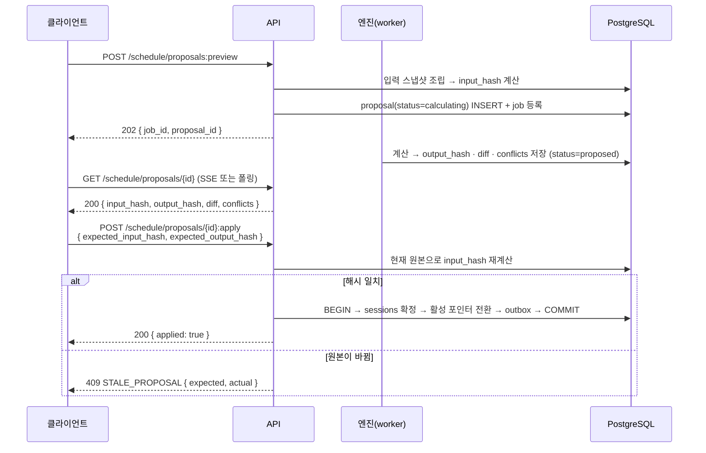

# API 계약 — 원칙·핵심 명령·멱등성·동시성·오류 코드

> 골프롬프트 2G(API, 멱등성과 동시성) 이행 문서.
> 관련: [state-machines.md](./state-machines.md) · [event-catalog.md](./event-catalog.md) · [domain-map.md](./domain-map.md) · [threat-model.md](./threat-model.md)

---

## 1. 스타일과 버전

| 항목 | 결정 |
|---|---|
| 스타일 | **업무 행위 중심 REST/JSON**. DB CRUD를 그대로 노출하지 않는다 |
| 계약 소스 | `packages/contracts`의 zod 4 스키마가 단일 정의. OpenAPI 3.1 문서는 **zod에서 생성**(`pnpm contracts:openapi`)하며 손으로 쓰지 않는다 |
| 버전 | URL 경로 `/api/v1/...`. **파괴적 변경만 major 증가**, 하위 호환 추가는 버전 유지 |
| 내부 호출 | 교사·학생 앱은 Next.js Server Actions를 우선 사용한다. **Server Action도 아래 명령 계약(멱등성·낙관적 잠금·오류 코드)을 동일하게 적용**한다. `/api/v1`은 외부 연동·모바일·SSE 전용 |
| 인증 | Supabase Auth 세션 쿠키(사용자) 또는 서비스 계정 토큰(외부 연동). `organization_id`는 **항상 서버가 세션에서 확정**한다 |
| 콘텐츠 타입 | `application/json; charset=utf-8`. 업로드만 `multipart/form-data` |
| 시간 | 요청·응답 전부 RFC 3339 UTC (`2026-08-03T05:00:00Z`) |
| 언어 | 오류 메시지 `message`는 한국어, `code`는 안정된 영문 상수 |

### 1.1 공통 응답 봉투

```jsonc
// 성공
{
  "data": { /* 리소스 또는 결과 */ },
  "meta": {
    "trace_id": "01J...",              // 필수, 모든 응답
    "data_versions": {                  // 필수, 주요 데이터 버전
      "route_version_id": "01J...",
      "route_version_no": 7,
      "curriculum_release_hash": "sha256:...",
      "snapshot_hash": "sha256:..."
    },
    "computed_at": "2026-08-03T05:00:00Z",   // 파생 데이터일 때 필수
    "stale": false                            // 읽기 모델 지연 여부
  }
}

// 오류
{
  "error": {
    "code": "STALE_PROPOSAL",
    "message": "제안을 만든 뒤 원본 일정이 바뀌었습니다. 다시 계산해 주세요.",
    "resolution": "미리보기를 다시 생성한 뒤 승인하세요.",
    "retryable": false,
    "details": { "expected_input_hash": "...", "actual_input_hash": "..." }
  },
  "meta": { "trace_id": "01J..." }
}
```

`trace_id`는 요청 전 구간(web → DB → Outbox → worker)에서 `correlation_id`로 전파된다.

---

## 2. 인증·권한 헤더

| 헤더 | 방향 | 필수 | 설명 |
|---|---|---|---|
| `Cookie: sb-*` | 요청 | 사용자 호출 | Supabase 세션. `proxy.ts`가 갱신 |
| `Authorization: Bearer <service-token>` | 요청 | 외부 연동 | 서비스 계정. 사람 계정과 분리, 만료·회전 정책 보유 |
| `Idempotency-Key` | 요청 | **모든 쓰기** | 클라이언트 생성 UUIDv4/v7. 24시간 유효 |
| `If-Match` | 요청 | 편집 명령 | `"<aggregate_version>"` 또는 `"<content_hash>"` |
| `X-Reauth-Token` | 요청 | 고위험 명령 | 재인증 토큰 (5분 유효) |
| `ETag` | 응답 | 편집 가능 리소스 | 다음 `If-Match` 값 |
| `X-Trace-Id` | 응답 | 항상 | `meta.trace_id`와 동일 |
| `Retry-After` | 응답 | 429·503 | 초 단위 |

**클라이언트가 보낸 `organization_id`는 권한 근거로 절대 신뢰하지 않는다.** 경로에 `:orgId`가 있어도 세션에서 확정한 값과 다르면 404를 반환한다(403은 존재를 노출한다).

### 2.1 재인증이 필요한 고위험 명령

| 명령 | 이유 |
|---|---|
| 역할 변경·권한 부여 | 권한 상승 |
| 전체 재채점 | 대량 성적 변경 |
| 문항 무효화 | 대량 성적 변경 |
| 개인정보 내보내기 | 데이터 유출 |
| 대량 일정 변경 (100건 초과) | 운영 영향 |
| 루트 게시 | 반 전체 계획 변경 |
| 조직 탈퇴 요청 | 파기 |
| break-glass 접근 | 운영자 대리 |

`X-Reauth-Token` 누락 시 `401 REAUTH_REQUIRED`.

---

## 3. 조회 규약

### 3.1 원칙

- 조회는 **커서 페이지네이션만**. offset/limit은 제공하지 않는다.
- 기본 페이지 크기 50, 최대 200.
- 조회는 부작용이 없다.
- 파생 데이터 조회는 `meta.computed_at`과 `meta.stale`을 반드시 포함한다. `stale=true`면 화면은 `계산 중`을 표시한다.

### 3.2 커서 인코딩 (확정)

커서는 **base64url로 인코딩한 JSON**이며, 서명한다.

```
cursor = base64url( JSON.stringify(payload) ) + "." + base64url( HMAC-SHA256(secret, payload) )

payload = {
  "v": 1,                                  // 커서 스키마 버전
  "k": ["2026-08-03T05:00:00Z", "01J8..."],// 정렬 키 값 배열 (정렬 컬럼과 같은 순서, 마지막은 항상 id)
  "d": "asc",                              // 방향
  "f": "3f9a1c2e",                          // 필터 해시 (필터가 바뀌면 커서 무효)
  "o": "01J0..."                            // organization_id (교차 테넌트 커서 재사용 차단)
}
```

규칙:

1. **정렬은 항상 `(정렬 컬럼..., id)` 복합**이다. `id`가 UUIDv7이므로 동률에서도 안정적으로 나뉜다.
2. 서버는 `o`가 세션의 `organization_id`와 다르면 `400 INVALID_CURSOR`를 반환한다.
3. `f`(필터 해시)가 현재 요청의 필터 해시와 다르면 `400 CURSOR_FILTER_MISMATCH`. 클라이언트는 첫 페이지부터 다시 요청한다.
4. HMAC 불일치·디코드 실패는 `400 INVALID_CURSOR`. 커서를 사용자가 조작해 다른 조직 데이터를 읽을 수 없다.
5. 커서에 만료는 두지 않는다. 대신 `v`를 올려 전체 무효화할 수 있다.
6. 쿼리는 튜플 비교로 실행한다: `WHERE (saved_at, id) > ($1, $2) ORDER BY saved_at, id LIMIT $3`.

응답:

```jsonc
{
  "data": { "items": [ /* ... */ ] },
  "meta": {
    "trace_id": "...",
    "page": { "next_cursor": "eyJ2Ijox....abc123", "has_more": true }
  }
}
```

마지막 페이지는 `next_cursor: null`, `has_more: false`.

---

## 4. 멱등성

### 4.1 규칙

1. **모든 쓰기 요청에 `Idempotency-Key`가 필수**다. 누락 시 `400 IDEMPOTENCY_KEY_REQUIRED`.
2. 서버는 `(organization_id, operation, idempotency_key)`로 저장한다 — `idempotency_keys` 테이블 UNIQUE 제약.
3. `request_hash = SHA256(canonical_json(body) + method + path)`를 함께 저장한다.
4. 같은 키 + **같은** `request_hash` → 저장된 응답을 그대로 반환 (`200`/`201` 원본 상태 코드 + `Idempotency-Replayed: true` 헤더).
5. 같은 키 + **다른** `request_hash` → `409 IDEMPOTENCY_KEY_CONFLICT`.
6. 처리 중(첫 요청이 아직 커밋 전)에 같은 키가 오면 `409 IDEMPOTENCY_IN_PROGRESS` + `Retry-After: 1`.
7. 보존 24시간. 만료 후 같은 키는 새 요청으로 취급한다.
8. **저장은 업무 트랜잭션과 같은 트랜잭션**에서 커밋한다. 별도 트랜잭션이면 "처리는 됐는데 키가 없는" 창이 생긴다.

```sql
-- 명령 진입부 (같은 TX)
INSERT INTO idempotency_keys (organization_id, operation, idempotency_key, request_hash, status_code)
VALUES ($1, $2, $3, $4, NULL)
ON CONFLICT (organization_id, operation, idempotency_key) DO NOTHING
RETURNING id;
-- RETURNING이 비면: 기존 행 조회 → request_hash 비교 → 재생 또는 409
```

### 4.2 논리적 중복의 최종 차단

멱등성 키는 클라이언트 재시도만 막는다. **의미상 중복은 DB 고유 제약으로 최종 차단**한다.

| 중복 유형 | 고유 제약 |
|---|---|
| 같은 학생·날짜·유형의 테스트 중복 생성 | `assessment_instances UNIQUE (organization_id, learning_group_id, student_id, kind, scheduled_on) WHERE status <> 'cancelled'` |
| 같은 응시 중복 | `attempts UNIQUE (assessment_instance_id, student_id, attempt_no)` |
| 같은 답안 중복 | `responses UNIQUE (attempt_id, assessment_question_id)` |
| 같은 반입 작업 중복 | `jobs UNIQUE (organization_id, job_type, idempotency_key) WHERE status <> 'cancelled'` |
| 같은 불참 이벤트 중복 수신 | `learning_availability_events UNIQUE (organization_id, source, external_event_id)` |
| 같은 채점 결과 중복 증거 | `mastery_evidences UNIQUE (grade_decision_id, canonical_concept_id)` |

고유 제약 위반은 `409 DUPLICATE_RESOURCE`로 변환하되, **멱등한 명령(테스트 생성 등)은 기존 리소스를 200으로 반환**한다.

---

## 5. 동시성

### 5.1 낙관적 잠금

편집 명령은 `If-Match`를 요구한다.

```http
PATCH /api/v1/routes/versions/01J8.../nodes/01J9...
If-Match: "7"
Idempotency-Key: 5f2c...
```

- 값은 `aggregate_version` 정수 또는 `content_hash` 문자열.
- 서버는 `UPDATE ... WHERE id = $1 AND version = $2`로 CAS. 영향 행 0 → `409 VERSION_CONFLICT` + `details.current_version`.
- `If-Match` 누락 → `428 PRECONDITION_REQUIRED`.
- 성공 응답은 새 `ETag`를 반환한다.

두 교사가 같은 루트를 동시에 편집하면 나중 요청이 409를 받고, 화면은 변경 전후 diff를 보여준 뒤 재시도하게 한다. **조용히 덮어쓰지 않는다.**

### 5.2 preview → apply (해시 일치 조건부 적용)

일정·평가 생성은 **부작용 없는 preview**를 먼저 만든다.



**규칙**: `expected_input_hash`와 `expected_output_hash`가 **둘 다** 일치할 때만 apply한다. 하나라도 다르면 적용을 거부하고 재계산을 요구한다.

### 5.3 답안 임시 저장 충돌 감지

```http
PUT /api/v1/attempts/{attemptId}/responses/{assessmentQuestionId}
Idempotency-Key: ...
{
  "client_seq": 42,
  "payload": { "choice_id": "c3" }
}
```

- `client_seq`는 **응시 세션 안에서 단조 증가**하는 정수. 기기마다 다른 시퀀스를 쓰지 않도록, 시작 응답에서 서버가 `client_seq_base`를 준다.
- 서버는 `UPDATE responses SET payload=$1, client_seq=$2 WHERE ... AND client_seq < $2`.
- 영향 행 0이면 `409 STALE_CLIENT_SEQ` + `details.server_client_seq`. 클라이언트는 서버 값을 받아 다시 그린다(다른 기기에서 더 최신 답안이 저장된 상태).
- 임시 저장은 **10초 배치**로 보낸다. 문항당 평균 1.4회([assumptions.md](./assumptions.md) A-15).

### 5.4 제출의 원자성

```http
POST /api/v1/attempts/{attemptId}:submit
If-Match: "3"
Idempotency-Key: ...
```

```sql
UPDATE attempts SET status='submitted', submitted_at=now(), version=version+1
WHERE id=$1 AND organization_id=$2 AND status='in_progress' AND version=$3
RETURNING id;
```

영향 행 0이면:
- 현재 상태가 `submitted` 이상 → `409 ATTEMPT_ALREADY_SUBMITTED` (멱등 키가 같으면 원 응답 재생)
- 버전 불일치 → `409 VERSION_CONFLICT`

제출 성공 트랜잭션 안에서 `AttemptSubmitted` Outbox 행과 채점 `jobs` 행을 함께 커밋한다. 접수에 성공했다면 채점은 유실되지 않는다.

### 5.5 lease 기반 계산 격리

일정 엔진은 전역 잠금을 쓰지 않는다.

```sql
-- 범위 lease 획득 (계획 범위 · 대상 · 기간 단위)
INSERT INTO compute_leases (organization_id, scope_type, scope_id, period_from, period_to, holder, expires_at)
VALUES (...) ON CONFLICT (organization_id, scope_type, scope_id, period_from) DO NOTHING;
```

lease를 못 얻으면 `409 SCOPE_BUSY` + `Retry-After`. lease 만료 5분, 워커가 갱신.

---

## 6. 장시간 작업

### 6.1 즉시 작업 ID 반환

```http
POST /api/v1/content/sources/{id}:ingest
→ 202 Accepted
{
  "data": { "job_id": "01J...", "status": "queued", "estimated_seconds": 900 },
  "meta": { "trace_id": "..." }
}
```

### 6.2 상태 조회·진행률·취소·재시도

| 엔드포인트 | 메서드 | 설명 |
|---|---|---|
| `/api/v1/jobs/{jobId}` | GET | 상태·단계·진행률·비용·재시도 횟수·마지막 오류 |
| `/api/v1/jobs/{jobId}/events` | GET (SSE) | `text/event-stream`. 이벤트 `progress`, `step`, `done`, `error`. 15초 heartbeat |
| `/api/v1/jobs/{jobId}:cancel` | POST | `cancel_requested_by` 설정. 이미 `succeeded`면 `409 JOB_ALREADY_COMPLETED` |
| `/api/v1/jobs/{jobId}:retry` | POST | `dead_lettered`·`failed_final`만. 같은 멱등성 키로 재등록 |

SSE 형식:

```
event: progress
data: {"job_id":"01J...","step":"ocr","done":42,"total":100,"percent":42}

event: done
data: {"job_id":"01J...","status":"succeeded","output_ref":"01JA..."}
```

**브라우저를 닫아도 작업은 계속된다.** 재접속 시 `GET /jobs/{id}`로 상태를 복구한다.

### 6.3 부분 실패

대량 작업은 성공 항목을 보존하고 실패 항목만 재처리할 수 있어야 한다.

```jsonc
{
  "data": {
    "job_id": "01J...",
    "status": "succeeded",
    "summary": { "total": 120, "succeeded": 117, "failed": 3 },
    "failures": [
      { "item_ref": "page:42", "code": "OCR_LOW_CONFIDENCE", "retryable": true },
      { "item_ref": "page:88", "code": "MALFORMED_IMAGE", "retryable": false }
    ],
    "retry_failed_url": "/api/v1/jobs/01J.../retry-failed"
  }
}
```

---

## 7. 핵심 명령 API 목록

`멱등` = `Idempotency-Key` 필수(모든 쓰기가 그렇다), `잠금` = `If-Match` 필수, `재인증` = `X-Reauth-Token` 필수.

### 7.1 워크스페이스·권한

| 경로 | 메서드 | 명령 | 잠금 | 재인증 | 주요 오류 |
|---|---|---|---|---|---|
| `/api/v1/organizations/{id}` | PATCH | 조직 설정 변경 | O | — | `VERSION_CONFLICT` |
| `/api/v1/memberships` | POST | 사용자 초대 | — | — | `INVITE_LIMIT_EXCEEDED`, `DUPLICATE_RESOURCE` |
| `/api/v1/memberships/{id}:change-role` | POST | 역할 변경 | O | **O** | `ROLE_ASSIGN_FORBIDDEN`(actor ≤ target 위계) |
| `/api/v1/memberships/{id}:suspend` | POST | 정지 | O | O | |
| `/api/v1/organizations/{id}:request-close` | POST | 탈퇴 요청 | O | **O** | `CLOSE_REQUIRES_TWO_APPROVERS` |
| `/api/v1/privacy/exports` | POST | 개인정보 내보내기 | — | **O** | `EXPORT_IN_PROGRESS` |
| `/api/v1/privacy/erasures` | POST | 삭제 요청 접수 | — | **O** | |

### 7.2 수업 실행

| 경로 | 메서드 | 명령 | 잠금 | 재인증 | 주요 오류 |
|---|---|---|---|---|---|
| `/api/v1/sessions/{id}:confirm` | POST | 수업 확정 | O | — | `SCHEDULE_CONFLICT`(교사·그룹·학생) |
| `/api/v1/sessions/{id}:start` | POST | 수업 시작 | O | — | `SESSION_NOT_CONFIRMED`, `OUT_OF_TIME_WINDOW` |
| `/api/v1/sessions/{id}:complete` | POST | 수업 종료 + 실제 진도 기록 | O | — | `COVERAGE_REQUIRED` |
| `/api/v1/sessions/{id}:cancel` | POST | 휴강 | O | — | `REASON_REQUIRED` |
| `/api/v1/sessions/{id}:lock` | POST | 일정 잠금 | O | — | |
| `/api/v1/makeups` | POST | 보강 지정 | — | — | `NO_AVAILABLE_SLOT` |
| `/api/v1/learning-availability-events` | POST | 학습 불참 이벤트 수신 (외부 연동) | — | — | `FIELD_NOT_ALLOWED` |

### 7.3 학습 루트·일정

| 경로 | 메서드 | 명령 | 잠금 | 재인증 | 주요 오류 |
|---|---|---|---|---|---|
| `/api/v1/routes/versions/{id}:validate` | POST | 루트 검증 | O | — | `MISSING_PREREQUISITE`, `INSUFFICIENT_QUESTIONS` |
| `/api/v1/routes/versions/{id}:publish` | POST | 루트 게시 | **O** | **O** | `ROUTE_NOT_READY`, `VERSION_CONFLICT` |
| `/api/v1/routes/versions/{id}:preview-impact` | POST | 게시 영향 미리보기 (부작용 없음) | — | — | |
| `/api/v1/routes/versions/{id}/nodes/{nodeId}` | PATCH | 노드 편집 | O | — | `ROUTE_PUBLISHED_IMMUTABLE` |
| `/api/v1/students/{id}/route-overrides` | POST | 학생 분기 생성 | — | — | `REJOIN_NODE_REQUIRED` |
| `/api/v1/students/{id}/route-overrides/{oid}:cancel` | POST | 오버라이드 취소 | O | — | |
| `/api/v1/schedule/proposals:preview` | POST | 일정 변경 미리보기 | — | — | `SCOPE_BUSY` |
| `/api/v1/schedule/proposals/{id}:approve` | POST | 승인 | O | — | `PROPOSAL_NOT_PROPOSED` |
| `/api/v1/schedule/proposals/{id}:reject` | POST | 거절 | O | — | |
| `/api/v1/schedule/proposals/{id}:apply` | POST | 적용 | — | 100건 초과 시 **O** | **`STALE_PROPOSAL`**, `HARD_CONSTRAINT_VIOLATION`, `KILL_SWITCH_ENABLED` |

### 7.4 교육과정·콘텐츠

| 경로 | 메서드 | 명령 | 잠금 | 재인증 | 주요 오류 |
|---|---|---|---|---|---|
| `/api/v1/curriculum/sources` | POST | 권위 소스 등록 (URL·체크섬) | — | — | `CHECKSUM_MISMATCH`, `SOURCE_UNREACHABLE` |
| `/api/v1/curriculum/releases/{id}:validate` | POST | 품질 게이트 실행 | O | — | `QUALITY_GATE_FAILED` (details에 6종별 위반 수) |
| `/api/v1/curriculum/releases/{id}:publish` | POST | 릴리스 발행 | **O** | **O** | `RELEASE_NOT_VALIDATED`, `KILL_SWITCH_ENABLED` |
| `/api/v1/curriculum/mappings:bulk-approve` | POST | 매핑 일괄 승인 | — | 500건 초과 시 O | `SAMPLE_REVIEW_REQUIRED` |
| `/api/v1/content/sources` | POST | 원본 업로드 (multipart) | — | — | `MIME_SIGNATURE_MISMATCH`, `FILE_TOO_LARGE`, `PAGE_LIMIT_EXCEEDED` |
| `/api/v1/content/sources/{id}:ingest` | POST | 반입 파이프라인 시작 | — | — | `RIGHTS_NOT_ALLOWED`, `BUDGET_EXCEEDED` |
| `/api/v1/content/reviews/{id}:resolve` | POST | 검수 판정 | O | — | `DECISION_REQUIRED` |
| `/api/v1/content/questions/{id}:publish` | POST | 문제은행 게시 | O | — | **`PUBLISH_GATE_FAILED`**, `RIGHTS_NOT_ALLOWED`, `KILL_SWITCH_ENABLED` |
| `/api/v1/content/questions/{id}:quarantine` | POST | 문항 격리 | O | 응시 영향 있으면 **O** | `REASON_REQUIRED` |
| `/api/v1/content/rights/{id}:suspend` | POST | 사용 권한 중지 | O | **O** | |
| `/api/v1/content/formula-reviews/{id}:resolve` | POST | 수식 검수 판정 | O | — | `SEMANTIC_RISK_UNRESOLVED` |

### 7.5 평가

| 경로 | 메서드 | 명령 | 잠금 | 재인증 | 주요 오류 |
|---|---|---|---|---|---|
| `/api/v1/assessments:generate` | POST | 자동 출제 (비동기, 202) | — | — | `INSUFFICIENT_QUESTIONS`, `BLUEPRINT_INVALID` |
| `/api/v1/assessments/{id}/questions/{qid}:replace` | POST | 문항 교체 | O | — | `ASSESSMENT_PUBLISHED_IMMUTABLE` |
| `/api/v1/assessments/{id}:publish` | POST | 평가 게시 (스냅샷 고정) | **O** | — | `RENDER_ARTIFACT_MISSING`, `PUBLISH_GATE_FAILED` |
| `/api/v1/assessments/{id}:assign` | POST | 학생 배정 | O | — | `STUDENT_NOT_IN_SCOPE` |
| `/api/v1/assessments/{id}:cancel` | POST | 취소 | O | 응시 있으면 **O** | `ATTEMPTS_EXIST` |
| `/api/v1/assessments/{id}/exports` | POST | PDF·HWPX 출력 요청 (202) | — | — | `KILL_SWITCH_ENABLED` |

### 7.6 응시·채점

| 경로 | 메서드 | 명령 | 잠금 | 재인증 | 주요 오류 |
|---|---|---|---|---|---|
| `/api/v1/attempts` | POST | 응시 시작 | — | — | `ASSESSMENT_NOT_OPEN`, `MAX_ATTEMPTS_EXCEEDED`, **`SNAPSHOT_ASSET_CHECKSUM_MISMATCH`** |
| `/api/v1/attempts/{id}/responses/{aqId}` | PUT | 답안 임시 저장 | — | — | **`STALE_CLIENT_SEQ`**, `ATTEMPT_NOT_IN_PROGRESS` |
| `/api/v1/attempts/{id}:submit` | POST | 제출 | **O** | — | **`ATTEMPT_ALREADY_SUBMITTED`**, `UNANSWERED_REQUIRED` |
| `/api/v1/attempts/{id}:invalidate` | POST | 응시 무효 | O | **O** | `REASON_REQUIRED` |
| `/api/v1/grading/exceptions/{id}:assign` | POST | 예외 배정 | O | — | |
| `/api/v1/grading/exceptions/{id}:resolve` | POST | 채점 확정·부분 점수 | O | — | `RESOLUTION_REQUIRED` |
| `/api/v1/grading/exceptions/{id}:escalate` | POST | 상급 배정 | O | — | |
| `/api/v1/grading/decisions/{responseId}:correct` | POST | 채점 정정 (새 버전) | O | — | `CORRECTION_REASON_REQUIRED` |
| `/api/v1/assessments/{id}:regrade` | POST | 전체 재채점 (202) | O | **O** | `REGRADE_IN_PROGRESS` |
| `/api/v1/assessments/{id}:regrade-impact` | POST | 재채점 영향 분석 (부작용 없음) | — | — | |

### 7.7 학습 지능

| 경로 | 메서드 | 명령 | 잠금 | 재인증 |
|---|---|---|---|---|
| `/api/v1/mastery/{studentId}/{conceptId}:override` | POST | 교사 수동 판정 | O | — |
| `/api/v1/mastery/{studentId}:recompute` | POST | 숙련도 재계산 (202) | — | — |
| `/api/v1/review-items/{id}:dismiss` | POST | 복습 항목 해제 | O | — |
| `/api/v1/retry-plans/{id}:schedule` | POST | 재시험 일정 확정 | O | — |

### 7.8 운영

| 경로 | 메서드 | 명령 | 재인증 |
|---|---|---|---|
| `/api/v1/ops/kill-switches/{key}` | PUT | kill switch 전환 | **O** |
| `/api/v1/ops/break-glass` | POST | 운영자 접근 요청 (2인 승인) | **O** |
| `/api/v1/ops/dlq/{jobId}:reprocess` | POST | DLQ 재처리 | O |

---

## 8. 오류 코드 체계

### 8.1 형식

`code`는 `SCREAMING_SNAKE_CASE` 안정 상수다. **한 번 배포한 코드는 의미를 바꾸지 않는다.** 새 상황은 새 코드를 만든다.

| HTTP | 계열 | 예 |
|---|---|---|
| 400 | 요청 형식·검증 | `VALIDATION_FAILED`, `INVALID_CURSOR`, `CURSOR_FILTER_MISMATCH`, `IDEMPOTENCY_KEY_REQUIRED`, `FIELD_NOT_ALLOWED` |
| 401 | 인증 | `UNAUTHENTICATED`, `SESSION_EXPIRED`, `REAUTH_REQUIRED` |
| 403 | 권한 | `FORBIDDEN`, `ROLE_ASSIGN_FORBIDDEN`, `OUT_OF_SCOPE`, `KILL_SWITCH_ENABLED` |
| 404 | 부재 (또는 **교차 테넌트 은닉**) | `NOT_FOUND` |
| 409 | 상태·동시성 | `VERSION_CONFLICT`, `ILLEGAL_STATE_TRANSITION`, `STALE_PROPOSAL`, `STALE_CLIENT_SEQ`, `ATTEMPT_ALREADY_SUBMITTED`, `IDEMPOTENCY_KEY_CONFLICT`, `IDEMPOTENCY_IN_PROGRESS`, `DUPLICATE_RESOURCE`, `SCOPE_BUSY`, `JOB_ALREADY_COMPLETED` |
| 412/428 | 조건부 | `PRECONDITION_FAILED`, `PRECONDITION_REQUIRED` |
| 413 | 크기 | `FILE_TOO_LARGE`, `PAGE_LIMIT_EXCEEDED`, `PAYLOAD_TOO_LARGE` |
| 415 | 형식 | `MIME_SIGNATURE_MISMATCH` |
| 422 | 도메인 규칙 위반 | `HARD_CONSTRAINT_VIOLATION`, `SCHEDULE_CONFLICT`, `MISSING_PREREQUISITE`, `INSUFFICIENT_QUESTIONS`, `PUBLISH_GATE_FAILED`, `QUALITY_GATE_FAILED`, `RIGHTS_NOT_ALLOWED`, `RENDER_ARTIFACT_MISSING`, `SNAPSHOT_ASSET_CHECKSUM_MISMATCH`, `SEMANTIC_RISK_UNRESOLVED` |
| 429 | 한도 | `RATE_LIMITED`, `BUDGET_EXCEEDED`, `CONCURRENCY_LIMIT` |
| 500 | 내부 | `INTERNAL_ERROR` (세부 노출 금지, `trace_id`만) |
| 502/503/504 | 상류 | `UPSTREAM_UNAVAILABLE`, `PROVIDER_TIMEOUT`, `SERVICE_DEGRADED` |

### 8.2 오류 응답 필수 필드

| 필드 | 규칙 |
|---|---|
| `code` | 안정 상수 |
| `message` | 한국어. **무엇이 실패했는지** 구체적으로. "오류가 발생했습니다" 금지 |
| `resolution` | **사용자가 다음에 할 행동.** 없으면 필드를 넣지 않는다 |
| `retryable` | boolean. `true`면 `Retry-After`를 함께 보낸다 |
| `details` | 코드별 구조화 정보. **개인정보·비밀·내부 스택 금지** |

예:

```jsonc
{
  "error": {
    "code": "INSUFFICIENT_QUESTIONS",
    "message": "'일차방정식의 활용' 개념에서 난이도 '중' 문항이 4개 필요하지만 1개만 사용할 수 있습니다.",
    "resolution": "문제은행에서 해당 개념 문항을 검수 완료하거나, 블루프린트의 난이도 분포를 조정하세요.",
    "retryable": false,
    "details": {
      "concept_id": "01J...",
      "required": 4, "available": 1,
      "blocked_by": { "rights_not_allowed": 2, "publish_gate_failed": 5, "reexposure_limit": 3 }
    }
  }
}
```

`blocked_by`처럼 **왜 부족한지**를 함께 주는 것이 계약이다. 숫자만 주면 교사가 해결할 수 없다.

### 8.3 4xx와 SLO

사용자 입력 오류인 정상 4xx(400·403·404·409·422)는 **가용성 SLO에서 제외**한다. 단, 429와 5xx는 포함한다. 자체 배포 실패와 우리가 의존하기로 선택한 외부 공급자 장애는 [slo.md](./slo.md)의 품질 분석에서 숨기지 않는다.

---

## 9. 속도·용량 한도

| 대상 | 한도 | 초과 시 |
|---|---|---|
| 사용자 일반 요청 | 300 req/분/사용자 | 429 `RATE_LIMITED`, `Retry-After: 60` |
| 답안 저장 | 120 req/분/응시 | 429 |
| 로그인 시도 | 10 회/15분/IP+이메일 | 429 + 계정 잠금 경고 |
| 조직 전체 쓰기 | 3,000 req/분/조직 | 429 |
| 업로드 파일 크기 | 200 MB/파일 | 413 `FILE_TOO_LARGE` |
| 업로드 페이지 수 | 1,500 페이지/파일 | 413 `PAGE_LIMIT_EXCEEDED` |
| 요청 본문 | 1 MB (업로드 제외) | 413 |
| AI 비용 | 조직 1일 USD 20 (기본) | 429 `BUDGET_EXCEEDED`. 80% 도달 시 경고 알림 |
| 워커 동시 실행 | 큐별 조직 한도([architecture.md](./architecture.md) 5.2) | 429 `CONCURRENCY_LIMIT` 또는 대기 |
| SSE 동시 연결 | 5/사용자 | 429 |

---

## 10. 외부 연동 어댑터 계약

허용 범위는 4가지로 고정한다. **그 외 데이터는 받아도 저장하지 않는다.**

| 방향 | 리소스 | 허용 필드 |
|---|---|---|
| 수신 | 사용자 동기화 | `external_id`, `email`, `display_name`, `role_hint` |
| 수신 | 학습 그룹·학생 명단 | `external_id`, `display_name`, `group_external_id`, `grade_band` |
| 수신 | 학습 불참 이벤트 | `external_event_id`, `student_external_id`, `kind`, `effective_from`, `effective_to` |
| 송신 | 평가 결과 내보내기 | `student_external_id`, `assessment_ref`, `score`, `max_score`, `finalized_at` |
| 송신 | 오늘 학습 링크 | `student_external_id`, `url`, `expires_at` |

```ts
// packages/contracts/src/integrations/availability.ts
export const InboundAvailabilityEvent = z.object({
  external_event_id: z.string().min(1).max(128),
  student_external_id: z.string().min(1).max(128),
  kind: z.enum(['absent', 'unavailable_slot', 'partial']),
  effective_from: z.string().datetime(),
  effective_to: z.string().datetime().nullable(),
}).strict();   // ← strict()가 계약이다. 알 수 없는 필드는 파싱 실패
```

`.strict()` 파싱 실패 시:
1. 알 수 없는 필드만 있으면 → 필드를 폐기하고 처리 계속, `integration_connections.discarded_field_count` 증가, 감사 기록.
2. 금지 계열 필드(`payment*`, `guardian_contact*` 등)가 포함되면 → `400 FIELD_NOT_ALLOWED` + 요청 전체 거부 + SEV3 알림.

**외부 연동이 끊겨도** 이미 동기화된 최소 명단, 게시된 루트, 오늘 수업, 응시와 채점은 계속 동작한다.

---

## 11. 계약 테스트

| 테스트 | 내용 |
|---|---|
| OpenAPI 호환 | 생성된 스펙과 실제 응답 스키마 일치 (`packages/contracts` zod ↔ 런타임) |
| 하위 호환 | 이전 릴리스 스펙으로 현재 서버 호출 → 200. 필드 삭제·타입 변경 검출 시 CI 실패 |
| 멱등성 | 모든 쓰기 엔드포인트에 대해 같은 키 2회 → 같은 응답, 부작용 1회 |
| 낙관적 잠금 | 모든 편집 엔드포인트에 대해 stale `If-Match` → 409 |
| 오류 코드 안정성 | 코드 목록 스냅샷 테스트. 삭제·의미 변경 시 CI 실패 |
| 커서 | 임의 필터·정렬에서 전체 순회 시 중복·누락 0. 조작된 커서 → 400 |
| 금지 필드 | 금지 토큰 포함 페이로드 → 저장 0건 |
| 롤링 배포 | 구·신 앱 버전 공존 시 양방향 호출 성공 |
