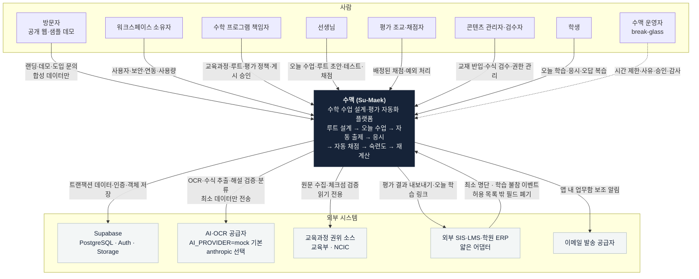
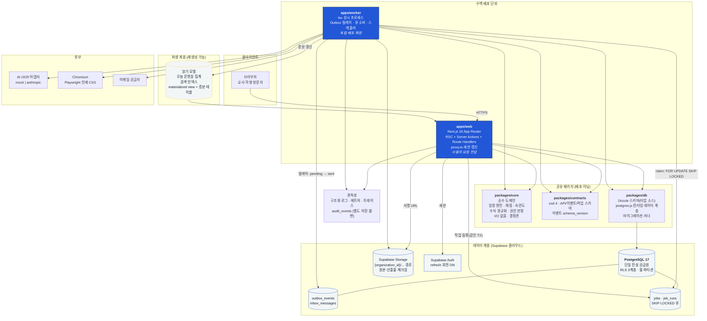
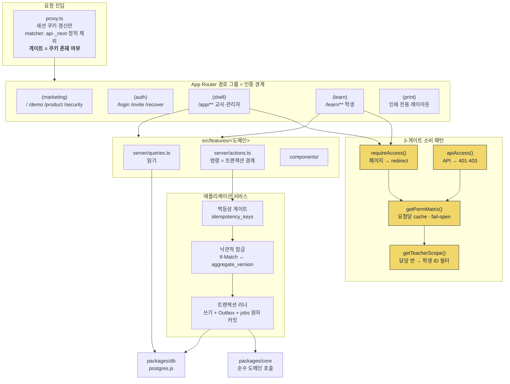
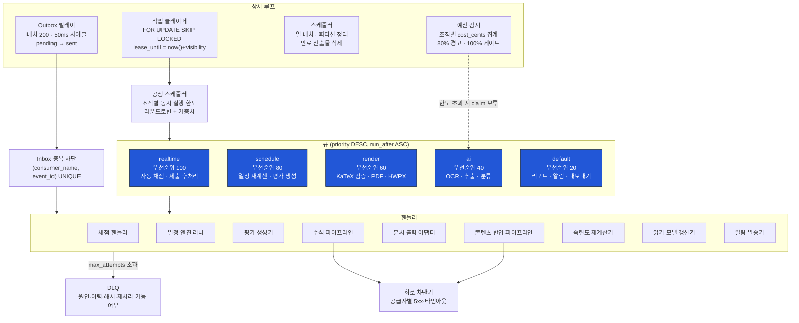
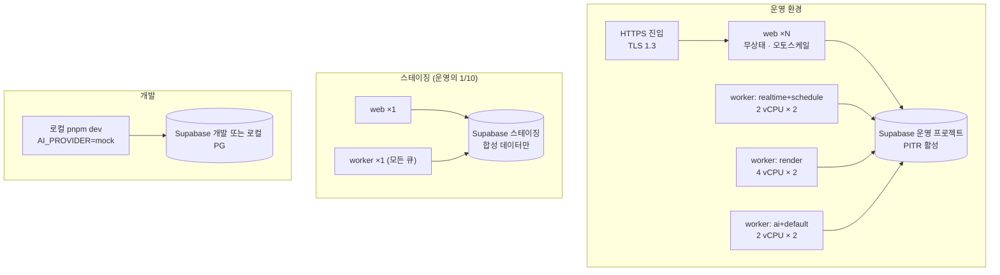

# 아키텍처 — C4 컨텍스트·컨테이너·컴포넌트

> 골프롬프트 2B(목표 논리 아키텍처) 이행 문서.
> 상위 결정: [decisions.md](./decisions.md) · 근거 수치: [assumptions.md](./assumptions.md)

관련 문서: [domain-map.md](./domain-map.md) · [failure-modes.md](./failure-modes.md) · [ADR-0002 모듈형 모놀리스](../adr/0002-modular-monolith.md)

---

## 1. 한 줄 요약

**도메인 경계가 명확한 모듈형 모놀리스**. 배포 단위는 `web`(Next.js 16, 사용자 요청)과 `worker`(tsx, 비동기 작업) **2개**이며, 둘 다 같은 `packages/core` 도메인 코드와 같은 PostgreSQL을 사용한다. 서비스 분리는 4장 기준을 실측으로 충족하기 전까지 하지 않는다.

---

## 2. C4 Level 1 — 시스템 컨텍스트



### 2.1 경계에서 하지 않는 일

| 외부 시스템 | 받는 것 | 절대 저장하지 않는 것 |
|---|---|---|
| SIS·LMS·ERP | 학생 불변 ID, 표시명, 소속 그룹, 학습 불참 이벤트 | 결제·수납, 상담 이력, 전자출결 원장, 보호자 연락처, 주소, 생활기록 |
| AI 공급자 | 구조화 스키마 응답만 | 학생 이름·연락처, 조직 식별 정보 (문항 처리 시 학생 데이터 미전송) |
| 권위 소스 | 원문 체크섬, 인용 위치, 발행 메타 | 원문 전문 재배포 (Q-02) |

집행: `scripts/boundary-check.mjs` 빌드 게이트 + 어댑터 zod `.strict()` + 폐기 필드 카운터 메트릭.

---

## 3. C4 Level 2 — 컨테이너



### 3.1 컨테이너 계약

| 컨테이너 | 책임 | 하지 않는 것 | 확장 축 |
|---|---|---|---|
| `apps/web` | 사용자 요청 처리, 권한 판정, 트랜잭션 커밋, Outbox·작업 등록 | 외부 AI 호출, PDF·HWPX 렌더, 30초 초과 작업 | 수평 (무상태). 인스턴스당 DB pool max 10 |
| `apps/worker` | 큐 소비, Outbox 릴레이, 스케줄러, AI·렌더 호출, 읽기 모델 증분 갱신 | 사용자 HTTP 요청 처리 | 큐별 수평. `render` 큐 4 vCPU×2, `ai` 큐 2 vCPU×2, `default` 큐 2 vCPU×2 |
| `packages/core` | 결정론적 순수 로직 | DB·네트워크·`Date.now()`·`Math.random()` 접근 | — (라이브러리) |
| `packages/db` | 스키마 정의, 쿼리, 마이그레이션 | 도메인 규칙 | — |
| `packages/contracts` | zod 스키마 = API·이벤트·작업 페이로드의 단일 정의 | — | — |

**web과 worker를 나눈 이유**: 확장 특성이 다르다. web은 요청 동시성(수평, 짧은 수명), worker는 CPU·외부 IO 대기(Chromium 4 vCPU 고정, AI 호출 대기). 같은 프로세스에 두면 대량 OCR이 답안 제출 지연을 만든다(골프롬프트 28장: "실시간 채점이 대량 OCR보다 높은 우선순위"). **데이터는 분리하지 않는다** — 같은 DB, 같은 트랜잭션 경계.

### 3.2 `packages/core`의 순수성 강제

```ts
// packages/core/src/shared/clock.ts — 시간·난수는 반드시 주입
export interface DeterministicContext {
  readonly now: Date;            // 호출자가 고정
  readonly seed: string;         // 엔진 시드
  readonly timezoneId: string;   // IANA
  readonly engineVersion: string;
}
```

- ESLint 규칙: `packages/core/**`에서 `Date.now`, `new Date()` (인자 없음), `Math.random`, `crypto.randomUUID`, `process.env`, `fetch` 금지.
- 단위 테스트: 같은 `DeterministicContext` + 같은 입력 → 같은 출력 해시 (fast-check 속성 테스트).

---

## 4. 서비스 분리 기준

골프롬프트 2B의 6개 조건 중 **2개 이상이 실측으로 확인될 때만** 분리를 검토한다. 추측은 근거가 아니다.

| # | 조건 | 측정 지표 | 분리 검토 임계값 |
|---|---|---|---|
| S-1 | 다른 모듈과 현저히 다른 확장·자원 특성 | 큐별 CPU-초/요청, 메모리 상주 | 특정 큐가 전체 워커 CPU의 60% 이상을 30일 연속 점유 |
| S-2 | 반드시 격리해야 하는 장애 영향 | 해당 모듈 장애로 인한 타 모듈 SLO 위반 횟수 | 90일 내 3회 이상 |
| S-3 | 독립 런타임(Python·GPU)의 지속적 필요 | 해당 런타임 없이 대체 불가한 기능 수 | 2개 이상이 6개월 이상 지속 |
| S-4 | 별도 보안·데이터 지역·배포 주기 | 규제 요구 문서 | 계약상 요구 발생 시 즉시 |
| S-5 | 독립 소유 팀과 안정된 공개 계약 | 팀 수, 계약 변경 빈도 | 전담 팀 2개 이상 + 계약 6개월 무변경 |
| S-6 | 단일 DB로 해결 불가한 실측 병목 | p99 지연, 락 대기, IO 포화 | 파티션·인덱스·풀 튜닝 후에도 SLO 미달이 30일 지속 |

### 4.1 분리 후보 우선순위 (조건 충족 시)

| 순위 | 후보 | 예상 충족 조건 | 분리 시 소유 데이터 | 계약 |
|---|---|---|---|---|
| 1 | **콘텐츠 반입 OCR·AI 워커** | S-1, S-3 (Python 기반 레이아웃 모델 도입 시) | `source_files`, `source_pages`, 추출 중간 산출물 | 작업 등록 API + `ContentApproved` 이벤트 |
| 2 | **문서 출력 워커 (PDF·HWPX)** | S-1 (Chromium CPU 독점) | `document_exports` (메타는 코어 유지) | 작업 등록 API + `RenderArtifactValidated` |
| 3 | **알림 워커** | S-2 (외부 공급자 장애 격리) | 없음 (읽기만) | Outbox 소비만 |
| 4 | **대용량 리포트 워커** | S-1 | 없음 | 작업 등록 API |

### 4.2 절대 분리하지 않는 영역

루트 게시, 실제 수업 생성·충돌 확정, 평가 게시·스냅샷, 응시·답안·채점 확정. **강한 트랜잭션 관계**(2D 강한 일관성 목록)가 있어 분리하면 분산 트랜잭션 또는 사가가 필요해진다. 이 영역은 S-6이 증명되어도 먼저 DB 수직 확장·파티셔닝을 시도한다.

---

## 5. C4 Level 3 — 핵심 컴포넌트

### 5.1 `apps/web` 내부



핵심 규약 (eywa 실측 이식):

1. **인증 게이트는 쿠키 존재만 확인**한다. `proxy.ts`에서 `getUser()` 검증 실패를 로그아웃으로 처리하면 로그인 무한루프가 난다(eywa 실사고 2). 실제 검증은 `(shell)/layout.tsx`의 `getCurrentUser()`.
2. **`organization_id`와 역할은 JWT가 아니라 `users`·`memberships`에서 항상 조회**한다. JWT 클레임은 신선도를 보장하지 않는다.
3. **`canAccess`(읽기)와 `canWrite`(쓰기)를 분리**한다. 변경 액션에 `canAccess`를 쓰면 readonly 권한이 샌다(eywa 실사고).
4. **`getPermMatrix`는 fail-open**(조회 실패 시 최고 역할 통과). 관리자 락아웃 방지. 단, **DB RLS는 fail-closed**로 최종 차단한다(eywa 실사고 1·3).
5. 명령은 반드시 `멱등성 게이트 → 낙관적 잠금 → 트랜잭션 러너` 순서를 거친다.

### 5.2 `apps/worker` 내부



큐 계약:

| 큐 | 우선순위 | 가시성 타임아웃 | 최대 시도 | 백오프 | 조직별 동시 한도 |
|---|---|---|---|---|---|
| `realtime` | 100 | 60 s | 5 | 지수 2^n × 2s, 전체 지터 | 20 |
| `schedule` | 80 | 600 s | 3 | 지수 2^n × 30s | 4 |
| `render` | 60 | 300 s | 4 | 지수 2^n × 15s | 8 |
| `ai` | 40 | 900 s | 5 (408·429·일시적 5xx만) | 지수 2^n × 60s, 상한 15분 | 3 |
| `default` | 20 | 300 s | 3 | 지수 2^n × 30s | 6 |

**공정 스케줄러**: 한 클레임 배치(최대 50건)에서 단일 조직의 점유율을 40% 이하로 제한한다. 초과분은 다음 사이클로 미룬다. 이것이 "한 조직의 대량 작업이 다른 조직을 막지 않게 한다"의 구현이다.

### 5.3 수식 파이프라인 컴포넌트 (`packages/core/src/math`)

모든 화면·출력이 **하나의 파이프라인**을 통과한다. 별도 수식 처리기를 만드는 것을 금지한다.

```mermaid
flowchart LR
    In["구조화 블록<br/>+ 원본 자산"] --> P1["1. 비수식 블록 보호<br/>SVG·표·이미지 → 자리표시자"]
    P1 --> P2["2. 무손실 복구<br/>백슬래시·구분자·유니코드"]
    P2 --> P3["3. 토큰화·균형 검사<br/>괄호·중괄호·환경"]
    P3 --> P4["4. 허용 목록 구문 검증<br/>macro_policy_version"]
    P4 --> P5["5. KaTeX 서버 사전 파싱<br/>오류 명시 수집"]
    P5 --> P6["6. HTML+MathML 생성<br/>render_hash 저장"]
    P6 --> P7["7. 블록 재조립<br/>표·조건·선택지·도형"]
    P7 --> P8["8. 시각 회귀<br/>web 1280 · mobile 360 · print A4"]
    P8 --> P9["9. PDF·HWPX 변환<br/>의미·레이아웃 동등성"]
    P9 --> Gate{"10. 게시 게이트<br/>10개 조건 전부 통과?"}
    Gate -->|통과| Pub["게시 가능"]
    Gate -->|실패| Quar["FORMULA_REVIEW_REQUIRED<br/>LAYOUT_REVIEW_REQUIRED<br/>검수 격리"]

    classDef gate fill:#C9453D,stroke:#162338,color:#FFFFFF
    class Gate,Quar gate
```



- 의미 변경 가능 보정은 **저작 화면의 제안으로만** 제공하고, 게시 파이프라인에서는 **실패**로 처리한다.
- `.math-raw` 중립 폴백은 **저작·검수 화면에서만** 허용한다. 학생 게시물·PDF·HWPX에는 0건.

---

## 6. 일관성 경계

```mermaid
flowchart LR
    subgraph Strong["강한 일관성 — 단일 트랜잭션 또는 원자적 포인터 전환"]
        S1["조직 권한 확인·쓰기"]
        S2["루트 버전 게시·활성 전환"]
        S3["수업 배정·시간 충돌 확정"]
        S4["평가 문항 스냅샷·게시"]
        S5["답안 제출·응시 상태 전환"]
        S6["최종 채점·교사 재판정"]
        S7["일정 변경안 승인·활성 전환"]
        S8["문항 검수·권한 상태 전환"]
        S9["교육과정 릴리스 발행"]
        S10["문항 버전·렌더 산출물·수식 검수 게시 전환"]
    end

    subgraph Eventual["최종 일관성 — 확정 원본에서 재생성 가능"]
        E1["숙련도·복습 추천<br/>60초"]
        E2["미래 일정 변경안 계산<br/>비동기"]
        E3["오늘 운영실 집계<br/>30초"]
        E4["검색 인덱스<br/>30초"]
        E5["분석·리포트<br/>비동기"]
        E6["알림<br/>30초"]
    end

    Strong -->|"Outbox 이벤트<br/>at-least-once"| Eventual
```



**규칙**:
- 화면에는 `계산 중`, `마지막 반영 시각`, `기준 데이터 버전`을 항상 표시한다.
- **파생 데이터가 확정 원본보다 먼저 노출되어서는 안 된다.** 읽기 모델 갱신 시각이 원본 `updated_at`보다 이르면 원본을 직접 조회한다.
- 이벤트 소싱은 전면 채택하지 않는다. 버전·정정 이벤트·감사 로그를 쓰는 영역은 **루트, 채점, 숙련도, 일정 변경** 4개로 한정한다.

---

## 7. 장애 시 유지 동작

전체 표는 [failure-modes.md](./failure-modes.md). 여기서는 **아키텍처가 보장하는 구조적 이유**만 적는다.

| 장애 | 유지되는 것 | 구조적 이유 |
|---|---|---|
| AI·OCR 공급자 전면 중단 | 게시된 일정, 검수 완료 문제은행, 학생 응시, 자동·수동 채점 | AI는 `ai` 큐에서만 호출된다. `web`의 동기 경로에 AI 의존이 없다(C-11). 게시된 콘텐츠는 스냅샷이라 재호출 불필요 |
| 워커 전면 중단 | 로그인, 조회, 답안 임시 저장·제출, 수업 기록, 수동 채점 | 제출은 `web`의 단일 트랜잭션에서 완결되고 후처리만 `jobs`에 적재된다. 접수된 작업은 DB에 남아 유실 0 |
| Chromium·렌더 워커 중단 | 온라인 응시 전체 | 응시는 웹 KaTeX 사전 파싱 결과(게시 스냅샷)를 사용한다. PDF·HWPX는 별도 큐 |
| 읽기 모델·검색 중단 | 모든 권한 판정, 원본 조회 기반 화면 | 권한 검사는 캐시 성공 여부에 의존하지 않는다. 읽기 모델은 파생 계층이며 원본 조회로 폴백 |
| Supabase Storage 중단 | 기존 응시(스냅샷 자산은 게시 시 검증·CDN 캐시), 조회, 채점 | 게시 게이트가 "원본·산출물 완전 저장 전 게시 금지"를 강제하므로 게시된 것은 이미 완결 상태 |
| PostgreSQL 쓰기 불가 | 없음 — **쓰기를 성공으로 응답하지 않는다** | 단일 진실 공급원. 성공 응답한 제출의 유실 0을 위해 큐를 업무 기록 저장소로 쓰지 않는다 |
| 알림 공급자 중단 | 앱 내 업무함 전체 | 알림은 Outbox 소비자이며 업무함은 원본 테이블 조회 |
| 교육과정 권위 소스 접근 불가 | 마지막 검증 릴리스 읽기 전용 사용 | 릴리스는 원자적 발행 스냅샷. 새 발행만 차단 |

---

## 8. 배포 토폴로지



- 운영·스테이징·개발은 **계정과 데이터가 완전히 분리**된다. 실제 학생 개인정보를 스테이징·개발에 복사하지 않는다.
- 배포는 **블루·그린**. 전환 전 스모크(로그인 → 오늘 운영실 → 답안 1건 제출 → 채점 확정)를 통과해야 트래픽 전환.
- 롤링 중에는 구·신 버전이 공존하므로 DB 변경은 `확장 → 백필 → 전환 → 검증 → 구 구조 제거` 5단계를 지킨다.
- 워커는 `SIGTERM` 수신 시 진행 중 작업의 lease를 유지한 채 **새 claim만 중단**하고 최대 120초 대기 후 종료한다. 미완료 작업은 lease 만료 후 다른 워커가 이어받는다.

---

## 9. 관측성 배선

| 신호 | 내용 | 저장 |
|---|---|---|
| 구조화 로그 | `trace_id`, `correlation_id`, `causation_id`, `organization_id`, `route`, `outcome` | 로그 백엔드. **학생 이름·연락처·답안 원문·문제집 페이지·토큰 금지** |
| 메트릭 | API RED, 인프라 USE, 큐 깊이·최고 대기, 단계별 처리량·재시도·DLQ | **레이블에 학생 ID 등 고카디널리티 개인정보 금지** |
| 트레이스 | web 요청 → 트랜잭션 → Outbox → worker 핸들러까지 `correlation_id`로 연결 | |
| 감사 | `audit_events` — 행위자, 대상, 변경 전후, 사유, 시각, 권한 근거 | **애플리케이션 로그와 분리된 DB 테이블. 일반 수정 API로 변경·삭제 불가** |

합성 모니터링 3종: ① 시험 시작→제출 왕복 ② 일정 재계산 preview→apply ③ 반입 1페이지 OCR→검수 대기. 각 5분 주기.

---

## 10. 이 문서가 코드에 강제하는 것

| 규약 | 강제 수단 |
|---|---|
| `packages/core` 순수성 | ESLint no-restricted-globals + 결정성 속성 테스트 |
| 컨텍스트 간 직접 테이블 수정 금지 | `packages/db` export를 컨텍스트별 네임스페이스로 분리 + import 경계 ESLint 규칙 |
| 명령의 멱등성 게이트 통과 | `Actions` 래퍼 타입 강제 (`defineCommand()` 없이는 쓰기 불가) |
| 수식은 단일 파이프라인 통과 | `renderMath()` 외 KaTeX 직접 호출 금지 ESLint 규칙 |
| 큐 우선순위 | `jobs.queue` CHECK 제약 + 핸들러 등록 시 큐 명시 필수 |
| 제품 경계 | `scripts/boundary-check.mjs` (빌드 게이트) |
