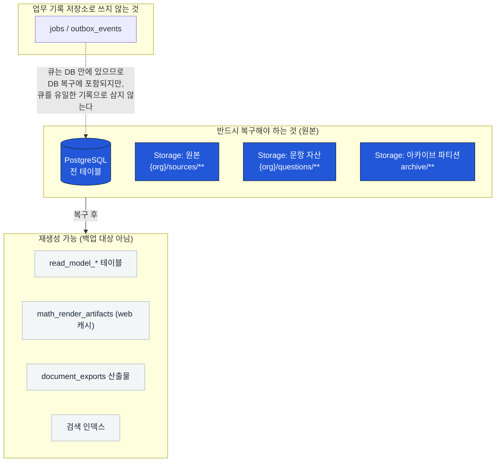
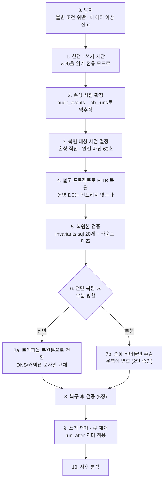
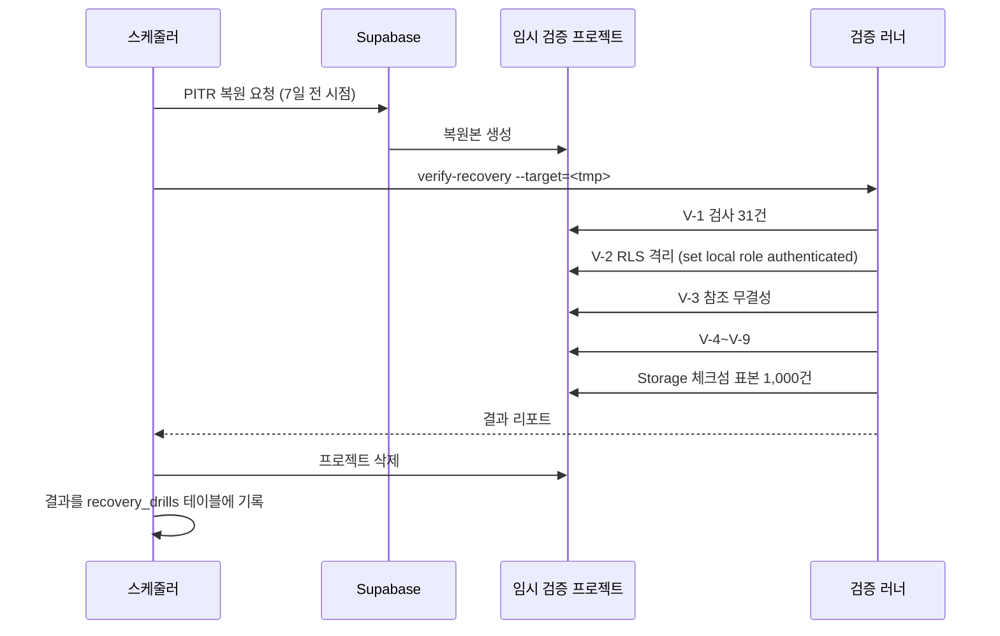
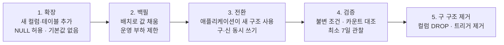

# 백업·복구·마이그레이션 계획

> 골프롬프트 28장(백업과 재해 복구, 배포와 스키마 변경) 이행 문서.
> 관련: [failure-modes.md](./failure-modes.md) · [erd.md](./erd.md) · [slo.md](./slo.md) · [../runbooks/05-db-failure-pitr.md](../runbooks/05-db-failure-pitr.md)

---

## 1. 목표

| 지표 | 목표 | 대상 |
|---|---|---|
| **RPO** | **5분** | 핵심 데이터 (PostgreSQL 전체) |
| **RTO** | **60분** | 핵심 서비스 (로그인·조회·응시·제출·채점·일정) |
| RTO | **4시간** | OCR·AI 파이프라인 |
| 제출 유실 | **0건** | 성공 응답한 답안 제출, 일반 단일 노드 장애 |
| 복구 검증 | **월 1회 자동** | 스크립트 |
| 복구 훈련 | **분기 1회 실제** | 사람 |

---

## 2. 백업 대상과 방식

### 2.1 계층별 분류



### 2.2 백업 방식

| 대상 | 방식 | 주기 | 보존 | RPO 기여 |
|---|---|---|---|---|
| PostgreSQL | **Supabase 연속 백업 + PITR (WAL 아카이빙)** | 연속 | **35일** | 5분 이내 임의 시점 |
| PostgreSQL | 논리 덤프 (`pg_dump -Fc`, 스키마 + 전 테이블) | 일 1회 03:00 KST | 90일 | 24시간 (2차 방어선) |
| PostgreSQL | 스키마 전용 덤프 | 배포마다 | 1년 | 마이그레이션 롤백용 |
| Storage 원본·자산 | **버킷 버전 관리 + 객체 잠금(불변 보존)** | 실시간 | 원본 A-45 정책, 삭제 후 35일 | 즉시 |
| Storage | 체크섬 목록 스냅샷 (`sha256` + 경로 + 크기) | 일 1회 | 90일 | 무결성 검증용 |
| 아카이브 파티션 | `pg_dump` 후 Storage 저장 + 체크섬 | 파티션 DETACH 시 | A-39~A-43 정책 | — |
| 비밀·환경 설정 | 비밀 관리 시스템 자체 백업 | 변경 시 | 1년 | — |
| IaC·마이그레이션 SQL | Git 저장소 | 커밋마다 | 영구 | — |

### 2.3 백업 격리 (운영 계정 침해 방어)

| 규칙 | 구현 |
|---|---|
| 운영 계정 침해와 함께 삭제되지 않을 것 | 백업 저장소는 **별도 자격 증명**. 운영 서비스 계정에 백업 삭제 권한 없음 |
| 불변 보존 | Storage 버킷에 객체 잠금(retention) 설정. 보존 기간 내 덮어쓰기·삭제 불가 |
| 암호화 | 전송 TLS 1.3, 저장 AES-256. 키는 비밀 관리 시스템 |
| 접근 감사 | 백업 접근·복원 시도 전부 기록 |
| 2인 승인 | 백업 삭제·보존 정책 변경은 2인 승인 |

**큐를 유일한 업무 기록 저장소로 사용하지 않는다.** `jobs`·`outbox_events`는 PostgreSQL 안에 있으므로 DB 백업에 포함되지만, 업무 사실의 원본은 항상 도메인 테이블이다. 큐가 비어도 `attempts`·`responses`·`grade_decisions`로 무엇이 처리되어야 하는지 재구성할 수 있다.

---

## 3. 복구 시나리오

### 3.1 시나리오 분류

| # | 시나리오 | 복구 방식 | RTO | RPO |
|---|---|---|---|---|
| R-1 | 단일 노드 장애 (인스턴스 재시작) | Supabase 자동 페일오버 | 5분 | 0 |
| R-2 | 데이터 손상 (잘못된 마이그레이션·대량 삭제) | **PITR — 손상 직전 시점으로 복원** | 60분 | 5분 |
| R-3 | 논리 오류 (특정 테이블만 오염) | PITR 복원본에서 해당 테이블만 추출 후 병합 | 90분 | 5분 |
| R-4 | 리전 장애 | 논리 덤프에서 새 리전 복원 | 4시간 | 24시간 |
| R-5 | Storage 객체 손상·삭제 | 버전 관리에서 이전 버전 복원 | 30분 | 0 |
| R-6 | 조직 단위 실수 삭제 | 30일 유예 내 복구 (`organizations.status='closing'` → `active`) | 15분 | 0 |
| R-7 | 읽기 모델 손상 | 재빌드 스크립트 | 20분 | — (파생) |

### 3.2 PITR 복구 절차 (R-2, 주 시나리오)



**핵심 규칙**:

1. **운영 DB를 직접 PITR 하지 않는다.** 별도 프로젝트로 복원하고 검증한 뒤 전환한다. 잘못 판단한 시점으로 되돌리면 되돌릴 수 없다.
2. 손상 시점 확정에는 `audit_events`(불변)와 `job_runs`를 쓴다. 애플리케이션 로그만 믿지 않는다.
3. 안전 마진 60초를 뺀 시점으로 복원한다. 이 60초분 데이터는 손실되므로 RPO 5분 안에 들어온다.
4. 전면 복원 시 손상 이후의 **정상 데이터도 함께 사라진다.** 영향 범위를 계산해 부분 병합과 비교한 뒤 결정한다.

### 3.3 부분 병합 시 주의

부분 병합은 참조 무결성을 깨기 쉽다. 병합 가능한 조합만 허용한다.

| 병합 가능 | 이유 |
|---|---|
| `responses` (특정 파티션) | `attempts`가 살아 있으면 FK 유지 |
| `mastery_evidences` | append-only, `grade_decisions` 참조만 |
| `question_versions` 본문 | 참조 방향이 단방향 |
| `curriculum_*` (릴리스 단위) | 원자적 발행 단위 |

| 병합 금지 | 이유 |
|---|---|
| `attempts` 단독 | `assessment_instances`·`assignments`와 상태 불일치 |
| `sessions` 단독 | EXCLUDE 제약과 충돌 |
| `route_versions` 단독 | `active_version_id` 포인터 불일치 |
| `outbox_events`·`inbox_messages` | 중복 처리·순서 붕괴 |
| `idempotency_keys` | 중복 실행 유발 |

병합 금지 대상이 손상됐으면 **전면 복원만** 가능하다.

---

## 4. 복구 중 데이터 보호

### 4.1 이벤트 워터마크·멱등성 키 보존

복구 후 알림·채점·재계산이 **중복 실행되지 않게** 다음을 함께 복원한다.

| 대상 | 이유 |
|---|---|
| `inbox_messages` | `(consumer_name, event_id)`가 중복 소비를 막는다. 이것이 없으면 전 이벤트가 재처리된다 |
| `idempotency_keys` | 24시간 창의 클라이언트 재시도가 중복 실행된다 |
| `jobs.idempotency_key` | 같은 작업이 두 번 산출물을 만든다 |
| `outbox_events.status` | `sent`가 `pending`으로 되돌아가면 전 이벤트가 재발행된다 |
| `mastery_evidences` UNIQUE | 증거 중복 반영 |

**PITR은 이들을 자동으로 함께 복원한다**(같은 DB). 부분 병합에서 이들을 빼면 안 된다.

### 4.2 복구 시점 이후 발생한 작업 처리

복구 시점 T와 장애 인지 시점 T+n 사이에 접수된 작업은 사라진다. 처리 방침:

| 데이터 | 방침 |
|---|---|
| 답안 제출 | **클라이언트 로컬(IndexedDB) 재전송에 의존.** 재접속 시 `client_seq`로 재전송. 중복은 CAS로 1회만 반영 |
| 수업 진도 기록 | 교사에게 재입력 요청 (영향 목록 제공) |
| 콘텐츠 반입 | 원본 `sha256`이 남아 있으면 파이프라인 재실행 (멱등) |
| 문서 출력 | 스냅샷이 살아 있으므로 결정론적 재생성 |
| 알림 | 재생성 (Outbox 재발행) |

복구 후 **"T ~ T+n 사이 접수분 목록"을 조직별로 산출해 공지**한다. 조용히 없어진 것으로 두지 않는다.

---

## 5. 복구 후 검증

복구를 완료로 선언하기 전에 **전부 통과**해야 한다.

### 5.1 자동 검증 (`scripts/verify-recovery.mjs`)

| # | 검증 | 통과 조건 | 쿼리·명령 |
|---|---|---|---|
| V-1 | 검사 31건 (불변 I-01~I-22 + 참조·위생 R-01~R-09) | 전부 0행 | `pnpm verify:recovery` (또는 `psql -f packages/db/src/checks/invariants.sql`) |
| V-2 | **테넌트 격리** | 교차 테넌트 조회 0행 | `pnpm --filter @su-maek/db test:rls` (`set local role authenticated` 필수) |
| V-3 | **참조 무결성** | FK 위반 0건 | 전 FK에 대해 `NOT VALID` 재검증 또는 조인 카운트 대조 |
| V-4 | **활성 일정 버전** | `route_plans.active_version_id`가 가리키는 `route_versions.status='published'` | 아래 5.2 쿼리 |
| V-5 | **제출·채점 수** | 복원 시점 스냅샷과 ±0 (또는 알려진 차이만) | `attempts`·`grade_decisions` 일별 카운트 대조 |
| V-6 | **파일 체크섬** | Storage 객체 `sha256`이 DB 값과 100% 일치 | 체크섬 스냅샷 대조 |
| V-7 | **미완료 작업** | `jobs`에 `running` 상태로 lease 만료된 행이 재클레임 가능 | `lease_until < now()` 확인 |
| V-8 | 이벤트 워터마크 | `inbox_messages` 행 수 ≥ 복원 시점 값 | 카운트 |
| V-9 | 상태 머신 정합 | 불법 상태 조합 0건 | 상태 조합 검증 쿼리 |
| V-10 | 읽기 모델 | 재생성 후 원본과 표본 대조 100건 일치 | 재빌드 + 샘플링 |

### 5.2 검증 쿼리 (핵심 4종)

```sql
-- V-4: 활성 일정 버전 정합
SELECT rp.id AS route_plan_id, rp.active_version_id, rv.status
FROM route_plans rp
LEFT JOIN route_versions rv ON rv.id = rp.active_version_id
WHERE rp.active_version_id IS NOT NULL
  AND (rv.id IS NULL OR rv.status <> 'published');

-- V-5: 제출·채점 수 대조 (복원 시점 이전 날짜만)
SELECT date_trunc('day', a.submitted_at) AS day,
       count(*) FILTER (WHERE a.status IN ('submitted','auto_graded','review_required','finalized')) AS submitted,
       count(DISTINCT gd.response_id) FILTER (WHERE gd.is_current) AS graded_responses
FROM attempts a
LEFT JOIN responses r ON r.attempt_id = a.id
LEFT JOIN grade_decisions gd ON gd.response_id = r.id
WHERE a.submitted_at < $restore_point
GROUP BY 1 ORDER BY 1 DESC LIMIT 30;

-- V-7: lease 만료로 고아가 된 작업
SELECT queue, count(*) AS orphaned
FROM jobs
WHERE status = 'running' AND lease_until < now()
GROUP BY 1;

-- V-9: 불법 상태 조합 — 게시되지 않은 평가에 응시가 존재
SELECT ai.id AS assessment_instance_id, ai.status, count(a.id) AS attempts
FROM assessment_instances ai
JOIN attempts a ON a.assessment_instance_id = ai.id
WHERE ai.status IN ('generating','draft','ready','cancelled')
GROUP BY 1,2;
```

### 5.3 수동 검증 (사람)

| # | 검증 | 담당 |
|---|---|---|
| M-1 | 표본 조직 3개에서 로그인 → 오늘 운영실 → 학생 상세 → 최근 시험 결과 조회 | 운영 엔지니어 |
| M-2 | 표본 시험 1건 응시 → 제출 → 채점 확정 (합성 조직) | 운영 엔지니어 |
| M-3 | 표본 문항 3건의 web·PDF·HWPX 렌더 비교 | 콘텐츠 담당 |
| M-4 | 영향 조직에 복구 완료·손실 범위 공지 | 공지 담당 |

---

## 6. 월별 자동 복구 검증

매월 1일 05:00 KST, `scripts/verify-recovery.mjs --mode=drill` 실행.



| 항목 | 값 |
|---|---|
| 복원 대상 시점 | 7일 전 (WAL 보존 범위 안, 실제 사용 데이터) |
| 실행 시간 목표 | 90분 이내 (RTO 60분 + 검증 30분) |
| 실패 시 | SEV2 알림 + 다음 영업일 내 원인 분석 |
| 기록 | `recovery_drills`(실행일, 복원 시점, 소요 시간, V-1~V-10 결과, 실패 항목) |
| 결과 보관 | 3년 |

**측정하는 것**: 복원 소요 시간(RTO 검증), 데이터 정합성, 절차의 실행 가능성. **측정하지 않는 것**: 운영 트래픽 영향(임시 프로젝트에서 하므로 없다).

---

## 7. 분기별 실제 복구 훈련

자동 검증은 절차가 도는지만 본다. 분기 훈련은 **사람이 런북대로 움직일 수 있는지**를 본다.

| 항목 | 내용 |
|---|---|
| 주기 | 분기 1회 (3·6·9·12월 둘째 주) |
| 환경 | 스테이징 (운영 1/10 규모, 합성 데이터) |
| 시나리오 | 매 분기 다른 것 — R-2(PITR) → R-3(부분 병합) → R-4(리전) → R-5(Storage) 순환 |
| 참가 | 인시던트 지휘자, 운영 엔지니어 2명, 도메인 소유자 1명 |
| 사전 공지 | 시나리오는 **당일 공개**. 런북 준비 상태를 본다 |
| 측정 | 탐지→선언 시간, 선언→복원 시작, 복원 완료, 검증 완료, 공지 발송 |
| 통과 기준 | RTO 60분 이내 + V-1~V-10 전부 통과 + 런북 수정 항목 도출 |
| 산출물 | 훈련 기록(타임라인·병목·런북 수정 항목). `docs/runbooks/` 갱신 |

`scripts/dr-drill.mjs`가 시나리오별 장애 주입과 타임스탬프 기록을 자동화한다. 사람이 하는 판단(복원 시점 결정, 전면 vs 부분)은 자동화하지 않는다.

---

## 8. 데이터 마이그레이션 계획

### 8.1 스키마 변경 5단계



| 단계 | 규칙 | 롤백 |
|---|---|---|
| 1. 확장 | `ADD COLUMN`은 기본값 없이(테이블 재작성 회피). 새 인덱스는 `CONCURRENTLY` | `DROP COLUMN` (즉시) |
| 2. 백필 | 배치 1,000행 + 100ms 간격. 진행률·중단·재개 지원 | 백필 중단 (데이터는 남아도 무해) |
| 3. 전환 | 롤링 배포 중 구·신 버전 공존. **구 버전이 새 컬럼을 무시해도 동작해야 함** | 이전 앱 버전 재배포 |
| 4. 검증 | 불변 조건 + 신·구 값 대조. 7일 관찰 후 다음 단계 | 3단계로 복귀 |
| 5. 제거 | 별도 마이그레이션 파일. 최소 1릴리스 이후 | **롤백 불가** — 이 단계 전에 확신해야 함 |

### 8.2 마이그레이션 2갈래 규약

| 유형 | 파일명 | 내용 | 생성 |
|---|---|---|---|
| 생성 | `NNNN_<name>.sql` | Drizzle이 생성한 DDL (테이블·컬럼·인덱스) | `pnpm db:generate` |
| 수기 | `NNNNa_<name>.sql` | RLS 정책, 트리거, EXCLUDE 제약, 함수, 전이표 INSERT, 뷰 | 손으로 작성 |

규칙:

1. **`drizzle-kit push` 금지.** 운영에 직접 반영하는 경로를 만들지 않는다.
2. **수기 파일(`NNNNa_*.sql`)은 멱등**하게 작성한다. `DROP POLICY IF EXISTS` 후 `CREATE POLICY`, `CREATE OR REPLACE FUNCTION`, `DROP TRIGGER IF EXISTS` 후 `CREATE TRIGGER`, 제약은 `pg_constraint` 조회 후 추가. `psql`로 직접 재실행할 수 있어야 한다.
3. 각 마이그레이션에 **역방향 스크립트** `NNNN_<name>.down.sql`을 첨부한다. 5단계(제거)만 예외.

> **실제 상태 (2026-08-01 확인) — 규칙 2·3은 지켜지지 않고 있다.**
>
> | 규칙 | 문서가 말하는 것 | 저장소의 실제 |
> |---|---|---|
> | 2 | "전부 멱등. `CREATE ... IF NOT EXISTS`" | Drizzle 생성물(`NNNN_*.sql`)에는 가드가 **하나도 없다** — `CREATE TABLE` 89건·`CREATE INDEX` 141건 중 `IF NOT EXISTS` **0건**. 수기 파일(`NNNNa_*.sql`) 4개만 규칙대로 재실행 가능하다 |
> | 3 | "역방향 스크립트를 첨부한다" | `*.down.sql` **0건**. 확인: `find packages/db -name "*.down.sql"` |
>
> **그래서 멱등성은 어디서 오는가** — SQL 가드가 아니라 **`su_maek_migrations` 원장**이다.
> 러너(`packages/db/src/migrate.ts:30-45`)는 원장에 이름이 있는 파일을 건너뛰고, 파일
> 적용과 원장 기록을 **한 트랜잭션에 커밋**한다. 실패한 파일은 원장에 남지 않으므로
> 재실행이 안전하다. 반대로 **이미 적용된 파일을 강제로 다시 돌리면 대부분 "이미
> 존재합니다"로 죽는다** — 규칙 2가 약속하는 성질이 아니다.
>
> 규칙 2는 Drizzle이 생성하는 DDL을 손대야 지킬 수 있는데(생성물 수정은 드리프트를
> 부른다), 원장이 이미 같은 보장을 주므로 **수기 파일에만 요구하도록 범위를 좁혔다.**
> 규칙 3은 의도로서 유효하다고 보아 남긴다 — 다만 **지금은 지켜지지 않는다**는 사실을
> 함께 적는다. 롤백은 [../runbooks/14-deploy-migration-rollback.md](../runbooks/14-deploy-migration-rollback.md)
> 5.3의 **수기 절차로만** 존재한다.
4. 대형 테이블 변경은 **잠금·재작성 시간을 사전 측정**한다. 스테이징에서 운영 규모의 1/10로 측정 후 10배 외삽. 5초 초과 예상이면 `CONCURRENTLY` 또는 배치 전환.
5. 마이그레이션 실행 전후로 **스키마 덤프를 저장**한다(1년 보존).

### 8.3 위험 변경 체크리스트

배포 전 반드시 확인:

| # | 확인 | 방법 |
|---|---|---|
| 1 | 테이블 재작성이 발생하는가 | `ADD COLUMN ... DEFAULT`(PG 11+ 상수는 안전), `ALTER TYPE`, `SET NOT NULL` |
| 2 | ACCESS EXCLUSIVE 잠금 시간 | 스테이징 측정 × 10 |
| 3 | 인덱스 생성이 `CONCURRENTLY`인가 | 대형 테이블 필수 |
| 4 | 파티션 테이블에 적용되는가 | 부모·자식 모두 확인 |
| 5 | RLS 정책이 새 컬럼·테이블을 덮는가 | 불변 I-01 검증 쿼리 |
| 6 | 구 버전 앱이 깨지지 않는가 | 계약 테스트 (롤링 배포) |
| 7 | 역방향 스크립트가 있는가 | **CI 게이트 없음** — 파일도 0건이다(8.2 아래 표). 되돌릴 방법을 배포 **전에** 글로 남겼는지 사람이 확인한다 |
| 8 | 데이터 손실 가능성 | `DROP`·`ALTER TYPE` 축소 변환 검토 |

### 8.4 마이그레이션 롤백

| 상황 | 대응 |
|---|---|
| 1~2단계 실패 | **되돌리지 않는 것이 기본.** 확장·백필은 무해하다. 꼭 되돌려야 하면 RB-14 5.3의 수기 절차(역방향 SQL 작성 → 실행 → **원장 행 삭제**). `*.down.sql`은 없다 |
| 3단계 실패 | 이전 앱 버전 재배포. 스키마는 유지(확장은 무해) |
| 4단계 검증 실패 | 3단계로 복귀 + 원인 분석. 스키마 유지 |
| 5단계 후 문제 발견 | **PITR** — 컬럼을 되살려도 데이터가 없다 |
| 마이그레이션 중 프로세스 사망 | 자체 러너가 트랜잭션 단위로 실행하므로 부분 적용 없음. 재실행(멱등) |

**5단계는 되돌릴 수 없다는 것이 계약이다.** 그래서 4단계 관찰이 7일이다.

---

## 9. 데이터 이관 (외부 → 수맥)

기존 프로젝트에서 가져오는 경우의 규약.

| 규칙 | 내용 |
|---|---|
| 실데이터 금지 | 개발·테스트에 실제 학생 개인정보를 복사하지 않는다. **합성 데이터로 먼저 검증**한다 |
| 미리보기 필수 | 업로드 전 미리보기. 중복 학생·잘못된 날짜·알 수 없는 반·필수값 누락을 **행 단위로** 표시 |
| 부분 재처리 | 오류 행만 수정해 다시 처리 가능 |
| 허용 목록 | 금지 필드(`payment*`·`guardian_contact*` 등)는 저장하지 않고 폐기 카운터 증가 |
| 별칭 처리 | 기존 목차·개념 ID는 `source_aliases`를 통해 canonical concept에 연결. **직접 매핑 금지** |
| 임계값 | 기존 코드의 60/70/80/90% 숙련 임계값을 상수로 복사하지 않는다. `mastery_policy_versions`로 통합 |
| 진도 컨테이너 | `edutrix`식 소단원 단일 순번을 그대로 쓰지 않는다. 모든 소단원을 같은 크기로 계산하지 않는다 |
| 원본 미반입 | `시험지 한글화`의 실제 시험지·학생 데이터는 가져오지 않는다. 골든 회귀 기준만 어댑터로 활용 |

---

## 10. 조직 데이터 내보내기·삭제

### 10.1 내보내기

| 항목 | 값 |
|---|---|
| 포맷 | JSONL(관계형 원본) + CSV(표 형식 요약) 번들 |
| 범위 | 조직 소유 전 데이터 (학생 최소 정보, 수업, 루트, 평가, 응시, 채점, 숙련도, 콘텐츠 메타) |
| 제외 | 다른 조직 데이터, 플랫폼 공용 교육과정 원문, 렌더 캐시 |
| 전달 | 서명 URL 24시간 |
| 권한 | 소유자 + 재인증 |
| 감사 | `audit_events`에 `action='privacy.export'` |

### 10.2 삭제

[erd.md](./erd.md) 10.3의 순서를 따른다. 백업과의 상호작용:

| 규칙 | 내용 |
|---|---|
| 백업 선택적 삭제 | **하지 않는다.** 무결성이 깨진다 |
| 고객 고지 | 삭제 요청 처리 시 **백업 만료 예정일(최대 35일)을 명시**한다 |
| 기록 | `data_deletion_requests`(요청일, 처리일, 범위, 백업 만료 예정일, 처리자) |
| 검증 | 삭제 후 활성 DB·Storage·읽기 모델·검색 인덱스에서 0건 확인 쿼리 실행, 결과를 감사에 기록 |

---

## 11. 이 문서가 요구하는 스크립트

| 스크립트 | 역할 |
|---|---|
| `scripts/verify-recovery.mjs` | 5장 V-1~V-10 자동 검증. `--mode=drill`로 월별 자동 실행 |
| `scripts/dr-drill.mjs` | 분기 훈련용 장애 주입 + 타임스탬프 기록 |
| `packages/db/src/checks/invariants.sql` | 검사 31건 (불변 22 + 참조·위생 9) 검증 쿼리 |
| `packages/db/src/migrate.ts` | 멱등 마이그레이션 러너 (2갈래 파일 순서 실행) |
| `scripts/checksum-snapshot.mjs` | Storage 체크섬 목록 일 스냅샷 |
| `scripts/rebuild-read-models.mjs` | 읽기 모델 전체 재생성 |
| `scripts/export-organization.mjs` | 조직 데이터 내보내기 번들 생성 |
| `scripts/purge-organization.mjs` | 조직 파기 (역순 의존 삭제 + 검증) |
