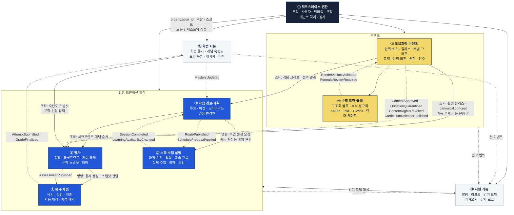
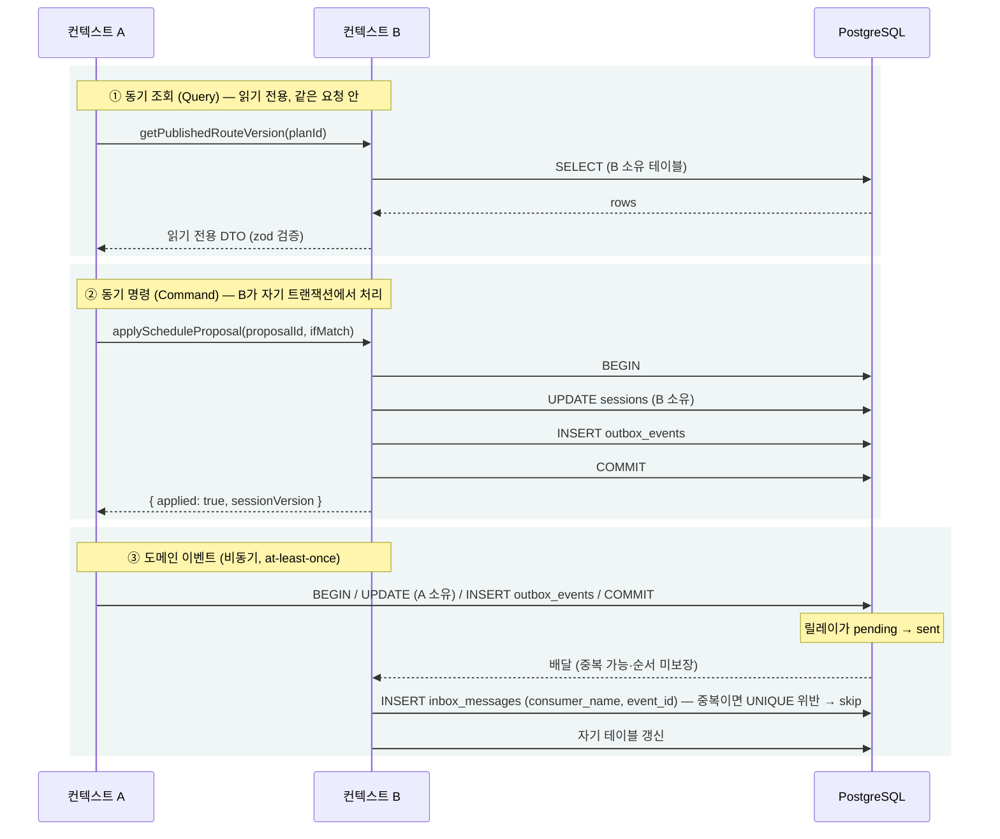

# 도메인 컨텍스트 맵과 데이터 소유권

> 골프롬프트 2C(도메인 경계와 데이터 소유권) 이행 문서.
> 상위 결정: [decisions.md](./decisions.md)

관련 문서: [architecture.md](./architecture.md) · [erd.md](./erd.md) · [event-catalog.md](./event-catalog.md) · [api-contract.md](./api-contract.md)

---

## 1. 컨텍스트 맵

9개 컨텍스트. 화살표 라벨은 통신 수단이며, **직선 = 동기 공개 인터페이스 호출**, **점선 = 도메인 이벤트(비동기, at-least-once)**다.



### 1.1 컨텍스트 관계 유형 (DDD 패턴)

| 상류 → 하류 | 관계 유형 | 이유 |
|---|---|---|
| ① 워크스페이스·권한 → 전체 | **Conformist** | 모든 컨텍스트가 `organization_id`와 역할 판정을 그대로 따른다. 컨텍스트별 권한 모델을 만들지 않는다 |
| ③ 교육과정 → ⑤ 계획, ⑥ 평가 | **Published Language** | 활성 릴리스의 `canonical_concept_id`와 `achievement_standard_code`가 공용 언어. 하류는 문자열 이름으로 참조하지 않는다 |
| ④ 수학 표현 → ③ 교육과정 | **Open Host Service** | 게시 게이트 결과(`publish_gate_status`)를 공개 인터페이스로 제공. ③은 내부 렌더 구현을 알지 못한다 |
| ⑤ 계획 ↔ ② 수업 실행 | **Customer/Supplier** | ⑤가 고객(변경안 제시), ②가 공급자(수업·충돌의 최종 소유자). ⑤는 ②의 `sessions`를 직접 UPDATE하지 않는다 |
| ⑥ 평가 → ⑦ 응시·채점 | **Shared Kernel (스냅샷)** | 게시 스냅샷 구조(`assessment_questions`)는 두 컨텍스트가 공유하는 불변 계약 |
| ⑦ 채점 → ⑧ 학습 지능 | **Published Language** | `GradeFinalized` 이벤트가 유일한 통로. ⑧은 `responses`를 직접 읽지 않는다 |
| 전체 → ⑨ 지원 기능 | **Anti-Corruption Layer** | ⑨는 Outbox 이벤트만 소비한다. 원본 테이블에 대한 쓰기 권한이 없다 |
| 외부 SIS·LMS → ②, ① | **Anti-Corruption Layer** | 어댑터가 허용 목록으로 변환. 외부 스키마가 내부로 침투하지 못한다 |

---

## 2. 데이터 소유권 표

`소유` = 해당 컨텍스트만 INSERT/UPDATE/DELETE 한다. 다른 컨텍스트는 조회 인터페이스 또는 이벤트로만 접근한다.

### ① 워크스페이스·권한

| 테이블 | 소유 | 다른 컨텍스트의 접근 |
|---|---|---|
| `organizations`, `workspaces` | ① | 조회: `getOrganization(id)` |
| `users`, `memberships` | ① | 조회: `getCurrentUser()`, `getMembership(userId, orgId)` |
| `students` (최소 데이터) | ① | 조회: `getStudentIdsInScope()`, `getStudentMinimal(id)` |
| `external_identities`, `integration_connections`, `integration_sync_cursors` | ① | 없음 |
| `audit_events` | ① (append-only) | 쓰기: `recordAudit()` 공개 명령만. UPDATE·DELETE 불가 |
| `break_glass_grants` | ① | 없음 |

### ② 수학 수업 실행

| 테이블 | 소유 | 다른 컨텍스트의 접근 |
|---|---|---|
| `course_periods`, `calendar_rules`, `holidays`, `teacher_availabilities` | ② | 조회: `getCalendarSnapshot(orgId, periodId)` — 일정 엔진 입력 |
| `learning_groups`, `learning_group_memberships` | ② | 조회: `getGroupMembershipSnapshot()` |
| `sessions` | ② | **⑤는 직접 쓰지 않는다.** 명령 `applyScheduleProposal(proposalId)`만 |
| `learning_availability_events` | ② | 이벤트 발행 `LearningAvailabilityChanged` |
| `makeup_sessions` | ② | 명령 `planMakeup()` |

### ③ 교육과정·콘텐츠

| 테이블 | 소유 | 다른 컨텍스트의 접근 |
|---|---|---|
| `curriculum_authority_sources`, `curriculum_versions`, `curriculum_applicabilities`, `curriculum_releases` | ③ | 조회: `getActiveRelease(orgId, applicability)` |
| `official_curriculum_nodes`, `achievement_standards`, `competency_definitions` | ③ | 조회: `getOfficialNode(id)` |
| `canonical_concepts`, `source_aliases`, `learning_objectives`, `concept_edges`, `representations`, `misconceptions`, `instructional_profiles`, `assessment_evidences` | ③ | 조회: `getConceptGraph(releaseId, rootConceptId, depth)` |
| `curriculum_concept_alignments`, `curriculum_mappings` | ③ | 조회 |
| `publishers`, `books`, `book_editions`, `source_files`, `source_pages` | ③ | 조회 |
| `content_rights` | ③ | 조회: `isAutoGenerationEligible(questionVersionId)` |
| `questions`, `question_versions`, `question_alignments`, `duplicate_groups`, `content_reviews` | ③ | ⑥은 조회만. 스냅샷 복사는 ⑥이 자기 테이블에 |
| `question_assets` | ③ | 조회 (서명 URL 발급은 ③ 경유) |

### ④ 수학 표현·출력

| 테이블 | 소유 | 다른 컨텍스트의 접근 |
|---|---|---|
| `structured_content_blocks` | ④ | ③이 조회. 편집은 ④의 `saveContentBlocks()` 명령 |
| `math_expressions`, `math_normalization_runs` | ④ | 조회 |
| `math_render_artifacts` | ④ | 조회: `getRenderArtifact(expressionId, target, rendererVersion)` |
| `formula_reviews` | ④ | 조회 + 명령 `resolveFormulaReview()` |
| `diagram_assets` | ④ | 조회 |
| `document_exports` | ④ | 명령 `requestExport()`, 조회 `getExport()` |

> ③과 ④의 경계: **③은 "무엇을 담고 있는가"(문항·정답·개념·권한), ④는 "어떻게 표현·출력되는가"(블록·수식·렌더·게이트)**를 소유한다. `question_versions.publish_gate_status`는 ③의 컬럼이지만 값을 바꾸는 것은 ④가 발행한 `RenderArtifactValidated`/`FormulaReviewRequired`를 ③이 소비한 결과다.

### ⑤ 학습 경로·계획

| 테이블 | 소유 | 다른 컨텍스트의 접근 |
|---|---|---|
| `route_templates`, `route_plans`, `route_versions`, `route_nodes`, `route_dependencies` | ⑤ | 조회: `getPublishedRouteVersion(planId)` |
| `student_route_overrides` | ⑤ | 조회 |
| `route_publications` | ⑤ | 이벤트 `RoutePublished` |
| `schedule_change_proposals` | ⑤ | ②가 `ScheduleProposalApplied` 후 `sessions` 확정 |
| `progress_events` | ⑤ | ②가 명령 `recordProgress()`로 기록 요청 |

### ⑥ 평가

| 테이블 | 소유 | 다른 컨텍스트의 접근 |
|---|---|---|
| `assessment_policies`, `assessment_blueprints` | ⑥ | 조회 |
| `assessment_instances` | ⑥ | ⑦은 조회만 |
| `assessment_questions` (게시 스냅샷) | ⑥ | **불변.** 게시 후 UPDATE 금지 (DB 트리거로 차단) |
| `assignments` | ⑥ | ⑦이 조회 |

### ⑦ 응시·채점

| 테이블 | 소유 | 다른 컨텍스트의 접근 |
|---|---|---|
| `attempts` | ⑦ | 조회: `getAttemptSummary()` |
| `responses` | ⑦ | **⑧은 직접 읽지 않는다.** `GradeFinalized` 페이로드로만 |
| `grade_decisions` | ⑦ | 이벤트 발행 |
| `grading_exceptions` | ⑦ | ⑨가 업무함에 노출 (읽기) |

### ⑧ 학습 지능

| 테이블 | 소유 | 다른 컨텍스트의 접근 |
|---|---|---|
| `mastery_evidences` | ⑧ (append-only, 불변) | 없음 |
| `concept_masteries` (파생) | ⑧ | 조회: `getMasterySnapshot(studentId, conceptIds, cutoffAt)` |
| `mastery_policy_versions` | ⑧ | 조회 |
| `review_items`, `retry_plans` | ⑧ | ⑤가 조회하여 루트 노드 삽입 제안 생성 |

### ⑨ 지원 기능

| 테이블 | 소유 | 비고 |
|---|---|---|
| `notifications`, `inbox_tasks` | ⑨ | 원본 테이블 참조만 보유 |
| `reports` | ⑨ | |
| `read_model_*` (오늘 운영실 집계·검색 인덱스) | ⑨ | 전부 재생성 가능. 백업 대상 아님 |
| `import_batches`, `import_rows` | ⑨ | 어댑터가 허용 목록으로 정제한 결과만 |

### 인프라 (컨텍스트 없음, 플랫폼 소유)

| 테이블 | 규칙 |
|---|---|
| `outbox_events` | 쓰기는 모든 컨텍스트가 자기 트랜잭션 안에서. 상태 전환은 릴레이만 |
| `inbox_messages` | 소비자만 |
| `jobs`, `job_runs` | 등록은 모든 컨텍스트, 상태 전환은 큐 러너만 |
| `idempotency_keys` | 멱등성 게이트만 |
| `kill_switches`, `feature_flags` | ① (운영자 권한) |

---

## 3. 컨텍스트 간 통신 규칙

### 3.1 절대 금지

| # | 금지 사항 | 위반 시 증상 | 집행 |
|---|---|---|---|
| R-1 | 다른 컨텍스트 테이블 직접 INSERT/UPDATE/DELETE | 불변 조건 우회, 감사 누락 | `packages/db` export 네임스페이스 분리 + import 경계 ESLint 규칙 + 코드 리뷰 |
| R-2 | 다른 컨텍스트의 DB 트랜잭션에 참여 | 락 확산, 경계 붕괴 | 명령 인터페이스는 자기 트랜잭션만 연다 |
| R-3 | 이벤트 페이로드에 다른 컨텍스트의 내부 구조 노출 | 스키마 결합 | `packages/contracts` zod 스키마가 페이로드 계약 |
| R-4 | 이벤트 순서에 의존한 로직 | 중복·역순 이벤트에서 오작동 | 같은 aggregate 내부 순서만 보장. `aggregate_version` 비교로 역행 차단 |
| R-5 | 파생 데이터(⑧·⑨)를 권한 판정 근거로 사용 | 캐시 지연 시 권한 우회 | 권한은 항상 ①의 원본 조회 |
| R-6 | 학생 개인 식별 정보를 ③·④로 전달 | 콘텐츠 담당자의 학생 정보 접근 | 콘텐츠 컨텍스트 함수 시그니처에 `studentId` 금지 |

### 3.2 허용되는 3가지 통신 수단



### 3.3 조회 인터페이스 규약

```ts
// packages/core/src/<context>/public/queries.ts 에만 둔다.
// 반환 타입은 반드시 readonly DTO — ORM 엔티티를 그대로 반환하지 않는다.
export interface CurriculumPublicQueries {
  getActiveRelease(orgId: OrgId, applicability: ApplicabilityKey): Promise<ReleaseRef | null>;
  getConceptGraph(releaseId: ReleaseId, root: ConceptId, depth: number): Promise<ConceptGraphDto>;
  /** 자동 출제 가능 문항만. 권한·검수·게시 게이트를 전부 통과한 것. */
  listEligibleQuestions(q: EligibilityQuery): Promise<QuestionRefPage>;
  isAutoGenerationEligible(qvId: QuestionVersionId): Promise<EligibilityResult>;
}
```

규칙:
1. 조회 함수는 **`organization_id`를 첫 인자로 받거나 호출 컨텍스트에서 확정**한다. 클라이언트가 보낸 값은 쓰지 않는다.
2. 반환 DTO에는 **원본 데이터 버전**(`version` 또는 `snapshot_hash`)을 포함한다. 호출자가 낙관적 잠금·결과 해시 비교에 쓴다.
3. 페이지네이션은 커서만. 커서 인코딩은 [api-contract.md](./api-contract.md) 3.2절 규약을 따른다.
4. 조회 함수는 부작용이 없어야 한다. 로그·메트릭 외 쓰기 금지.

### 3.4 명령 인터페이스 규약

```ts
export interface SessionExecutionCommands {
  applyScheduleProposal(input: {
    orgId: OrgId;
    proposalId: ProposalId;
    /** 제안 생성 시점의 입력 해시. 현재 원본과 다르면 409 STALE_PROPOSAL */
    expectedInputHash: string;
    expectedOutputHash: string;
    idempotencyKey: string;
    actor: ActorRef;
  }): Promise<ApplyResult>;
}
```

규칙:
1. 모든 명령은 `idempotencyKey`와 `actor`를 받는다.
2. 편집 명령은 `expected*Hash` 또는 `ifMatchVersion`을 받아 낙관적 잠금을 수행한다.
3. 명령은 자기 소유 테이블 + `outbox_events` + `jobs` + `audit_events`만 같은 트랜잭션에서 쓴다.
4. 명령은 **다른 컨텍스트의 명령을 같은 트랜잭션에서 호출하지 않는다.** 필요하면 이벤트로 연결한다.

### 3.5 이벤트 규약

전체 카탈로그는 [event-catalog.md](./event-catalog.md). 통신 규칙만 여기에 둔다.

1. **발행**: 상태 변경과 **같은 PostgreSQL 트랜잭션**에서 `outbox_events`에 INSERT.
2. **전달 의미**: at-least-once. "정확히 한 번"과 전역 순서를 가정하지 않는다.
3. **중복 차단**: 소비자는 `inbox_messages(consumer_name, event_id)` UNIQUE로 막는다. 처리와 Inbox INSERT는 같은 트랜잭션.
4. **순서**: 같은 `(aggregate_type, aggregate_id)` 내부만 `aggregate_version` 오름차순 보장. 소비자는 자기 테이블에 마지막 처리 버전을 두고 **역행 이벤트를 무시**한다.
5. **페이로드**: 소비자가 원본을 재조회하지 않고 처리할 수 있는 **최소 필드**만. 대용량은 참조 ID만 싣는다.
6. **스키마 버전**: `schema_version` 필수. 하위 호환 변경(필드 추가)은 버전 유지, 파괴적 변경은 새 `event_type` 또는 `schema_version` 증가 + 이중 발행 기간.

---

## 4. 소유권 충돌 판정 (자주 헷갈리는 경계)

| 상황 | 소유자 | 이유 |
|---|---|---|
| 일정 변경안이 수업을 만든다 | 제안 = ⑤, **수업 생성·시간 충돌 확정 = ②** | 골프롬프트 2C 명시. 충돌은 교사·그룹 달력 전체를 봐야 하며 그 데이터는 ②가 소유 |
| 채점 결과가 숙련도를 바꾼다 | 최종 채점 = ⑦, **숙련도 산출·복습 계획 = ⑧** | 골프롬프트 2C 명시 |
| 문항 게시 가능 여부 | 권한·검수 상태 = ③, **렌더 게이트 = ④** | ③이 `publish_gate_status`를 보유하되 값은 ④ 이벤트로만 전환 |
| 평가에 들어간 문항 내용 | 원본 = ③, **스냅샷 = ⑥** | 게시 시 ⑥이 자기 테이블(`assessment_questions`)에 복사·고정. 이후 ③ 변경이 ⑥에 반영되지 않는 것이 정상 |
| 학생 표시명 | ① | ⑦·⑧은 `student_id`만 사용. 이름은 화면 조립 시점에 ① 조회 |
| 오늘 운영실 집계 | **⑨** (파생) | 원본은 각 컨텍스트. ⑨는 읽기 모델만 소유하고 재생성 가능 |
| 문항 격리(quarantine) | ③이 상태 소유, **영향 분석·재채점 결정은 ⑦** | `QuestionQuarantined` → ⑥은 미완료 배정 제외, ⑦은 완료 응시 영향 분석 |
| 교육과정 릴리스가 루트에 미치는 영향 | 릴리스 = ③, **영향 분석 결과와 마이그레이션 초안 = ⑤** | 활성 루트는 ⑤ 소유. 자동 재매핑 금지(2번 원칙 13) |
| 외부 SIS 명단 | ① (사용자·학생), ② (학습 그룹 소속) | 어댑터가 두 컨텍스트의 명령을 순차 호출 |
| 학습 불참 이벤트 | ② | 출결 제품이 아니라 "학습 불참 사실"만 받는다 |

---

## 5. 컨텍스트별 배포·확장 특성

| 컨텍스트 | 주 실행 위치 | 확장 병목 | 분리 후보 순위 ([architecture.md](./architecture.md) 4.1) |
|---|---|---|---|
| ① 워크스페이스·권한 | web (동기) | 없음 | 분리 안 함 |
| ② 수학 수업 실행 | web + `schedule` 큐 | 충돌 검사 쿼리 | 분리 안 함 |
| ③ 교육과정·콘텐츠 | web + `ai` 큐 | AI 호출 비용·지연 | 1위 (OCR·AI 워커) |
| ④ 수학 표현·출력 | `render` 큐 | Chromium CPU | 2위 (문서 출력 워커) |
| ⑤ 학습 경로·계획 | `schedule` 큐 | 일정 엔진 계산 | 분리 안 함 |
| ⑥ 평가 | web + `schedule` 큐 | 문항 선정 쿼리 | 분리 안 함 |
| ⑦ 응시·채점 | web + `realtime` 큐 | 답안 쓰기 IO | 분리 안 함 |
| ⑧ 학습 지능 | `realtime` 큐 | 증거 집계 | 분리 안 함 |
| ⑨ 지원 기능 | `default` 큐 | 알림 공급자 | 3·4위 (알림·리포트 워커) |

---

## 6. 코드 배치 규약

```
packages/core/src/
  authz/          ① 권한 판정 (순수)
  scheduling/     ② + ⑤ 일정 엔진 (순수·결정론)
  curriculum/     ③ 개념 그래프·매핑 판정 (순수)
  math/           ④ 정규화·검증 (순수)
  assessment/     ⑥ 블루프린트·문항 선정 (순수)
  grading/        ⑦ 정답 정규화·동치 판정 (순수)
  mastery/        ⑧ 숙련도 계산 (순수)
  shared/         공통 값 객체·결정론 컨텍스트

apps/web/src/features/
  workspace/  sessions/  curriculum/  content/  routes/
  assessments/  attempts/  grading/  mastery/  inbox/  reports/
    server/queries.ts   ← 조회 인터페이스
    server/actions.ts   ← 명령 인터페이스 (트랜잭션 경계)
    components/

packages/db/src/schema/
  workspace.ts  sessions.ts  curriculum.ts  content.ts  math.ts
  routes.ts  assessment.ts  attempts.ts  mastery.ts  support.ts  infra.ts
```

ESLint import 경계 규칙 (`eslint-plugin-boundaries`):

| 규칙 | 내용 |
|---|---|
| B-1 | `features/<X>/server/**`는 `features/<Y>/server/queries` 또는 `actions`만 import 가능. `features/<Y>/server/internal/**` 금지 |
| B-2 | `packages/db/src/schema/<Y>.ts`는 소유 컨텍스트의 feature에서만 직접 import. 타 컨텍스트는 공개 인터페이스 경유 |
| B-3 | `packages/core/**`는 `packages/db`, `apps/**`를 import할 수 없다 |
| B-4 | `apps/worker/**`와 `apps/web/**`는 서로 import할 수 없다 |
