# 핵심 ERD와 데이터 수명 주기

> 골프롬프트 24장(핵심 데이터 모델) 전체 엔터티 이행 문서.
> 상위 결정: [decisions.md](./decisions.md) · 소유권: [domain-map.md](./domain-map.md) · 상태 전이: [state-machines.md](./state-machines.md)

---

## 0. 전역 규약

이 규약은 모든 테이블에 예외 없이 적용된다.

| # | 규약 | 값 |
|---|---|---|
| G-1 | 기본키 | `id uuid PRIMARY KEY DEFAULT uuidv7()` — 시간순 정렬 가능 |
| G-2 | 테넌트 키 | 모든 테넌트 테이블에 `organization_id uuid NOT NULL REFERENCES organizations(id)` |
| G-3 | 외래키 | 테넌트 테이블 간 FK는 **복합 FK** `(organization_id, <fk_id>)` → 대상의 `(organization_id, id)` UNIQUE. 교차 테넌트 참조를 DB가 차단 |
| G-4 | 고유 제약 | 논리적 고유성은 반드시 `organization_id`를 포함 |
| G-5 | 시간 | 전부 `timestamptz`, UTC 저장. 날짜 계산에 쓴 `timezone_id text`(IANA)를 함께 보존 |
| G-6 | 감사 컬럼 | `created_at`, `updated_at`, `created_by`, `updated_by` |
| G-7 | 소프트 삭제 | `archived_at timestamptz` 사용. 완료 기록·감사는 **삭제 대신 보관 상태** |
| G-8 | 낙관적 잠금 | 편집 가능한 aggregate 루트는 `version integer NOT NULL DEFAULT 1` (UPDATE 트리거로 증가) |
| G-9 | 상태 컬럼 | `status text NOT NULL` + `CHECK (status IN (...))`. 전이 검증은 `BEFORE UPDATE` 트리거 |
| G-10 | jsonb 검증 | 구조화 payload는 `CHECK (jsonb_typeof(...) = 'object')` + 애플리케이션 zod 검증 |
| G-11 | RLS | 전 테이블 `ENABLE ROW LEVEL SECURITY` + `*_tenant_isolation` PERMISSIVE 정책 + `*_role_gate` RESTRICTIVE 정책 |
| G-12 | 파티션 | 무한 증가 테이블은 월 단위 RANGE 파티션 (`responses`, `attempts`, `mastery_evidences`, `progress_events`, `audit_events`, `outbox_events`, `job_runs`) |

**금지 엔터티·필드** (스키마 리뷰 규칙, `scripts/boundary-check.mjs` 게이트):
`payment*`, `invoice*`, `tuition*`, `attendance_ledger*`, `guardian_contact*`, `counseling_log*`, `vehicle_route*`, `payroll*`, `sales_lead*`

---

## 1. 워크스페이스·권한

```mermaid
erDiagram
    ORGANIZATIONS ||--o{ WORKSPACES : "보유"
    ORGANIZATIONS ||--o{ MEMBERSHIPS : "소속"
    ORGANIZATIONS ||--o{ STUDENTS : "최소 명단"
    ORGANIZATIONS ||--o{ AUDIT_EVENTS : "기록"
    ORGANIZATIONS ||--o{ INTEGRATION_CONNECTIONS : "연동"
    USERS ||--o{ MEMBERSHIPS : "가진다"
    USERS ||--o{ EXTERNAL_IDENTITIES : "외부 식별"
    ROLES ||--o{ MEMBERSHIPS : "부여"
    ROLES ||--o{ ROLE_PERMISSIONS : "기본 권한"
    PERMISSIONS ||--o{ ROLE_PERMISSIONS : "구성"
    MEMBERSHIPS ||--o{ MEMBERSHIP_SCOPES : "담당 범위"
    INTEGRATION_CONNECTIONS ||--o{ INTEGRATION_SYNC_CURSORS : "커서"
    STUDENTS ||--o{ EXTERNAL_IDENTITIES : "외부 식별"

    ORGANIZATIONS {
        uuid id PK
        text name
        text timezone_id "IANA"
        text plan_tier
        jsonb permission_overrides "역할 매트릭스 override"
        jsonb quota "ai_daily_cents, storage_bytes, worker_concurrency"
        text status "active|suspended|closing"
        timestamptz closing_at "탈퇴 유예 30일"
    }
    WORKSPACES {
        uuid id PK
        uuid organization_id FK
        text kind "personal|organization"
        text academic_year
        text name
    }
    USERS {
        uuid id PK "= auth.users.id"
        text email UK
        text display_name
        boolean mfa_enabled
        timestamptz last_seen_at
    }
    ROLES {
        text code PK "owner|program_director|teacher|grader|content_manager|content_reviewer|student"
        integer rank "위계 비교용"
        boolean is_staff
    }
    PERMISSIONS {
        text code PK "menu 또는 action 코드"
        text kind "menu|action"
        boolean requires_reconfirm "재인증 요구"
    }
    ROLE_PERMISSIONS {
        text role_code FK
        text permission_code FK
        text level "full|scoped|readonly|none"
    }
    MEMBERSHIPS {
        uuid id PK
        uuid organization_id FK
        uuid user_id FK
        text role_code FK
        text status "invited|active|suspended"
        timestamptz invited_at
        timestamptz expires_at
        integer version
    }
    MEMBERSHIP_SCOPES {
        uuid id PK
        uuid organization_id FK
        uuid membership_id FK
        text scope_type "learning_group|course_period|book"
        uuid scope_id
    }
    STUDENTS {
        uuid id PK
        uuid organization_id FK
        text display_name "최소 데이터"
        text external_ref "불투명 식별자"
        text grade_band
        uuid curriculum_applicability_id FK
        text status "active|paused|archived"
        timestamptz archived_at
    }
    EXTERNAL_IDENTITIES {
        uuid id PK
        uuid organization_id FK
        text subject_type "user|student"
        uuid subject_id
        text provider
        text external_id
        timestamptz linked_at
    }
    INTEGRATION_CONNECTIONS {
        uuid id PK
        uuid organization_id FK
        text provider "sis|lms|erp"
        text status "active|error|disabled"
        jsonb field_allowlist "허용 목록 밖 필드는 저장 안 함"
        integer discarded_field_count "폐기 카운터"
        timestamptz last_success_at
        text last_error
    }
    INTEGRATION_SYNC_CURSORS {
        uuid id PK
        uuid organization_id FK
        uuid connection_id FK
        text resource "users|students|availability"
        text cursor_value
        timestamptz synced_at
    }
    AUDIT_EVENTS {
        uuid id PK
        uuid organization_id FK
        uuid actor_user_id
        text actor_kind "user|system|operator"
        text action
        text target_type
        uuid target_id
        jsonb before
        jsonb after
        text reason
        text permission_basis "어떤 권한으로 통과했는가"
        text rule_version "자동화 규칙 버전"
        text correlation_id
        timestamptz occurred_at
    }
    BREAK_GLASS_GRANTS {
        uuid id PK
        uuid operator_user_id
        uuid organization_id
        text reason
        uuid approved_by
        uuid approved_by_2 "2인 승인"
        timestamptz expires_at "최대 4시간"
        timestamptz revoked_at
    }
```

핵심 제약:

| 제약 | SQL |
|---|---|
| 조직당 사용자 1멤버십 | `UNIQUE (organization_id, user_id) WHERE status <> 'suspended'` |
| 복합 FK 기반 | `UNIQUE (organization_id, id)` — 모든 테넌트 테이블에 추가 |
| 학생 외부 참조 고유 | `UNIQUE (organization_id, external_ref)` |
| 감사 불변 | `REVOKE UPDATE, DELETE ON audit_events FROM authenticated` + `BEFORE UPDATE/DELETE` 트리거 `RAISE EXCEPTION` |
| break-glass 만료 | `CHECK (expires_at <= created_at + interval '4 hours')` |

---

## 2. 수학 수업 실행

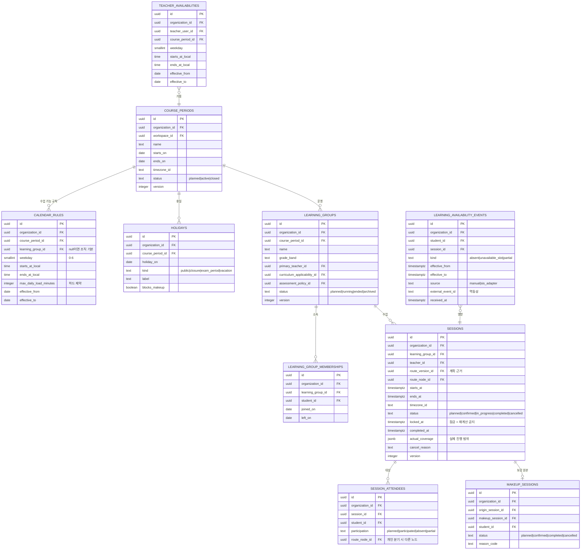

핵심 제약:

| 제약 | 구현 |
|---|---|
| 교사 시간 충돌 금지 | `EXCLUDE USING gist (organization_id WITH =, teacher_id WITH =, tstzrange(starts_at, ends_at) WITH &&) WHERE (status <> 'cancelled')` |
| 학습 그룹 시간 충돌 금지 | 동일 EXCLUDE, `learning_group_id` 기준 |
| 학생 시간 충돌 금지 | `session_attendees` 조인 뷰에 대한 트리거 검증 (학생은 여러 그룹 소속 가능) |
| 완료·잠금 수업 변경 금지 | `BEFORE UPDATE` 트리거: `status = 'completed' OR locked_at IS NOT NULL`이면 `actual_coverage`·메모 외 컬럼 변경 시 예외 |
| 불참 이벤트 멱등 | `UNIQUE (organization_id, source, external_event_id)` |
| 인덱스 | `(organization_id, learning_group_id, starts_at)`, `(organization_id, teacher_id, starts_at)`, `(organization_id, status, starts_at)` |

### 2.1 학생 계획과 학생 실행 — 3층

`sessions`는 **반이 언제 무엇을 하는가**만 답한다. 학생 개인의 경로와, 그 학생이 오늘 실제로 무엇을 하고 끝냈는가는 각각 다른 층이다. 근거: [ADR-0018](../adr/0018-daily-plan-projection-and-assessment-scheduler.md) §1.

| 층 | 테이블 | 답하는 질문 | 성질 | 상태 |
|---|---|---|---|---|
| ① 반 계획 | `sessions` | 이 반은 언제 어떤 노드를 하나 | 엔진 산출물 · 재계산 가능 | 구현됨 |
| ② 학생 계획 | `learner_schedule_items` | 이 학생은 언제 어떤 노드를 하나 | 엔진 산출물 · 재계산 가능 | 구현됨 |
| ③ 학생 실행 | `learner_day_plans` + `_items` | 이 학생이 오늘 **무엇을** 하고 **끝냈나** | 스냅샷 · 완료 이력 불변 | **T1.2 예정** |

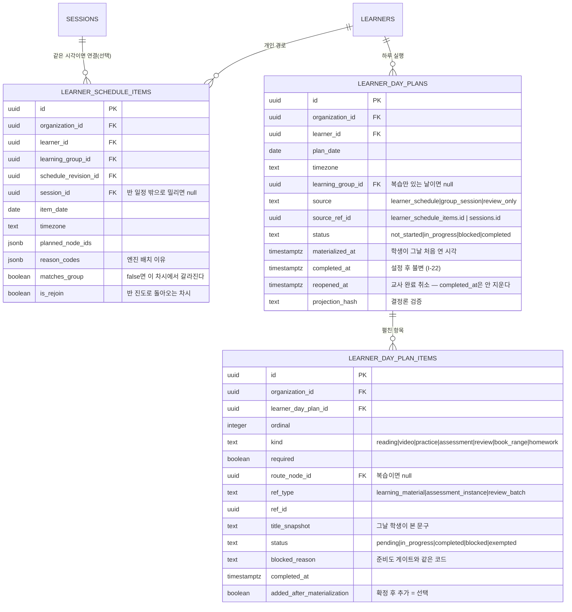

핵심 제약:

| 제약 | 구현 |
|---|---|
| 한 학생·한 날짜 계획은 하나 | `UNIQUE (organization_id, learner_id, plan_date)` |
| 멱등 재투영 | `learner_day_plan_items`에 `UNIQUE (learner_day_plan_id, kind, ref_id)` — UPSERT라 몇 번을 돌려도 행이 늘지 않는다 |
| 완료 불변 (`I-22`) | `BEFORE UPDATE` 트리거: `completed_at IS NOT NULL`이면 그 컬럼 변경 차단. 완료 전이는 CAS(`WHERE status <> 'completed'`) + outbox INSERT 같은 트랜잭션 |
| 반 상태 비침범 (`I-21`) | 하루 완료 경로가 `sessions`를 쓰지 않는다. 반 마감은 `session-execution`만 |
| 완료 계획 재투영 제외 | 재투영 대상 질의에 `status <> 'completed'` |
| 인덱스 | `(organization_id, plan_date, status)` 교사 현황판, `(organization_id, learning_group_id, plan_date)`, `(learner_day_plan_id, ordinal)` |

**②를 ③으로 대체하지 않는 이유**: ②는 일정이 바뀔 때마다 덮어써야 하고(`I-12` 결정론), ③은 완료 이력이 역행하면 안 된다(`I-22`). 한 테이블에 두면 재계산마다 "덮어써도 되는 행"과 "건드리면 안 되는 행"을 런타임에 갈라야 하고, 그 판단이 틀리는 순간 학생의 완료 기록이 사라진다.

**백필하지 않는다**: 마이그레이션 이전 날짜에는 계획 행이 없다. 과거 완주 여부는 어디에도 기록돼 있지 않아 역산하면 추정치이고, `completed_at`은 불변으로 소비자에게 흘러간다. 그 이전 날짜는 `empty`가 아니라 `no_record`로 구분해 표시한다 — ADR-0018 §6.

---

## 3. 교육과정

```mermaid
erDiagram
    CURRICULUM_AUTHORITY_SOURCES ||--o{ OFFICIAL_CURRICULUM_NODES : "근거"
    CURRICULUM_AUTHORITY_SOURCES ||--o{ ACHIEVEMENT_STANDARDS : "근거"
    CURRICULUM_VERSIONS ||--o{ CURRICULUM_APPLICABILITIES : "적용 규칙"
    CURRICULUM_VERSIONS ||--o{ OFFICIAL_CURRICULUM_NODES : "계층"
    CURRICULUM_VERSIONS ||--o{ COMPETENCY_DEFINITIONS : "역량"
    CURRICULUM_VERSIONS ||--o{ CURRICULUM_RELEASES : "릴리스"
    OFFICIAL_CURRICULUM_NODES ||--o{ OFFICIAL_CURRICULUM_NODES : "부모-자식"
    OFFICIAL_CURRICULUM_NODES ||--o{ ACHIEVEMENT_STANDARDS : "포함"
    ACHIEVEMENT_STANDARDS ||--o{ CURRICULUM_CONCEPT_ALIGNMENTS : "개념 정렬"
    CANONICAL_CONCEPTS ||--o{ CURRICULUM_CONCEPT_ALIGNMENTS : "정렬"
    CANONICAL_CONCEPTS ||--o{ SOURCE_ALIASES : "별칭"
    CANONICAL_CONCEPTS ||--o{ LEARNING_OBJECTIVES : "목표"
    CANONICAL_CONCEPTS ||--o{ CONCEPT_EDGES : "출발"
    CANONICAL_CONCEPTS ||--o{ REPRESENTATIONS : "표상"
    CANONICAL_CONCEPTS ||--o{ MISCONCEPTIONS : "오개념"
    CANONICAL_CONCEPTS ||--o{ INSTRUCTIONAL_PROFILES : "교수전략"
    LEARNING_OBJECTIVES ||--o{ ASSESSMENT_EVIDENCES : "기대 증거"
    CURRICULUM_RELEASES ||--o{ CURRICULUM_MAPPINGS : "포함"

    CURRICULUM_AUTHORITY_SOURCES {
        uuid id PK
        uuid organization_id FK "null=플랫폼 공용"
        text document_title
        text issuing_body "교육부|NCIC|출판사"
        text notice_number "고시 번호"
        text source_url
        text checksum "sha256"
        timestamptz fetched_at
        date effective_from
        date effective_to
        text applies_to
        text locator "페이지·조항"
        text review_status "unreviewed|reviewing|verified|superseded"
        integer priority "1-4"
    }
    CURRICULUM_VERSIONS {
        uuid id PK
        text code "2015-revised|2022-revised"
        text label
        text status "draft|active|superseded"
        date announced_on
    }
    CURRICULUM_APPLICABILITIES {
        uuid id PK
        uuid curriculum_version_id FK
        text academic_year
        text school_level "elementary|middle|high"
        text grade_band
        text subject
        date applies_from
        date applies_to
    }
    OFFICIAL_CURRICULUM_NODES {
        uuid id PK
        uuid curriculum_version_id FK
        uuid parent_id FK
        text node_type "school_level|grade_band|subject|domain|content_element"
        text official_code
        text official_label
        integer ordinal
        uuid source_id FK
        text source_locator
        text checksum
    }
    ACHIEVEMENT_STANDARDS {
        uuid id PK
        uuid curriculum_version_id FK
        uuid node_id FK
        text standard_code UK "원문 코드"
        text statement "공식 문구"
        text commentary "성취기준 해설"
        uuid source_id FK
        text source_locator
        text checksum
    }
    COMPETENCY_DEFINITIONS {
        uuid id PK
        uuid curriculum_version_id FK
        text code
        text label
        text definition
    }
    CANONICAL_CONCEPTS {
        uuid id PK
        uuid organization_id FK "null=플랫폼 표준"
        text slug UK
        text label
        text domain_hint
        text status "draft|reviewed|deprecated"
        uuid deprecated_by FK
        text evidence "최소 1건 필수"
        uuid reviewed_by
        timestamptz reviewed_at
    }
    SOURCE_ALIASES {
        uuid id PK
        uuid canonical_concept_id FK
        text source_system "mathg-gen|edutrix|math_test|mathlab|textbook"
        text raw_label
        text raw_id
        numeric confidence
        text resolution "confirmed|candidate|rejected"
        uuid reviewed_by
    }
    LEARNING_OBJECTIVES {
        uuid id PK
        uuid organization_id FK
        uuid canonical_concept_id FK
        text statement "관찰 가능한 수행"
        jsonb dimensions "conceptual|procedural|problem_solving|reasoning|communication|representation"
        jsonb tools_allowed
        integer expected_minutes
        jsonb success_evidence
        jsonb acceptable_errors
    }
    CONCEPT_EDGES {
        uuid id PK
        uuid organization_id FK
        uuid from_concept_id FK
        uuid to_concept_id FK
        text relation_type "PART_OF|PREREQUISITE|SOFT_PREREQUISITE|EXTENDS|SPECIAL_CASE_OF|EQUIVALENT_TO|CONTRASTS_WITH|REPRESENTED_BY|MISCONCEPTION_OF|ASSESSED_BY|TRANSFER_TO"
        text why_needed
        text required_depth
        boolean concurrent_ok
        uuid curriculum_version_id FK
        numeric confidence
        text evidence
        text origin "human|ai_suggested|rule"
        text review_status "draft|approved|rejected"
        uuid reviewed_by
        date reviewed_on
        date valid_from
        date valid_to
    }
    REPRESENTATIONS {
        uuid id PK
        uuid canonical_concept_id FK
        text kind "language|symbol|equation|table|graph|numberline|figure|manipulative|situation"
        text description
        jsonb sample_content
    }
    MISCONCEPTIONS {
        uuid id PK
        uuid canonical_concept_id FK
        text label
        text error_pattern
        jsonb detection_evidence
        text correction_strategy
        text applies_to_grade_band
        uuid curriculum_version_id FK
        text source
        numeric observed_effect
    }
    INSTRUCTIONAL_PROFILES {
        uuid id PK
        uuid canonical_concept_id FK
        jsonb sequence_patterns
        jsonb progression_stages "도입-발달-완성-전이"
        jsonb expected_prior
        jsonb next_extension
        text rationale
    }
    ASSESSMENT_EVIDENCES {
        uuid id PK
        uuid learning_objective_id FK
        text observable_performance
        text dimension
        jsonb acceptance_criteria
    }
    CURRICULUM_CONCEPT_ALIGNMENTS {
        uuid id PK
        uuid achievement_standard_id FK
        uuid canonical_concept_id FK
        text relation_type
        numeric confidence
        text evidence
        uuid source_id FK
        uuid created_by
        uuid reviewed_by
        date valid_from
        date valid_to
        integer version
    }
    CURRICULUM_MAPPINGS {
        uuid id PK
        uuid curriculum_release_id FK
        text target_type "book_edition|question|route_node"
        uuid target_id
        uuid official_node_id FK
        uuid canonical_concept_id FK
        text relation_type
        numeric confidence
        text evidence
        uuid reviewed_by
        integer version
    }
    CURRICULUM_RELEASES {
        uuid id PK
        uuid organization_id FK "null=플랫폼"
        uuid curriculum_version_id FK
        integer release_no
        text status "imported|parsed|mapped|expert_review|validated|published|superseded"
        text release_hash "결정론적 내용 해시"
        timestamptz published_at
        uuid superseded_by FK
        jsonb quality_gate_report
    }
```

핵심 제약:

| 제약 | 구현 |
|---|---|
| 성취기준 코드 중복 0 | `UNIQUE (curriculum_version_id, standard_code)` |
| 강한 선수 관계 DAG | 발행 전 `curriculum_releases` 검증 단계에서 `PREREQUISITE` 부분 그래프 순환 검사(재귀 CTE). 순환 1건이면 발행 차단 |
| 버전 교차 연결 금지 | `concept_edges`의 `curriculum_version_id`가 다른 노드끼리 암묵 연결 금지 — 검증 쿼리 |
| 고아 매핑 0 | 발행 전 대상 존재 검증 |
| 내부 개념 근거 필수 | `CHECK (status = 'draft' OR evidence IS NOT NULL)` |
| AI 제안 위장 금지 | `concept_edges.origin = 'ai_suggested' AND review_status <> 'approved'`인 간선은 자동 계획 쿼리에서 제외 (뷰 `approved_concept_edges`) |
| 권위 소스 역추적 | `official_curriculum_nodes.source_id`, `achievement_standards.source_id` NOT NULL |
| 활성 릴리스 1개 | `UNIQUE (organization_id, curriculum_version_id) WHERE status = 'published'` |

---

## 4. 콘텐츠 (교재·문항·출처)

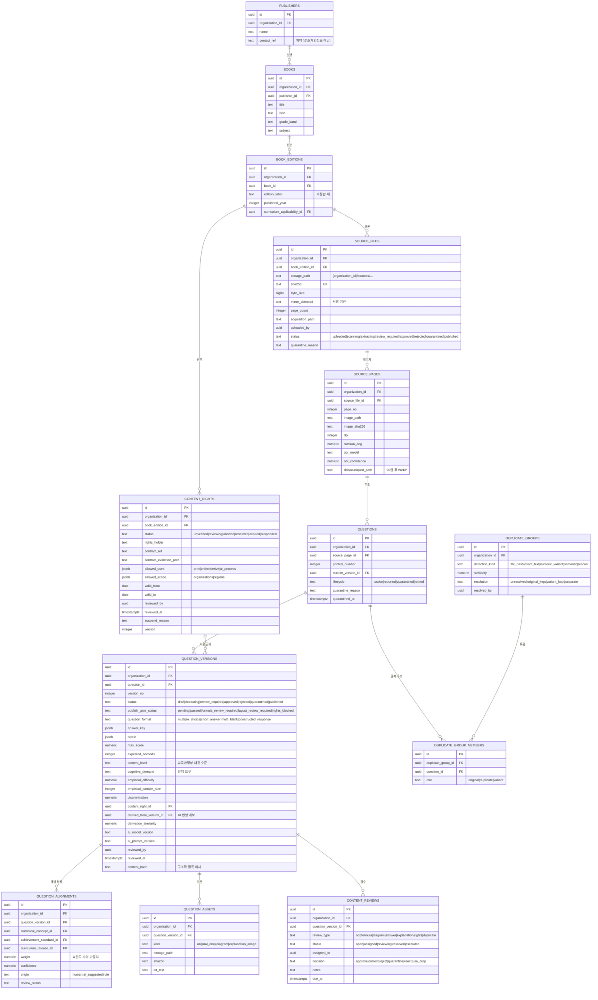

핵심 제약:

| 제약 | 구현 |
|---|---|
| 원본 파일 중복 방지 | `UNIQUE (organization_id, sha256)` |
| 게시 문항 불변 | `question_versions`에 `BEFORE UPDATE` 트리거: `status='published'`면 `empirical_*`·통계 컬럼 외 변경 예외 |
| 자동 출제 자격 | 뷰 `eligible_question_versions`: `status='published' AND publish_gate_status='passed' AND lifecycle='active' AND content_rights.status='allowed' AND content_rights.valid_to >= current_date AND EXISTS(question_alignments approved)` |
| 권한 만료 자동 반영 | 일 배치가 `valid_to < current_date`인 `content_rights`를 `expired`로 전환 + `ContentRightsRevoked` 발행 |
| 검색 인덱스 | `(organization_id, curriculum_release_id, canonical_concept_id, empirical_difficulty, question_format)` 복합 + 본문·태그 GIN (`pg_trgm`) |

---

## 5. 수학 표현·출력

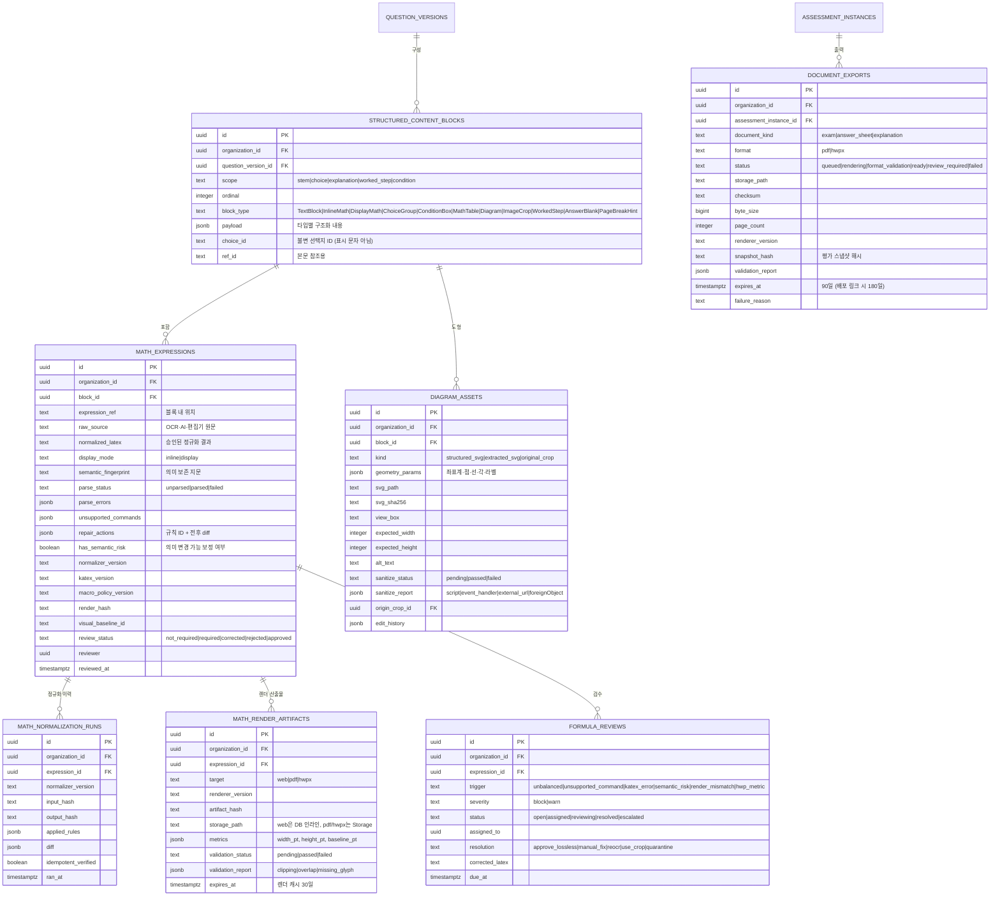

핵심 제약:

| 제약 | 구현 |
|---|---|
| 정규화 멱등성 | `math_normalization_runs.idempotent_verified` — `normalize(normalize(x)) = normalize(x)` 확인 후에만 true. false면 게시 게이트 실패 |
| 게시 게이트 (10조건) | 뷰 `question_publish_gate`가 전 조건 평가. 하나라도 실패면 `publish_gate_status`를 `formula_review_required` 또는 `layout_review_required`로 |
| 학생 노출 금지 조건 | `parse_status='failed'`, `review_status='required'`, `sanitize_status<>'passed'`, 필수 `math_render_artifacts` 누락 중 하나라도 있으면 게시 불가 |
| 렌더러 버전 고정 | 게시 시 `assessment_questions`에 `renderer_version` 복사. 이후 렌더러 업그레이드가 기존 시험 모양을 바꾸지 못함 |
| 의미 지문 일치 | web·pdf·hwpx 세 산출물의 `semantic_fingerprint` 불일치 0건 (게이트) |
| SVG 허용 목록 | `sanitize_report`에 `script|event_handler|external_url|foreignObject|dangerous_css` 항목이 하나라도 있으면 `failed` |

---

## 6. 학습 루트

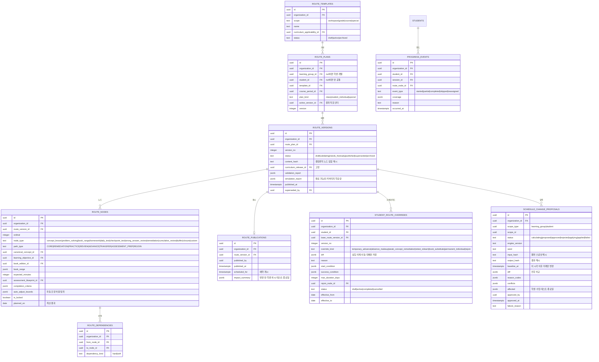

핵심 제약:

| 제약 | 구현 |
|---|---|
| 게시 버전 불변 | `route_versions` `BEFORE UPDATE` 트리거: `status='published'`면 `status`(→superseded/archived)와 `superseded_by` 외 변경 예외 |
| 활성 버전 원자 전환 | `route_plans.active_version_id` UPDATE + `route_versions.status` 전환을 같은 트랜잭션 |
| 반 루트 1개 활성 | `UNIQUE (organization_id, learning_group_id) WHERE plan_kind='class' AND archived_at IS NULL` |
| 오버라이드가 반 루트 미변경 | `student_route_overrides`는 `diff`만 보유. 반 루트 테이블에 쓰기 권한 없음 (ESLint B-2 + RLS 역할 게이트) |
| 결정론 검증 | `(input_hash, engine_version, seed)`가 같으면 `output_hash`도 같아야 함 — 속성 테스트 + `UNIQUE (organization_id, input_hash, engine_version, seed)` 부분 인덱스로 중복 계산 회피 |
| 잠금·완료 보존 | 엔진이 `is_locked=true` 노드와 `sessions.status='completed'`, `baseline_at` 이전을 결과에서 제외. 속성 테스트로 검증 |

---

## 7. 평가·응시·채점

```mermaid
erDiagram
    ASSESSMENT_POLICIES ||--o{ ASSESSMENT_BLUEPRINTS : "정책"
    ASSESSMENT_BLUEPRINTS ||--o{ ASSESSMENT_INSTANCES : "생성"
    ASSESSMENT_INSTANCES ||--o{ ASSESSMENT_QUESTIONS : "스냅샷"
    ASSESSMENT_INSTANCES ||--o{ ASSIGNMENTS : "배정"
    ASSIGNMENTS ||--o{ ATTEMPTS : "응시"
    ATTEMPTS ||--o{ RESPONSES : "답안"
    RESPONSES ||--o{ GRADE_DECISIONS : "채점"
    RESPONSES ||--o{ GRADING_EXCEPTIONS : "예외"
    ASSESSMENT_QUESTIONS ||--o{ RESPONSES : "대상"

    ASSESSMENT_POLICIES {
        uuid id PK
        uuid organization_id FK
        text name
        text automation_level "auto|approve_required|manual"
        jsonb daily_test_config "문항 수·시간·난이도·구성 비율"
        jsonb checkpoint_config "통과 점수·개념별 최소 숙련도·재시험"
        jsonb grading_config "부분 점수·동치 판정 범위"
        jsonb reexposure_limit "최근 동일 문항 재출제 제한"
        integer version
    }
    ASSESSMENT_BLUEPRINTS {
        uuid id PK
        uuid organization_id FK
        uuid assessment_policy_id FK
        uuid route_node_id FK
        text purpose "diagnostic|formative|checkpoint|cumulative|transfer|summative"
        uuid curriculum_release_id FK
        jsonb concept_weights "개념별 문항 수·가중치"
        jsonb cognitive_demand_mix
        jsonb difficulty_distribution
        jsonb representation_mix
        boolean calculator_allowed
        integer time_limit_seconds
        integer expected_seconds
        jsonb anchor_policy "공통 앵커 + 개인화 영역"
        jsonb autograde_scope
        jsonb pass_rules
        jsonb accessibility_checks
        integer version
    }
    ASSESSMENT_INSTANCES {
        uuid id PK
        uuid organization_id FK
        uuid blueprint_id FK
        uuid learning_group_id FK
        uuid student_id FK "개인화 시험"
        text kind "daily|checkpoint|retest|diagnostic"
        date scheduled_on
        text status "generating|draft|ready|published|open|closed|grading|finalized|cancelled|review_required"
        text snapshot_hash "게시 시 고정"
        text generation_seed
        uuid mastery_snapshot_id "당시 숙련도 스냅샷"
        timestamptz evidence_cutoff_at
        uuid curriculum_release_id FK
        uuid route_version_id FK
        integer policy_version
        text ai_model_version
        text ai_prompt_version
        timestamptz published_at
        timestamptz opens_at
        timestamptz closes_at
        integer version
    }
    ASSESSMENT_QUESTIONS {
        uuid id PK
        uuid organization_id FK
        uuid assessment_instance_id FK
        integer ordinal
        uuid question_version_id FK "참조만 — 내용은 아래에 고정"
        jsonb content_snapshot "구조화 블록 사본"
        text content_checksum
        jsonb answer_key_snapshot
        jsonb rubric_snapshot
        numeric max_score
        jsonb concept_weights_snapshot
        text selection_reason "today|weakness|wrong_answer|spaced|verify|difficulty_adaptive|anchor"
        text renderer_version
        text katex_version
        text normalizer_version
        boolean is_anchor
    }
    ASSIGNMENTS {
        uuid id PK
        uuid organization_id FK
        uuid assessment_instance_id FK
        uuid student_id FK
        text delivery "online|print|mixed"
        timestamptz assigned_at
        timestamptz due_at
        integer max_attempts
        text status "assigned|started|submitted|closed|cancelled"
    }
    ATTEMPTS {
        uuid id PK
        uuid organization_id FK
        uuid assignment_id FK
        uuid assessment_instance_id FK
        uuid student_id FK
        integer attempt_no
        text status "not_started|in_progress|submitted|auto_graded|review_required|finalized|invalidated"
        timestamptz started_at
        timestamptz submitted_at
        timestamptz finalized_at
        integer client_seq "다중 기기 충돌 감지"
        numeric total_score
        numeric max_score
        text invalidate_reason
        integer version
    }
    RESPONSES {
        uuid id PK
        uuid organization_id FK
        uuid attempt_id FK
        uuid assessment_question_id FK
        jsonb payload "선택지 ID·정규화 전 원문·빈칸별 값"
        text payload_storage_path "8KB 초과 시 오프로드"
        integer client_seq
        timestamptz saved_at
        timestamptz submitted_at
        integer hint_count
        integer retry_count
        integer elapsed_seconds
    }
    GRADE_DECISIONS {
        uuid id PK
        uuid organization_id FK
        uuid response_id FK
        integer version
        boolean is_current "한 response에 하나만 true"
        text decided_by "auto|teacher|reviewer|reprocess"
        uuid decided_by_user_id
        text grading_tier "exact|normalized|equivalence|partial|rubric|manual"
        numeric score
        numeric confidence
        jsonb rationale "루브릭 항목별 판단"
        jsonb normalized_answer
        text policy_version
        text correction_reason
        timestamptz decided_at
    }
    GRADING_EXCEPTIONS {
        uuid id PK
        uuid organization_id FK
        uuid response_id FK
        text exception_type "low_confidence_ocr|multiple_answers|format_mismatch|partial_credit|answer_conflict|question_error|missing_scan|unidentified|resubmit_needed|answer_key_changed"
        text status "open|assigned|reviewing|resolved|escalated"
        uuid assigned_to
        text resolution
        timestamptz due_at
    }
```

핵심 제약:

| 제약 | 구현 |
|---|---|
| 응시 고유 | `UNIQUE (assessment_instance_id, student_id, attempt_no)` |
| 답안 고유 | `UNIQUE (attempt_id, assessment_question_id)` |
| 한 번만 제출 | `UPDATE attempts SET status='submitted' WHERE id=$1 AND status='in_progress'` — 영향 행 0이면 409. `submitted_at` NOT NULL 후 변경 금지 트리거 |
| 게시 스냅샷 불변 | `assessment_questions` `BEFORE UPDATE/DELETE` 트리거: `assessment_instances.status IN ('published','open','closed','grading','finalized')`면 예외 |
| 현재 채점 1건 | `UNIQUE (response_id) WHERE is_current` |
| 채점 정정은 새 버전 | `grade_decisions` 는 append-only. 이전 행의 `is_current`를 false로만 변경 |
| 테스트 생성 멱등 | `UNIQUE (organization_id, learning_group_id, student_id, kind, scheduled_on) WHERE status <> 'cancelled'` |
| 인덱스 | `(organization_id, student_id, scheduled_on)`, `(organization_id, status, due_at)` (오늘 업무), `(attempt_id)` (응답 조회) |

---

## 8. 학습 지능

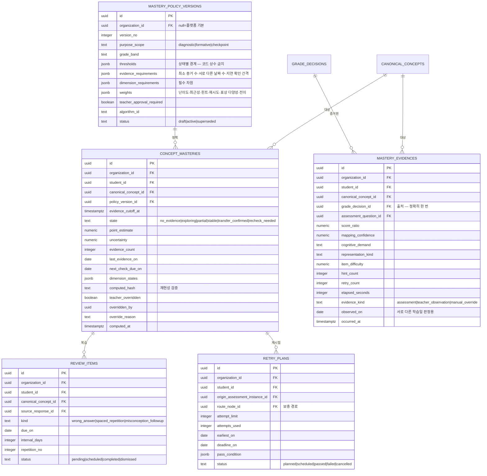

핵심 제약:

| 제약 | 구현 |
|---|---|
| 채점 1건 → 증거 정확히 1회 | `UNIQUE (grade_decision_id, canonical_concept_id)` + Inbox 중복 차단 |
| 증거 불변 | `mastery_evidences`는 append-only. UPDATE/DELETE 트리거 차단 |
| 숙련도 재현 가능 | `concept_masteries.computed_hash = H(policy_version_id, evidence_cutoff_at, 정렬된 evidence id 목록, algorithm_id)`. 같은 입력 → 같은 해시 (속성 테스트) |
| 정책 변경이 과거를 다시 쓰지 않음 | `concept_masteries`는 `(student_id, concept_id, policy_version_id)` 조합으로 다중 행 허용. 새 정책은 새 행 |
| 임계값 코드 상수 금지 | `mastery_policy_versions.thresholds` jsonb만 사용. `grep -rn "0\.[6-9]0\?" packages/core/src/mastery` 게이트 테스트 |
| 영구 숙련 금지 | `next_check_due_on` NOT NULL (상태 `stable` 이상일 때). 경과 시 자동 `recheck_needed` |

---

## 9. 지원 기능·인프라

```mermaid
erDiagram
    OUTBOX_EVENTS ||--o{ INBOX_MESSAGES : "소비"
    JOBS ||--o{ JOB_RUNS : "단계 실행"

    OUTBOX_EVENTS {
        uuid id PK "= event_id"
        uuid organization_id FK
        text aggregate_type
        uuid aggregate_id
        bigint aggregate_version
        text event_type
        integer schema_version
        timestamptz occurred_at
        text correlation_id
        text causation_id
        jsonb payload
        text status "pending|sent|failed"
        timestamptz next_attempt_at
        integer attempt_count
        text last_error
    }
    INBOX_MESSAGES {
        uuid id PK
        text consumer_name
        uuid event_id
        uuid organization_id
        timestamptz processed_at
        text outcome "applied|skipped_duplicate|skipped_stale"
    }
    JOBS {
        uuid id PK
        uuid organization_id FK
        text queue "realtime|schedule|render|ai|default"
        text job_type
        integer priority
        text status "queued|running|succeeded|failed|cancelled|dead_lettered"
        timestamptz run_after
        integer attempt_count
        integer max_attempts
        timestamptz lease_until
        text locked_by
        text idempotency_key
        text input_hash
        jsonb input
        jsonb output
        text last_error
        boolean retryable
        integer cost_cents
        text cancel_requested_by
        text pipeline_version
    }
    JOB_RUNS {
        uuid id PK
        uuid organization_id FK
        uuid job_id FK
        text step
        timestamptz started_at
        timestamptz ended_at
        text engine_version
        text model_version
        text prompt_version
        text input_hash
        uuid output_ref
        integer tokens_in
        integer tokens_out
        integer cost_cents
        integer attempt_no
        text outcome "succeeded|failed_retryable|failed_final|cancelled"
        text error_code
    }
    IDEMPOTENCY_KEYS {
        uuid id PK
        uuid organization_id FK
        text operation
        text idempotency_key
        text request_hash
        integer status_code
        jsonb response_body
        timestamptz expires_at "24시간"
    }
    KILL_SWITCHES {
        text key PK
        boolean enabled
        uuid enabled_by
        text reason
        timestamptz enabled_at
    }
    FEATURE_FLAGS {
        uuid id PK
        text key
        uuid organization_id "null=전역"
        text role_code
        numeric rollout_ratio
        boolean enabled
        uuid owner_user_id
        text created_reason
        date expires_on "만료 필수"
    }
    NOTIFICATIONS {
        uuid id PK
        uuid organization_id FK
        uuid recipient_user_id FK
        text kind
        text title
        text what_happened
        text why_happened
        jsonb affected_targets
        text recommended_action
        timestamptz due_at
        text status "unread|read|assigned|snoozed|done"
        uuid assigned_to
        uuid group_key "유사 알림 묶기"
    }
    REPORTS {
        uuid id PK
        uuid organization_id FK
        text report_type
        jsonb scope
        text status "draft|generating|review_required|approved|exported|failed|archived"
        text storage_path
        jsonb data_window "사용 데이터·기간"
        uuid approved_by
        timestamptz expires_at
    }
    IMPORT_BATCHES {
        uuid id PK
        uuid organization_id FK
        text source "csv|sis"
        text resource "students|groups|availability"
        text status "previewing|partial|succeeded|failed"
        integer total_rows
        integer ok_rows
        integer error_rows
        integer discarded_field_count
    }
```

핵심 제약:

| 제약 | 구현 |
|---|---|
| Inbox 중복 차단 | `UNIQUE (consumer_name, event_id)` |
| 멱등성 키 | `UNIQUE (organization_id, operation, idempotency_key)`. 같은 키 + 다른 `request_hash` → 409 `IDEMPOTENCY_KEY_CONFLICT` |
| 작업 멱등 | `UNIQUE (organization_id, job_type, idempotency_key) WHERE status <> 'cancelled'` |
| 파이프라인 멱등 | `idempotency_key = H(organization_id, source_sha256, book_edition_id, pipeline_version, step)` |
| Outbox 인덱스 | `(status, next_attempt_at, id) WHERE status IN ('pending','failed')` 부분 인덱스 |
| 큐 클레임 | `(queue, status, priority DESC, run_after, id) WHERE status='queued'` 부분 인덱스 + `FOR UPDATE SKIP LOCKED` |
| 기능 플래그 만료 | `CHECK (expires_on <= created_at::date + interval '90 days')` |
| 읽기 모델 | `read_model_*` 테이블은 백업 대상 제외. `TRUNCATE` 후 재생성 가능해야 함 (재생성 스크립트 필수) |

---

## 10. 데이터 수명 주기

### 10.1 전체 흐름

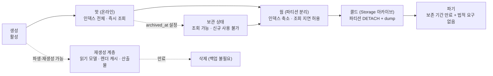

### 10.2 테이블별 수명 정책

| 테이블 | 핫 | 웜 | 콜드 | 파기 | 파기 방식 |
|---|---|---|---|---|---|
| `responses` | 180일 | 180일~3년 (파티션) | 3년 후 dump | 조직 탈퇴 +30일 또는 3년 경과 | 파티션 DROP |
| `attempts` | 180일 | ~3년 | 3년 후 dump | responses와 동일 | 파티션 DROP |
| `grade_decisions` | 영구 (핫) | — | — | 학생 삭제 요청 시 익명화 | `student_id` → 토큰, 점수·감사 유지 |
| `mastery_evidences` | 180일 | ~3년 | 3년 후 dump | 학생 삭제 요청 시 | 파티션 DROP + 집계 요약만 유지 |
| `concept_masteries` | 활성 정책 버전만 | 이전 정책 버전 | — | 정책 버전 폐기 +1년 | DELETE |
| `progress_events` | 180일 | ~3년 | dump | 3년 | 파티션 DROP |
| `sessions` | 과정 기간 + 1년 | ~3년 | dump | 3년 | 파티션 없음, DELETE 배치 |
| `learner_schedule_items` | 과정 기간 + 1년 | ~3년 | dump | 3년 | `sessions`와 같은 배치 |
| `learner_day_plans` | 과정 기간 + 1년 | ~3년 | dump | 3년 | `sessions`와 같은 배치. **완료 계획은 학습 이력이라 기간 내 삭제·수정 금지**(`I-22`) |
| `learner_day_plan_items` | 상위 계획과 동일 | 동일 | 동일 | 상위 계획 파기 시 | 부모 CASCADE |
| `route_versions` | 게시 중 + superseded 1년 | ~3년 | dump | 3년 | 소프트 삭제 후 배치 |
| `question_versions` | 영구 | — | — | 권한 `suspended` 확정 +30일 | 본문 파기, 메타·감사 유지 |
| `source_files` (Storage) | 계약 기간 | +90일 | Cold 스토리지 | 권한 `suspended` +30일 | 객체 삭제 + 체크섬 기록 유지 |
| `source_pages.image_path` | 90일 (300 DPI) | WebP 다운샘플 | — | 원본 파기 시 | 객체 삭제 |
| `math_render_artifacts` (web) | 30일 | — | — | 30일 | 재생성 가능, DELETE |
| `document_exports` 산출물 | 90일 (배포 링크 180일) | — | — | 만료 시 | 객체만 삭제, 메타 유지 |
| `audit_events` | 1년 | 1~5년 (압축 파티션) | 5년 후 dump | 5년 + 법정 요구 없음 | 파티션 DROP |
| `outbox_events` | sent 후 7일 | — | — | 7일 | 파티션 DROP |
| `job_runs` | 90일 | — | — | 90일 | 파티션 DROP |
| `idempotency_keys` | 24시간 | — | — | 24시간 | 배치 DELETE |
| `read_model_*` | 항상 | — | — | 재생성 시 | TRUNCATE |
| `notifications` | 90일 | — | — | 90일 | DELETE |

### 10.3 조직 탈퇴 처리

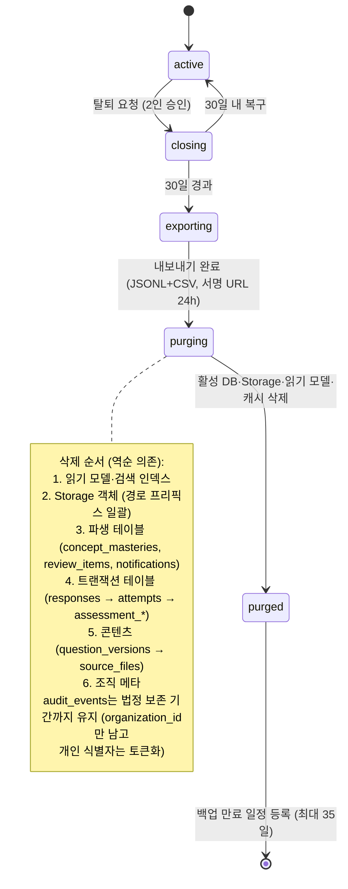

**PITR 상호작용**: 삭제 후에도 백업에는 데이터가 최대 35일(PITR 창) 남는다. 삭제 요청 처리 시 **백업 만료 예정일을 고객에게 명시**하고 `data_deletion_requests` 테이블에 기록한다. 백업에서 선택적 삭제는 하지 않는다(무결성 파괴).

### 10.4 학생 개인 삭제 요청

| 대상 | 처리 |
|---|---|
| `students.display_name`, `external_ref` | 즉시 토큰으로 치환 |
| `responses.payload` (서술형 본문) | 즉시 삭제, `payload = '{"redacted":true}'` |
| `attempts`, `grade_decisions` 점수 | **유지** (학습 증거·감사 무결성). `student_id`는 안정 토큰으로 유지 |
| `mastery_evidences` | 유지 (익명 토큰) |
| `audit_events` | 유지, 행위자·대상 식별자 토큰화 |
| Storage 학생 답안 스캔 | 즉시 삭제 |
| 생성된 리포트 | 즉시 삭제 |
| 읽기 모델·검색 인덱스 | 재생성 |

처리 기한: 요청 접수 후 **영업일 기준 10일 이내**. 처리 결과는 `audit_events`에 `action='privacy.erase'`로 기록.

### 10.5 파티션 운영

```sql
-- 매월 1일 03:00 KST, 스케줄러가 실행
-- 1) 다음 달 파티션 사전 생성 (3개월치 선행 유지)
-- 2) 보존 경계를 넘긴 파티션 아카이브 후 DETACH
-- 3) 콜드 보존 기간을 넘긴 파티션 DROP

-- 예: responses 180일 초과 파티션 처리
ALTER TABLE responses DETACH PARTITION responses_2026_01 CONCURRENTLY;
-- pg_dump → Storage {organization-less}/archive/responses_2026_01.dump (체크섬 기록)
-- 3년 경과 후:
DROP TABLE responses_2026_01;
```

파티션 키: `responses`·`attempts`는 `saved_at`/`started_at`, `audit_events`·`outbox_events`·`job_runs`·`progress_events`·`mastery_evidences`는 `occurred_at`/`created_at`. 전부 `RANGE` 월 단위.

---

## 11. 인덱스 요약 (골프롬프트 2J 목록 이행)

| 용도 | 인덱스 |
|---|---|
| 수업 (그룹) | `sessions (organization_id, learning_group_id, starts_at)` |
| 수업 (교사) | `sessions (organization_id, teacher_id, starts_at)` |
| 학생 일정 | `session_attendees (organization_id, student_id) INCLUDE (session_id)` + 조인 |
| 오늘 업무 | `notifications (organization_id, status, due_at)`, `grading_exceptions (organization_id, status, due_at)`, `content_reviews (organization_id, status, due_at)` |
| 응시 고유 | `attempts UNIQUE (assessment_instance_id, student_id, attempt_no)` |
| 답안 고유 | `responses UNIQUE (attempt_id, assessment_question_id)` |
| Outbox | `outbox_events (status, next_attempt_at, id)` 부분 |
| 큐 클레임 | `jobs (queue, priority DESC, run_after, id) WHERE status='queued'` |
| 문제 검색 | `question_versions (organization_id, curriculum_release_id, canonical_concept_id, empirical_difficulty, question_format, status, publish_gate_status)` 복합 |
| 문제 본문 검색 | `structured_content_blocks USING gin (payload jsonb_path_ops)` + `questions USING gin (search_tsv)` |
| 수식 중복 | `math_expressions (organization_id, semantic_fingerprint)` |
| 원본 중복 | `source_files UNIQUE (organization_id, sha256)` |
| 숙련도 조회 | `concept_masteries (organization_id, student_id, canonical_concept_id, policy_version_id)` |
| 복습 예정 | `review_items (organization_id, student_id, due_on) WHERE status='pending'` |
| 학생 개인 차시 | `learner_schedule_items (organization_id, learner_id, item_date)` |
| 하루 계획 고유 | `learner_day_plans UNIQUE (organization_id, learner_id, plan_date)` |
| 교사 현황판 | `learner_day_plans (organization_id, plan_date, status)` — T4.4가 날짜·반으로 학생 상태를 훑는다 |
| 하루 계획 항목 멱등 | `learner_day_plan_items UNIQUE (learner_day_plan_id, kind, ref_id)` |
| 하루 계획 항목 순서 | `learner_day_plan_items (learner_day_plan_id, ordinal)` |
