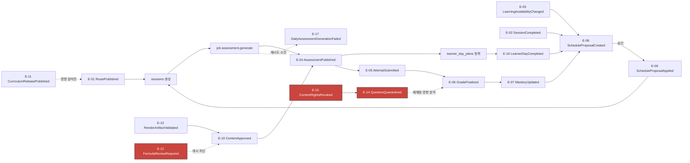
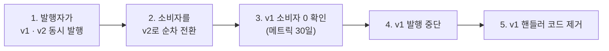

# 이벤트 카탈로그와 전달 의미

> 골프롬프트 2D(일관성 경계와 이벤트 계약) 이행 문서. 대표 이벤트 15종 전부.
> 관련: [domain-map.md](./domain-map.md) · [state-machines.md](./state-machines.md) · [api-contract.md](./api-contract.md)

---

## 1. 전달 의미

| 항목 | 결정 |
|---|---|
| 전달 보장 | **at-least-once**. "정확히 한 번"과 전역 순서를 가정하지 않는다 |
| 발행 | 상태 변경과 **같은 PostgreSQL 트랜잭션**에서 `outbox_events`에 INSERT (Transactional Outbox) |
| 릴레이 | `apps/worker`가 `status='pending'`을 배치 200건 · 50ms 사이클로 소비 → 핸들러 호출 → `sent` |
| 중복 차단 | 소비자는 `inbox_messages (consumer_name, event_id)` UNIQUE. **처리와 Inbox INSERT는 같은 트랜잭션** |
| 순서 | 같은 `(aggregate_type, aggregate_id)` 내부만 `aggregate_version` 오름차순 보장. **전역 순서 없음** |
| 역행 방지 | 소비자는 자기 테이블에 `last_applied_version`을 두고, `event.aggregate_version <= last_applied_version`이면 `skipped_stale`로 기록 후 무시 |
| 재시도 | 핸들러 실패 시 `attempt_count++`, `next_attempt_at = now() + 2^n × 5s` (전체 지터). `attempt_count >= 8`이면 `status='failed'` + SEV3 알림 |
| 보존 | `sent` 후 7일 (월 파티션 DROP) |

### 1.1 공통 이벤트 봉투

```jsonc
{
  "event_id": "01J8ZQ...",              // uuid v7, = outbox_events.id
  "organization_id": "01J0AA...",
  "aggregate_type": "RouteVersion",
  "aggregate_id": "01J8ZP...",
  "aggregate_version": 7,
  "event_type": "RoutePublished",
  "schema_version": 1,
  "occurred_at": "2026-08-03T05:00:00Z",
  "correlation_id": "01J8ZR...",        // 사용자 요청 trace_id에서 전파
  "causation_id": "01J8ZQ...",          // 이 이벤트를 유발한 이벤트/명령의 ID
  "payload": { /* 이벤트별 최소 필드 */ }
}
```

**페이로드 원칙**: 소비자가 **원본을 재조회하지 않고 라우팅·중복 판정·기본 처리를 할 수 있는 최소 필드**만 담는다. 대용량 본문은 참조 ID만 싣는다(예: 문항 내용 대신 `question_version_id`).

### 1.2 소비자 등록부

| `consumer_name` | 실행 위치 | 담당 |
|---|---|---|
| `session-execution` | worker | 수업 생성·확정 |
| `planning-engine` | worker | 일정 변경안 생성 |
| `assessment-generator` | worker | 자동 출제·재생성 |
| `attempt-processor` | worker | 채점 작업 등록 |
| `mastery-engine` | worker | 숙련도·복습·재시험 |
| `content-gatekeeper` | worker | 게시 게이트·격리 전파 |
| `curriculum-impact` | worker | 릴리스 영향 분석 |
| `read-model` | worker | 오늘 운영실·검색 인덱스 |
| `notifier` | worker | 알림·업무함 |
| `analytics` | worker | 리포트 집계 |
| `audit-mirror` | worker | 감사 파생 인덱스 |

---

## 2. 이벤트 17종

각 항목의 `발행 시점`은 **어느 트랜잭션의 커밋과 함께인지**를 뜻한다.

> E-01~E-15는 골프롬프트 2C 원안. **E-16·E-17은 [ADR-0018](../adr/0018-daily-plan-projection-and-assessment-scheduler.md)이 추가했다. E-17은 T3.4가, E-16은 T4.1이 구현했다.** 새 소비자는 없다 — §1.2 등록부의 `planning-engine`·`assessment-generator`·`read-model`·`notifier`·`analytics`를 그대로 쓴다.

---

### E-01 `RoutePublished`

| 항목 | 값 |
|---|---|
| aggregate | `RouteVersion` |
| 발행 시점 | `route_versions.status: ready → published` + `route_plans.active_version_id` 전환 트랜잭션 |
| schema_version | 1 |
| 소비자 | `session-execution`, `planning-engine`, `assessment-generator`, `read-model`, `notifier`, `analytics` |

```jsonc
"payload": {
  "route_plan_id": "01J...",
  "route_version_id": "01J...",
  "version_no": 7,
  "plan_kind": "class",                     // class | student_individual | special
  "learning_group_id": "01J...",            // plan_kind=class일 때
  "student_id": null,
  "course_period_id": "01J...",
  "curriculum_release_id": "01J...",
  "content_hash": "sha256:9f2a...",
  "node_count": 84,
  "date_range": { "from": "2026-09-01", "to": "2026-12-20" },
  "supersedes_version_id": "01J...",        // null이면 최초 게시
  "published_by": "01J...",
  "impact_summary": {
    "affected_students": 23,
    "sessions_to_create": 42,
    "sessions_to_move": 6,
    "sessions_to_cancel": 0,
    "assessments_to_create": 18,
    "locked_items_untouched": 4
  }
}
```

소비자 동작:

| 소비자 | 동작 |
|---|---|
| `session-execution` | 미래 `sessions` 생성·이동. **완료·잠금 수업은 제외** |
| `planning-engine` | 학생 오버라이드 재평가, 필요 시 `ScheduleProposalCreated` |
| `assessment-generator` | 체크포인트 노드에 대한 `assessment_instances` 예약 등록 |
| `notifier` | 담당 교사에게 "루트를 게시했습니다" + 영향 요약 |

---

### E-02 `SessionCompleted`

| 항목 | 값 |
|---|---|
| aggregate | `Session` |
| 발행 시점 | `sessions.status: in_progress → completed` + `progress_events` INSERT 트랜잭션 |
| schema_version | 1 |
| 소비자 | `planning-engine`, `assessment-generator`, `read-model`, `analytics` |

```jsonc
"payload": {
  "session_id": "01J...",
  "learning_group_id": "01J...",
  "teacher_id": "01J...",
  "route_version_id": "01J...",
  "route_node_id": "01J...",
  "started_at": "2026-08-03T07:00:00Z",
  "completed_at": "2026-08-03T08:30:00Z",
  "timezone_id": "Asia/Seoul",
  "coverage": {
    "status": "partial",                     // full | partial | not_started
    "planned_node_ids": ["01J...", "01J..."],
    "completed_node_ids": ["01J..."],
    "partial_reason": "예제 15번까지만 진행"
  },
  "attendees": [
    { "student_id": "01J...", "participation": "participated" },
    { "student_id": "01J...", "participation": "absent" }
  ]
}
```

`planning-engine`은 `coverage.status='partial'`이거나 `absent` 참석자가 있으면 미래 일정 preview를 생성한다. **자동 적용은 정책이 `auto`일 때만.**

---

### E-03 `LearningAvailabilityChanged`

| 항목 | 값 |
|---|---|
| aggregate | `Student` |
| 발행 시점 | `learning_availability_events` INSERT 트랜잭션 (수동 입력 또는 SIS 어댑터 수신) |
| schema_version | 1 |
| 소비자 | `planning-engine`, `session-execution`, `read-model`, `notifier` |

```jsonc
"payload": {
  "student_id": "01J...",
  "availability_event_id": "01J...",
  "kind": "absent",                         // absent | unavailable_slot | partial
  "effective_from": "2026-08-05T00:00:00Z",
  "effective_to": "2026-08-05T23:59:59Z",
  "affected_session_ids": ["01J..."],
  "source": "sis_adapter",                  // manual | sis_adapter
  "external_event_id": "SIS-2026-08-05-9931",
  "received_at": "2026-08-04T22:10:00Z"
}
```

**멱등성**: 같은 `(organization_id, source, external_event_id)`는 DB UNIQUE로 차단되므로 이벤트도 1회만 발행된다. 어댑터가 같은 이벤트를 10번 보내도 결과는 같다.

**경계 준수**: 이 이벤트는 "학습 불참 사실"만 나른다. 출결 원장·사유서·보호자 연락은 페이로드에 없고 저장하지도 않는다.

---

### E-04 `AssessmentPublished`

| 항목 | 값 |
|---|---|
| aggregate | `AssessmentInstance` |
| 발행 시점 | `assessment_instances.status: ready → published` + `assessment_questions` 스냅샷 INSERT 트랜잭션 |
| schema_version | 1 |
| 소비자 | `attempt-processor`, `read-model`, `notifier`, `analytics` |

```jsonc
"payload": {
  "assessment_instance_id": "01J...",
  "blueprint_id": "01J...",
  "kind": "daily",                          // daily | checkpoint | retest | diagnostic
  "learning_group_id": "01J...",
  "student_id": null,
  "scheduled_on": "2026-08-05",
  "opens_at": "2026-08-05T09:00:00Z",
  "closes_at": "2026-08-05T13:00:00Z",
  "question_count": 8,
  "max_score": 80,
  "snapshot_hash": "sha256:4c1e...",
  "generation_seed": "seed:01J8ZQ...",
  "evidence_cutoff_at": "2026-08-04T15:00:00Z",
  "curriculum_release_id": "01J...",
  "route_version_id": "01J...",
  "policy_version": 3,
  "renderer_versions": { "katex": "0.16.11", "normalizer": "2026.07.1", "pdf": "chromium-131", "hwpx": "2026.07.0" },
  "assigned_student_ids": ["01J...", "01J..."],
  "delivery": "online"
}
```

`renderer_versions`를 페이로드에 담는 이유: 렌더러 롤백([failure-modes.md](./failure-modes.md))에서 **어떤 게시물이 어떤 버전으로 고정됐는지**를 이벤트 이력만으로 역추적할 수 있어야 한다.

---

### E-05 `AttemptSubmitted`

| 항목 | 값 |
|---|---|
| aggregate | `Attempt` |
| 발행 시점 | `attempts.status: in_progress → submitted` 원자적 CAS 트랜잭션. **같은 트랜잭션에서 채점 `jobs` 행도 INSERT** |
| schema_version | 1 |
| 소비자 | `attempt-processor`, `read-model`, `notifier`, `analytics` |

```jsonc
"payload": {
  "attempt_id": "01J...",
  "assessment_instance_id": "01J...",
  "assignment_id": "01J...",
  "student_id": "01J...",
  "attempt_no": 1,
  "submitted_at": "2026-08-05T09:42:11Z",
  "elapsed_seconds": 1331,
  "response_count": 8,
  "unanswered_count": 0,
  "snapshot_hash": "sha256:4c1e...",
  "grading_job_id": "01J..."
}
```

**답안 본문은 담지 않는다.** 로그·큐를 통한 답안 유출을 구조적으로 막는다. 소비자는 `attempt_id`로 조회한다.

접수 성공(200 응답)했다면 이 이벤트와 채점 작업이 같은 커밋에 있으므로 **채점 유실 0**이 구조적으로 보장된다.

---

### E-06 `GradeFinalized`

| 항목 | 값 |
|---|---|
| aggregate | `Attempt` |
| 발행 시점 | `attempts.status: * → finalized` 트랜잭션 (자동 채점 완료 후 예외 0건, 또는 마지막 예외 해결) |
| schema_version | 1 |
| 소비자 | `mastery-engine`, `planning-engine`, `read-model`, `notifier`, `analytics` |

```jsonc
"payload": {
  "attempt_id": "01J...",
  "assessment_instance_id": "01J...",
  "student_id": "01J...",
  "attempt_no": 1,
  "kind": "checkpoint",
  "finalized_at": "2026-08-05T10:05:00Z",
  "total_score": 62,
  "max_score": 80,
  "passed": false,                          // 확인테스트일 때. daily는 null
  "policy_version": 3,
  "correction_of_grade_decision_ids": [],   // 재채점이면 이전 결정 ID 목록
  "concept_results": [
    {
      "canonical_concept_id": "01J...",
      "weight": 0.4,
      "score_ratio": 0.5,
      "evidence_refs": [
        {
          "grade_decision_id": "01J...",     // 멱등 키의 일부
          "assessment_question_id": "01J...",
          "score_ratio": 0.0,
          "mapping_confidence": 0.92,
          "cognitive_demand": "application",
          "representation_kind": "equation",
          "item_difficulty": 0.62,
          "hint_count": 1,
          "retry_count": 0,
          "elapsed_seconds": 210
        }
      ]
    }
  ]
}
```

`mastery-engine`은 `(grade_decision_id, canonical_concept_id)`로 `mastery_evidences`에 INSERT한다. UNIQUE 제약이 **불변 조건 I-10(최종 채점 한 건은 증거에 정확히 한 번)** 을 보장한다.

**재채점 시**: `correction_of_grade_decision_ids`가 비어 있지 않으면, `mastery-engine`은 이전 증거를 **삭제하지 않고** 상쇄 증거(`evidence_kind='correction'`)를 추가한 뒤 재계산한다. 증거는 append-only다.

---

### E-07 `MasteryUpdated`

| 항목 | 값 |
|---|---|
| aggregate | `ConceptMastery` |
| 발행 시점 | `concept_masteries` UPSERT 트랜잭션 (숙련도 재계산 완료) |
| schema_version | 1 |
| 소비자 | `planning-engine`, `assessment-generator`, `read-model`, `notifier`, `analytics` |

```jsonc
"payload": {
  "student_id": "01J...",
  "canonical_concept_id": "01J...",
  "policy_version_id": "01J...",
  "evidence_cutoff_at": "2026-08-05T10:05:00Z",
  "previous_state": "partial",
  "state": "recheck_needed",
  "point_estimate": 0.54,
  "uncertainty": 0.18,
  "evidence_count": 6,
  "last_evidence_on": "2026-08-05",
  "next_check_due_on": "2026-08-12",
  "dimension_states": {
    "conceptual": "partial", "procedural": "stable",
    "problem_solving": "exploring", "reasoning": "no_evidence"
  },
  "computed_hash": "sha256:7b3d...",
  "trigger": "grade_finalized",             // grade_finalized | policy_change | teacher_override | scheduled_recheck
  "reason_codes": ["CHECKPOINT_FAILED", "PREREQUISITE_GAP"]
}
```

`planning-engine`은 `state`가 `recheck_needed`·`exploring`으로 하락하고 `reason_codes`에 `PREREQUISITE_GAP`이 있으면 **다음 핵심 개념 전에** 보충 노드를 배치하는 preview를 만든다. 단순 실수(`CALCULATION_SLIP`)와 개념 오개념(`MISCONCEPTION`)은 다른 개입을 만든다.

**개별 학생 결과가 반 공통 경로와 다른 학생의 경로를 직접 변경하지 않는다** — `planning-engine`은 `student_route_overrides`만 만든다.

---

### E-08 `ScheduleProposalCreated`

| 항목 | 값 |
|---|---|
| aggregate | `ScheduleChangeProposal` |
| 발행 시점 | `schedule_change_proposals.status: calculating → proposed` 트랜잭션 |
| schema_version | 1 |
| 소비자 | `notifier`, `read-model`, `analytics` |

```jsonc
"payload": {
  "proposal_id": "01J...",
  "scope_type": "learning_group",           // learning_group | student
  "scope_id": "01J...",
  "trigger": "learning_availability_changed",
  "engine_version": "2026.07.3",
  "seed": "seed:01J...",
  "input_hash": "sha256:aa11...",
  "output_hash": "sha256:bb22...",
  "baseline_at": "2026-08-04T15:00:00Z",
  "requires_approval": true,
  "due_at": "2026-08-05T00:00:00Z",
  "summary": {
    "sessions_moved": 6, "sessions_added": 2, "sessions_cancelled": 0,
    "assessments_added": 1, "assessments_cancelled": 0,
    "affected_student_ids": ["01J..."],
    "target_end_date_before": "2026-12-20", "target_end_date_after": "2026-12-23",
    "locked_items_untouched": 4,
    "conflicts": []
  },
  "reason_codes": ["ABSENCE_MAKEUP", "DAILY_LOAD_REBALANCE"]
}
```

`notifier`는 `requires_approval=true`일 때 `due_at`이 있는 업무함 항목을 만든다. 알림에는 **무엇이·왜·영향 대상·권장 행동·처리 기한**을 모두 담는다(골프롬프트 22장).

---

### E-09 `ScheduleProposalApplied`

| 항목 | 값 |
|---|---|
| aggregate | `ScheduleChangeProposal` |
| 발행 시점 | `applying → applied` + `sessions` 확정 + 활성 일정 포인터 전환 트랜잭션 |
| schema_version | 1 |
| 소비자 | `session-execution`, `assessment-generator`, `read-model`, `notifier`, `analytics` |

```jsonc
"payload": {
  "proposal_id": "01J...",
  "scope_type": "learning_group",
  "scope_id": "01J...",
  "applied_at": "2026-08-04T23:05:00Z",
  "applied_by": "01J...",                   // 자동 정책이면 "system"
  "approval_mode": "auto",                  // auto | approved
  "input_hash": "sha256:aa11...",
  "output_hash": "sha256:bb22...",
  "engine_version": "2026.07.3",
  "changed": {
    "sessions_created": ["01J..."],
    "sessions_moved": [{ "session_id": "01J...", "from": "2026-08-05T07:00:00Z", "to": "2026-08-07T07:00:00Z" }],
    "sessions_cancelled": [],
    "assessments_created": ["01J..."],
    "assessments_cancelled": []
  },
  "rollback_token": "01J..."                 // 되돌리기용 역방향 제안 ID
}
```

`rollback_token`은 되돌리기의 계약이다. 자동 결정은 **되돌리는 방법과 함께** 제공한다(제품 원칙 6).

---

### E-10 `ContentApproved`

| 항목 | 값 |
|---|---|
| aggregate | `QuestionVersion` |
| 발행 시점 | `question_versions.status: approved → published` 트랜잭션 |
| schema_version | 1 |
| 소비자 | `assessment-generator`, `read-model`(검색 인덱스), `notifier`, `analytics` |

```jsonc
"payload": {
  "question_id": "01J...",
  "question_version_id": "01J...",
  "version_no": 3,
  "book_edition_id": "01J...",
  "source_page_id": "01J...",
  "printed_number": 14,
  "question_format": "multiple_choice",
  "publish_gate_status": "passed",
  "content_right_id": "01J...",
  "rights_status": "allowed",
  "rights_valid_to": "2027-02-28",
  "alignments": [
    { "canonical_concept_id": "01J...", "achievement_standard_id": "01J...", "weight": 0.7, "confidence": 0.94 }
  ],
  "curriculum_release_id": "01J...",
  "content_level": "중2-1",
  "cognitive_demand": "application",
  "expected_seconds": 180,
  "content_hash": "sha256:33cc...",
  "reviewed_by": "01J...",
  "derived_from_version_id": null,
  "derivation_similarity": null
}
```

`assessment-generator`는 이 이벤트로 **자동 출제 풀 진입**을 인지한다. 단, 실제 선정 시에는 뷰 `eligible_question_versions`를 재확인한다 — 이벤트와 현재 상태가 다를 수 있고(권한 만료 등), **파생 데이터를 권한 근거로 쓰지 않는다**(도메인 규칙 R-5).

---

### E-11 `CurriculumReleasePublished`

| 항목 | 값 |
|---|---|
| aggregate | `CurriculumRelease` |
| 발행 시점 | `curriculum_releases.status: validated → published` + 활성 포인터 전환 트랜잭션 |
| schema_version | 1 |
| 소비자 | `curriculum-impact`, `read-model`, `notifier`, `analytics` |

```jsonc
"payload": {
  "curriculum_release_id": "01J...",
  "curriculum_version_id": "01J...",
  "curriculum_version_code": "2022-revised",
  "release_no": 4,
  "release_hash": "sha256:55ee...",
  "published_at": "2026-08-01T00:00:00Z",
  "supersedes_release_id": "01J...",
  "applicability": [
    { "academic_year": "2027", "school_level": "middle", "grade_band": "중1-3", "subject": "수학" }
  ],
  "authority_sources": [
    { "source_id": "01J...", "checksum": "sha256:ab...", "notice_number": "제2022-33호", "fetched_at": "2026-07-20T00:00:00Z" }
  ],
  "quality_gate_report": {
    "duplicate_standard_codes": 0, "prerequisite_cycles": 0, "orphan_mappings": 0,
    "concepts_without_evidence": 0, "scope_contradictions": 0, "untraceable_nodes": 0
  },
  "diff_summary": { "added": 12, "removed": 3, "moved": 7, "split": 2, "merged": 1 }
}
```

`curriculum-impact`는 **영향 분석만** 만든다. 활성 루트·평가를 자동 재매핑하지 않는다(제품 원칙 13, 불변 조건과 동일). 영향 분석 결과는 `notifier`가 수학 프로그램 책임자에게 마이그레이션 초안으로 전달한다.

---

### E-12 `FormulaReviewRequired`

| 항목 | 값 |
|---|---|
| aggregate | `MathExpression` |
| 발행 시점 | `formula_reviews` INSERT 트랜잭션 (게이트 실패 감지) |
| schema_version | 1 |
| 소비자 | `content-gatekeeper`, `notifier`, `read-model`, `analytics` |

```jsonc
"payload": {
  "expression_id": "01J...",
  "block_id": "01J...",
  "question_version_id": "01J...",
  "formula_review_id": "01J...",
  "trigger": "semantic_risk",                // unbalanced | unsupported_command | katex_error |
                                             // semantic_risk | render_mismatch | hwp_metric
  "severity": "block",                       // block | warn
  "parse_status": "parsed",
  "unsupported_commands": ["\\substack"],
  "error_locations": [{ "offset": 42, "length": 9, "detail": "unmatched \\left" }],
  "normalizer_version": "2026.07.1",
  "katex_version": "0.16.11",
  "macro_policy_version": "3",
  "affected_targets": ["web", "pdf", "hwpx"],
  "due_at": "2026-08-06T00:00:00Z"
}
```

**수식 원문은 페이로드에 넣지 않는다** — 메트릭·로그 레이블 오염과 저작권 노출을 막는다. 검수 화면이 `expression_id`로 조회한다.

`content-gatekeeper`는 `severity='block'`이면 `question_versions.publish_gate_status`를 `formula_review_required`로 전환하고, 해당 문항이 든 **미게시** 평가의 생성을 중단시킨다. **이미 게시된 평가의 스냅샷은 건드리지 않는다.**

---

### E-13 `RenderArtifactValidated`

| 항목 | 값 |
|---|---|
| aggregate | `MathExpression` 또는 `QuestionVersion` |
| 발행 시점 | `math_render_artifacts.validation_status: pending → passed\|failed` 트랜잭션 |
| schema_version | 1 |
| 소비자 | `content-gatekeeper`, `analytics` |

```jsonc
"payload": {
  "question_version_id": "01J...",
  "expression_ids": ["01J...", "01J..."],
  "target": "hwpx",                          // web | pdf | hwpx
  "renderer_version": "2026.07.0",
  "validation_status": "passed",             // passed | failed
  "artifact_hash": "sha256:77aa...",
  "metrics": { "width_pt": 128.4, "height_pt": 22.1, "baseline_pt": 6.3 },
  "semantic_fingerprint_match": true,
  "checks": {
    "clipping": 0, "overlap": 0, "missing_glyph": 0,
    "zero_width_objects": 0, "baseline_error_pt": 0.4
  },
  "duration_ms": 812
}
```

`content-gatekeeper`는 `web`·`pdf`·`hwpx` **3개 target 모두** `passed`이고 `semantic_fingerprint_match`가 전부 true일 때만 `publish_gate_status='passed'`로 전환한다. 하나라도 없거나 실패하면 게시 불가(불변 조건 I-18, I-19).

---

### E-14 `QuestionQuarantined`

| 항목 | 값 |
|---|---|
| aggregate | `Question` |
| 발행 시점 | `questions.lifecycle: * → quarantined` 트랜잭션 |
| schema_version | 1 |
| 소비자 | `assessment-generator`, `attempt-processor`, `content-gatekeeper`, `notifier`, `read-model`, `analytics` |

```jsonc
"payload": {
  "question_id": "01J...",
  "affected_version_ids": ["01J...", "01J..."],
  "reason": "answer_key_error",              // answer_key_error | formula_broken | rights_revoked |
                                             // duplicate | reported_by_teacher | layout_broken
  "reason_detail": "정답 ③이 아니라 ④",
  "quarantined_by": "01J...",
  "quarantined_at": "2026-08-06T02:00:00Z",
  "impact": {
    "pending_assessment_ids": ["01J..."],     // 미완료 — 즉시 제외 대상
    "published_assessment_ids": ["01J..."],   // 게시됨 — 영향 분석 대상
    "completed_attempt_count": 214,
    "affected_student_count": 214,
    "regrade_required": true
  }
}
```

소비자 동작:

| 소비자 | 동작 |
|---|---|
| `assessment-generator` | 미완료 평가에서 해당 문항 제외·대체 문항 재선정. 미게시 상태로 되돌림 |
| `attempt-processor` | 완료 응시 영향 목록 생성. **자동 재채점하지 않고** 재채점 영향 분석을 제공 |
| `content-gatekeeper` | 자동 출제 풀에서 제외 |
| `notifier` | 수학 프로그램 책임자에게 SEV2 업무 (재채점 결정 필요) |

**과거 감사·응시 기록은 조용히 삭제하지 않는다**(불변 조건 I-13).

---

### E-15 `ContentRightsRevoked`

| 항목 | 값 |
|---|---|
| aggregate | `ContentRight` |
| 발행 시점 | `content_rights.status: allowed → expired\|suspended\|restricted` 트랜잭션 |
| schema_version | 1 |
| 소비자 | `content-gatekeeper`, `assessment-generator`, `notifier`, `read-model`, `analytics` |

```jsonc
"payload": {
  "content_right_id": "01J...",
  "book_edition_id": "01J...",
  "publisher_id": "01J...",
  "previous_status": "allowed",
  "status": "suspended",
  "reason": "publisher_request",              // expiry | publisher_request | contract_dispute |
                                              // internal_review | takedown_notice
  "effective_at": "2026-08-06T00:00:00Z",
  "revoked_by": "01J...",
  "impact": {
    "question_count": 1842,
    "published_question_version_ids_sample": ["01J...", "01J..."],
    "pending_assessment_ids": ["01J..."],
    "active_document_export_ids": ["01J..."],
    "signed_url_count": 37
  },
  "actions_required": ["block_new_assignments", "revoke_signed_urls", "purge_cached_exports"]
}
```

`content-gatekeeper` 처리 순서(모두 같은 트랜잭션 또는 보상 가능한 순서):

1. 해당 판본의 전 `question_versions`를 자동 출제 풀에서 제외 (`eligible_question_versions` 뷰가 자동 반영).
2. 미완료 `assessment_instances`에서 문항 제외 요청.
3. 활성 서명 URL 폐기 (Storage 객체 정책 갱신).
4. `document_exports`의 캐시 산출물 삭제 (메타·체크섬은 보존).
5. 이미 완료된 응시의 **점수·감사·출처 식별 기록은 보존**한다(골프롬프트 2I).

---

### E-16 `LearnerDayCompleted`

| 항목 | 값 |
|---|---|
| aggregate | `LearnerDayPlan` |
| 발행 시점 | `learner_day_plans.status → completed` + `completed_at` 설정 트랜잭션 |
| schema_version | 1 |
| 소비자 | `planning-engine`, `read-model`, `notifier`, `analytics` |

```jsonc
"payload": {
  "learner_day_plan_id": "01J...",
  "learner_id": "01J...",
  "learning_group_id": "01J...",            // 복습만 있는 날이면 null
  "plan_date": "2026-08-04",
  "timezone_id": "Asia/Seoul",
  "completed_at": "2026-08-04T11:20:00Z",
  "source": "learner_schedule",             // learner_schedule | group_session | review_only
  "items": {
    "required_total": 5,
    "required_completed": 4,
    "required_exempted": 1,
    "optional_completed": 2
  },
  "route_node_ids": ["01J...", "01J..."]    // 오늘 항목이 나온 노드 (복습 항목은 빠짐)
}
```

**이 이벤트는 반 수업을 완료시키지 않는다** (`I-21`). `sessions.status`를 바꾸는 소비자는 없다. 반 마감은 교사의 별도 명령이고 E-02가 나른다 — [ADR-0017](../adr/0017-learner-day-and-session-completion.md) §1.

**멱등성**: `learner_day_plans`의 `UNIQUE (organization_id, learner_id, plan_date)`와 완료 CAS 전이로 계획 1건당 **최대 1회** 발행된다(`I-22`). 교사가 완료를 취소했다가 다시 완료돼도 **재발행하지 않는다** — `completed_at`이 이미 있기 때문이다.

`planning-engine`은 `required_completed < required_total`인 완료(면제가 섞인 날)를 진도 계산에서 구분한다. 면제는 "했다"가 아니다.

> **T4.1 구현 시 정정 ① — payload 키는 camelCase다.** 위 예시는 snake_case로 적혀 있지만 코드가 내는 키는 `learnerDayPlanId`·`timezoneId`·`routeNodeIds`다. 이 문서의 다른 이벤트도 전부 그렇다(E-17의 `job_id`는 실제로 `jobId`). 정의처는 `packages/contracts/src/events/index.ts`이고, 이 문서의 JSON은 **모양을 보이는 예시**다.
>
> 표기가 어긋난 것 자체보다, 그 표기가 실행되는 코드로 새어 들어간 것이 문제였다: `invariants.sql`의 I-22 검사가 `payload->>'learner_day_plan_id'`로 묶고 있어서 모든 행이 NULL 한 바구니에 들어갔다. 발행부가 없던 동안에는 0행이라 조용했고, T4.1이 발행을 붙이자 **정상 이벤트 2건이 곧바로 위반으로 보고**됐다. 지금은 payload가 아니라 컬럼(`aggregate_id`)으로 묶는다.
>
> **T4.1 구현 시 정정 ② — 지금은 소비자가 없다.** 위 표의 소비자 넷이 전부 미구현이다. 붙일 수 있는 유일한 기존 토픽인 `schedule.recalculate`는 학생이 속한 반의 일정을 통째로 다시 실체화하므로, 서른 명 반에서 하루 서른 번 돈다. 그래서 `EVENT_WITHOUT_CONSUMER`에 근거와 함께 무소비를 **선언**한다 — 선언 없는 소비자 0건은 디스패처가 격리한다(무음 폐기 방지). 적응 재계획(T4.3)이 「무엇을 다시 계획할지」를 정하면 그때 소비자를 넣는다.
>
> 이벤트를 아예 만들지 않는 선택지는 없다. 완료는 불변 기록이고(I-22), 그 기록이 outbox에 남아야 나중에 붙는 소비자가 볼 근거가 생긴다.

---

### E-17 `DailyAssessmentGenerationFailed`

| 항목 | 값 |
|---|---|
| aggregate | `Session` |
| 발행 시점 | `assessment.generate` 작업이 **재시도 불가** 오류로 끝나거나 재시도 소진 후 `jobs.status='failed'`로 전이하는 트랜잭션 |
| schema_version | 1 |
| 소비자 | `notifier`, `read-model`, `analytics` |

```jsonc
"payload": {
  "session_id": "01J...",
  "learning_group_id": "01J...",
  "route_node_id": "01J...",
  "plan_date": "2026-08-05",
  "purpose": "daily",                       // daily | confirmation
  "job_id": "01J...",
  "idempotency_key": "assessment.generate:01J...:2026-08-05:daily",
  "reason": "insufficient_questions",       // 아래 8종 — 코드가 단일 정의처:
                                            //   GENERATION_FAILURE_REASONS (생성기의 판단)
                                            //   + transient_db | bad_payload (핸들러의 분류)
                                            // no_policy | no_session | no_route |
                                            // insufficient_questions | no_repeat_window |
                                            // difficulty_unsatisfiable | transient_db |
                                            // bad_payload
                                            // (no_blueprint은 없앴다 — T3.3: 블루프린트는
                                            //  교사가 고르는 입력이 아니라 생성 산출물이다)
  "retryable": false,
  "attempt_count": 8,
  "detail": {
    "requested_count": 20,
    "eligible_count": 3,
    "shortfall_buckets": ["weakness", "spaced_review"]
  },
  "recovery_href": "/app/tests?session=01J...",
  "failed_at": "2026-08-04T21:00:00Z"
}
```

**왜 성공 이벤트가 없나**: 생성 성공은 E-04 `AssessmentPublished`가 이미 나른다. **왜 요청 이벤트가 없나**: 요청은 이벤트가 아니라 `jobs` 행이다 — 멱등 키·재시도 횟수·상태를 그 행이 이미 담는다. 같은 사실을 두 곳에 두면 둘이 어긋난다([ADR-0018](../adr/0018-daily-plan-projection-and-assessment-scheduler.md) §4).

**실패가 성공처럼 보이지 않는다**: 이 경로로 끝난 평가는 게시·배정되지 않는다. 교사는 `recovery_href`로 복구 화면(`/app/tests`)에 닿아 사유·조치·「다시 생성」을 함께 본다.

> **T3.4 구현 시 정정**: 학생 화면의 사유는 아직 `assessment_generation_failed`가 아니라 `assessment_not_generated`다. 「아직 안 만들어졌다」와 「만들다 실패했다」를 학생 화면에서 가르려면 투영기가 실패 상태를 읽어야 하는데, 학생에게 그 둘은 **똑같이 「오늘 시험을 볼 수 없다」**이고 조치도 없다. 구분이 필요한 쪽은 교사이고, 그쪽은 이 이벤트와 복구 화면이 덮는다.

> **재실행은 같은 작업 행을 되살린다**(새 작업을 만들지 않는다). `jobs`의 `(topic, idempotency_key)` 유니크를 실패한 행이 쥐고 있어, 새로 넣으면 `on conflict do nothing`이 조용히 삼켜 **아무 일도 일어나지 않는다**. 같은 행을 되살려야 멱등 키가 유지되고 자동 경로도 함께 복구된다.

`reason`이 `transient_db`면 `retryable=true`이고 이 이벤트는 **재시도가 모두 소진된 뒤에만** 발행된다. 백오프 중에는 발행하지 않는다 — 일시 장애로 교사에게 알림을 쏘지 않기 위해서다.

---

## 3. 이벤트 → 소비자 매트릭스

| 이벤트 | session-execution | planning-engine | assessment-generator | attempt-processor | mastery-engine | content-gatekeeper | curriculum-impact | read-model | notifier | analytics |
|---|:-:|:-:|:-:|:-:|:-:|:-:|:-:|:-:|:-:|:-:|
| E-01 RoutePublished | ● | ● | ● | | | | | ● | ● | ● |
| E-02 SessionCompleted | | ● | ● | | | | | ● | | ● |
| E-03 LearningAvailabilityChanged | ● | ● | | | | | | ● | ● | |
| E-04 AssessmentPublished | | | | ● | | | | ● | ● | ● |
| E-05 AttemptSubmitted | | | | ● | | | | ● | ● | ● |
| E-06 GradeFinalized | | ● | | | ● | | | ● | ● | ● |
| E-07 MasteryUpdated | | ● | ● | | | | | ● | ● | ● |
| E-08 ScheduleProposalCreated | | | | | | | | ● | ● | ● |
| E-09 ScheduleProposalApplied | ● | | ● | | | | | ● | ● | ● |
| E-10 ContentApproved | | | ● | | | | | ● | ● | ● |
| E-11 CurriculumReleasePublished | | | | | | | ● | ● | ● | ● |
| E-12 FormulaReviewRequired | | | | | | ● | | ● | ● | ● |
| E-13 RenderArtifactValidated | | | | | | ● | | | | ● |
| E-14 QuestionQuarantined | | | ● | ● | | ● | | ● | ● | ● |
| E-15 ContentRightsRevoked | | | ● | | | ● | | ● | ● | ● |
| E-16 LearnerDayCompleted | | ● | | | | | | ● | ● | ● |
| E-17 DailyAssessmentGenerationFailed | | | | | | | | ● | ● | ● |

E-16에 `session-execution` 열이 비어 있는 것이 `I-21`이다 — **학생 하루 완료를 받아 `sessions`를 바꾸는 소비자는 없다.**

---

## 4. 이벤트 연쇄 (인과 사슬)



**핵심 자동 순환**은 `E-01 → sessions → assessment.generate → E-04 → E-05 → E-06 → E-07 → E-08 → E-09 → sessions`다. 이 순환이 제품의 노스스타이며, 각 화살표는 위 이벤트 계약으로 구현된다.

`sessions`와 `E-04` 사이의 `assessment.generate`는 **이벤트가 아니라 작업**이다([ADR-0018](../adr/0018-daily-plan-projection-and-assessment-scheduler.md) §4·§5). 지금은 이 자리가 **비어 있고 교사의 버튼이 대신하고 있다** — `apps/worker/src/registry.ts`에 `assessment.*` 핸들러가 없다. T3.2가 채운다.

**학생 순환**은 `E-04 → learner_day_plans 항목 → E-16 → E-08`이다. 반 순환(E-02)과 갈라져 있고, 합류점은 `E-08 ScheduleProposalCreated` 하나뿐이다 — 두 완료가 섞이지 않으면서도 미래 일정에는 둘 다 반영된다.

`causation_id` 사용 예: `E-06`이 만든 `E-07`은 `causation_id = E-06.event_id`. `E-07`이 만든 `E-08`은 `causation_id = E-07.event_id`. `correlation_id`는 최초 사용자 요청의 `trace_id`로 전 사슬에 동일하게 유지된다. 한 번의 답안 제출이 만든 모든 후속 변경을 하나의 ID로 추적할 수 있다.

---

## 5. 스키마 버전 전략

### 5.1 변경 분류

| 변경 | 하위 호환 | `schema_version` | 절차 |
|---|---|---|---|
| 선택 필드 추가 | O | 유지 | 배포만. 구 소비자는 무시 |
| 필드에 값 추가 (enum 확장) | 조건부 | 유지 | 소비자가 `default` 분기를 가져야 함. 계약 테스트로 강제 |
| 필수 필드 추가 | X | +1 | 이중 발행 |
| 필드 삭제·이름 변경 | X | +1 | 이중 발행 |
| 필드 타입 변경 | X | +1 | 이중 발행 |
| 의미 변경 (같은 이름, 다른 뜻) | X | **새 `event_type`** | 이름을 바꾼다. 같은 이름의 의미 변경은 금지 |

### 5.2 이중 발행 절차 (파괴적 변경)



- 이중 발행 기간 **최소 30일**.
- 소비자 전환 여부는 `inbox_messages`에서 `consumer_name`별 `schema_version` 분포를 집계해 확인한다.
- 롤링 배포 중 구·신 앱이 공존하므로, **발행자를 먼저 배포**하고 소비자를 나중에 배포한다(발행자가 v1도 계속 내보내므로 안전).

### 5.3 소비자의 방어 규약

```ts
// 모든 핸들러의 공통 진입부
export function handle(envelope: EventEnvelope) {
  if (envelope.schema_version > SUPPORTED_MAX) {
    // 미래 버전 — 처리하지 않고 대기 (실패로 기록해 재시도)
    throw new UnsupportedSchemaVersionError(envelope.event_type, envelope.schema_version);
  }
  const payload = PayloadSchemas[envelope.event_type][envelope.schema_version].parse(envelope.payload);
  // ...
}
```

- **모르는 `event_type`은 무시하고 `skipped_unknown`으로 Inbox에 기록**한다. 실패로 만들면 릴레이가 막힌다.
- **모르는(더 높은) `schema_version`은 실패로 처리**해 재시도한다. 소비자가 배포되면 자동으로 처리된다.
- zod 스키마는 소비자 쪽에서 `.passthrough()`를 쓴다(발행자가 필드를 추가해도 깨지지 않게). 발행자 쪽 검증만 `.strict()`.

### 5.4 계약 테스트

| 테스트 | 내용 |
|---|---|
| 스냅샷 | 15개 이벤트 × 각 `schema_version`의 페이로드 예제를 픽스처로 고정. 변경 시 CI가 diff를 보여주고 명시적 승인 요구 |
| 하위 호환 | 이전 릴리스의 픽스처를 현재 소비자에 주입 → 전부 처리 성공 |
| 상위 호환 | 현재 픽스처에 미지 필드를 추가 → 소비자가 무시하고 처리 성공 |
| 중복 | 같은 `event_id` 10회 배달 → 부작용 1회, Inbox `skipped_duplicate` 9건 |
| 역순 | `aggregate_version` 역순 배달 → 상태 역행 0, `skipped_stale` 기록 |
| 지연 | 24시간 지연 이벤트 배달 → 최신 상태를 덮어쓰지 않음 |
| 미지 타입 | 존재하지 않는 `event_type` → 릴레이 정상 진행, `skipped_unknown` 기록 |

---

## 6. 운영 지표

| 지표 | 임계 | 알림 |
|---|---|---|
| `outbox_pending_age_seconds` (최고 대기) | > 60초 | SEV3 |
| | > 300초 | SEV2 |
| `outbox_failed_count` | > 0 (5분 창) | SEV3 |
| `inbox_skipped_stale_rate` | > 5% | SEV3 (순서 문제 신호) |
| `inbox_skipped_unknown_count` | > 0 | SEV4 (배포 순서 확인) |
| `event_handler_duration_p99` (소비자별) | > 5초 | SEV3 |
| `event_lag_seconds` (발행 → 처리 완료) | 파생 데이터 목표: 집계 30초, 추천 60초 | 초과 시 SEV3 |

메트릭 레이블: `event_type`, `schema_version`, `consumer_name`, `outcome`. **`organization_id`·`student_id`는 레이블에 넣지 않는다**(고카디널리티 + 개인정보).
