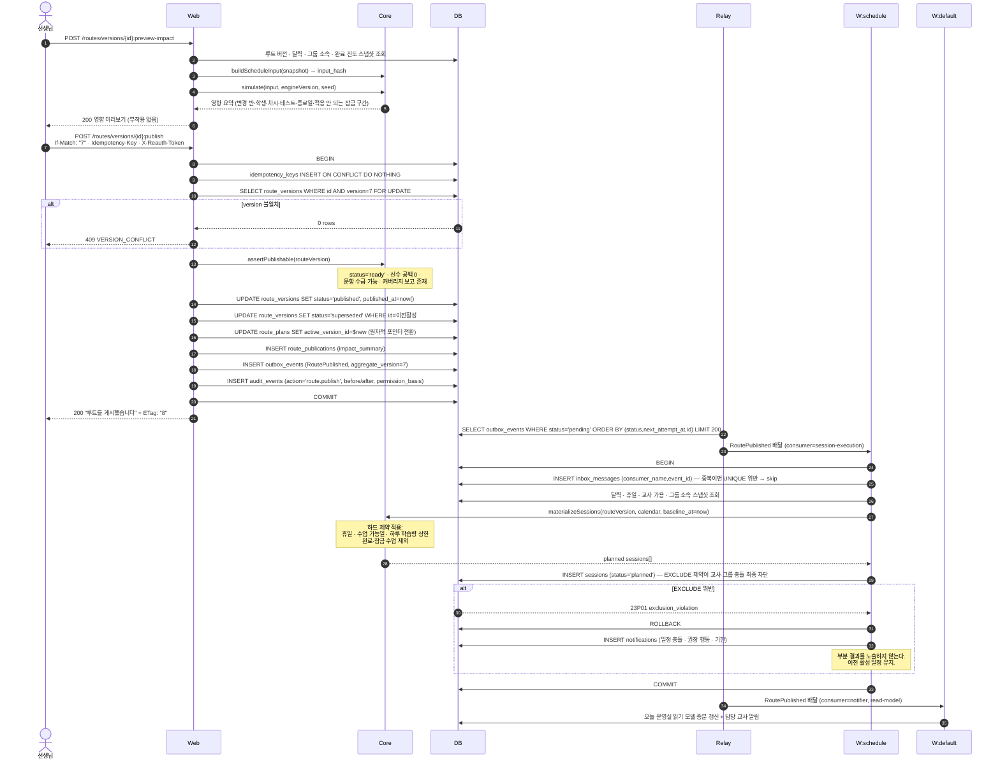
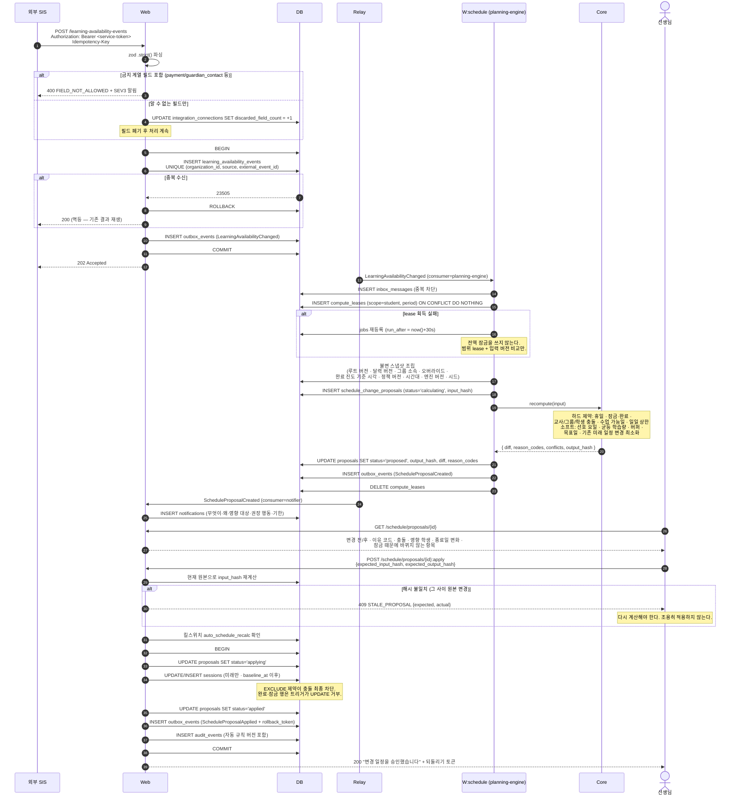
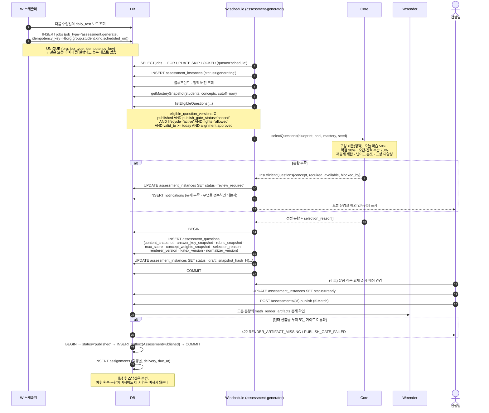
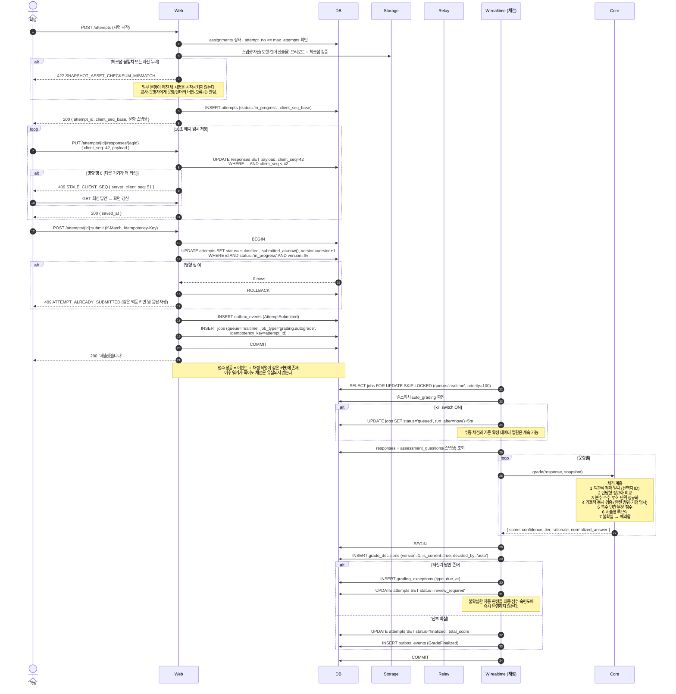
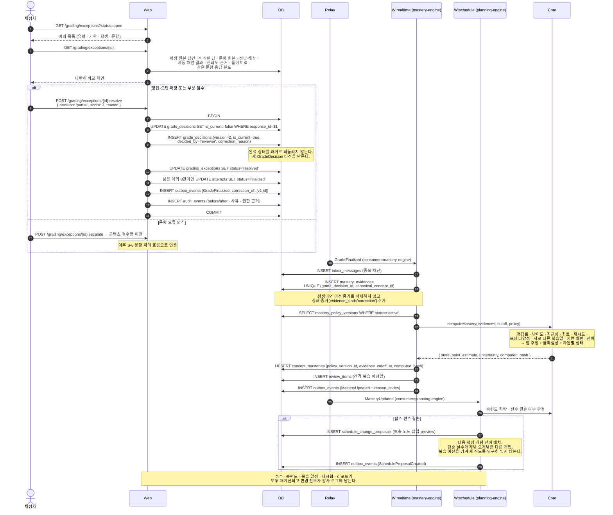
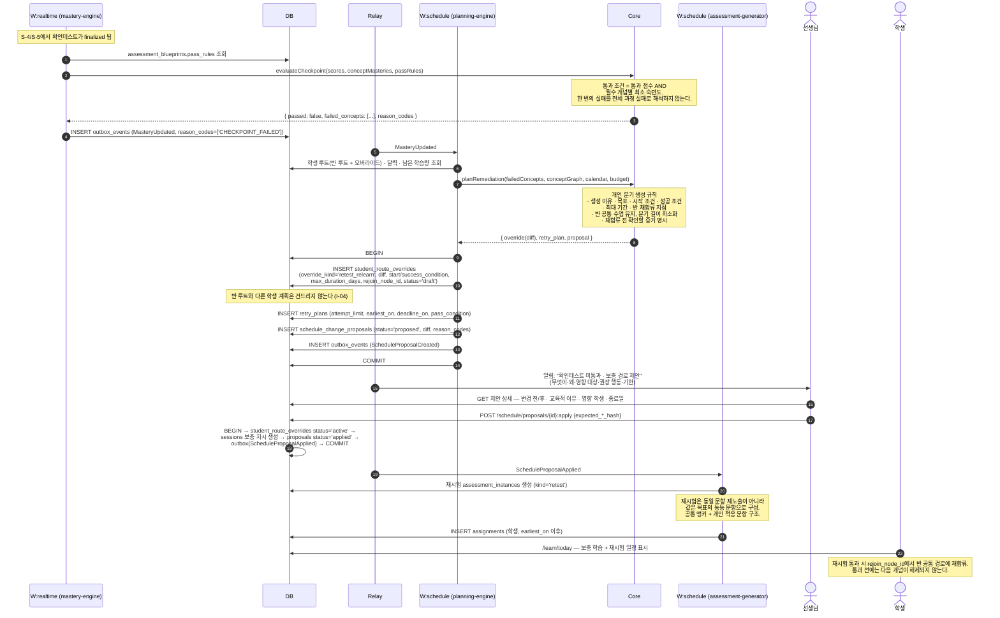
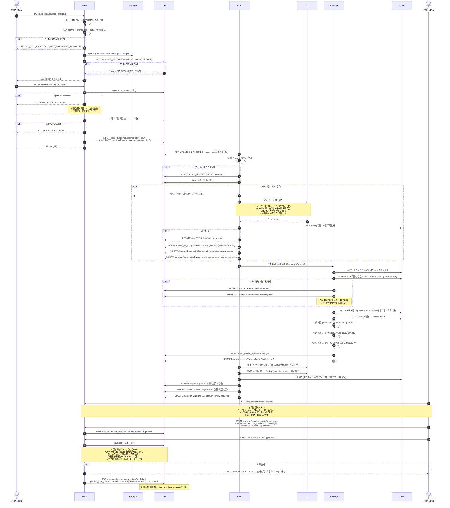
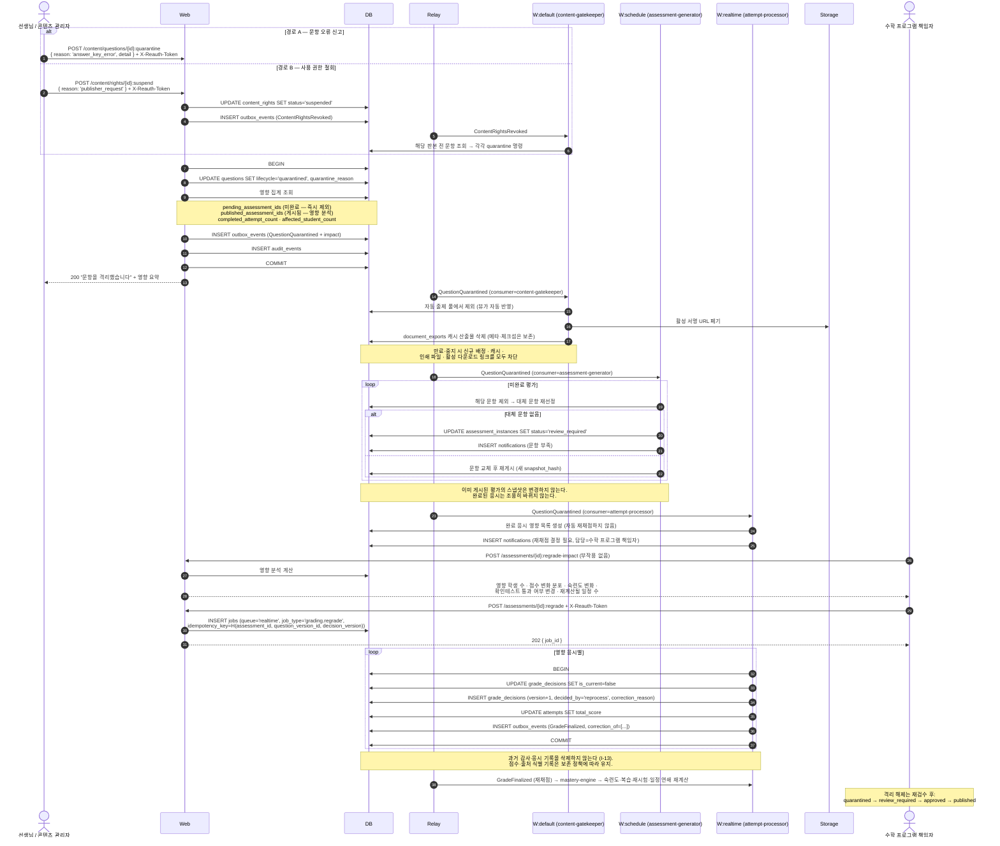

# 핵심 흐름 시퀀스 다이어그램

> 골프롬프트 2A(최소 시퀀스 다이어그램 대상 8종) 이행 문서.
> 관련: [api-contract.md](./api-contract.md) · [event-catalog.md](./event-catalog.md) · [state-machines.md](./state-machines.md)

## 참여자 표기

| 표기 | 실체 |
|---|---|
| `Web` | `apps/web` — Next.js Server Action 또는 Route Handler |
| `Core` | `packages/core` — 순수 도메인 (I/O 없음) |
| `DB` | PostgreSQL (Supabase). 트랜잭션 경계를 `BEGIN`/`COMMIT`으로 표기 |
| `Relay` | `apps/worker`의 Outbox 릴레이 |
| `W:<큐>` | `apps/worker`의 해당 큐 핸들러 |
| `Storage` | Supabase Storage |
| `AI` | AI·OCR 어댑터 (`mock` 또는 `anthropic`) |

---

## S-1. 반 루트 게시와 날짜별 수업 생성

**계약 요약**

| 보장 | 근거 |
|---|---|
| 게시 후 루트 내용 불변 | `route_versions` UPDATE 트리거 (I-02) |
| 활성 버전 전환은 원자적 | 같은 트랜잭션의 포인터 UPDATE |
| 완료·잠금 수업 미변경 | `baseline_at` + `is_locked` 필터 (I-05) |
| 충돌 최종 차단 | `EXCLUDE USING gist` (I-06) |
| 중복 게시 방지 | `Idempotency-Key` + `If-Match` |

---

## S-2. 학습 불참 이벤트 수신과 미래 일정 변경안 승인

---

## S-3. 일일테스트 생성과 배정

---

## S-4. 학생 답안 임시 저장·제출·자동 채점

---

## S-5. 저신뢰 답안의 사람 검수와 재계산

---

## S-6. 확인테스트 미통과와 보충 경로 생성

---

## S-7. `mathg-gen` 원본 업로드부터 문제은행 게시

---

## S-8. 문항 오류·권한 철회 후 격리와 영향 분석

---

## 시퀀스별 검증 대응표

각 시퀀스가 어떤 테스트로 지켜지는지.

| 시퀀스 | 통합 테스트 | 동시성 테스트 | 속성 테스트 |
|---|---|---|---|
| S-1 | 루트 게시 후 날짜별 수업 생성 | 두 교사 동시 게시 → 409 하나 | 잠금·완료 수업 불변 |
| S-2 | 불참 이벤트 후 미래 일정 제안 | 같은 외부 이벤트 10회 → 1건 | 하드 제약 위반 0 / stale preview apply 거부 |
| S-3 | 테스트 생성·배정 | 같은 (학생, 날짜, 유형) 동시 생성 → 1건 | 같은 시드·입력 → 같은 문항 집합 |
| S-4 | 응시·제출·채점 | 같은 답안 제출 10회 → 1회 반영 | 다중 기기 client_seq 단조성 |
| S-5 | 예외 해결 후 숙련도 재계산 | GradeFinalized 중복·역순 배달 | 숙련도 재현성 (computed_hash) |
| S-6 | 미통과 → 보충 경로 → 재합류 | — | 오버라이드가 반 루트·타 학생 불변 |
| S-7 | OCR → 정규화 → 게이트 → 게시 | 워커 중단·재시작 시 중복 산출물 0 | 정규화 멱등성·결정성 |
| S-8 | 격리 + 재채점 영향 분석 | 격리와 평가 게시 경합 | 과거 기록 행 수 불변 |
