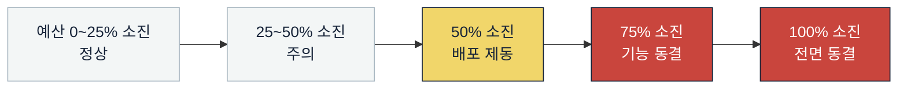

# SLI·SLO와 오류 예산

> 골프롬프트 28장(성능·신뢰성·관측성) 이행 문서.
> 관련: [assumptions.md](./assumptions.md) · [failure-modes.md](./failure-modes.md) · [../runbooks/README.md](../runbooks/README.md)

---

## 1. 측정 원칙

| # | 원칙 |
|---|---|
| 1 | **평균으로 측정하지 않는다.** p95·p99와 마감 성공률로 측정한다 |
| 2 | 사용자 입력 오류인 정상 4xx(400·403·404·409·412·413·415·422·428)는 가용성에서 **제외**한다. **429와 5xx는 포함**한다 |
| 3 | 자체 배포 실패와 **제품이 의존하기로 선택한** 외부 공급자 장애를 내부 품질 분석에서 숨기지 않는다. 고객 대상 SLA 계산에서만 별도 표기한다 |
| 4 | 외부 SLA는 실제 운영 능력보다 높게 약속하지 않는다. 현재 외부 SLA는 **약속하지 않음**(내부 SLO만 운영) |
| 5 | SLI는 **서버 관측**과 **합성 모니터링** 두 소스로 이중 측정한다. 두 값이 20% 이상 벌어지면 계측 자체를 의심한다 |
| 6 | 측정 창은 **롤링 30일**. 월초 리셋이 아니다 |

---

## 2. 출시 기준 내부 SLO

골프롬프트 28장 표 전체. `SLI` 열은 실제 계산식이다.

| # | 대상 | 목표 | SLI 정의 (측정 방법) |
|---|---|---|---|
| **O-01** | 교사용 핵심 API 월간 가용성 | **99.9% 이상** | `1 - (5xx + 429 응답 수) / (전체 응답 수 - 정상 4xx)`. 대상 경로: `/app/**`, `/api/v1/**` 중 교사 역할 접근분. 서버 접근 로그 + 5분 합성 모니터링 |
| **O-02** | 예정 시험 시간대의 시험 시작·답안 제출 | **99.95% 이상** | `성공한 (POST /attempts + POST /attempts/*:submit) / 전체 시도`. 측정 창 = `assessment_instances.opens_at ~ closes_at` 구간만. 재시도 성공은 성공으로 계산 |
| **O-03** | 50명·미래 일정 1,000건 이하 반 재계산 | **95% 60초, 99% 5분 이내** | `schedule_change_proposals`의 `calculating → proposed` 경과 시간. 대상 필터: 학생 ≤ 50 AND 대상 일정 ≤ 1,000 |
| **O-04** | 30문항 이하 자동 테스트 생성 | **95% 2분, 99% 10분 이내** | `jobs(job_type='assessment.generate')`의 `queued → succeeded` 경과 시간(대기 포함). 문항 수 ≤ 30 |
| **O-05** | 100페이지 이하 OCR 초벌 처리 | **95% 20분 이내** (사람 검수 제외) | `jobs(job_type='content.ingest')`의 `queued → waiting_review\|succeeded` 경과 시간. 페이지 ≤ 100 |
| **O-06** | 게시 전 30문항 KaTeX 검증 | **95% 5초, 99% 15초 이내** | `math.validate` 작업의 실행 시간(대기 제외). 문항 ≤ 30 |
| **O-07** | 30문항 시험 PDF·HWPX 출력 | **95% 2분, 99% 10분 이내** | `document_exports`의 `queued → ready` 경과 시간. 형식별로 각각 측정 |
| **O-08** | 접수 완료 비동기 작업 유실 | **0건** | `202` 응답 수 대비 `jobs` 행 수 일치 검증(일 배치). 불일치 1건이면 SEV1 |
| **O-09** | 객관식·정규화 가능 단답형 자동 채점 정확도 | **골드셋 99.99% 이상** | 골드 데이터셋(고정 1만 건) 회귀 실행 결과. 모델·정규화기·정책 변경 시마다 |
| **O-10** | 저신뢰 문항 자동 게시 | **0건** | `question_versions`에서 `status='published' AND publish_gate_status <> 'passed'`인 행 수(일 배치) |
| **O-11** | 게시 콘텐츠의 원시 LaTeX·`katex-error`·필수 수식 누락 | **0건** | 게시된 `assessment_questions`의 렌더 산출물 DOM 검사 + 골든 코퍼스 회귀 |
| **O-12** | 공식 성취기준의 권위 소스 역추적 누락 | **0건** | 활성 릴리스의 `achievement_standards`·`official_curriculum_nodes` 중 `source_id IS NULL OR checksum IS NULL` 행 수 |
| **O-13** | 심각도 1 장애 탐지 | **5분 이내** | 장애 시작 시각(사후 분석 확정) → 최초 알림 발화 시각. 사후 분석에서 측정 |

### 2.1 추가 지연 SLO (골프롬프트 28장 "내부 앱 성능" + 2J)

| # | 대상 | p95 | p99 | SLI |
|---|---|---|---|---|
| L-01 | 오늘 운영실·반 대시보드 | 1.5 s | 3.0 s | 서버 처리 시간(TTFB 기준). 읽기 모델 조회 포함 |
| L-02 | 답안 제출 접수 | 1.0 s | 2.5 s | `POST /attempts/*:submit` 서버 처리 시간 |
| L-03 | 일반 동기 조회 | 400 ms | 900 ms | GET `/api/v1/**` 서버 처리 시간 |
| L-04 | 동기 명령(쓰기) | 800 ms | 1,800 ms | POST·PATCH `/api/v1/**` 서버 처리 시간 |
| L-05 | 답안 임시 저장 | 300 ms | 700 ms | `PUT /attempts/*/responses/*` |

### 2.2 공개 페이지 SLO

| # | 대상 | 목표 | SLI |
|---|---|---|---|
| W-01 | LCP | ≤ 2.5 s (p75) | 실사용자 측정(RUM) + Lighthouse CI |
| W-02 | CLS | ≤ 0.1 (p75) | 동일 |
| W-03 | INP | ≤ 200 ms (p75) | 동일 |
| W-04 | JS 실패 시 핵심 콘텐츠 판독 | 100% | E2E: JS 비활성 상태에서 히어로·문제 인식·운영 흐름 텍스트 렌더 확인 |

자동 재생 비디오 대신 SVG·CSS를 쓰고, 한글 폰트를 서브셋한다.

### 2.3 최종 일관성 반영 시간 (골프롬프트 2D)

| 대상 | 목표 | SLI |
|---|---|---|
| 일반 운영 집계 (오늘 운영실) | 30초 이내 | `outbox_events.occurred_at` → 읽기 모델 `updated_at` 경과 시간 p95 |
| 학습 결과 기반 추천 (숙련도·복습) | 60초 이내 | `GradeFinalized.occurred_at` → `concept_masteries.computed_at` 경과 시간 p95 |
| 검색 인덱스 | 30초 이내 | 동일 방식 |
| 알림 | 30초 이내 | 동일 방식 |

**파생 데이터가 확정 원본보다 먼저 노출되어서는 안 된다.** 읽기 모델 `updated_at`이 원본보다 이르면 원본을 직접 조회한다(구조적 보장, SLO 위반이 아님).

---

## 3. 오류 예산

### 3.1 계산

| 대상 | 목표 | 30일 오류 예산 |
|---|---|---|
| O-01 교사용 핵심 API | 99.9% | 30일 × 24h × 60m × 0.001 = **43분 12초** ≈ 43분 50초(31일 기준) |
| O-02 시험 시간대 | 99.95% | 시험 시간대 총 노출 시간 × 0.0005. 월 시험 노출 200시간 가정 시 **6분 0초** |
| O-03~O-07 지연 SLO | 95%/99% | 요청 수 기준. 예: O-04 월 50만 건 → 99% 예산 = **5,000건 초과 허용** |
| O-08~O-12 무결성 SLO | 0건 | **예산 없음.** 1건이면 즉시 SEV1·SEV2 |

> 골프롬프트가 명시한 "99.9% 월간 SLO의 약 43분 50초"는 31일 기준값이다. 수맥은 **롤링 30일 기준 43분 12초**를 추적하고, 월간 리포트에는 해당 월 일수 기준값을 병기한다.

### 3.2 소진 정책



| 소진율 | 조치 | 해제 조건 |
|---|---|---|
| ~25% | 없음 | — |
| 25~50% | 주간 리뷰에 원인 항목 보고 | — |
| **50%** | **위험한 기능 배포 중단.** 신뢰성 작업 우선. 배포 가능 항목: 버그 수정·관측성·롤백 | 롤링 30일 소진율 < 40% |
| **75%** | 기능 배포 전면 동결. 신뢰성 작업만. kill switch 점검 | 소진율 < 50% |
| **100%** | 전면 동결 + 사후 분석 필수 + 다음 스프린트 신뢰성 전용 | 소진율 < 50% + 재발 방지 항목 완료 |

"위험한 기능 배포"의 정의: 일정 엔진·채점·숙련도·게시 게이트·마이그레이션·인증·RLS를 건드리는 변경.

### 3.3 예산 소진 알림

| 조건 | 심각도 | 대상 |
|---|---|---|
| 1시간 창에서 예산의 5% 소진 (급속 소진) | SEV2 | 인시던트 지휘자 |
| 6시간 창에서 예산의 10% 소진 | SEV2 | 동일 |
| 누적 50% 도달 | SEV3 | 팀 전체 |
| 누적 75% 도달 | SEV2 | 팀 전체 + 배포 게이트 자동 활성 |
| 누적 100% 도달 | SEV2 | 동일 |

---

## 4. SLI 계측 구현

### 4.1 API SLI

```ts
// apps/web 공통 계측 (미들웨어 아님 — 라우트 핸들러 래퍼)
recordApiMetric({
  route: '/api/v1/attempts/:id:submit',   // 파라미터는 패턴으로 (카디널리티 억제)
  method: 'POST',
  status: 200,
  duration_ms: 412,
  outcome: 'success',                     // success | client_error | server_error | rate_limited
  slo_class: 'exam_window',               // core_api | exam_window | query | command | none
});
```

메트릭 이름과 레이블:

| 메트릭 | 타입 | 레이블 |
|---|---|---|
| `sumaek_api_requests_total` | counter | `route`, `method`, `outcome`, `slo_class` |
| `sumaek_api_duration_seconds` | histogram | `route`, `method`, `slo_class` |
| `sumaek_job_duration_seconds` | histogram | `queue`, `job_type`, `outcome` |
| `sumaek_job_wait_seconds` | histogram | `queue`, `job_type` |
| `sumaek_queue_depth` | gauge | `queue`, `status` |
| `sumaek_queue_oldest_wait_seconds` | gauge | `queue` |
| `sumaek_outbox_pending_age_seconds` | gauge | — |
| `sumaek_event_lag_seconds` | histogram | `event_type`, `consumer_name` |
| `sumaek_render_validation_total` | counter | `target`, `renderer_version`, `validation_status` |
| `sumaek_formula_parse_failures_total` | counter | `normalizer_version`, `katex_version`, `trigger` |
| `sumaek_ai_calls_total` | counter | `provider`, `model_version`, `step`, `outcome` |
| `sumaek_ai_cost_cents_total` | counter | `provider`, `step` |
| `sumaek_grading_confidence` | histogram | `grading_tier` |
| `sumaek_error_budget_burn_ratio` | gauge | `slo_id` |

**레이블 금지**: `organization_id`, `student_id`, `user_id`, 수식 원문, 문항 ID. 고카디널리티 + 개인정보. 조직별 분석이 필요하면 로그·DB 쿼리로 한다.

### 4.2 합성 모니터링 (5분 주기)

| # | 시나리오 | 검증 |
|---|---|---|
| SYN-1 | 시험 제출 왕복 | 합성 조직에서 응시 시작 → 답안 3건 저장 → 제출 → 채점 완료까지. 목표 60초 |
| SYN-2 | 일정 재계산 | preview 생성 → apply → 활성 일정 전환. 목표 120초 |
| SYN-3 | OCR 파이프라인 | 1페이지 픽스처 반입 → `waiting_review` 도달. 목표 300초 |
| SYN-4 | 로그인 → 오늘 운영실 | 세션 생성 → `/app/today` 렌더. 목표 5초 |
| SYN-5 | 공개 랜딩 | `/` LCP 측정 | 

합성 결과는 서버 관측 SLI와 **별도 시계열**로 저장한다. SEV1 탐지 5분(O-13)의 주 수단이다.

### 4.3 무결성 SLI (일 배치)

`packages/db/src/checks/invariants.sql`의 20개 불변 조건 쿼리를 매일 04:00 KST에 실행한다. 각 쿼리 결과 행 수를 `sumaek_invariant_violations` gauge로 노출한다.

| 불변 조건 | 위반 시 심각도 |
|---|---|
| I-01 (테넌트 격리), I-15 (감사 불변) | **SEV1** |
| I-02, I-08, I-09, I-10, I-13, I-18, I-19 | **SEV1** |
| I-05, I-06, I-07, I-11, I-12, I-16, I-17, I-20 | SEV2 |
| I-03, I-04, I-14 | SEV2 |

---

## 5. 알림 설계

**단순 CPU가 아니라 사용자 영향으로 알림을 건다.**

| 알림 | 조건 | 심각도 | 런북 |
|---|---|---|---|
| `exam_submit_failure_spike` | 시험 시간대 제출 실패율 > 0.05% (5분 창, 최소 100건) | SEV1 | [RB-01](../runbooks/01-exam-start-submit-failure.md) |
| `exam_start_failure_spike` | 시험 시작 실패율 > 0.05% (5분 창) | SEV1 | RB-01 |
| `submit_latency_breach` | 제출 p95 > 1s (10분 창) | SEV2 | RB-01 |
| `grading_deadline_violation` | 제출 후 30분 경과 미채점 응시 > 50건 | SEV2 | [RB-12](../runbooks/12-wrong-autograding-reprocess.md) |
| `queue_wait_exceeded` | 큐 최고 대기 > 600s (`realtime`은 60s) | SEV2 | [RB-04](../runbooks/04-queue-backlog-dlq.md) |
| `outbox_backlog` | `outbox_pending_age` > 300s | SEV2 | RB-04 |
| `dlq_growth` | DLQ 신규 > 20건/시간 | SEV3 | RB-04 |
| `schedule_recalc_failure` | 재계산 실패율 > 5% (1시간 창) | SEV2 | [RB-02](../runbooks/02-mass-wrong-schedule.md) |
| `mass_schedule_change` | 1시간 내 `sessions` 변경 > 5,000건 | SEV1 | RB-02 |
| `ai_provider_error_rate` | 공급자 5xx·타임아웃 > 20% (10분 창) | SEV2 | [RB-03](../runbooks/03-ai-ocr-outage-cost.md) |
| `ai_budget_burn` | 조직 일 예산 80% 도달 | SEV3 | RB-03 |
| | 전체 일 예산 80% 도달 | SEV2 | RB-03 |
| `db_connection_saturation` | 커넥션 사용률 > 85% (5분 창) | SEV2 | [RB-05](../runbooks/05-db-failure-pitr.md) |
| `db_replication_lag` | 복제 지연 > 30s | SEV2 | RB-05 |
| `cross_tenant_suspicion` | RLS 위반 예외 발생 또는 불변 I-01 위반 > 0 | **SEV1** | [RB-06](../runbooks/06-cross-tenant-exposure.md) |
| `auth_anomaly` | 동일 계정 5개 이상 지역 로그인 (1시간) 또는 MFA 우회 시도 | SEV1 | [RB-07](../runbooks/07-account-takeover-malicious-upload.md) |
| `malicious_upload` | `source_files.status='quarantined'` 신규 > 0 | SEV3 | RB-07 |
| `rights_expiry_impact` | `ContentRightsRevoked`로 영향받는 미완료 평가 > 0 | SEV2 | [RB-08](../runbooks/08-content-rights-emergency-stop.md) |
| `curriculum_gate_failure` | 릴리스 품질 게이트 실패 또는 I-16·I-17 위반 | SEV2 | [RB-09](../runbooks/09-curriculum-mapping-rollback.md) |
| `formula_broken_in_student_view` | 게시 콘텐츠에서 `katex-error`·원시 LaTeX 탐지 > 0 | **SEV1** | [RB-10](../runbooks/10-formula-render-rollback.md) |
| `render_regression` | 골든 회귀 실패 > 0 (렌더러 승격 중) | SEV2 | RB-10 |
| `export_failure_rate` | 문서 출력 실패율 > 10% (1시간 창) | SEV3 | [RB-11](../runbooks/11-document-export-failure.md) |
| `autograde_accuracy_drop` | 골드셋 정확도 < 99.99% | **SEV1** | RB-12 |
| `grading_exception_rate` | 자동 채점 예외율 > 15% (1시간 창) | SEV3 | RB-12 |
| `notification_provider_down` | 알림 발송 실패율 > 30% (15분 창) | SEV3 | [RB-13](../runbooks/13-notification-provider-outage.md) |
| `deploy_slo_breach` | 배포 후 15분 내 SLO 위반 또는 불변 위반 | SEV1 | [RB-14](../runbooks/14-deploy-migration-rollback.md) |
| `error_budget_burn_fast` | 1시간 창에서 예산 5% 소진 | SEV2 | — |
| `invariant_violation` | 일 배치 불변 조건 위반 > 0 | I별 (4.3 표) | 해당 런북 |

**알림 피로 방지**: 같은 조건의 재발화는 30분 억제. 상위 심각도 알림이 발화하면 하위 알림은 자동 그룹화. 알림 5분 미확인 시 자동 에스컬레이션.

---

## 6. 관측성 신호 목록

골프롬프트 28장 "관측성" 항목의 구현 대응.

| 요구 | 구현 |
|---|---|
| 구조화 로그 | JSON. 필수 필드: `trace_id`, `correlation_id`, `causation_id`, `organization_id`, `route`, `outcome`, `duration_ms` |
| 메트릭 | 4.1 표 |
| 분산 트레이스 | web 요청 → DB 트랜잭션 → Outbox → worker 핸들러. `correlation_id`로 연결 |
| 상관관계·인과관계 ID | `correlation_id`(최초 요청 고정), `causation_id`(직전 이벤트) |
| API RED | `sumaek_api_requests_total`(Rate·Errors), `sumaek_api_duration_seconds`(Duration) |
| 인프라 USE | CPU·메모리·디스크 사용률, 큐 포화도, 오류 수 |
| 큐 깊이·최고 대기 | `sumaek_queue_depth`, `sumaek_queue_oldest_wait_seconds` |
| 단계별 처리량·성공·재시도·DLQ | `job_runs` 기반 집계 |
| 제출·채점 지연 | L-02, `grading_deadline_violation` |
| DB 연결·잠금·복제 지연 | `pg_stat_activity`, `pg_locks`, `pg_stat_replication` 스크레이프 |
| 저장소 오류 | Storage 5xx·체크섬 불일치 카운터 |
| AI 모델별 정확도·신뢰도·검수 전환·수정률 | `job_runs.model_version` 별 집계 + `content_reviews.decision` 분포 |
| 페이지·문항당 비용, 공급자 429·5xx·타임아웃 | `sumaek_ai_cost_cents_total`, `sumaek_ai_calls_total{outcome}` |
| 테스트 생성 실패·문항 부족 | `assessment_instances.status='review_required'` 사유별 카운터 |
| 일정 재계산 실패·승인·거절 | `schedule_change_proposals.status` 분포 |
| 콘텐츠 품질 신고·격리 | `questions.lifecycle` 전이 카운터 |
| 교육과정 매핑 신뢰도·검수 전환·릴리스 실패 | `curriculum_mappings.confidence` 분포, 게이트 실패 카운터 |
| KaTeX 파싱·자동 보정·미지원 명령·수식 검수 전환 | `sumaek_formula_parse_failures_total`, 규칙별 보정 카운터, 미지원 명령 상위 목록 |
| 웹·PDF·HWP 렌더 불일치·클리핑 | `sumaek_render_validation_total{validation_status='failed'}` + `checks` 세부 카운터 |

**로그·트레이스 금지 항목**: 학생 이름·연락처, 원문 답안, 전체 문제집 페이지, 토큰, 비밀. **메트릭 레이블 금지**: 학생 ID 등 고카디널리티 개인정보.

**애플리케이션 관측 로그와 변경 감사 로그를 분리한다.** 감사는 `audit_events` 테이블(불변)이며, 행위자·대상·변경 전후·사유·시각·권한 근거를 남긴다.

---

## 7. 대시보드

| 대시보드 | 대상 | 패널 |
|---|---|---|
| **SLO 개요** | 전원 | O-01~O-13 현재값, 오류 예산 소진율, 30일 추이 |
| **시험 시간대** | 온콜 | 진행 중 시험 수, 동시 응시자, 제출 RPS, 제출 p95/p99, 실패율, 채점 지연 |
| **큐·워커** | 온콜 | 큐별 깊이·최고 대기·처리량, DLQ 건수, 워커 상태, 조직별 점유율 |
| **콘텐츠 파이프라인** | 콘텐츠팀 | 단계별 처리량, 검수 전환율, 미지원 명령 상위 10, 렌더 불일치율, AI 비용·토큰 |
| **일정 엔진** | 도메인 소유자 | 재계산 시간 분포, 승인·거절률, 충돌 발생률, 결정론 검증 실패 |
| **무결성** | 전원 | 20개 불변 조건 위반 수(일 배치), O-08~O-12 |
| **보안** | 보안 담당 | 인증 실패율, RLS 예외, break-glass 활성, 격리 업로드, 교차 테넌트 테스트 결과 |

---

## 8. SLO 리뷰

| 주기 | 내용 |
|---|---|
| 주간 | 오류 예산 소진율, 알림 발화 상위 5, 억제된 알림, 미해결 사후 분석 항목 |
| 월간 | O-01~O-13 달성 여부, SLO 목표 적정성(너무 쉽거나 어려운가), 계측 신뢰도(서버 vs 합성 편차) |
| 분기 | SLO 목표 재조정 여부 결정. 변경 시 이 문서와 [assumptions.md](./assumptions.md) 동시 갱신 |

**SLO를 낮추는 결정은 반드시 근거와 함께 기록한다.** "달성하기 어려워서"는 근거가 아니다. 사용자 영향 데이터가 근거다.

---

## 9. 부하시험 통과 조건 (골프롬프트 29장)

초기 설계 용량과 **예상 최대의 2배**에서 검증한다.

| 시나리오 | 목표 |
|---|---|
| 교사 1,000명이 5분 안에 오늘 운영실 진입 | L-01 유지 |
| 학생 20,000명이 10분 안에 시험 시작 | O-02 유지, 시작 RPS 33.3 |
| 초당 200건 이상 답안 제출 | 설계 수용 1,000 RPS, 시험 2,000 RPS ([assumptions.md](./assumptions.md) 3.1) |
| 일정 재계산 5,000건 동시 대기 | O-03 유지 |
| 시간당 10,000페이지 OCR + 실시간 채점 동시 | `realtime` 큐가 `ai` 큐에 고갈되지 않음 |
| 한 대형 테넌트의 AI 대량 사용 | 타 조직 SLO 무영향 |

**통과 조건**: 제출 유실 0건 · 교차 테넌트 노출 0건 · 핵심 API 오류율 < 1% · p95·p99 SLO 충족 · 실시간 응시·채점이 대량 OCR에 고갈되지 않음 · 공정 큐와 테넌트 한도 작동.

부하시험 환경은 운영의 1/10 규모(스테이징)이며, 결과는 선형 외삽 + 보정 계수 1.3을 적용한다([assumptions.md](./assumptions.md) Q-12).
