# 상태 머신과 불변 조건

> 골프롬프트 2F(상태 머신 11종) · 2E(시스템 불변 조건 20개) 이행 문서.
> 관련: [erd.md](./erd.md) · [api-contract.md](./api-contract.md) · [event-catalog.md](./event-catalog.md)

---

## 0. 전이 검증 규약

**허용되지 않은 상태 전이는 API와 데이터베이스 양쪽에서 거부한다.** 한쪽만 있으면 우회 가능하다(eywa 실사고 1: 화면에서만 잠근 결과 PostgREST 직결로 우회).

3계층 방어:

| 계층 | 구현 | 실패 시 |
|---|---|---|
| 1. 애플리케이션 | `packages/core/src/shared/state-machine.ts`의 `transition(machine, from, to, guards)` — 전이표는 코드 상수 | `IllegalTransitionError` → HTTP 409 `ILLEGAL_STATE_TRANSITION` |
| 2. DB 트리거 | 테이블별 `BEFORE UPDATE` 트리거가 `(OLD.status, NEW.status)` 쌍을 전이표 테이블 `state_transitions`와 대조 | `RAISE EXCEPTION 'illegal transition %→% on %'` |
| 3. 모델 기반 테스트 | `fast-check` 상태 머신 모델로 무작위 전이 시퀀스를 생성해 불법 전이가 통과하지 않음을 검증 | CI 실패 |

전이표 테이블(플랫폼 공용, 테넌트 없음):

```sql
CREATE TABLE state_transitions (
  machine     text NOT NULL,
  from_state  text NOT NULL,
  to_state    text NOT NULL,
  guard_code  text,              -- 애플리케이션이 확인해야 하는 추가 조건 코드
  PRIMARY KEY (machine, from_state, to_state)
);
```

트리거는 `state_transitions`에 행이 없으면 거부한다. 새 전이를 추가하려면 마이그레이션 + 전이표 INSERT + 전이표 스냅샷 테스트 갱신이 함께 필요하다.

---

## 1. 루트 (`route_versions.status`)

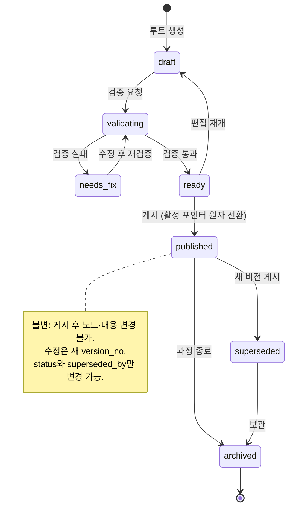

| 전이 | 가드 | 부수 효과 |
|---|---|---|
| `draft→validating` | 편집 권한, `route_nodes` 1건 이상 | 검증 작업 `schedule` 큐 등록 |
| `validating→ready` | 선수 공백 0, 커버리지 보고 생성, 문항 수급 가능 | `validation_report`·`simulation_report` 저장 |
| `validating→needs_fix` | 하드 제약 위반 1건 이상 | 위반 목록 저장 |
| `ready→published` | `route.publish` 권한 + 재확인, 영향 미리보기 확인 | 같은 TX에서 `route_plans.active_version_id` 전환, 이전 버전 `superseded`, `RoutePublished` 발행, `audit_events` 기록 |
| `published→superseded` | 새 버전 게시 트랜잭션 내부에서만 | — |

**금지 전이**: `published→draft`, `published→ready`, `archived→*`(archived는 종단), `superseded→published`.

---

## 2. 일정 변경안 (`schedule_change_proposals.status`)

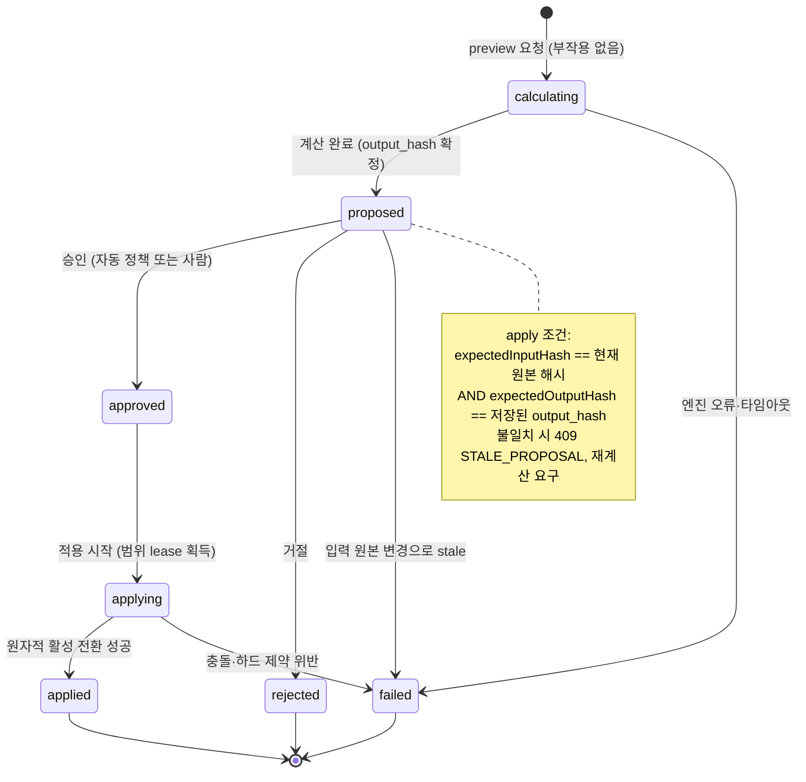

| 전이 | 가드 | 부수 효과 |
|---|---|---|
| `→calculating` | 계산 범위 lease 획득 (`learning_group` 또는 `student` 단위) | 작업 등록 |
| `calculating→proposed` | 하드 제약 위반 0 | `input_hash`·`output_hash`·`diff`·`reason_codes`·`conflicts` 저장, `ScheduleProposalCreated` 발행 |
| `proposed→approved` | 정책이 `auto`면 시스템, `approve_required`면 `schedule.approve` 권한 | `audit_events` |
| `approved→applying` | 자동 재계산 kill switch OFF | 범위 lease 재획득 |
| `applying→applied` | 입력 해시 재검증 통과 | ②에 수업 확정 명령, 활성 일정 리비전 포인터 원자 전환, `ScheduleProposalApplied` 발행 |
| `applying→failed` | 충돌 발생 | **이전 활성 일정 유지**, 부분 결과 비노출, 원인·영향·재시도 정보 제공 |

**실패한 중간 결과는 사용자에게 노출하지 않는다.** `applying` 상태의 계산 결과는 `applied` 전까지 조회 API에서 제외한다.

---

## 3. 실제 수업 (`sessions.status`)

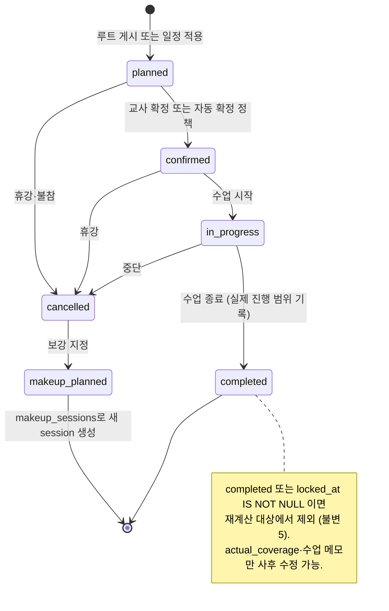

| 전이 | 가드 | 부수 효과 |
|---|---|---|
| `planned→confirmed` | 교사·그룹·학생 시간 충돌 0 (EXCLUDE 제약) | — |
| `confirmed→in_progress` | 수업 시작 시각 ±90분 이내 또는 명시 override | 수업 진행 모드 진입 |
| `in_progress→completed` | 실제 진행 범위 입력 | `progress_events` 기록, `SessionCompleted` 발행, 다음 일정 변경 preview 생성 |
| `*→cancelled` | 취소 사유 필수 | `LearningAvailabilityChanged` 또는 휴강 이벤트 |
| `cancelled→makeup_planned` | 보강 가능일 존재 | `makeup_sessions` 생성 + 새 `sessions` 행 `planned` |

**금지 전이**: `completed→*`(종단), `cancelled→confirmed`, `in_progress→planned`.

---

## 4. 콘텐츠 반입 (`source_files.status` / `question_versions.status`)

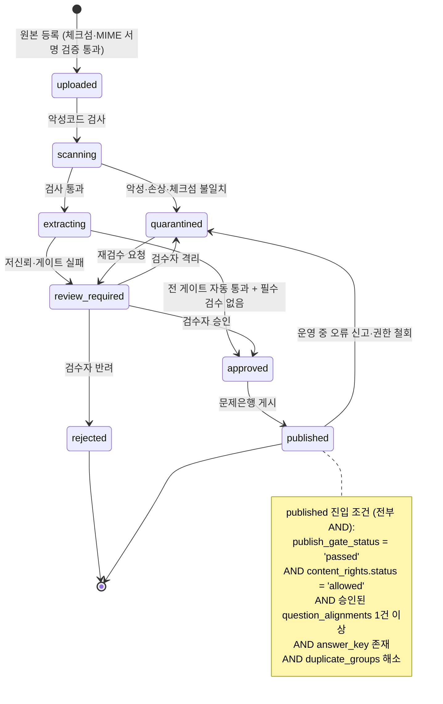

| 전이 | 가드 | 부수 효과 |
|---|---|---|
| `uploaded→scanning` | 파일 크기·페이지 수·해상도·압축률 한도 통과 | |
| `scanning→quarantined` | 악성코드 탐지 또는 `sha256` 불일치 | 샌드박스 격리, 재시도 금지, 운영 알림 |
| `extracting→review_required` | 게이트 실패 또는 OCR 신뢰도 < 0.85 | `content_reviews` 생성, `FormulaReviewRequired` 발행(수식 사유일 때) |
| `approved→published` | 위 노트 조건 전부 | `ContentApproved` 발행, 자동 출제 풀 진입 |
| `published→quarantined` | 오류 신고 또는 `ContentRightsRevoked` | `QuestionQuarantined` 발행. **미완료 배정에서 제외, 완료 응시는 영향 분석 제공. 과거 감사·응시 기록은 삭제하지 않는다** |

---

## 5. 교육과정 릴리스 (`curriculum_releases.status`)

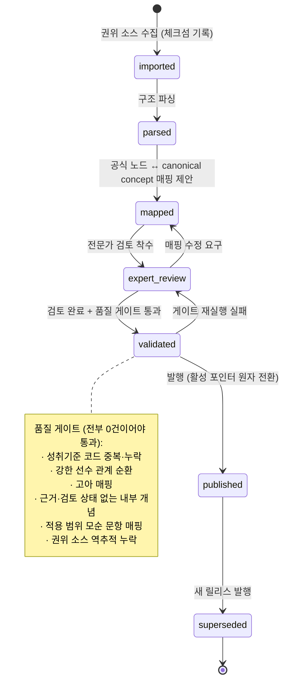

| 전이 | 가드 | 부수 효과 |
|---|---|---|
| `imported→parsed` | 소스 `review_status='verified'` | |
| `mapped→expert_review` | AI 제안 매핑은 `origin='ai_suggested'`로 표시됨 | 표본 검토 대상 추출 |
| `expert_review→validated` | 품질 게이트 6종 전부 0건, 시험 공간 검증 통과 | `quality_gate_report` 저장 |
| `validated→published` | `curriculum.publish` 권한 + 재확인, kill switch `curriculum_release_publish` OFF | 활성 포인터 전환, `CurriculumReleasePublished` 발행, **영향 분석 생성(활성 루트·평가는 자동 재매핑하지 않음)** |

**권위 소스 접근 불가 시**: `imported` 진입만 차단된다. 이미 `published`인 릴리스는 읽기 전용으로 계속 사용된다.

---

## 6. 수식 검수 (`math_expressions.review_status` + 파이프라인 단계)

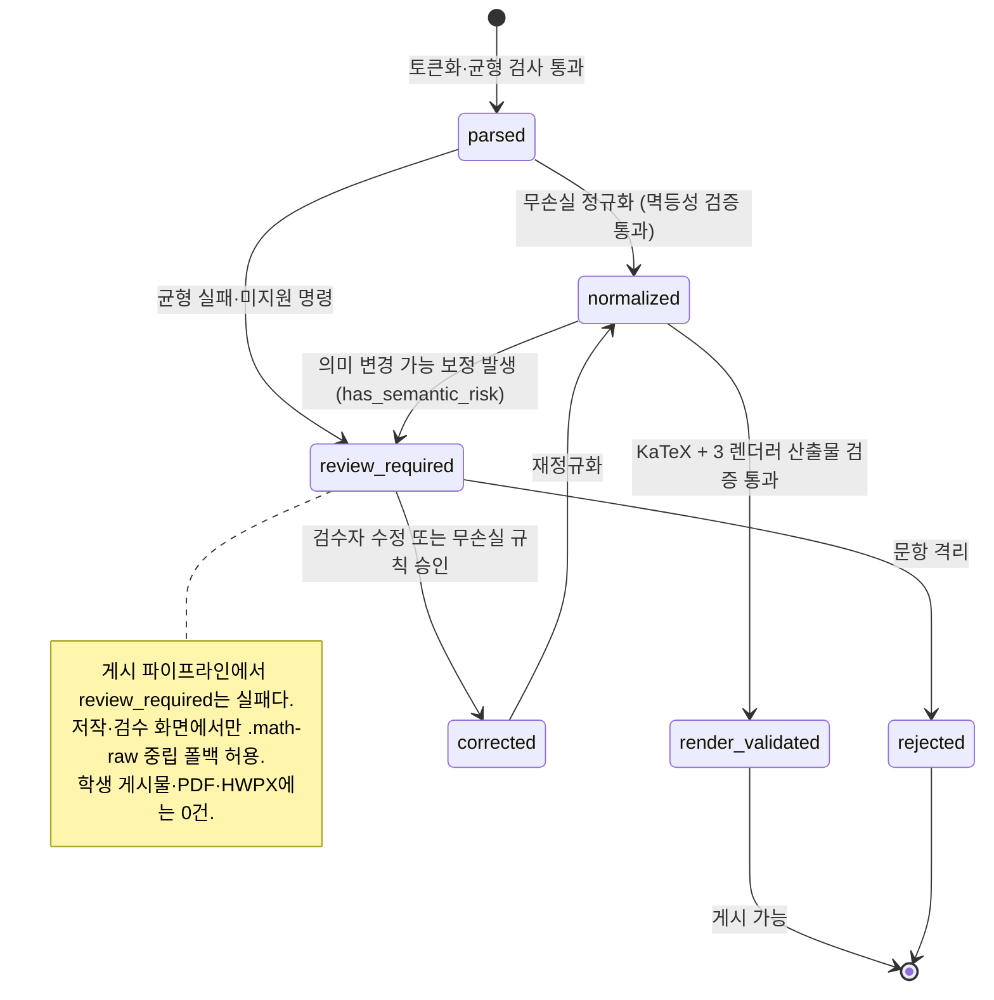

| 전이 | 가드 |
|---|---|
| `parsed→normalized` | `normalize(normalize(x)) = normalize(x)` 검증 통과 + `has_semantic_risk = false` |
| `normalized→render_validated` | `math_render_artifacts`가 `web`·`pdf`·`hwpx` 3건 모두 `validation_status='passed'` + 세 산출물의 `semantic_fingerprint` 동일 |
| `review_required→corrected` | `formula_reviews.resolution` 기록 + 검수자 |
| `corrected→normalized` | 재정규화 실행 |

**자동 보정 분류** (골프롬프트 2O):

| 자동 허용 (무손실) | 사람 검토 필수 (의미 변경 가능) |
|---|---|
| JSON 백슬래시 손상 복구 | 빈 분모·지수·근호 내용 채우기 |
| 승인 유니코드 기호 정규화 (`−`, `×`, `÷`, `≤`, `≥`, `≠`, `℃`) | 괄호·절댓값·집합 기호 짝 추측 추가 |
| 구분자 표준화 (`$`, `$$`, `\(`, `\[`) | `-`·`±`·부등호 방향·정의역 변경 |
| 겹친 동일 구분자·고립 크기 명령 정리 | 분수 구조 vs 나눗셈 문자열 판별 |
| 유니코드 위첨자 → 명시 지수 구조 | `1/l/I`, `0/O`, `x/×` 문자 교체 |
| 선택지 동그라미 문자 변환 | 로그 밑·극한 방향·적분 구간·행렬 원소 추정 |
| 단위·기하 점 라벨 직립체 | 한글 문장을 `\text{}` 안팎으로 이동 |
| 공백·줄바꿈·표시 크기 표준화 | |

`repair_actions`에 규칙 ID + 전후 diff를 항상 남긴다.

---

## 7. 문서 출력 (`document_exports.status`)

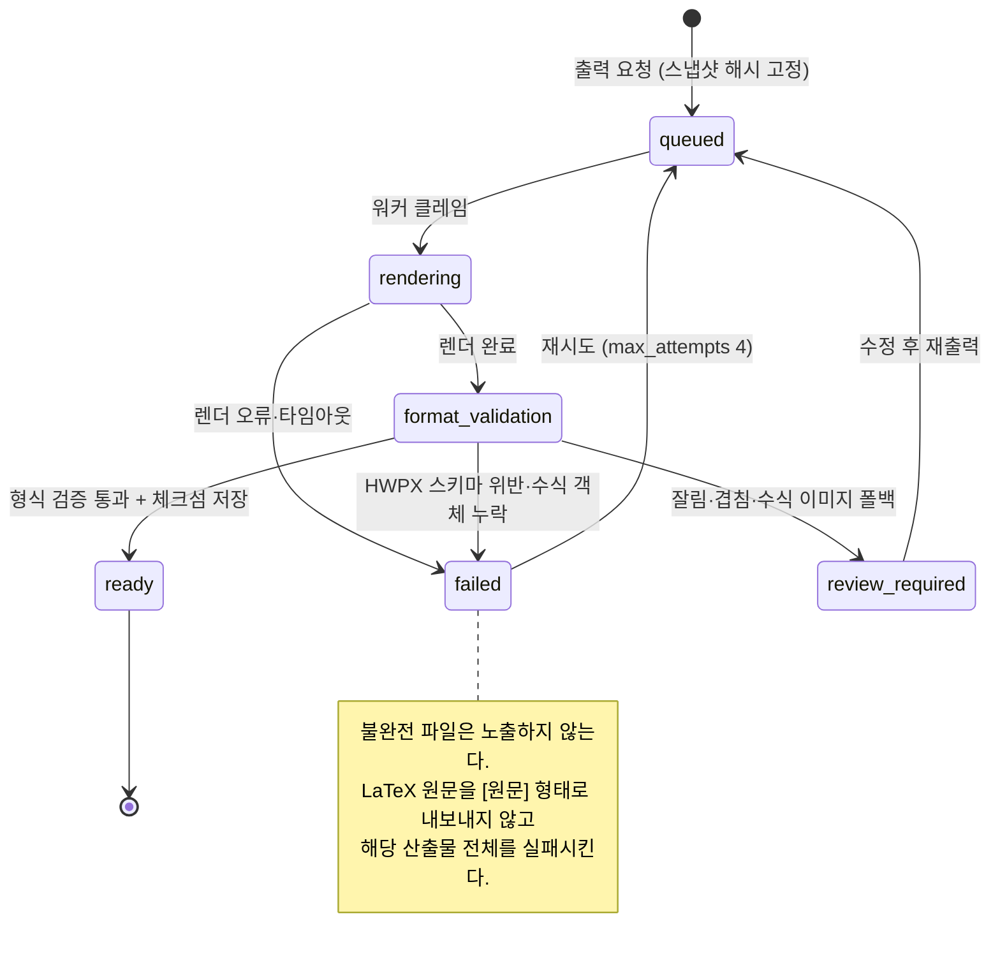

형식 검증 항목:

| 형식 | 검증 |
|---|---|
| PDF | 페이지 수 일치, 텍스트 레이어 존재, 클리핑 0, 분수·근호·대형 연산자 상하 잘림 0, 문항 번호와 첫 줄 분리 0, 도형-캡션 분리 0 |
| HWPX | ZIP 무결성, XML 스키마 통과, 수식 객체 수 = `math_expressions` 수, 폭 0 객체 0, 기준선 오차 ≤ 2pt, 옆 글자 겹침 0, 글꼴 대체 0 |
| 공통 | `semantic_fingerprint`가 web 산출물과 전부 일치, 답안지·해설지의 문항 참조가 `snapshot_hash`와 일치 |

---

## 8. 평가 (`assessment_instances.status`)

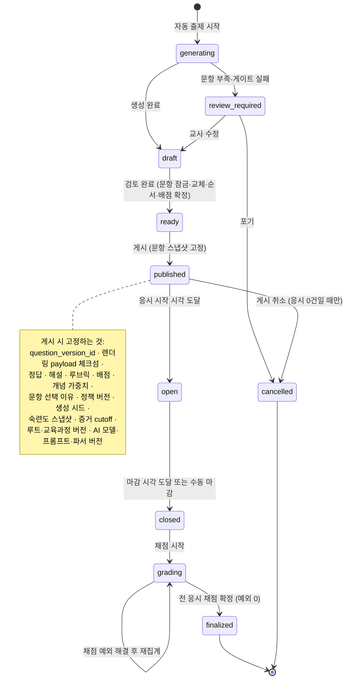

| 전이 | 가드 |
|---|---|
| `generating→draft` | 블루프린트 요구 문항 수 충족, 전 문항이 자동 출제 자격 통과 |
| `generating→review_required` | 문항 부족 또는 게이트 실패 |
| `ready→published` | `assessment.publish` 권한, kill switch `auto_question_publish` 확인, 모든 문항의 `math_render_artifacts` 존재 |
| `published→cancelled` | `attempts` 0건 |
| `grading→finalized` | `grading_exceptions` 중 `status IN ('open','assigned','reviewing')` 0건 |

**게시 후 원본 문항·정답이 수정되어도 기존 응시는 바뀌지 않는다.** 오류 정정은 새 문항·평가 버전 + 영향 대상 목록 + 명시적 재채점 이벤트로만 처리한다.

---

## 9. 응시 (`attempts.status`)

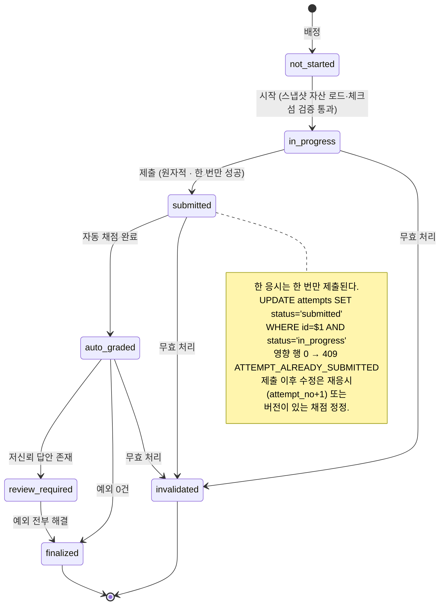

| 전이 | 가드 | 부수 효과 |
|---|---|---|
| `not_started→in_progress` | `assignments.status='assigned'`, 평가 `open`, `attempt_no <= max_attempts` | 스냅샷 자산 프리로드·체크섬 검증. **일부 문항이 깨진 채 시작시키지 않는다** |
| `in_progress→submitted` | 원자적 CAS. `client_seq` 최신성 확인 | `AttemptSubmitted` 발행, `realtime` 큐에 채점 작업 등록 (같은 TX) |
| `submitted→auto_graded` | kill switch `auto_grading` OFF | `grade_decisions` 생성 (`decided_by='auto'`) |
| `auto_graded→review_required` | 신뢰도 < 정책 임계 또는 예외 유형 발생 | `grading_exceptions` 생성 |
| `*→finalized` | 예외 0건 | `GradeFinalized` 발행 → ⑧ 숙련도 |
| `*→invalidated` | `attempt.invalidate` 권한 + 사유 | 숙련도 증거에서 제외 (기존 증거는 정정 이벤트로 상쇄) |

**응시 중 렌더 실패 감지 시**: 답안을 보존하고 해당 문항만 일시 차단, 교사·운영자에게 `문항 버전 + 렌더러 버전 + 오류 ID` 알림. 원시 LaTeX는 학생에게 표시하지 않는다.

---

## 10. 채점 예외 (`grading_exceptions.status`)

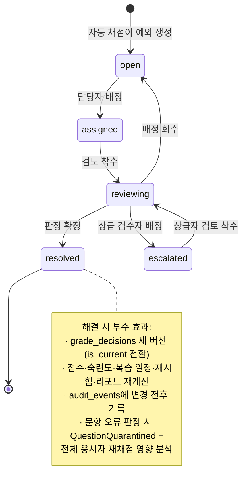

예외 유형별 기본 담당·기한:

| 유형 | 기본 담당 | 기한 |
|---|---|---|
| `low_confidence_ocr`, `format_mismatch` | 평가 조교·채점자 | 24시간 |
| `multiple_answers`, `answer_conflict` | 선생님 | 24시간 |
| `partial_credit` | 선생님 | 48시간 |
| `question_error` | 콘텐츠 검수자 (에스컬레이션) | 4시간 |
| `missing_scan`, `unidentified`, `resubmit_needed` | 선생님 | 24시간 |
| `answer_key_changed` | 수학 프로그램 책임자 | 4시간 |

---

## 11. 비동기 작업 (`jobs.status`)

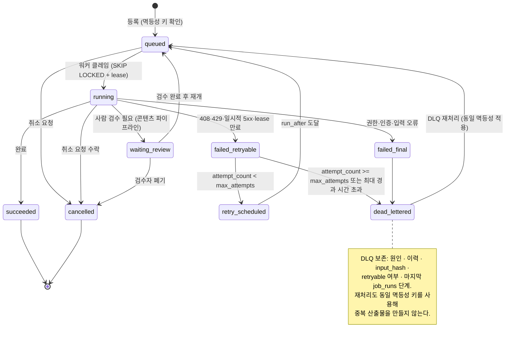

재시도 정책:

| 오류 유형 | 자동 재시도 | 백오프 |
|---|---|---|
| HTTP 408, 429, 502, 503, 504 | O | 지수 2^n × 기본 간격, 전체 지터 (`random(0, backoff)`) |
| 공급자 타임아웃 | O | 동일 |
| lease 만료 (워커 강제 종료) | O | 즉시 재클레임 가능 |
| 401, 403 (권한·인증) | X → `failed_final` | — |
| 400, 422 (입력 오류) | X → `failed_final` | — |
| 스키마 검증 실패 | X → `waiting_review` | — |

**취소와 완료 경합**: `cancel_requested_by`를 설정해도 `running`인 작업은 즉시 중단되지 않는다. 워커가 체크포인트에서 확인하고 `cancelled`로 전환한다. 이미 `succeeded`로 커밋된 작업은 취소되지 않으며, 게시 상태 일관성은 게시 게이트가 보장한다.

**체크포인트**: 콘텐츠 파이프라인은 페이지·문항 단위로 `job_runs`에 단계 완료를 기록한다. 재개는 마지막 성공 단계 다음부터.

---

## 12. 보조 상태 머신

2F 목록 외에 코드가 지켜야 하는 상태 집합.

| 대상 | 상태 | 규칙 |
|---|---|---|
| 콘텐츠 사용 권한 (`content_rights.status`) | `unverified → reviewing → allowed \| restricted`, `allowed → expired \| suspended`, `suspended → reviewing` | **`allowed`만 자동 출제 풀 진입.** `expired`·`suspended` 전환 시 신규 배정·캐시·인쇄 파일·활성 다운로드 링크 차단 |
| 테스트 운영 상태 (17장) | `예정 → 생성 대기 → 생성 중 → 검토 필요 \| 준비 완료 → 배정됨 → 응시 중 → 제출 → 채점 중 → 예외 있음 → 완료 \| 취소` | `assessment_instances.status`(8장)와 `assignments.status`의 조합으로 계산되는 **표시용 파생 상태**. 별도 컬럼을 두지 않는다 |
| 리포트 (`reports.status`) | `draft → generating → review_required → approved → exported`, `→ failed`, `→ archived` | `approved` 전에는 외부 SIS·LMS 내보내기 불가 |
| 멤버십 (`memberships.status`) | `invited → active → suspended`, `invited → expired` | 초대 만료 14일 |
| 조직 (`organizations.status`) | `active → suspended`, `active → closing → (복구) active \| purged` | `closing` 유예 30일 |
| 학습자 하루 계획 (`learner_day_plans.status`) | `not_started → in_progress → completed`, 어느 상태에서든 `→ blocked`, `blocked → in_progress`(차단 해소). 항목이 없으면 파생 `empty` | **필수 항목 판정에서 계산되는 값**이며 직접 쓰지 않는다. `blocked`가 `completed`보다 우선한다 — 필수 항목 하나가 막히면 나머지를 다 해도 완료가 아니다. `completed_at`은 설정 후 불변(I-22). 교사의 완료 취소는 `completed_at`을 지우지 않고 `reopened_at`을 더한다 ([ADR-0017](../adr/0017-learner-day-and-session-completion.md) §6) |
| 하루 계획 항목 (`learner_day_plan_items.status`) | `pending → in_progress → completed`, `→ blocked`, `→ exempted` | `blocked`(사고 — 완료를 막고 교사에게 알림)와 `exempted`(교사 판단 — 완료 분모에서 제외)를 **합치지 않는다.** 합치면 자료 미게시 사고가 「면제」로 위장된다. `blocked`는 `blocked_reason`을 반드시 가지며, 코드 목록은 게시 준비도 게이트와 같은 레지스트리를 쓴다 |

---

## 13. 시스템 불변 조건 22개와 검증 방법

`DB` = 데이터베이스 제약·트리거 / `SVC` = 도메인 서비스 / `TEST` = 자동 테스트.
**세 열 중 최소 두 곳에 구현이 있어야 한다.** UI 검증만으로는 통과로 보지 않는다.

> **I-01~I-20은 구현·검증 완료**(골프롬프트 2E 원안). **I-21·I-22는 [ADR-0017](../adr/0017-learner-day-and-session-completion.md)이 추가한 것으로 아직 구현 전이다** — 참조하는 `learner_day_plans`·`learner_day_plan_items` 테이블이 없다. 따라서 §13.1의 실행 쿼리 중 I-21·I-22는 아래에 문서로만 두고, `packages/db/src/checks/invariants.sql`에는 **T1.2의 마이그레이션과 함께** 넣는다. 지금 넣으면 `psql -f invariants.sql`과 `pnpm verify:recovery`가 없는 테이블을 조회해 실패한다.
>
> 이 때문에 `docs/phase0/backup-recovery.md`, `docs/runbooks/05-db-failure-pitr.md`, `docs/runbooks/README.md`, `packages/db/src/checks/invariants.sql`의 "불변 조건 20개" 문구가 일시적으로 이 문서와 어긋난다. 정합은 T1.2(하네스 추가)와 T6.4(문서 갱신)에서 맞춘다.

| # | 불변 조건 | DB 제약 | 도메인 서비스 | 테스트 |
|---|---|---|---|---|
| **I-01** | 모든 테넌트 데이터에 `organization_id`가 있고 서버 권한 검사와 RLS를 모두 통과 | 전 테이블 `organization_id NOT NULL`; `ENABLE ROW LEVEL SECURITY` + `*_tenant_isolation` PERMISSIVE(`auth_organization_id()`) + `*_role_gate` RESTRICTIVE | `apiAccess()`/`requireAccess()` 3-게이트, `organization_id`는 세션에서만 확정 | `tests/integration/rls-isolation.test.ts` — 트랜잭션 안 `set_config('request.jwt.claims',...)` + `set local role authenticated` 후 교차 테넌트 `count = 0`. **DATABASE_URL이 소유자이므로 role을 낮추지 않으면 false-green** / 스키마 스냅샷 테스트가 `organization_id` 누락 테이블 0건 검증 |
| **I-02** | 게시된 루트·평가·문항 버전과 완료된 수업·제출 답안은 덮어쓰지 않는다 | `route_versions`·`assessment_questions`·`question_versions`·`sessions`·`responses`에 `BEFORE UPDATE/DELETE` 트리거 (상태·시각 조건부 예외 발생) | 명령 계층이 `published`/`completed` 대상 편집 요청을 409로 거부 | 모델 기반 테스트: 게시 후 임의 UPDATE 시퀀스 → 전부 실패 / 통합 테스트: 게시 후 원본 수정이 기존 응시에 반영되지 않음 |
| **I-03** | 학생 경로 = 게시된 반 루트 버전 + 버전이 있는 학생 오버라이드 | `student_route_overrides.base_route_version_id` NOT NULL + FK; `version_no` NOT NULL | `resolveStudentPath(routeVersion, overrides[])` 순수 함수만이 학생 경로를 계산 | 속성 테스트: 임의 오버라이드 조합에서 base 버전 노드 집합이 보존됨 |
| **I-04** | 학생 오버라이드는 반 루트나 다른 학생 계획을 직접 변경하지 않는다 | 오버라이드 테이블에 반 루트 FK 쓰기 권한 없음; RESTRICTIVE 정책이 `route_nodes` 쓰기를 `route.edit` 역할로 제한 | 오버라이드 명령은 `student_route_overrides`만 INSERT | 속성 테스트: 학생 A 오버라이드 적용 전후로 반 루트 `content_hash`와 학생 B 경로 해시 불변 |
| **I-05** | 완료된 과거 일정은 재계산하지 않고 기준 시각 이후 미래만 최소 범위로 변경 | `sessions` 트리거가 `completed` 또는 `locked_at IS NOT NULL` 행의 시간 컬럼 UPDATE 차단 | 엔진 입력에 `baseline_at` 포함, 그 이전 항목은 결과 집합에서 제외 | 속성 테스트: 임의 입력에서 `starts_at < baseline_at`인 수업이 결과 diff에 등장하지 않음 / `is_locked` 노드 불변 |
| **I-06** | 일정은 휴일·수업 가능 시간·교사/그룹/학생 충돌·하루 학습량 하드 제약을 위반할 수 없다 | `EXCLUDE USING gist` 3종(교사·그룹) + 학생 충돌 트리거 + `calendar_rules.max_daily_load_minutes` 검증 트리거 | 엔진이 하드 제약을 사전 필터로 적용, 위반 시 `proposed` 진입 거부 | 속성 테스트: 무작위 달력·불참 입력 1,000회에서 하드 제약 위반 결과 0건 |
| **I-07** | 검수 완료 + 출처·권한 유효한 정확한 문항 버전만 새 평가에 포함 | 뷰 `eligible_question_versions` + `assessment_questions` INSERT 트리거가 대상이 뷰에 존재하는지 확인 | `listEligibleQuestions()`가 유일한 문항 선정 소스 | 통합 테스트: 권한 만료·검수 미완료·게이트 실패 문항이 생성 결과에 0건 |
| **I-08** | 게시된 평가는 문항·정답·해설·루브릭·배점·개념 연결·정책 버전을 고정한 스냅샷 | `assessment_questions`의 `content_snapshot`·`answer_key_snapshot`·`rubric_snapshot` NOT NULL; 게시 후 UPDATE 차단 트리거 | 게시 명령이 원본을 복사하고 `snapshot_hash` 계산 | 통합 테스트: 게시 후 원본 문항 수정 → 스냅샷 해시 불변, 학생 화면 내용 불변 |
| **I-09** | 한 응시는 한 번만 제출. 이후 수정은 재응시 또는 버전이 있는 채점 정정 | `attempts` CAS UPDATE (`WHERE status='in_progress'`) + `submitted_at` 변경 차단 트리거; `UNIQUE (assessment_instance_id, student_id, attempt_no)` | 제출 명령이 원자적 상태 전이 | 동시성 테스트: 같은 답안 제출 10회 동시 → 성공 1, 409 아홉 번, `attempts` 1행 |
| **I-10** | 최종 채점 한 건은 숙련도 증거에 정확히 한 번 반영 | `mastery_evidences UNIQUE (grade_decision_id, canonical_concept_id)`; `inbox_messages UNIQUE (consumer_name, event_id)` | 소비자가 처리와 Inbox INSERT를 같은 트랜잭션에서 수행 | 동시성 테스트: `GradeFinalized` 10회 중복 배달 → 증거 1건 / 역순 이벤트에서 상태 역행 0 |
| **I-11** | 숙련도는 원본 증거·cutoff·알고리즘 버전으로 재현 가능 | `concept_masteries`에 `policy_version_id`·`evidence_cutoff_at`·`computed_hash` NOT NULL | 계산은 `packages/core/src/mastery` 순수 함수 | 속성 테스트: 같은 (증거 집합, cutoff, 정책) → 같은 `computed_hash` / 재계산 결과가 저장값과 일치 |
| **I-12** | 같은 입력 스냅샷·엔진 버전·시드의 일정·평가 생성은 같은 결과 해시 | `schedule_change_proposals`에 `input_hash`·`engine_version`·`seed`·`output_hash` NOT NULL | `packages/core` 순수성 (ESLint: `Date.now`·`Math.random`·`process.env` 금지) | 속성 테스트 1,000회: 동일 입력 → 동일 `output_hash` / 정렬 없는 조회 결과 주입 시에도 동일 |
| **I-13** | 권한 철회·문항 격리는 이후 배정을 막지만 과거 기록을 조용히 삭제하지 않는다 | `questions.lifecycle='quarantined'`여도 `assessment_questions`·`responses`·`audit_events` 삭제 금지 트리거 | 격리 명령이 미완료 `assignments`만 제외 | 통합 테스트: 격리 후 신규 생성 0건 포함, 기존 `attempts`·`grade_decisions` 행 수 불변 |
| **I-14** | 모든 시간은 UTC 저장 + 계산에 사용한 워크스페이스 시간대 ID 병행 보존 | 전 시간 컬럼 `timestamptz`; `sessions`·`course_periods`에 `timezone_id text NOT NULL` | 날짜 계산은 `DeterministicContext.timezoneId`만 사용 | 스키마 테스트: `timestamp without time zone` 컬럼 0건 / 서머타임·시간대 변경 시나리오 단위 테스트 |
| **I-15** | 감사 로그와 원본 학습 증거는 일반 수정 API로 변경·삭제 불가 | `audit_events`·`mastery_evidences`·`grade_decisions`에 `BEFORE UPDATE/DELETE` 차단 트리거 + `REVOKE UPDATE, DELETE FROM authenticated` | 쓰기 경로가 `recordAudit()` append-only 한 곳 | 보안 테스트: 최고 권한 세션으로 직접 UPDATE·DELETE 시도 → 전부 실패 |
| **I-16** | 활성 릴리스의 모든 공식 노드·성취기준은 권위 소스 위치와 체크섬으로 역추적된다 | `official_curriculum_nodes.source_id`·`achievement_standards.source_id` NOT NULL + `source_locator`·`checksum` NOT NULL | 발행 게이트가 역추적 누락 0건 확인 | 통합 테스트: 발행된 릴리스의 전 노드에 대해 소스 조회 성공률 100% |
| **I-17** | 강한 선수 그래프에 순환이 없고, 적용 버전이 다른 노드를 암묵 연결하지 않는다 | 발행 전 재귀 CTE 순환 검사; `concept_edges.curriculum_version_id` NOT NULL + 교차 버전 연결 검증 쿼리 | 간선 추가 명령이 즉시 순환 검사 | 속성 테스트: 무작위 간선 추가 시퀀스에서 `PREREQUISITE` 순환 0건 / 고아 노드 검출 |
| **I-18** | 학생에게 게시된 콘텐츠에 `katex-error`·원시 LaTeX 폴백·미검증 SVG·필수 렌더 산출물 누락이 없다 | `question_versions.publish_gate_status='passed'`가 아니면 `assessment_questions` INSERT 차단 트리거; `diagram_assets.sanitize_status='passed'` 검증 | 게시 게이트 10조건 | 시각 회귀 테스트(1280·360·A4) + DOM 검사: `katex-error` 클래스·`.math-raw`·빈 KaTeX 노드 0건 / 골든 코퍼스 전량 |
| **I-19** | 게시된 평가의 각 수식은 원본·정규화본·렌더러 버전·의미 지문으로 재현 가능 | `assessment_questions`에 `renderer_version`·`katex_version`·`normalizer_version` NOT NULL; `math_expressions`에 `raw_source`·`normalized_latex`·`semantic_fingerprint` NOT NULL | 게시 시 버전 3종 복사 | 결정성 테스트: 저장된 버전으로 재렌더 → `render_hash` 일치 / web·pdf·hwpx 의미 지문 불일치 0건 |
| **I-20** | 외부 행정 연동은 허용 목록 밖의 결제·상담·전자출결·보호자 연락 데이터를 영속화하지 않는다 | 금지 컬럼명 스키마 게이트(`scripts/boundary-check.mjs`); `integration_connections.field_allowlist` NOT NULL | 어댑터 zod `.strict()` + 폐기 필드 카운터 | 계약 테스트: 금지 필드를 포함한 페이로드 주입 → 저장 0건, `discarded_field_count` 증가 / 스키마 전체에 금지 토큰 0건 |
| **I-21** | 학습자 하루 완료는 반 `sessions` 상태를 직접 바꾸지 않는다 | `learner_day_plans`에 `sessions` 쓰기 권한 없음; `sessions.status` 전이는 `session-execution` 경로에서만 | 하루 완료 명령은 `learner_day_plans`·`outbox_events`만 INSERT/UPDATE. 반 마감은 별도 명령(교사 확인) | 속성 테스트: 반 전원의 하루 완료 전후로 해당 `sessions` 행의 `status`·`completed_at`·시간 컬럼 불변 / 통합 테스트: 30명 완료 후 `SessionCompleted` 발행 0건 |
| **I-22** | `learner_day_plans.completed_at`은 설정 후 변경·삭제되지 않고, `LearnerDayCompleted`는 계획 1건당 최대 1회 발행된다 | `learner_day_plans`에 `BEFORE UPDATE` 트리거 (`completed_at IS NOT NULL`이면 그 컬럼 변경 차단); `UNIQUE (organization_id, learner_id, plan_date)` | 완료 전이는 CAS(`WHERE status <> 'completed'`)이고 outbox INSERT와 같은 트랜잭션. 교사의 완료 취소는 `reopened_at`만 더한다 | 동시성 테스트: 같은 학생·날짜 완료 10회 동시 → 성공 1, `learner_day_plans` 1행, outbox 1건 / 재개방 후 재완료 시 outbox 추가 0건 |

### 13.1 불변 조건 회귀 하네스

`packages/db/src/checks/invariants.sql`에 20개 조건을 **실행 가능한 검증 쿼리**로 둔다. 각 쿼리는 위반 행을 반환하며, 정상이면 0행이어야 한다.

```sql
-- I-01: organization_id 없는 테넌트 테이블 검출
SELECT c.relname FROM pg_class c
JOIN pg_namespace n ON n.oid = c.relnamespace
WHERE n.nspname = 'public' AND c.relkind = 'r'
  AND c.relname NOT IN ('state_transitions','roles','permissions','role_permissions',
                        'curriculum_versions','curriculum_applicabilities','kill_switches')
  AND NOT EXISTS (SELECT 1 FROM pg_attribute a
                  WHERE a.attrelid = c.oid AND a.attname = 'organization_id' AND a.attnum > 0);

-- I-10: 채점 1건이 증거 2건 이상으로 반영된 경우
SELECT grade_decision_id, canonical_concept_id, count(*)
FROM mastery_evidences
GROUP BY 1,2 HAVING count(*) > 1;

-- I-18: 게시 게이트 미통과 문항이 게시된 평가에 포함된 경우
SELECT aq.id, aq.assessment_instance_id
FROM assessment_questions aq
JOIN question_versions qv ON qv.id = aq.question_version_id
JOIN assessment_instances ai ON ai.id = aq.assessment_instance_id
WHERE ai.status IN ('published','open','closed','grading','finalized')
  AND qv.publish_gate_status <> 'passed';

-- I-21: 학생 하루 완료만 있고 교사 마감이 없는데 session이 완료된 경우
-- (반 마감은 progress_events를 반드시 남긴다 — 없으면 학생 완료가 넘어온 것이다)
SELECT s.id, s.session_date
FROM sessions s
WHERE s.status = 'completed'
  AND NOT EXISTS (SELECT 1 FROM progress_events pe WHERE pe.session_id = s.id);

-- I-22: 완료 계획 1건에 LearnerDayCompleted가 2회 이상 발행된 경우
SELECT (payload->>'learnerDayPlanId') AS plan_id, count(*)
FROM outbox_events
WHERE event_type = 'LearnerDayCompleted'
GROUP BY 1 HAVING count(*) > 1;

-- I-22: 필수 항목이 남았는데 완료로 표시된 계획
SELECT p.id, p.learner_id, p.plan_date
FROM learner_day_plans p
WHERE p.status = 'completed'
  AND EXISTS (
    SELECT 1 FROM learner_day_plan_items i
    WHERE i.learner_day_plan_id = p.id
      AND i.required
      AND i.status NOT IN ('completed','exempted')
  );
```

이 하네스는 ① CI 통합 테스트, ② 운영 일 배치(위반 시 SEV2 알림), ③ 복구 후 검증([backup-recovery.md](./backup-recovery.md))에서 동일하게 실행한다.
