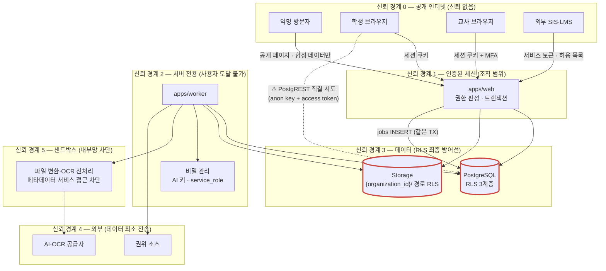
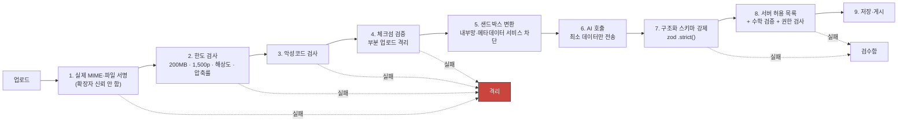
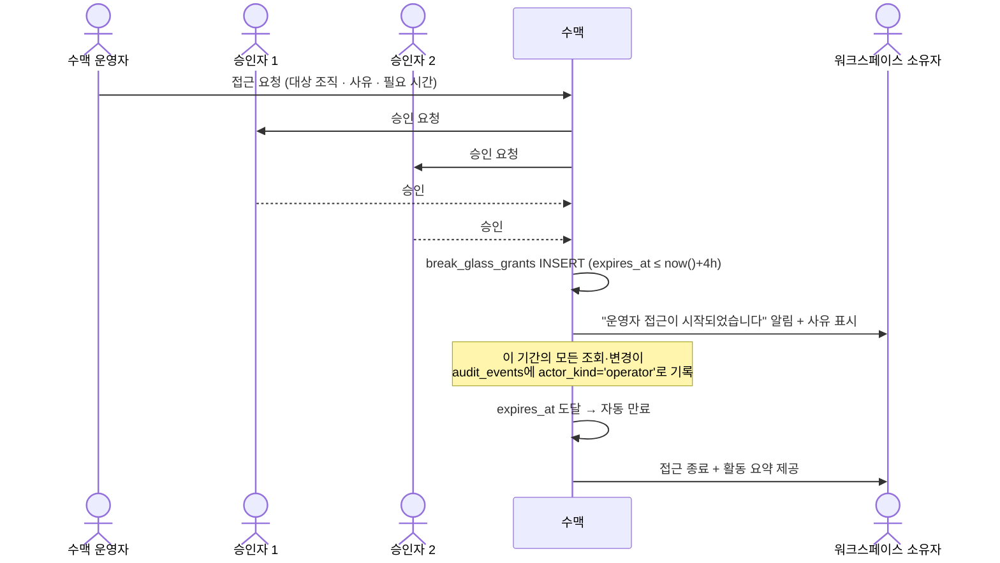

# 위협 모델과 권한 매트릭스

> 골프롬프트 27장(보안과 개인정보) 전체 이행 문서. STRIDE 기반.
> 관련: [architecture.md](./architecture.md) · [api-contract.md](./api-contract.md) · [erd.md](./erd.md) · 실사고 근거: [survey/eywa-allinone.md](./survey/eywa-allinone.md)

---

## 1. 보호 자산과 위협 행위자

### 1.1 핵심 보호 자산

| # | 자산 | 노출 시 피해 | 최소 보호 |
|---|---|---|---|
| P-1 | 학생 개인정보 (표시명·외부 식별자·학습 기록) | 미성년자 정보 유출, 법적 책임 | RLS + 최소 수집 + 내부 처리 시 불투명 ID |
| P-2 | **시험 전 문항·정답** | 평가 무효화, 신뢰 붕괴 | 게시 전 학생 역할 접근 0, 서명 URL 만료, 스냅샷 접근 제어 |
| P-3 | 학생 답안·성적 | 프라이버시 침해, 성적 조작 | RLS + 감사 + 불변 채점 이력 |
| P-4 | 확정된 진도·일정 | 운영 마비 | 완료·잠금 불변, 재계산 범위 제한 |
| P-5 | 교재 원본·계약 정보 | 저작권 분쟁, 계약 위반 | 권한 상태 게이트, 서명 URL, 반출 감사 |
| P-6 | 관리자 권한 | 전 자산 침해 | MFA 필수, 위계 검증, 재인증, break-glass |
| P-7 | 세션 토큰 | 계정 탈취 | HttpOnly·Secure·SameSite, 짧은 수명, 회전, 원격 폐기 |
| P-8 | AI 공급자 키 | 비용 폭주, 데이터 유출 | 서버 전용, 비밀 관리 시스템, 정기 회전 |
| P-9 | 감사 로그 | 침해 은폐 | append-only, 일반 관리자 수정 불가 |

### 1.2 위협 행위자

| 행위자 | 동기 | 능력 |
|---|---|---|
| 외부 공격자 | 데이터 탈취, 랜섬 | 인터넷 접근, 자동화 스캐닝, 알려진 취약점 |
| **악성 학생** | 시험 전 문항 열람, 점수 조작 | 유효 세션, 브라우저 개발자 도구, PostgREST 직결, 다중 기기 |
| **권한 오용 교직원** | 담당 외 학생 조회, 성적 임의 변경 | 유효 세션 + 정당한 역할 |
| 탈취된 관리자 계정 | 전면 침해 | 최고 권한 |
| **악성 업로드** | 파서 취약점, 프롬프트 인젝션 | 콘텐츠 관리자 권한 또는 그 계정 탈취 |
| 공급망 | 백도어 | 의존성·컨테이너·CI |
| 외부 AI 제공자 | 데이터 보존·학습 이용 | 전송된 데이터 전량 |
| 수맥 운영자 | 호기심·대리 접근 남용 | break-glass |

---

## 2. 신뢰 경계와 데이터 흐름

**핵심**: 학생·교사 브라우저는 Supabase anon key와 자기 access token으로 **PostgREST에 직접 접속할 수 있다**. 앱 게이트만으로는 막을 수 없다(eywa 실사고 1). **RLS가 유일한 최종 방어선**이다.

---

## 3. STRIDE 위협 분석

`위험` = 발생 가능성 × 영향. **H**=높음, **M**=중간, **L**=낮음.

### 3.1 Spoofing (위장)

| ID | 위협 | 위험 | 완화 | 검증 |
|---|---|---|---|---|
| S-01 | 탈취한 세션 쿠키로 교사 위장 | H | HttpOnly·Secure·SameSite=Lax 쿠키, 액세스 토큰 수명 1시간, refresh 회전 ON + reuse_interval 90초, 기기·세션 목록과 원격 폐기 | 세션 폐기 후 API 호출 → 401 |
| S-02 | 학생이 다른 학생 ID로 응시 | H | `attempts.student_id`는 세션에서 확정. 요청 본문의 `student_id` 무시 | 보안 테스트: 타 학생 ID 주입 → 404 |
| S-03 | 외부 SIS 토큰 위조 | M | 서비스 계정 토큰은 사람 계정과 분리, 만료·회전 정책, `integration_connections`에 바인딩 | 만료 토큰 → 401 |
| S-04 | 초대 링크 재사용으로 계정 가로채기 | M | 초대 토큰 1회용, 14일 만료, 이메일 소유 확인 후 활성화 | 재사용 → 410 |
| S-05 | MFA 미적용 교직원 계정 탈취 | H | **교직원·운영자 MFA 필수**(owner·program_director·teacher·grader·content_manager·content_reviewer). 미설정 시 로그인 후 강제 등록 화면 | 미설정 계정의 쓰기 API → 403 `MFA_REQUIRED` |

### 3.2 Tampering (변조)

| ID | 위협 | 위험 | 완화 | 검증 |
|---|---|---|---|---|
| T-01 | 제출 후 답안 수정 | H | `responses`·`attempts` 제출 후 UPDATE 차단 트리거. 정정은 새 `grade_decisions` 버전 | 직접 UPDATE 시도 → 예외 |
| T-02 | 점수 직접 변조 | H | `grade_decisions` append-only, `is_current` 전환만. 감사 필수 | 보안 테스트 |
| T-03 | 게시된 시험 문항·정답 변조 | H | `assessment_questions` 게시 후 UPDATE/DELETE 차단 트리거 | 모델 기반 테스트 |
| T-04 | 감사 로그 삭제·수정 | H | `REVOKE UPDATE, DELETE ON audit_events FROM authenticated` + 트리거. **일반 관리자도 불가** | 최고 권한 세션으로 시도 → 실패 |
| T-05 | 완료·잠금 일정 임의 변경 | M | `sessions` 트리거 + 엔진 `baseline_at` 필터 | 속성 테스트 |
| T-06 | 커서 조작으로 타 조직 데이터 열람 | M | 커서에 `organization_id` 포함 + HMAC 서명. 불일치 → 400 | 조작 커서 주입 테스트 |
| T-07 | SQL 삽입 | M | postgres.js 파라미터 바인딩만 사용. 문자열 결합 쿼리 ESLint 금지 | SAST + DAST |
| T-08 | 정규화 규칙 변경으로 게시 시험 의미 변경 | M | 게시 스냅샷에 `normalizer_version`·`katex_version` 고정. 재렌더 시 저장 버전 사용 | 결정성 테스트 |
| T-09 | AI 응답을 그대로 신뢰해 저장 | H | zod `.strict()` + 허용 목록 + 수학 검증 + 권한 검사를 통과한 결과만 저장 | 계약 테스트: 스키마 밖 필드 주입 |

### 3.3 Repudiation (부인)

| ID | 위협 | 위험 | 완화 | 검증 |
|---|---|---|---|---|
| R-01 | 성적 변경 사실 부인 | M | `audit_events`에 행위자·시각·사유·변경 전후·권한 근거·규칙 버전 | 통합 테스트: 채점 정정 후 감사 1건 |
| R-02 | 자동 일정 변경 책임 불명 | M | `schedule_change_proposals`에 `engine_version`·`seed`·`input_hash`·`output_hash`·`reason_codes` + 감사 | 재현 테스트 |
| R-03 | 운영자 대리 접근 부인 | M | `break_glass_grants`(2인 승인·사유·4시간 만료) + 전 조회 감사 + 소유자에게 접근 사실 표시 | 감사 완전성 테스트 |
| R-04 | 콘텐츠 승인 책임 불명 | M | `content_reviews.reviewed_by`, `math_expressions.reviewer` NOT NULL | |

### 3.4 Information Disclosure (정보 노출)

| ID | 위협 | 위험 | 완화 | 검증 |
|---|---|---|---|---|
| **I-01** | **IDOR·교차 테넌트 조회** | **H** | ① RLS `auth_organization_id()` PERMISSIVE 정책 전 테이블 ② 복합 FK `(organization_id, id)` ③ 서버가 세션에서만 `organization_id` 확정 ④ 부재는 404 (403은 존재 노출) | `tests/integration/rls-isolation.test.ts` — **`set local role authenticated` 필수** (소유자 롤이면 false-green) |
| **I-02** | **시험 전 문항·정답 유출** | **H** | ① 학생 역할은 `assessment_instances.status IN ('open')` + 자기 `assignments`가 있는 것만 RLS로 조회 가능 ② `answer_key_snapshot`·`rubric_snapshot`은 학생 역할 RESTRICTIVE 정책으로 차단 ③ 도형·이미지는 서명 URL 15분 ④ 게시~open 사이 프리페치 금지 | 보안 테스트: 학생 토큰으로 미개시 시험 조회 → 0행. `answer_key` 컬럼 조회 → 0행 |
| I-03 | 캐시·검색·큐·분석을 통한 테넌트 누출 | H | 읽기 모델·검색 인덱스·캐시 키·큐 메시지·내보내기 전부 `organization_id` 포함. 읽기 모델 테이블도 RLS 적용 | 교차 테넌트 자동 테스트(URL·ID·검색·캐시·내보내기·큐·SSE) |
| I-04 | 로그·메트릭에 개인정보 노출 | M | 로그 필터: 학생 이름·연락처·답안 원문·문제집 페이지·토큰·비밀 금지. 메트릭 레이블에 학생 ID 금지 | CI: 로그 출력 스캔 테스트 + 금지 키 목록 |
| I-05 | 오류 응답의 내부 정보 노출 | M | 500은 `trace_id`만. 스택·쿼리·경로 노출 금지 | 응답 스냅샷 테스트 |
| I-06 | 서명 URL 유출 후 무기한 접근 | M | 만료 15분(문항 자산)·24시간(내보내기), 발급 시 권한 재검사, 권한 철회 시 즉시 폐기 | 만료·철회 테스트 |
| I-07 | 콘텐츠 담당자가 학생 개인정보 접근 | M | `content_manager`·`content_reviewer` 역할은 학생 테이블 RESTRICTIVE 정책으로 차단. 콘텐츠 함수 시그니처에 `studentId` 금지 | 권한 매트릭스 테스트 |
| I-08 | AI 공급자에게 불필요 데이터 전송 | M | 문항 처리 시 학생 데이터 미전송. 조직 식별 정보 제거. 공급자의 학습 사용·보존·처리 지역·재위탁 검토 문서화 | 전송 페이로드 계약 테스트 |
| I-09 | 공개 데모에 실데이터 노출 | M | `/demo`는 합성 데이터 전용 워크스페이스. 실 조직 데이터 접근 경로 없음 | E2E: 데모 세션의 DB 조회 범위 검증 |
| I-10 | 백업에서 데이터 유출 | M | 저장 데이터·백업 암호화, 별도 백업 권한(운영 계정 침해와 함께 삭제되지 않음) | 접근 권한 감사 |

### 3.5 Denial of Service

| ID | 위협 | 위험 | 완화 | 검증 |
|---|---|---|---|---|
| D-01 | 압축 폭탄·거대 PDF | M | 크기 200MB·페이지 1,500·해상도·압축률 한도. 샌드박스에서 검사 | 악성 파일 픽스처 테스트 |
| D-02 | KaTeX 자원 고갈 (매크로 폭탄·깊은 중첩) | M | 매크로 수 64·중첩 깊이 32·입력 길이 8,192자·렌더 시간 200ms 제한 | 퍼즈 테스트: 크래시·무한 렌더 0건 |
| D-03 | 한 조직의 대량 작업이 타 조직 마비 | H | 큐별 조직 동시 한도 + 공정 스케줄러(단일 조직 배치 점유 ≤ 40%) + `realtime` 큐 최우선 | 부하 테스트: 대형 테넌트 AI 대량 사용 중 실시간 채점 SLO 유지 |
| D-04 | AI 비용 폭주 | H | 조직 1일 USD 20 / 전체 1일 USD 4,000. 80% 경고, 100% 게이트. 회로 차단기 | 예산 초과 시뮬레이션 |
| D-05 | 로그인 무차별 대입 | M | 10회/15분/IP+이메일, 계정 잠금 경고 | 속도 제한 테스트 |
| D-06 | SSE 연결 고갈 | L | 사용자당 5개, 15초 heartbeat, 유휴 5분 종료 | |
| D-07 | 대량 응시 시 DB 커넥션 고갈 | M | transaction pooler 고정, 인스턴스당 pool max 10, 워커 별도 풀 | 부하 테스트 2,000 RPS |

### 3.6 Elevation of Privilege (권한 상승)

| ID | 위협 | 위험 | 완화 | 검증 |
|---|---|---|---|---|
| **E-01** | **앱 게이트만 있고 RLS 역할 게이트 없어 PostgREST 직결로 우회** | **H** | RLS 3계층: ① 테넌트 격리 PERMISSIVE ② **역할 게이트 RESTRICTIVE**(둘 다 통과해야 통과) ③ Storage 경로 선두 세그먼트 | RLS 직접 쿼리 보안 테스트 (전 역할 × 전 테이블) |
| E-02 | 자신보다 높은 역할 부여 | H | `canAssignRole(actor, newRole, target)` = `actor.rank > newRole.rank && actor.rank > target.rank`. DB에서도 RESTRICTIVE 정책 | 권한 위계 테스트 |
| E-03 | 담당 외 학생 접근 (scoped 권한 누수) | H | **`scoped` 권한은 메뉴만 연다.** 실제 데이터는 `getTeacherScope()`가 담당 그룹 → 학생 ID로 쿼리 필터. RLS에도 동일 스코프 반영 | 스코프 테스트: 담당 외 학생 조회 → 0행 |
| E-04 | 읽기 권한으로 쓰기 수행 | H | **`canAccess`(읽기)와 `canWrite`(쓰기) 분리.** 변경 액션에 `canAccess` 사용 금지 ESLint 규칙 | 매트릭스 테스트: readonly 역할의 전 쓰기 API → 403 |
| E-05 | 뷰 모드(겸직)로 권한 상승 | M | 뷰는 **스코프·크롬만** 바꾼다. 권한 판정은 항상 실 role | 뷰 모드 테스트 |
| E-06 | **프롬프트 인젝션으로 AI가 권한 상승** | H | OCR 텍스트는 데이터로만 처리. AI는 구조화 스키마만 출력. AI 출력이 시스템 프롬프트·도구 호출·URL 접근·권한을 바꿀 수 없음. AI 워커의 내부망·메타데이터 서비스 접근 차단 | 프롬프트 인젝션 픽스처 테스트 |
| E-07 | SSRF (권위 소스 수집·이미지 URL) | M | URL 허용 목록(교육부·NCIC 도메인), 사설 IP·메타데이터 대역 차단, 리다이렉트 추적 금지 | SSRF 테스트 |
| E-08 | XSS를 통한 세션 탈취 | H | React 자동 이스케이프. `dangerouslySetInnerHTML`은 **KaTeX 산출물에만** 허용(ESLint 규칙). SVG는 허용 목록 정제 후에만 인라인. CSP `script-src 'self'` | XSS 픽스처 + CSP 검증 |
| E-09 | CSRF | M | SameSite=Lax 쿠키 + Server Action의 Next.js 내장 CSRF 보호 + 상태 변경은 POST/PATCH만 | CSRF 테스트 |
| E-10 | 경로 이동 (Storage 경로 조작) | M | Storage 경로는 서버가 조립. 사용자 입력을 경로에 직접 쓰지 않음. `..` 정규화 | 경로 조작 테스트 |
| E-11 | 공급망 (의존성·컨테이너·CI) | M | 락파일 고정, `pnpm audit` CI 게이트, 재현 가능 빌드, CI 시크릿 최소 권한, 서명된 아티팩트 | 의존성·컨테이너·IaC 스캔 |

---

## 4. eywa 실사고 5건의 반영

실운영에서 실제로 발생한 사고다. 각각을 위협 항목과 설계 규약으로 못박는다.

### 4.1 실사고 1 — "화면에서만 잠갔다"

> 앱 게이트만 있고 RLS 역할 게이트가 없어, 사용자가 자기 access token으로 PostgREST에 직접 접속해 우회했다. 실제로 계좌번호가 노출됐다.

| 반영 | 내용 |
|---|---|
| 위협 ID | E-01, I-01 |
| 설계 규약 | **모든 테이블에 PERMISSIVE 테넌트 격리 + RESTRICTIVE 역할 게이트 2중 정책.** 둘 다 통과해야 통과 |
| 구현 | `auth_organization_id()` SECURITY DEFINER + DO 루프로 전 테이블 `*_tenant_isolation` 생성. 역할 게이트는 `auth_menu_access(p_menu)`가 `organizations.permission_overrides` jsonb → DEFAULTS jsonb 순으로 해석. **역할을 SQL에 하드코딩하지 않는다** |
| 수맥 특화 | 학생 역할에 대해 `assessment_questions.answer_key_snapshot`·`rubric_snapshot` 접근을 RESTRICTIVE로 차단. 시험 전 정답 유출(P-2)이 수맥의 "계좌번호"다 |
| 검증 | 전 역할 × 전 테이블 RLS 직접 쿼리 테스트. TS 권한 미러와 SQL의 드리프트는 SQL 파싱 테스트로 검증 |

### 4.2 실사고 2 — 로그인 무한루프

> 미들웨어에서 `getUser()` 검증에 실패하면 로그아웃 처리가 되어 무한루프에 빠졌다.

| 반영 | 내용 |
|---|---|
| 위협 ID | 가용성 (D 계열) |
| 설계 규약 | **인증 게이트는 쿠키 존재 여부로만 판정한다.** 진짜 검증은 `(shell)/layout.tsx`의 `getCurrentUser()` |
| 구현 | `proxy.ts`의 `updateSession()`은 `getClaims()`로 refresh만 유도하고, `setAll`에서 요청·응답 쿠키를 동시 갱신한 뒤 `NextResponse.next({ request })`. matcher는 api·`_next`·robots·폰트 확장자 전부 제외 |
| 검증 | E2E: 만료 직전 토큰 + 동시 요청 5개 → 로그아웃 0회, 갱신 성공 |

### 4.3 실사고 3 — fail-open vs 락아웃

> 권한 설정 조회가 실패했을 때 fail-closed로 만들면 관리자가 설정 화면에 들어가지 못해 복구 불능이 된다.

| 반영 | 내용 |
|---|---|
| 위협 ID | E-04(반대 방향의 위험), 가용성 |
| 설계 규약 | **애플리케이션 `getPermMatrix()`는 fail-open**(조회 실패 시 최고 역할 통과). **DB RLS는 fail-closed**로 최종 차단. 두 계층의 실패 방향을 반대로 둔다 |
| 구현 | DB 레벨에서도 `owner` 역할은 항상 통과(락아웃 방지). `isPermissionLocked` 가드레일로 소유자 권한 제거 불가 |
| 검증 | 권한 테이블 조회 실패 주입 → 관리자 설정 화면 접근 성공, 동시에 학생 토큰의 교차 테넌트 조회는 여전히 0행 |

### 4.4 실사고 4 — refresh 회전 경합

> 멀티 창·멀티 iframe에서 refresh 토큰 회전 + 짧은 reuse interval 조합이 정상 사용자를 탈취범으로 오인해 세션을 폐기했다.

| 반영 | 내용 |
|---|---|
| 위협 ID | S-01(회전은 유지해야 함) vs 가용성 |
| 설계 규약 | 수맥은 **멀티 고객 SaaS이므로 회전 ON**. 대신 **reuse_interval 90초**로 경합 창을 확보하고, 클라이언트는 **탭 간 단일 갱신자**(BroadcastChannel + 리더 선출)를 둔다 |
| 구현 | 갱신은 `proxy.ts` 한 곳에서만. 클라이언트 컴포넌트가 독자적으로 `refreshSession()`을 호출하지 않는다 |
| 검증 | 동시 탭 5개 × 만료 직전 요청 → 세션 폐기 0건. 진짜 토큰 재사용(90초 초과 후 옛 토큰) → 세션 폐기 1건 |

### 4.5 실사고 5 — write-only 동기화 orphan

> 동기화 상태가 `ok`인데 error 필드에만 이슈가 쌓여, 유령 데이터가 침묵 속에 누적됐다.

| 반영 | 내용 |
|---|---|
| 위협 ID | 무결성 (T 계열) |
| 설계 규약 | **동기화 상태를 UI 배지로 노출한다.** `integration_connections`에 `status`·`last_error`·`last_success_at`·`discarded_field_count`를 두고 화면에 표시 |
| 수맥 특화 | 같은 원리를 **읽기 모델·Outbox·DLQ**에도 적용한다. `outbox_pending_age`, `inbox_skipped_stale_rate`, DLQ 건수를 오늘 운영실에 노출. **조용히 쌓이는 실패를 만들지 않는다** |
| 검증 | 동기화 실패 주입 → 배지 노출 + 알림 생성. `discarded_field_count > 0`이면 설정 화면에 경고 |

---

## 5. 권한 매트릭스 (역할 7종 × 주요 리소스)

### 5.1 표기

| 기호 | 의미 |
|---|---|
| `F` | full — 조직 전체 범위 읽기·쓰기 |
| `S` | scoped — 담당 범위만 읽기·쓰기 (`getTeacherScope()`가 필터) |
| `R` | readonly — 읽기만 (**쓰기 액션에 `canAccess`를 쓰면 여기서 샌다**) |
| `O` | own — 본인 것만 |
| `–` | none — 접근 불가 (RLS로 0행) |
| `!` | 재인증(`X-Reauth-Token`) 필요 |

역할: `OWN`=워크스페이스 소유자 / `DIR`=수학 프로그램 책임자 / `TCH`=선생님 / `GRD`=평가 조교·채점자 / `CNT`=콘텐츠 관리자 / `REV`=콘텐츠 검수자 / `STU`=학생

### 5.2 매트릭스

| 리소스 | OWN | DIR | TCH | GRD | CNT | REV | STU |
|---|:-:|:-:|:-:|:-:|:-:|:-:|:-:|
| **조직 설정·보안** | F! | R | – | – | – | – | – |
| 사용자·멤버십 조회 | F | R | R | – | – | – | – |
| **역할 변경** | F! | –  | – | – | – | – | – |
| 사용자 초대 | F | S | – | – | – | – | – |
| 외부 연동 설정 | F! | R | – | – | – | – | – |
| **감사 로그 조회** | F | R | S | – | – | – | – |
| 감사 로그 수정 | **–** | **–** | **–** | **–** | **–** | **–** | **–** |
| break-glass 승인 | F! | – | – | – | – | – | – |
| **학생 최소 명단** | F | F | S | S(배정분) | **–** | **–** | O |
| 학생 학습 기록·숙련도 | F | F | S | S(배정분) | **–** | **–** | O |
| **개인정보 내보내기** | F! | F! | – | – | – | – | – |
| **개인정보 삭제 요청** | F! | – | – | – | – | – | – |
| 학습 그룹 | F | F | S | R(배정분) | – | – | O |
| 과정 기간·달력·휴일 | F | F | S | – | – | – | R |
| **수업(세션)** | F | F | S | R(배정분) | – | – | O |
| 수업 시작·종료·진도 기록 | F | F | S | – | – | – | – |
| 학습 불참 이벤트 | F | F | S | – | – | – | – |
| 일정 잠금 | F | F | S | – | – | – | – |
| **루트 초안 편집** | F | F | S | – | – | – | – |
| **루트 게시** | F! | F! | **–** | – | – | – | – |
| 학생 오버라이드 | F | F | S | – | – | – | – |
| 일정 변경안 조회 | F | F | S | – | – | – | – |
| 일정 변경안 승인 | F | F | S | – | – | – | – |
| **대량 일정 변경(100건+)** | F! | F! | – | – | – | – | – |
| **교육과정 권위 소스** | R | F | R | – | F | R | – |
| 개념 그래프 편집 | – | F | R | – | S | S | – |
| **교육과정 릴리스 발행** | – | F! | – | – | – | – | – |
| 교재·판본 | R | R | R | – | F | R | – |
| **콘텐츠 사용 권한** | F! | R | R | – | F! | R | – |
| 문항 조회 (본문) | F | F | S | S(채점분) | F | F | O(응시분) |
| **문항 정답·해설** | F | F | S | S(채점분) | F | F | **–** |
| 문항 편집 | – | R | – | – | F | S | – |
| **문제은행 게시** | – | F | – | – | F! | – | – |
| **문항 격리** | F! | F! | S | – | F! | S | – |
| 수식 검수 | – | R | R | – | F | F | – |
| 평가 정책·블루프린트 | F | F | S | – | – | – | – |
| 테스트 생성·편집 | F | F | S | – | – | – | – |
| **테스트 게시·배정** | F | F | S | – | – | – | – |
| **미개시 시험 문항 조회** | F | F | S | S(채점분) | – | – | **–** |
| 응시(본인) | – | – | – | – | – | – | O |
| 답안 조회 | F | F | S | S(배정분) | – | – | O |
| **답안 본문(서술형)** | F | F | S | S(배정분) | **–** | **–** | O |
| 자동 채점 결과 | F | F | S | S | – | – | O(공개 후) |
| 채점 예외 처리 | F | F | S | S | – | – | – |
| 채점 정정 | F | F | S | S | – | – | – |
| **전체 재채점** | F! | F! | **–** | – | – | – | – |
| 응시 무효화 | F! | F! | S! | – | – | – | – |
| 숙련도 조회 | F | F | S | R(배정분) | – | – | O |
| 숙련도 수동 판정 | F | F | S | – | – | – | – |
| 리포트 생성 | F | F | S | – | – | – | O |
| **리포트 외부 내보내기** | F! | F! | S! | – | – | – | – |
| 알림·업무함 | O | O | O | O | O | O | O |
| **kill switch** | F! | – | – | – | – | – | – |
| DLQ 재처리 | F! | – | – | – | – | – | – |

### 5.3 매트릭스에서 읽어야 할 규칙

| # | 규칙 | 근거 |
|---|---|---|
| 1 | **콘텐츠 담당자(CNT·REV)는 학생 개인정보에 접근하지 않는다.** 학생 관련 전 행이 `–` | 골프롬프트 4장, I-07 |
| 2 | **학생은 정답·해설·미개시 시험 문항에 접근하지 않는다.** RLS RESTRICTIVE로 컬럼 단위 차단 | P-2, I-02 |
| 3 | 선생님은 **루트 게시·전체 재채점을 할 수 없다.** 초안·승인까지만 | 골프롬프트 4장 "루트 게시, 전체 재채점, 문항 무효화, 개인정보 내보내기, 대량 일정 변경은 별도 권한과 재확인" |
| 4 | **감사 로그 수정은 전 역할 `–`.** 소유자도 못 한다 | I-15, R-01 |
| 5 | `S`(scoped)는 **메뉴만 여는 것이 아니다.** 반드시 데이터 필터가 함께 적용된다 | E-03 |
| 6 | `R`(readonly) 역할이 쓰기 API를 호출하면 403. 읽기 권한 함수(`canAccess`)로 쓰기를 검사하지 않는다 | E-04 |
| 7 | 보호자·수납·상담·차량·인사 역할은 **만들지 않는다.** 외부 시스템이 보낸 명단도 위 7개 역할로 재매핑 | 골프롬프트 4장, C-01 |

### 5.4 데이터 스코프 정의

| 역할 | 스코프 계산 |
|---|---|
| `TCH` | `memberships` → `membership_scopes(scope_type='learning_group')` → 해당 그룹의 `learning_group_memberships.student_id` 집합 + 자신이 `primary_teacher_id`인 그룹 |
| `GRD` | `assignments`·`grading_exceptions.assigned_to = 자신`인 응시의 학생 집합. **그 외 학습 정보는 제한** |
| `REV` | `content_reviews.assigned_to = 자신`인 문항. 학생 데이터 없음 |
| `STU` | `students.id = 세션의 student_id`. 자기 `assignments`·`attempts`·`responses`만 |

스코프는 애플리케이션(`getTeacherScope()`)과 RLS 정책 양쪽에 구현한다. 한쪽만 있으면 우회 가능하다.

---

## 6. 인증과 세션 정책

| 항목 | 값 |
|---|---|
| 기본 원칙 | 기본 거부 + 최소 권한 |
| MFA | 교직원 6개 역할 필수. `owner`는 강제(미설정 시 쓰기 전면 차단) |
| 액세스 토큰 수명 | 1시간 |
| refresh 회전 | ON, reuse_interval 90초 (실사고 4 반영) |
| 쿠키 | `HttpOnly`, `Secure`, `SameSite=Lax`, `__Host-` 프리픽스 |
| 세션 목록·원격 폐기 | 제공. 기기·마지막 접속 시각·IP 대역 표시 |
| 재인증 | 5.2 매트릭스의 `!` 표시 명령 전부. 토큰 5분 유효 |
| 서비스 계정 | 사람 계정과 분리. 용도·만료일·회전 주기(90일) 필수 |
| 로그 금지 | 비밀번호, 토큰, API 키, 전체 답안 |

---

## 7. 업로드와 AI 격리

**프롬프트 인젝션 방어 (E-06)**:

| 계층 | 조치 |
|---|---|
| 입력 | PDF·이미지 안의 지시문은 **데이터로만** 처리. 시스템 프롬프트와 사용자 콘텐츠를 구조적으로 분리 |
| 도구 | AI 워커는 도구 호출 권한이 없다. 응답은 순수 JSON만 |
| 출력 | zod `.strict()` + 명령 허용 목록 + 수학 검증. 스키마 밖 필드는 저장 실패 |
| 네트워크 | AI 워커의 내부망·클라우드 메타데이터 서비스(`169.254.169.254`) 접근 차단 |
| 권한 | AI 출력이 `content_rights`·`publish_gate_status`·권한 테이블을 바꿀 수 없다 (해당 컬럼은 AI 경로에서 쓰기 불가) |

**KaTeX 보안 설정**:

| 항목 | 값 |
|---|---|
| `trust` | `false` (기본 꺼둠). 확장 필요 시 명령 단위 허용 목록 + 별도 보안 테스트 |
| `throwOnError` | `false`이되 **오류를 명시적으로 수집**한다. false만 믿고 성공으로 간주하지 않는다 |
| 금지 | 임의 URL, HTML, 스타일, 클래스, 이미지 로드, 사용자 정의 매크로 실행 |
| 자원 한도 | 매크로 64개, 중첩 깊이 32, 입력 8,192자, 렌더 200ms |
| 주입 | KaTeX가 만든 결과만 `dangerouslySetInnerHTML`. 그 외 전면 금지(ESLint) |

**SVG 정제 허용 목록**: `script`, 이벤트 핸들러(`on*`), 외부 URL, `foreignObject`, 위험한 CSS(`expression`, `url()`, `@import`) 제거. 제거 이력은 `diagram_assets.sanitize_report`에 남긴다.

---

## 8. 개인정보

| 항목 | 결정 |
|---|---|
| 전제 | **미성년자 데이터**. 최소 수집 원칙 |
| 수집 필드 | 학생: 불변 ID, 표시명, 외부 식별자, 소속 그룹, 적용 교육과정, 진도·숙련도·평가 증거 |
| **금지 필드** | 보호자 연락처, 주소, 학교 생활기록, 상담 전문, 결제 정보 — 스키마 게이트로 차단 |
| 내부 처리 | 이름 대신 **불투명 학생 ID** 사용. 로그·메트릭·AI 전송에 이름 없음 |
| 필드별 목적·역할·보존 | [erd.md](./erd.md) 10장 수명 주기 표 |
| 권리 요청 | 정정·내보내기·탈퇴·삭제. 처리 기한 영업일 10일 |
| 삭제 범위 | 활성 DB + 검색 인덱스 + 캐시 + 생성 파일 + **백업 만료 일정**을 함께 관리 |
| 백업 | 선택적 삭제 불가. 삭제 요청 시 **백업 만료 예정일(최대 35일)을 고객에게 명시** |
| AI 공급자 검토 | 학습 사용 여부·보존 기간·처리 지역·재위탁자·삭제 정책을 계약 전 문서화. `AI_PROVIDER=mock`이면 해당 없음 |
| 개발·테스트 | 실제 학생 개인정보 복사 **금지**. 합성 데이터만 |
| 공개 데모 | 합성 데이터 전용 |

---

## 9. 콘텐츠 사용 권한 집행

문항·원본 페이지에 연결하는 정보:

| 항목 | 컬럼 |
|---|---|
| 출판사·교재명·ISBN·판본·페이지·문항 번호 | `publishers`, `books`, `book_editions`, `source_pages`, `questions.printed_number` |
| 파일 해시·취득 경로 | `source_files.sha256`, `acquisition_path` |
| 권리자·계약 증빙 | `content_rights.rights_holder`, `contract_evidence_path` |
| 허용 용도·조직·지역·기간 | `allowed_uses`, `allowed_scope`, `valid_from`, `valid_to` |
| 변형·AI 처리·인쇄·온라인 허용 | `allowed_uses.{derive, ai_process, print, online}` |

권한 상태: `unverified → reviewing → allowed | restricted | expired | suspended`

**`allowed`만 자동 출제 풀에 들어간다.** 만료·중지 시 차단 대상: 신규 배정, 캐시, 인쇄 파일, 활성 다운로드 링크 (S-8 시퀀스).

AI 변형 문항에는 원본 계보(`derived_from_version_id`), 유사도(`derivation_similarity`), 모델·프롬프트 버전, 검수자를 남긴다.

> 적용 법률과 출판사 계약의 최종 판단은 법률 검토 대상이다. **시스템이 권리 확보 자체를 보증한다고 표현하지 않는다.**

---

## 10. 운영자 접근 (break-glass)

| 규칙 | 값 |
|---|---|
| 승인 | 2인 |
| 최대 기간 | 4시간 (`CHECK` 제약으로 강제) |
| 사유 | 필수 |
| 감사 | 전 조회·변경 기록 |
| 소유자 통지 | 시작 시 즉시, 종료 시 활동 요약 |
| 일반 관리자 | 감사 로그 수정 불가 |

---

## 11. 보안 테스트 목록

| 분류 | 테스트 |
|---|---|
| 권한 매트릭스 | 7역할 × 5.2 표 전 행 × (읽기·쓰기) 조합. 기대값과 불일치 시 실패 |
| 교차 테넌트 | URL·ID·검색·캐시·내보내기·큐·SSE 전 경로 |
| RLS 직접 쿼리 | `set local role authenticated` + 조작된 JWT 클레임으로 전 테이블 |
| 주입 | IDOR, SQLi, XSS, CSRF, SSRF, 경로 이동 |
| 파일 | 악성 PDF, 압축 폭탄, 잘못된 MIME, 부분 업로드, 체크섬 불일치 |
| AI | OCR 프롬프트 인젝션 픽스처, 스키마 밖 출력 |
| KaTeX | 신뢰 명령, 매크로 폭탄, 중첩 깊이, 초대형 입력 |
| SVG | `script`·이벤트 핸들러·외부 URL·`foreignObject`·CSS 공격 |
| 렌더 | 원시 HTML 주입, `dangerouslySetInnerHTML` 우회 |
| URL | 서명 URL 만료·권한 철회 후 접근 |
| 운영자 | break-glass 승인·만료·감사 완전성 |
| 로그 | 비밀·개인정보 유출 스캔 |
| 공급망 | 의존성·컨테이너·IaC·SAST·DAST |
