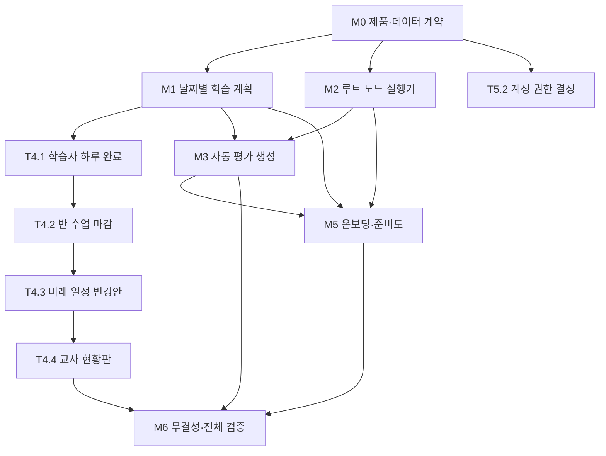

# TASKS: 수맥 — 학생 자율형 하루 수업 완결화

> 기준일: 2026-08-04  
> 목적: 앞선 제품 검토에서 확인된 결손을 수정해, **권한 있는 교사가 사전 설정하면 학생이 로그인만으로 그날의 필수 수업을 끝내고, 완료 결과가 다음 수업 계획까지 이어지는 상태**를 만든다.  
> 현재 기준선: 타입 검사·빌드·경계 검사 통과, 단위·통합 테스트 통과(수치는 착수 시점에 `pnpm test`로 재측정해 갱신한다). 다만 일일 평가 자동 생성, 학습자 하루 완료의 서버 기록, `SessionCompleted` 발행, 일부 루트 노드 실행기가 없다.  
> 상태 표기: `[]` 미착수 · `[~]` 진행 중 · `[x]` 완료

> **먼저 읽을 것**: 아래 「기존 자산과 3층 모델」은 이 문서 전체의 전제다. 특히 `learner_schedule_items`가 이미 존재한다는 사실을 모르고 M1을 시작하면 학생별 날짜 투영이 두 개가 되어 문서의 「단일 진실」 전제가 첫 태스크에서 깨진다.

---

## MVP 캡슐

1. **목표**: 교사가 기간·반·학생·루트·자료·평가 정책을 준비하면, 학생이 `/learn/today`의 안내만 따라 하루 필수 학습을 완주한다.
2. **핵심 사용자**: 워크스페이스 소유자, 프로그램 책임자, 담당 교사, 학생.
3. **핵심 문제**: 학생 소비 화면은 있으나 매일의 할 일 생성과 완료 확정이 하나의 서버 권위 흐름으로 닫히지 않는다.
4. **핵심 여정**: `사전 설정 → 준비도 검증 → 일정/평가 자동 생성 → 학생 학습 → 서버 완료 확정 → 교사 확인 → 다음 일정 재계산`.
5. **필수 기능**: 날짜별 학습 계획, 루트 노드 실행기, 자동 평가 생성, 학습자 하루 완료, 반 수업 마감, 교사 준비도/진행 현황.
6. **품질 기준**: 멱등성, KST 날짜 권위, 완료 이력 불변, 학생·교사 스코프 격리, 워커 중단 후 재개.
7. **MVP 비범위**: 출결 ERP, 보호자 CRM, 상담, 수납, 숙제 파일 업로드·채팅. 숙제는 교재 범위 확인 또는 시스템 내 연습문제 방식만 지원한다.
8. **완료 정의**: 시드·SQL 수동 조작 없이 빈 워크스페이스에서 교사 설정부터 학생 하루 완료와 다음 일정 제안까지 E2E가 통과한다.
9. **배포 조건**: 전 테스트·빌드 통과, 신규/변경 핵심 모듈 커버리지 80% 이상, P0/P1 결손 0건, 워커 장애 복구 리허설 통과.
10. **다음 단계**: Phase 0의 제품 결정을 먼저 확정한 뒤 Phase 1·2의 독립 태스크를 병렬 착수한다.

---

## 현재 결손과 목표 상태

| ID | 현재 결손 | 목표 상태 | 우선순위 | 연결 태스크 |
|---|---|---|---|---|
| G-01 | 최근 90일의 완료 테스트가 오늘 완료로 오인될 수 있음 | 오늘 날짜·오늘 계획 항목만으로 완료 판정 | P0 | T1.1, T1.3, T1.4 |
| G-02 | 하루 완료가 화면 계산일 뿐 서버에 확정 기록이 없음 | 학습자별 날짜 계획과 완료 시각을 영속화 | P0 | T1.2, T4.1 |
| G-03 | `SessionCompleted` 계약은 있으나 제품 발행 경로가 없음 | 교사 마감 또는 정책 기반 집계로 원자적 발행 | P0 | T4.2 |
| G-04 | 일일·확인테스트가 교사 버튼으로만 생성됨 | 워커가 설정된 시점에 멱등 생성·배정 | P0 | T3.1~T3.4 |
| G-05 | `book_range`, `homework`, `confirmation_test` 노드가 학생 행동으로 연결되지 않음 | 모든 필수 노드가 실행기 또는 명시적 비필수 상태를 가짐 | P0 | T2.1~T2.3 |
| G-06 | 문항 없는 연습 자료도 게시할 수 있어 학생이 영구 대기함 | 게시·루트 게시 전 실행 가능성 검증 | P0 | T2.4 |
| G-07 | 일반 교사는 반·학생·계정 최초 세팅을 끝낼 수 없음 | 역할별 책임이 명확한 온보딩과 제한적 위임 | P1 | T5.1, T5.2 |
| G-08 | 교사가 학생 관점의 준비 상태를 한눈에 확인할 수 없음 | 날짜·반·학생별 준비도 및 학생 화면 미리보기 | P1 | T2.4, T5.4 |
| G-09 | 시험 제한 시간이 클라이언트에서만 강제됨 | 서버가 저장·제출 마감 시각을 권위 있게 검사 | P1 | T6.1 |
| G-10 | 기존 full-loop가 시드된 평가 소비만 검증 | 빈 조직 생성부터 실제 워커까지 전체 왕복 검증 | P0 | T6.2 |
| G-11 | 반 수업 완료와 개별 학생 완료 의미가 섞일 가능성 | `LearnerDayCompleted`와 `SessionCompleted` 분리 | P0 | T0.1, T4.1, T4.2 |
| G-12 | 담당 교사 `scoped` 메뉴와 실제 데이터 필터가 분리되어 있음 | 읽기·쓰기 모두 담당 범위 필터 집행 | P1 | T5.3 |
| G-13 | `/learn` 8개 화면 중 4개만 오늘 범위를 공유해 완료 상태가 화면마다 갈릴 수 있음 | 모든 학생 화면이 같은 하루 계획을 읽음 | P0 | T1.3, T1.4 |
| G-14 | 학생별 날짜 투영(`learner_schedule_items`)이 이미 있는데 새 계획 테이블과 관계가 미정 | 계획층·실행층 역할을 계약으로 분리 | P0 | T0.2 |
| G-15 | `assessments_idempotent_uq`가 nullable 컬럼을 포함해 **반 공통 평가의 중복을 못 막는다**(PostgreSQL은 유니크에서 NULL을 서로 다르게 본다). 지금은 SELECT-then-INSERT가 가리고 있으나 워커가 붙으면 경합이 드러난다 | DB 수준 멱등이 실제로 걸림 | P0 | T3.2 |

---

## 기존 자산과 3층 모델

이 문서가 만드는 것은 **새로운 일정 체계가 아니라 기존 일정 위에 얹는 실행층**이다. 착수 전에 아래 3층을 구분하지 못하면 T1.2에서 곧바로 중복 설계가 나온다.

| 층 | 테이블 | 답하는 질문 | 성질 | 상태 |
|---|---|---|---|---|
| ① 반 계획 | `sessions` (`packages/db/src/schema/instruction.ts:215`) | 이 반은 언제 어떤 노드를 하나 | 엔진 산출물 · 재계산 가능(완료·잠금 제외) | 구현됨 |
| ② 학생 계획 | `learner_schedule_items` (`packages/db/src/schema/instruction.ts:269`) | 이 학생은 언제 어떤 노드를 하나 | 엔진 산출물 · 재계산 가능(과거·완료 보존) | 구현됨 |
| ③ 학생 실행 | `learner_day_plans` / `learner_day_plan_items` | 이 학생이 오늘 **무엇을** 하고 **끝냈나** | 스냅샷 · 완료 이력 불변 | **이 문서가 만든다** |

**②를 ③으로 대체하지 않는다.** `packages/db/src/domain/learner-schedule.ts`가 지키는 불변 조건(오버라이드가 반 루트·다른 학생을 바꾸지 않는다, `sessions` 행 수·시각 불변, 재합류 지점 계산)은 그대로 살아 있어야 한다. ②는 재계산이 자유롭게 덮어써야 하는 층이고 ③은 완료 이력이 절대 역행하면 안 되는 층이라, 한 테이블에 합치면 두 요구가 정면으로 부딪힌다.

**②와 ③의 계약**:
- ③의 입력은 ②다. `learner_schedule_items`가 있으면 그것을, 없으면 `sessions`(반 공통) fallback — 이미 `apps/web/src/app/learn/today/page.tsx:273-289`가 쓰는 규칙을 그대로 승격한다.
- ②는 "노드 목록"까지만 안다. ③은 그 노드를 **자료·평가·복습·숙제 항목으로 펼친** 결과를 가진다. 펼치는 규칙이 T2.2의 노드 실행기다.
- ②의 재계산은 ③의 **미완료** 계획만 다시 투영한다. 완료된 ③은 재계산 대상이 아니다.

**이미 있어 재사용할 것** (새로 만들지 말 것):
- `packages/core/src/scheduling/engine.ts` — 결정론적 일정 엔진
- `packages/db/src/domain/learner-schedule.ts` — 학생 경로 실체화·재합류
- `apps/web/src/lib/learn/node-titles.ts` — 노드 이름 해석(오버라이드 포함)
- `apps/web/src/lib/domain/assessment.ts` — 평가 생성(T3.1이 이동만 한다)
- `packages/db/src/schema/instruction.ts:321,360` — `learning_availability_events`, `makeup_sessions`(불참·보강)

---

## 핵심 완료 시나리오

아래 시나리오가 최종 릴리스의 단일 수락 기준이다.

1. 빈 워크스페이스에서 권한 있는 사용자가 과정 기간, 반, 학생과 학생 로그인 계정을 만든다.
2. 담당 교사가 개념·교재 범위·읽기·영상·연습·숙제·일일테스트·확인테스트가 포함된 루트를 만든다.
3. 준비도 검증이 누락 자료, 문항 0개, 계정 미연결, 평가 정책 미설정을 차단하거나 명시적 비필수로 표시한다.
4. 루트를 게시하면 미래 수업이 생성되고, 설정된 선행 시점에 워커가 날짜별 평가를 생성·게시·배정한다.
5. 학생이 로그인하면 오늘 날짜의 필수 항목만 순서대로 보이고, 과거 완료나 미래 평가가 오늘 완료 판정에 섞이지 않는다.
6. 학생이 필수 항목을 모두 끝내면 `learner_day_plans.status=completed`와 `LearnerDayCompleted`가 정확히 한 번 기록된다.
7. 교사는 반 현황에서 완료·진행·막힘 학생과 막힘 이유를 확인한다.
8. 교사가 실제 진행 범위를 확인해 수업을 마감하면 `progress_events`와 `SessionCompleted`가 같은 트랜잭션에 기록된다.
9. 완료 진도·숙련도·불참을 반영한 미래 일정 변경안이 만들어지고, 위험 변경은 교사 승인 전까지 적용되지 않는다.
10. 워커 중단·재시작, 중복 이벤트, 새로고침, 재제출 후에도 결과가 중복되거나 역행하지 않는다.

---

## 마일스톤 개요

| 마일스톤 | Phase | 목표 | 주요 산출물 | 종료 게이트 |
|---|---:|---|---|---|
| M0 | Phase 0 | 제품·데이터·이벤트 계약 확정 | ADR 0017·0018 + `docs/phase0/` 확장 + 수락 매트릭스 | 해석이 필요한 정책 0건, 3층 관계 확정 |
| M1 | Phase 1 | 날짜별 학습 계획을 단일 진실로 확립 | 하루 계획 상태 머신·DB·학생 화면 | 과거 테스트 오완료 0건 |
| M2 | Phase 2 | 모든 루트 노드를 실행 가능한 학생 행동으로 연결 | 노드별 payload·실행기·게시 게이트 | 실행 불가능한 필수 노드 0건 |
| M3 | Phase 3 | 평가를 날짜에 맞춰 자동 생성 | 공유 생성 서비스·워커 생산자·복구 UI | 교사 수동 생성 없이 평가 노출 |
| M4 | Phase 4 | 학생 완료를 수업·다음 일정까지 연결 | 완료 이벤트·수업 마감·재계산·현황 | 닫힌 학습 순환 E2E 통과 |
| M5 | Phase 5 | 교사가 안전하게 사전 설정하고 검증 | 온보딩·계정 위임·스코프·미리보기 | 빈 조직 사전 설정 E2E 통과 |
| M6 | Phase 6 | 평가 무결성·부하·운영 준비 | 서버 마감·전체 E2E·부하·런북 | 릴리스 체크리스트 전부 통과 |

---

## 공통 구현 규칙

- Phase 1 이상은 태스크별 전용 Git Worktree와 `codex/phase-*` 브랜치를 사용한다.
- 모든 Phase 1 이상 태스크는 **RED → GREEN → REFACTOR** 순서를 지킨다.
- DB 상태 변경과 이벤트 발행은 같은 트랜잭션에서 처리한다.
- 날짜 판정은 `Asia/Seoul` 조직 날짜만 사용하고 브라우저 시계는 권위로 사용하지 않는다.
- 학습자 하루 완료와 반 수업 완료를 동일 이벤트로 처리하지 않는다.
- 과거 완료 계획·응시·증거·감사 로그를 재계산으로 수정하거나 삭제하지 않는다.
- 자동화에는 멱등 키, kill switch, 재시도, DLQ, 수동 재실행 경로가 모두 있어야 한다.
- 새 테이블에는 조직 스코프, RLS, 인덱스, 불변 검사, purge 테스트 데이터 규칙을 함께 추가한다.
- 새 UI는 360px·키보드·WCAG 2.0 A/AA 자동 검사를 통과해야 한다.
- 각 태스크의 신규/변경 핵심 모듈 테스트 커버리지는 80% 이상이어야 한다.
- **마이그레이션 파일명**: 수기 SQL은 `NNNNa_이름.sql`(현재 마지막 `0015a_material_derived_from.sql`), drizzle-kit 생성물은 `NNNN_이름.sql`(`migrations/meta/_journal.json`이 추적, 현재 idx 5). `packages/db/src/migrate.ts`가 **파일명 사전순**으로 적용하므로 번호를 건너뛰거나 섞으면 적용 순서가 깨진다.
- **마이그레이션 번호는 착수 전에 main에서 선점한다.** 병렬 worktree 둘이 같은 번호를 집으면 병합 시 한쪽이 조용히 순서를 잃는다. 선점은 빈 파일 커밋이 아니라 이 문서의 태스크 산출물 줄을 고쳐 기록하는 방식으로 한다.
- 기존 파일을 고치는 태스크는 **그 파일을 산출물에 반드시 적는다.** 산출물에 없는 파일을 고치면 병렬 worktree 간 충돌이 리뷰 밖에서 발생한다.

---

## M0: 제품 계약과 설계 기준선

### [x] Phase 0, T0.1: 하루 완료·수업 완료 제품 계약 확정

**담당**: backend-specialist + product-owner

**작업 내용**:
- `필수`, `선택`, `대기`, `차단`, `완료`, `면제` 항목의 의미를 정의한다.
- 하루 완료는 학생별 날짜 단위로 정의하고, 반 수업 완료는 교사 마감 또는 명시적 자동 마감 정책으로 분리한다.
- 과거 미완료 테스트·기한 지난 복습을 오늘 필수 항목에 포함할지 정책을 정한다.
- 자료가 수업 당일 추가·회수되었을 때 완료율이 역행하지 않도록 계획 스냅샷 시점을 정한다.
- 학생 완료 후 새 필수 항목 추가 시 재개방 여부와 감사 규칙을 정한다.

**산출물**:
- `docs/adr/0017-learner-day-and-session-completion.md` (신규)
- `docs/phase0/state-machines.md` (기존 갱신 — §12 보조 상태 머신에 학습자 하루 계획 추가, §13 불변 조건 확장)

> **`docs/planning/01-prd.md`을 새로 쓰지 않는다.** 이 저장소의 제품·설계 baseline은 `docs/phase0/` 14개 문서(`decisions.md`, `erd.md`, `event-catalog.md`, `state-machines.md`, `sequences.md`, `failure-modes.md`, `threat-model.md` …)다. 여기에 병렬 문서 세트를 만들면 `LearnerDayCompleted`가 두 곳에 서로 다른 모양으로 남는다. Phase 0의 일은 **새 문서를 만드는 것이 아니라 기존 baseline을 확장하고, 그 확장의 근거를 ADR로 남기는 것**이다.

**완료 조건**:
- [ ] 학습자 하루 완료와 반 수업 완료가 서로 다른 상태·이벤트로 정의됨
- [ ] 필수/선택/면제 정책과 재개방 정책이 예시와 함께 명시됨
- [ ] 과거·오늘·미래 평가의 노출 및 완료 판정 규칙이 명시됨
- [ ] 제품 책임자의 승인 기록이 남음

### [x] Phase 0, T0.2: 데이터·이벤트·마이그레이션 설계 확정

**담당**: database-specialist + backend-specialist

**작업 내용**:
- **[최우선] `learner_schedule_items`와 `learner_day_plans`의 관계를 확정한다.** 「기존 자산과 3층 모델」의 계약(②는 계획층·재계산 가능, ③은 실행층·완료 불변)을 검증하고, 흡수·확장·분리 중 무엇인지 근거와 함께 못박는다. 이 결정 없이 T1.2를 시작하면 학생별 날짜 투영이 두 개가 된다.
- 재계산(②)이 이미 투영된 하루 계획(③)을 어떻게 다루는지 정한다 — 미완료 재투영, 완료 보존, 진행 중 항목의 처리.
- `learner_day_plans`와 `learner_day_plan_items`의 키, 상태, 스냅샷, 완료 시각, 차단 사유를 설계한다.
- 이벤트 계약을 설계한다. 번호는 `docs/phase0/event-catalog.md`의 E-15 다음을 잇고, §1.2 소비자 등록부에 이미 있는 소비자를 재사용한다(새 소비자 없음). **작업(job)과 이벤트를 구분한다** — 원안의 `DailyAssessmentGenerationRequested`는 이벤트가 아니라 `jobs` 행이므로 만들지 않는다(ADR-0018 §4). 결과: **E-16 `LearnerDayCompleted`, E-17 `DailyAssessmentGenerationFailed` 둘만 추가.** 성공은 기존 E-04 `AssessmentPublished`가 나른다.
- 기존 `sessions.actual_progress`, `progress_events`, `SessionCompleted`와의 관계를 정의한다.
- `/learn/records`(`apps/web/src/lib/learn/record-days.ts`)가 하루 이력을 별도로 계산한다 — 하루 계획으로 옮길지, 응시 이력 기반을 유지할지 정한다. 두 곳이 각자 날짜를 풀면 "끝냈다"의 정의가 화면마다 갈린다.
- 기존 학생 데이터 백필, 롤백, RLS, 불변 조건과 보존 정책을 설계한다. 배포된 조직이 이미 있으므로 백필은 **과거 완료 이력을 만들어내지 않는 방향**(오늘 이후만 투영)을 기본으로 검토한다.
- 워커가 날짜별 평가 생성 작업을 발견하는 방식과 멱등 키를 결정한다.

**산출물**:
- `docs/adr/0018-daily-plan-projection-and-assessment-scheduler.md` (신규)
- `docs/phase0/erd.md` (기존 갱신 — §2 수학 수업 실행에 `learner_day_plans`·`learner_day_plan_items` 추가, §10.2 수명 정책·§11 인덱스 요약 확장)
- `docs/phase0/event-catalog.md` (기존 갱신 — E-16~E-18 추가, 「이벤트 15종」 제목·소비자 등록부 갱신)
- `packages/db/migrations/0016a_learner_day_plans.sql` **번호 선점** (T1.2가 채운다)
- `packages/db/migrations/0017a_teacher_scope_rls.sql` **번호 선점** (T5.3이 채운다)
- `packages/db/migrations/0018a_assessment_idempotency_fix.sql` **번호 선점** (T3.2가 채운다 — G-15)

**완료 조건**:
- [ ] `learner_schedule_items`와의 관계가 ADR에 근거와 함께 확정됨
- [ ] 일정 재계산이 하루 계획을 어떻게 다루는지 완료/미완료/진행 중별로 명시됨
- [ ] 테이블·이벤트·상태 전이 다이어그램이 존재함
- [ ] 한 학생·한 날짜 계획의 유일성 및 재생성 규칙이 명시됨
- [ ] 백필과 롤백이 데이터 손실 없이 설명됨
- [ ] 멱등·재시도·kill switch·DLQ 설계가 포함됨
- [ ] 마이그레이션 번호 2개가 선점되어 병렬 태스크가 충돌하지 않음

### [x] Phase 0, T0.3: 사용자 흐름·수락 테스트 기준선 작성

**담당**: test-specialist + frontend-specialist

**작업 내용**:
- 소유자 설정, 담당 교사 준비, 학생 수행, 교사 마감 흐름을 화면 단위로 작성한다.
- 정상, 빈 날, 수업만 있는 날, 자료 부족, 문항 부족, 워커 중단, 학생 일부 미완료 상태를 정의한다.
- 기존 `full-loop.spec.ts`가 덮지 못한 빈 워크스페이스·실워커 범위를 명시한다.
- 최종 E2E에서 사용할 격리 조직·계정·날짜 fixture와 정리 전략을 설계한다.

**산출물**:
- `docs/planning/acceptance-matrix.md` (신규 — 이 문서 옆에 두는 유일한 신규 계획 문서)
- `docs/phase0/sequences.md` (기존 갱신 — 학생 하루 완주·교사 마감 시퀀스 추가)
- `docs/phase0/failure-modes.md` (기존 갱신 — 빈 날·자료 부족·문항 부족·워커 중단의 학생 화면과 교사 복구 행동)

> **`03-user-flow.md`·`05-design-system.md`을 만들지 않는다.** 화면 흐름은 `docs/phase0/sequences.md`에 이미 있고, UI 규약은 `docs/adr/0016-list-table-convention.md`와 `apps/web/test/ui/list-table.test.ts`가 이미 강제한다. 새 문서는 그 둘을 조용히 포크할 뿐이고, 포크된 쪽은 테스트가 지켜 주지 않는다.

**완료 조건**:
- [ ] 핵심 완료 시나리오 10단계가 Given/When/Then으로 변환됨
- [ ] 실패 상태마다 학생 행동과 교사 복구 행동이 정의됨
- [ ] 테스트가 데모 조직과 불변 증거를 오염시키지 않는 전략이 있음
- [ ] 모바일·접근성·실워커 검증 범위가 포함됨

---

## M1: 날짜별 학습 계획을 단일 진실로 확립

### [] Phase 1, T1.1: 하루 계획 상태 머신·완료 판정 RED→GREEN

**담당**: backend-specialist

**Git Worktree 설정**:
```powershell
git worktree add ..\Su-Maek-t1-1-day-state -b codex/phase-1-t1-1-day-state
Set-Location ..\Su-Maek-t1-1-day-state
```

**의존성/독립성**: T0.1 계약에 의존한다. DB 없이 순수 fixture로 독립 개발한다.

**TDD 사이클**:
1. **RED**: `packages/core/test/learning/day-plan.test.ts`에 날짜 경계, 필수/선택, 차단, 면제, 재개방, 과거 테스트 오완료 사례를 작성한다.
   ```powershell
   pnpm --filter @su-maek/core exec vitest run test/learning/day-plan.test.ts
   # Expected: FAILED
   ```
2. **GREEN**: `packages/core/src/learning/day-plan.ts`와 export를 최소 구현한다.
   ```powershell
   pnpm --filter @su-maek/core exec vitest run test/learning/day-plan.test.ts
   # Expected: PASSED
   ```
3. **REFACTOR**: UI 문구와 분리된 상태·판정 함수로 정리하고 전체 core 테스트를 재실행한다.

**산출물**:
- `packages/core/src/learning/day-plan.ts`
- `packages/core/test/learning/day-plan.test.ts`

**인수 조건**:
- [ ] 과거 완료 테스트만 있는 날은 `finished`가 아님
- [ ] 필수 항목이 모두 끝난 경우에만 완료됨
- [ ] 차단 항목이 있으면 완료되지 않고 차단 사유가 보존됨
- [ ] 신규 모듈 커버리지 80% 이상
- [ ] RED와 GREEN 실행 결과가 기록됨

**완료 시**:
- [ ] 사용자 승인 후 main 병합
- [ ] `git worktree remove ..\Su-Maek-t1-1-day-state`

### [] Phase 1, T1.2: 하루 계획 DB·저장소 RED→GREEN

**담당**: database-specialist

**Git Worktree 설정**:
```powershell
git worktree add ..\Su-Maek-t1-2-day-db -b codex/phase-1-t1-2-day-db
Set-Location ..\Su-Maek-t1-2-day-db
```

**의존성/독립성**: T0.2에 의존한다 — 특히 `learner_schedule_items`와의 관계 결정이 없으면 착수하지 않는다. T1.1의 타입은 계약 fixture로 대체해 독립 실행한다.

**작업 경계**: 실행층(③)만 만든다. `learner_schedule_items`·`sessions` 스키마를 **바꾸지 않는다** — 「기존 자산과 3층 모델」 참조. 테이블은 `packages/db/src/schema/instruction.ts`(②가 있는 곳)와 `learning.ts`(숙련도·복습·자료) 중 T0.2가 정한 쪽에 둔다.

**TDD 사이클**:
1. **RED**: `packages/db/test/learner-day-plan.test.ts`에 유일성, 상태 전이, 완료 불변, 조직 격리, 멱등 재투영, **②의 재계산이 완료된 ③을 건드리지 않음**을 작성한다.
   ```powershell
   pnpm --filter @su-maek/db exec vitest run test/learner-day-plan.test.ts
   # Expected: FAILED
   ```
2. **GREEN**: schema, migration, domain repository, RLS·인덱스를 구현한다.
   ```powershell
   pnpm --filter @su-maek/db exec vitest run test/learner-day-plan.test.ts
   # Expected: PASSED
   ```
3. **REFACTOR**: 트랜잭션 경계를 정리하고 불변 SQL·purge 규칙·복구 검사를 추가한다.

**산출물**:
- `packages/db/src/schema/learning.ts`
- `packages/db/src/domain/learner-day-plan.ts`
- `packages/db/migrations/0016a_learner_day_plans.sql` (T0.2가 선점한 번호 — 수기 SQL은 `NNNNa_`)
- `packages/db/src/checks/invariants.sql` (I-21·I-22 실행 쿼리 추가 — 원문은 `docs/phase0/state-machines.md` §13.1에 이미 있다)
- `packages/db/test/learner-day-plan.test.ts`

**인수 조건**:
- [ ] `(organization_id, learner_id, plan_date)`가 유일함
- [ ] 완료 계획의 필수 항목과 완료 시각이 일반 UPDATE로 역행하지 않음
- [ ] RLS와 조직 간 격리 테스트 통과
- [ ] 같은 입력 재투영이 행을 중복 생성하지 않음
- [ ] 학습자 일정 재실체화(`materializeLearnerSchedule`) 후에도 완료된 하루 계획이 그대로임
- [ ] `learner_schedule_items`·`sessions`의 행 수·컬럼이 이 마이그레이션으로 변하지 않음
- [ ] 신규/변경 모듈 커버리지 80% 이상

**완료 시**:
- [ ] 사용자 승인 후 main 병합
- [ ] `git worktree remove ..\Su-Maek-t1-2-day-db`

### [] Phase 1, T1.3: 오늘 계획 투영기·날짜 오류 수정 RED→GREEN

**담당**: backend-specialist

**Git Worktree 설정**:
```powershell
git worktree add ..\Su-Maek-t1-3-day-projection -b codex/phase-1-t1-3-day-projection
Set-Location ..\Su-Maek-t1-3-day-projection
```

**의존성/독립성**: T1.1·T1.2에 의존한다. core 판정기와 repository mock을 제공해 독립 테스트한다.

**작업 경계**: 이 태스크가 **G-01의 실제 버그를 소유한다.** 90일 판정은 `apps/web/src/app/learn/today/page.tsx:245`(`a.scheduled_date >= ${today}::date - 90`)에 있고 `today-context.ts`에는 날짜 로직이 없다. T1.3은 page.tsx에서 **데이터 질의를 걷어내 투영기로 옮기고** 90일을 제거하는 데까지, T1.4는 그 뒤 **렌더링을 계획 기반으로** 바꾸는 데까지다. 두 태스크가 같은 파일을 순차로 만지므로 T1.4는 T1.3 병합 후에 착수한다.

**TDD 사이클**:
1. **RED**: `apps/web/test/integration/day-plan-projection.test.ts`에 개별 일정 우선, 반 일정 fallback, 오늘 평가만 완료 반영, 미래 평가 제외, 기한 지난 미완료 처리 테스트를 작성한다. **91일 전 완료 테스트와 89일 전 완료 테스트가 오늘 완료 판정에 똑같이 무관함**을 경계값으로 넣는다.
   ```powershell
   pnpm --filter @su-maek/web exec vitest run test/integration/day-plan-projection.test.ts
   # Expected: FAILED
   ```
2. **GREEN**: 일정·자료·평가·복습을 날짜 계획 항목으로 투영하고, `learn/today/page.tsx`의 배정 질의에서 90일 창을 제거한다. 배정 스캔 상한은 없애는 게 아니라 **오늘 날짜 기준**으로 바꾼다(상한이 사라지면 학기가 지날수록 스캔이 무한히 자란다 — page.tsx 주석의 원래 우려가 그대로 유효하다).
   ```powershell
   pnpm --filter @su-maek/web exec vitest run test/integration/day-plan-projection.test.ts
   # Expected: PASSED
   ```
3. **REFACTOR**: `/learn/today`, `/learn/study`, `/learn/watch`, `/learn/practice`, `/learn/tests`, `/learn/review`가 같은 TodayScope를 사용하도록 중복 질의를 정리한다. `/learn/records`·`/learn/results`는 이력 화면이라 T0.2가 정한 방침을 따른다(하루 계획 기반 전환 또는 응시 이력 유지).

**산출물**:
- `apps/web/src/lib/domain/day-plan.ts`
- `apps/web/src/lib/learn/today-context.ts`
- `apps/web/src/app/learn/today/page.tsx` (**질의부만** — 90일 제거·투영기 호출로 교체. 렌더링은 T1.4)
- `apps/web/src/app/learn/study/page.tsx`, `watch/page.tsx`, `practice/page.tsx`, `tests/page.tsx`, `review/page.tsx` (TodayScope 공유)
- `apps/web/test/integration/day-plan-projection.test.ts`

**인수 조건**:
- [ ] 90일 전후의 완료 테스트가 오늘 완료에 영향을 주지 않음
- [ ] `grep -rn "date - 90" apps/web/src`가 0건
- [ ] 배정 스캔에 오늘 기준 상한이 남아 있음(무제한 스캔으로 바뀌지 않음)
- [ ] 미래 평가는 예정으로만 보이고 필수 완료 분모에 들어가지 않음
- [ ] 개별 일정이 있으면 반 공통 노드가 섞이지 않음 (`learner_schedule_items` 우선 → `sessions` fallback)
- [ ] 같은 날짜 재조회 결과가 결정론적임
- [ ] TodayScope를 쓰는 학생 화면 6개가 같은 완료 상태를 보여 줌
- [ ] 신규/변경 모듈 커버리지 80% 이상

**완료 시**:
- [ ] 사용자 승인 후 main 병합
- [ ] `git worktree remove ..\Su-Maek-t1-3-day-projection`

### [] Phase 1, T1.4: 학생 오늘 화면·항목 완료 동기화 RED→GREEN

**담당**: frontend-specialist + backend-specialist

**Git Worktree 설정**:
```powershell
git worktree add ..\Su-Maek-t1-4-today-ui -b codex/phase-1-t1-4-today-ui
Set-Location ..\Su-Maek-t1-4-today-ui
```

**의존성/독립성**: T1.1~T1.3에 의존한다. 고정 DayPlan fixture와 action mock으로 UI를 독립 개발하되, **`learn/today/page.tsx`는 T1.3 병합 후에 만진다**(같은 파일을 순차로 소유한다 — T1.3의 「작업 경계」 참조).

**TDD 사이클**:
1. **RED**: `apps/web/test/ui/today-steps.test.ts`를 계획 기반으로 확장하고 `e2e/tests/learner-day.spec.ts`에 완료·차단·빈 날 화면을 추가한다.
   ```powershell
   pnpm --filter @su-maek/web exec vitest run test/ui/today-steps.test.ts
   # Expected: FAILED
   ```
2. **GREEN**: `/learn/today`를 계획 항목 기반으로 변경하고 자료·연습·테스트·복습 완료 후 해당 항목을 재투영한다.
   ```powershell
   pnpm --filter @su-maek/web exec vitest run test/ui/today-steps.test.ts
   # Expected: PASSED
   ```
3. **REFACTOR**: 정거장 렌더러를 항목 종류별 컴포넌트로 분리하고 서버에서 필요한 데이터만 직렬화한다.

**산출물**:
- `apps/web/src/app/learn/today/page.tsx` (**렌더링부만** — 질의부는 T1.3이 이미 걷어냈다)
- `apps/web/src/lib/learn/today-steps.ts`
- `apps/web/src/lib/learn/node-titles.ts` (재사용 — 노드 이름 규칙을 다시 구현하지 않는다)
- `apps/web/test/ui/today-steps.test.ts`
- `e2e/tests/learner-day.spec.ts`

**인수 조건**:
- [ ] 화면의 완료 문구와 DB 계획 상태가 일치함
- [ ] 차단 항목은 원인과 교사에게 알릴 문구를 제공함
- [ ] 완료·빈 날·수업만 있는 날이 서로 구분됨
- [ ] 보충 차시 이름이 `/learn/today`와 `/learn/records`에서 같게 보임(`node-titles.ts` 단일 규칙 유지)
- [ ] 360px·키보드·axe 검사 통과
- [ ] 신규/변경 모듈 커버리지 80% 이상

**완료 시**:
- [ ] 사용자 승인 후 main 병합
- [ ] `git worktree remove ..\Su-Maek-t1-4-today-ui`

---

## M2: 루트 노드를 실제 학생 행동으로 연결

### [] Phase 2, T2.1: 노드 종류별 편집 payload·검증 RED→GREEN

**담당**: frontend-specialist + backend-specialist

**Git Worktree 설정**:
```powershell
git worktree add ..\Su-Maek-t2-1-node-editor -b codex/phase-2-t2-1-node-editor
Set-Location ..\Su-Maek-t2-1-node-editor
```

**의존성/독립성**: T0.1 계약에 의존한다. 기존 route schema를 사용해 Phase 1 없이 독립 개발 가능하다.

**TDD 사이클**:
1. **RED**: `apps/web/test/integration/route-node-payload.test.ts`에 `daily_test`, `confirmation_test`, `book_range`, `homework` 필수 필드와 잘못된 조합 거부 테스트를 작성한다.
   ```powershell
   pnpm --filter @su-maek/web exec vitest run test/integration/route-node-payload.test.ts
   # Expected: FAILED
   ```
2. **GREEN**: 빌더 폼과 서버 액션이 기존 `book_edition_id`, `page_range`, `homework`, `blueprint_id`, `completion_criteria`를 저장하도록 구현한다.
   ```powershell
   pnpm --filter @su-maek/web exec vitest run test/integration/route-node-payload.test.ts
   # Expected: PASSED
   ```
3. **REFACTOR**: 종류별 zod schema와 폼 컴포넌트를 분리하고 충돌 스냅샷에 payload 변경을 포함한다.

**산출물**:
- `apps/web/src/app/app/routes/RouteBuilderForms.tsx`
- `apps/web/src/app/app/routes/actions.ts`
- `packages/core/src/routes/conflict.ts`
- `apps/web/test/integration/route-node-payload.test.ts`

**인수 조건**:
- [ ] `route_node_kind` 12종(`packages/db/src/schema/route.ts:100-113`)이 각각 **폼 노출** 또는 **명시적 비노출 사유**를 가짐 — 현재 폼(`RouteBuilderForms.tsx:95-104`)은 8종만 노출하고 `daily_test`·`remediation`·`break`·`custom`이 빠져 있다
- [ ] 그중 `daily_test`는 반드시 도달 가능함(자동 생성의 출발점이라 비노출이면 M3 전체가 막힌다)
- [ ] 비노출 종류는 사유가 코드 주석과 테스트에 함께 남음(예: `remediation`은 오버라이드로만 삽입)
- [ ] 교재 범위는 교재 판본과 시작/끝 쪽을 필수 저장함
- [ ] 숙제는 `book_pages` 또는 `practice_set` 방식이 명시됨
- [ ] 평가 노드는 정책/블루프린트 참조를 가짐
- [ ] 신규/변경 모듈 커버리지 80% 이상

**완료 시**:
- [ ] 사용자 승인 후 main 병합
- [ ] `git worktree remove ..\Su-Maek-t2-1-node-editor`

### [] Phase 2, T2.2: 루트 노드 실행기·계획 항목 변환 RED→GREEN

**담당**: backend-specialist

**Git Worktree 설정**:
```powershell
git worktree add ..\Su-Maek-t2-2-node-executor -b codex/phase-2-t2-2-node-executor
Set-Location ..\Su-Maek-t2-2-node-executor
```

**의존성/독립성**: T1.1, T2.1 계약에 의존한다. 노드 payload fixture로 독립 실행한다.

**TDD 사이클**:
1. **RED**: `packages/core/test/learning/node-executor.test.ts`에 모든 route node kind의 계획 항목 변환과 필수/선택/자동완료 규칙을 작성한다.
   ```powershell
   pnpm --filter @su-maek/core exec vitest run test/learning/node-executor.test.ts
   # Expected: FAILED
   ```
2. **GREEN**: 종류별 executor registry와 알 수 없는 종류의 차단 결과를 구현한다.
   ```powershell
   pnpm --filter @su-maek/core exec vitest run test/learning/node-executor.test.ts
   # Expected: PASSED
   ```
3. **REFACTOR**: 종류별 실행기를 독립 모듈로 분리하고 exhaustiveness 검사를 추가한다.

**산출물**:
- `packages/core/src/learning/node-executors.ts`
- `packages/core/test/learning/node-executor.test.ts`

**인수 조건**:
- [ ] 모든 DB route node kind가 실행·비필수·차단 중 하나로 명시됨
- [ ] 새 enum 추가 시 테스트가 실패함
- [ ] 실행 불가능한 필수 노드가 조용히 사라지지 않음
- [ ] 신규 모듈 커버리지 80% 이상

**완료 시**:
- [ ] 사용자 승인 후 main 병합
- [ ] `git worktree remove ..\Su-Maek-t2-2-node-executor`

### [] Phase 2, T2.3: 교재 범위·숙제 학생 실행 화면 RED→GREEN

**담당**: frontend-specialist + backend-specialist

**Git Worktree 설정**:
```powershell
git worktree add ..\Su-Maek-t2-3-homework -b codex/phase-2-t2-3-homework
Set-Location ..\Su-Maek-t2-3-homework
```

**의존성/독립성**: T1.2, T2.2에 의존한다. 계획 항목·저장 action mock으로 화면을 독립 개발한다.

**TDD 사이클**:
1. **RED**: `apps/web/test/integration/homework-completion.test.ts`와 `e2e/tests/homework.spec.ts`에 교재 범위 표시, 확인 완료, 시스템 연습 숙제 채점·완료를 작성한다.
   ```powershell
   pnpm --filter @su-maek/web exec vitest run test/integration/homework-completion.test.ts
   # Expected: FAILED
   ```
2. **GREEN**: `/learn/homework`와 완료 action을 구현하고 오늘 계획에 연결한다.
   ```powershell
   pnpm --filter @su-maek/web exec vitest run test/integration/homework-completion.test.ts
   # Expected: PASSED
   ```
3. **REFACTOR**: 연습문제 렌더러를 재사용하고 파일 업로드·자유 서술 제출이 비범위임을 UI에 명확히 한다.

**산출물**:
- `apps/web/src/app/learn/homework/page.tsx`
- `apps/web/src/app/learn/homework/actions.ts`
- `apps/web/test/integration/homework-completion.test.ts`
- `e2e/tests/homework.spec.ts`

**인수 조건**:
- [ ] 교재명·쪽 범위·완료 조건이 학생에게 표시됨
- [ ] 완료 action이 현재 학생·현재 계획 항목만 변경함
- [ ] 시스템 연습 숙제는 채점 결과와 완료 결과를 함께 저장함
- [ ] 한 학생의 숙제 완료가 다른 학생에게 영향을 주지 않음
- [ ] 신규/변경 모듈 커버리지 80% 이상

**완료 시**:
- [ ] 사용자 승인 후 main 병합
- [ ] `git worktree remove ..\Su-Maek-t2-3-homework`

### [] Phase 2, T2.4: 자료·루트 게시 준비도 게이트 RED→GREEN

**담당**: backend-specialist + test-specialist

**Git Worktree 설정**:
```powershell
git worktree add ..\Su-Maek-t2-4-readiness-gate -b codex/phase-2-t2-4-readiness-gate
Set-Location ..\Su-Maek-t2-4-readiness-gate
```

**의존성/독립성**: T2.1·T2.2에 의존한다. repository mock으로 독립 검증 가능하다.

**TDD 사이클**:
1. **RED**: `apps/web/test/integration/learning-readiness-gate.test.ts`에 문항 0개 연습, 비공개 자료, 권한 만료 교재, 평가 정책 없음, 계정 미연결 사례를 작성한다.
   ```powershell
   pnpm --filter @su-maek/web exec vitest run test/integration/learning-readiness-gate.test.ts
   # Expected: FAILED
   ```
2. **GREEN**: 자료 게시와 루트 게시 전에 실행 가능성 보고서를 계산하고 필수 결손을 차단한다.
   ```powershell
   pnpm --filter @su-maek/web exec vitest run test/integration/learning-readiness-gate.test.ts
   # Expected: PASSED
   ```
3. **REFACTOR**: 차단 코드·사람용 메시지·복구 링크를 중앙 레지스트리로 정리한다.

**산출물**:
- `apps/web/src/lib/domain/learning-readiness.ts`
- `apps/web/src/app/app/content/materials/actions.ts`
- `apps/web/src/app/app/routes/actions.ts`
- `apps/web/test/integration/learning-readiness-gate.test.ts`

**인수 조건**:
- [ ] 문항 0개 연습 자료를 필수 상태로 게시할 수 없음
- [ ] 차단 결과가 문제 화면과 복구 행동을 정확히 안내함
- [ ] 선택 항목 결손은 경고로 남고 게시 정책에 따라 처리됨
- [ ] 게이트 결과가 학생 화면 최초 발견보다 먼저 교사에게 노출됨
- [ ] 신규/변경 모듈 커버리지 80% 이상

**완료 시**:
- [ ] 사용자 승인 후 main 병합
- [ ] `git worktree remove ..\Su-Maek-t2-4-readiness-gate`

---

## M3: 날짜별 평가 자동 생성

### [] Phase 3, T3.1: 평가 생성 서비스를 웹 밖 공유 도메인으로 이동 RED→GREEN

**담당**: backend-specialist

**Git Worktree 설정**:
```powershell
git worktree add ..\Su-Maek-t3-1-assessment-domain -b codex/phase-3-t3-1-assessment-domain
Set-Location ..\Su-Maek-t3-1-assessment-domain
```

**의존성/독립성**: 현재 생성 로직만 이동하므로 다른 Phase와 독립 실행 가능하다.

**작업 경계**: 순수 이동 리팩터다. **동작을 바꾸지 않는다.** `apps/web/src/lib/domain/assessment.ts`(790줄)의 의존은 `uuid`, `@su-maek/db`, `@su-maek/core/{assessment,mastery,shared}`뿐이라 이동이 가능하지만, 1행의 `import "server-only"`는 Next 전용이므로 반드시 제거해야 한다.

**TDD 사이클**:
0. **기준선 고정(이동 전)**: 현재 코드로 대표 입력 3건(정상·문항 부족·재실행 멱등)을 생성해 결과를 골든 스냅샷으로 저장한다. **이 단계를 건너뛰면 「결과 해시 동일」을 사후에 검증할 방법이 사라진다.**
   ```powershell
   pnpm --filter @su-maek/web exec vitest run test/integration/blueprint-chain.test.ts -u
   ```
1. **RED**: 기존 평가 통합 테스트를 공유 도메인 import로 전환해 먼저 실패시킨다.
   ```powershell
   pnpm --filter @su-maek/web exec vitest run test/integration/blueprint-chain.test.ts test/integration/review-selection.test.ts
   # Expected: FAILED
   ```
2. **GREEN**: `apps/web/src/lib/domain/assessment.ts`의 순수 DB 서비스를 `packages/db/src/domain/assessment-generation.ts`로 이동하고(`server-only` 제거) 웹 action은 어댑터만 남긴다.
   ```powershell
   pnpm --filter @su-maek/web exec vitest run test/integration/blueprint-chain.test.ts test/integration/review-selection.test.ts
   # Expected: PASSED
   ```
3. **REFACTOR**: 웹·워커가 같은 함수와 오류 코드를 사용하도록 export 경계를 정리한다.

**산출물**:
- `packages/db/src/domain/assessment-generation.ts`
- `packages/db/src/domain/index.ts` (export 추가)
- `apps/web/src/lib/domain/assessment.ts` (어댑터만 남기거나 삭제)
- `apps/web/src/app/app/tests/actions.ts`
- 관련 기존 통합 테스트

**인수 조건**:
- [ ] 0단계 골든 스냅샷과 이동 후 결과가 완전히 동일함
- [ ] 이동한 모듈에 `server-only`·`next/*` import가 0건 (`grep -n "server-only\|from \"next" packages/db/src/domain/assessment-generation.ts`)
- [ ] `pnpm --filter @su-maek/worker exec tsc --noEmit`이 이 모듈을 import한 상태로 통과함
- [ ] 중복 생성·문항 부족·블루프린트 스냅샷 테스트 유지
- [ ] `pnpm boundary:check` 통과
- [ ] 신규/변경 모듈 커버리지 80% 이상

**완료 시**:
- [ ] 사용자 승인 후 main 병합
- [ ] `git worktree remove ..\Su-Maek-t3-1-assessment-domain`

### [] Phase 3, T3.2: 평가 생성 생산자·워커 핸들러 RED→GREEN

**담당**: backend-specialist

**Git Worktree 설정**:
```powershell
git worktree add ..\Su-Maek-t3-2-assessment-worker -b codex/phase-3-t3-2-assessment-worker
Set-Location ..\Su-Maek-t3-2-assessment-worker
```

**의존성/독립성**: T3.1에 의존한다. 생성 서비스 mock으로 생산자·핸들러를 독립 테스트한다.

**TDD 사이클**:
1. **RED**: `apps/worker/test/handlers/assessment-generation.test.ts`와 wiring 테스트에 due session 발견, 멱등 enqueue, kill switch, 재시작 사례를 작성한다.
   ```powershell
   pnpm --filter @su-maek/worker exec vitest run test/handlers/assessment-generation.test.ts test/wiring/event-wiring.test.ts
   # Expected: FAILED
   ```
2. **GREEN**: `assessment.generate` 핸들러와 주기적 due-session 생산자를 등록한다.
   ```powershell
   pnpm --filter @su-maek/worker exec vitest run test/handlers/assessment-generation.test.ts test/wiring/event-wiring.test.ts
   # Expected: PASSED
   ```
3. **REFACTOR**: lookahead, batch size, 재시도 간격을 운영 파라미터로 분리하고 heartbeat 상태에 생산자 상태를 포함한다.

**선행 수리 (G-15)**: 착수 첫 커밋으로 `assessments_idempotent_uq`를 고친다. 현재 인덱스는 `learning_group_id`·`learner_id`가 nullable이라 **반 공통 평가(`learner_id IS NULL`)의 중복을 전혀 막지 못한다** — PostgreSQL은 유니크 인덱스에서 NULL을 서로 다른 값으로 본다. 지금은 `apps/web/src/lib/domain/assessment.ts:88-99`의 SELECT-then-INSERT가 가리고 있으나, 워커에 재시도·재시작이 붙는 순간 그 경합이 드러난다. 수정 SQL은 [ADR-0018](../adr/0018-daily-plan-projection-and-assessment-scheduler.md) §5에 있다.

**산출물**:
- `packages/db/migrations/0018a_assessment_idempotency_fix.sql` (T0.2가 선점한 번호)
- `apps/worker/src/handlers/assessment.ts`
- `apps/worker/src/registry.ts`
- `apps/worker/src/loop.ts`
- `apps/worker/test/handlers/assessment-generation.test.ts`
- `packages/db/test/assessment-idempotency.test.ts`

**인수 조건**:
- [ ] **인덱스 수리 검증**: 반 공통 평가(`learner_id IS NULL`)를 같은 `(org, group, date, purpose)`로 두 번 INSERT하면 두 번째가 DB에서 거부됨 — 수리 전에는 통과한다(RED로 먼저 확인)
- [ ] 같은 반·날짜·목적은 작업과 평가가 각각 1건만 생성됨
- [ ] 작업 멱등 키가 인덱스와 같은 모양임 (`{org}:{group ?? '-'}:{learner ?? '-'}:{date}:{purpose}`)
- [ ] 학생 개별 보충 평가와 반 공통 일일테스트가 같은 날 같은 반에 공존 가능함
- [ ] 수업일 전에 설정된 시점에 작업이 생성됨
- [ ] kill switch 중에는 작업이 보존되고 재개 후 실행됨
- [ ] 워커 재시작 후 누락·중복 없이 이어짐
- [ ] 신규/변경 모듈 커버리지 80% 이상

**완료 시**:
- [ ] 사용자 승인 후 main 병합
- [ ] `git worktree remove ..\Su-Maek-t3-2-assessment-worker`

### [] Phase 3, T3.3: 일일·확인테스트 노드 실행과 최신 학습 상태 반영 RED→GREEN

**담당**: backend-specialist

**Git Worktree 설정**:
```powershell
git worktree add ..\Su-Maek-t3-3-assessment-nodes -b codex/phase-3-t3-3-assessment-nodes
Set-Location ..\Su-Maek-t3-3-assessment-nodes
```

**의존성/독립성**: T2.1, T3.1에 의존한다. node·mastery·review fixture로 독립 실행한다.

**TDD 사이클**:
1. **RED**: `packages/db/test/scheduled-assessment-generation.test.ts`에 일일/확인 구분, 생성 직전 최신 숙련도·복습 반영, 미래 선생성 금지, 문항 부족 실패를 작성한다. **T3.1이 코드를 `@su-maek/db`로 옮겼으므로 테스트도 그 패키지에 둔다** — 웹에 남기면 워커 경로가 테스트 밖에 놓인다.
   ```powershell
   pnpm --filter @su-maek/db exec vitest run test/scheduled-assessment-generation.test.ts
   # Expected: FAILED
   ```
2. **GREEN**: 평가 노드의 blueprint/policy와 계획 날짜를 generation context에 스냅샷하고 학생에게 자동 배정한다.
   ```powershell
   pnpm --filter @su-maek/db exec vitest run test/scheduled-assessment-generation.test.ts
   # Expected: PASSED
   ```
3. **REFACTOR**: 일일·확인 공통 파이프라인과 목적별 선택 정책을 분리한다.

**산출물**:
- `packages/db/src/domain/assessment-generation.ts`
- `packages/db/test/scheduled-assessment-generation.test.ts`

**인수 조건**:
- [ ] 학기 초 미리 누른 결과가 아니라 생성 시점의 숙련도·복습을 사용함
- [ ] 확인테스트 노드가 실제 confirmation assessment를 생성함
- [ ] 미래 평가는 허용 날짜 전 응시할 수 없음
- [ ] 문항 부족 시 빈 평가를 게시하지 않음
- [ ] 신규/변경 모듈 커버리지 80% 이상

**완료 시**:
- [ ] 사용자 승인 후 main 병합
- [ ] `git worktree remove ..\Su-Maek-t3-3-assessment-nodes`

### [] Phase 3, T3.4: 자동 평가 실패 알림·수동 복구 RED→GREEN

**담당**: backend-specialist + frontend-specialist

**Git Worktree 설정**:
```powershell
git worktree add ..\Su-Maek-t3-4-assessment-recovery -b codex/phase-3-t3-4-assessment-recovery
Set-Location ..\Su-Maek-t3-4-assessment-recovery
```

**의존성/독립성**: T3.2에 의존한다. 실패 job fixture로 UI를 독립 개발한다.

**TDD 사이클**:
1. **RED**: `apps/worker/test/handlers/assessment-failure.test.ts`와 `e2e/tests/assessment-recovery.spec.ts`에 문항 부족·DB 일시 실패·DLQ·수동 재실행을 작성한다.
   ```powershell
   pnpm --filter @su-maek/worker exec vitest run test/handlers/assessment-failure.test.ts
   # Expected: FAILED
   ```
2. **GREEN**: 실패 이벤트, 교사 업무함 알림, `/app/tests` 재시도 action과 readiness 링크를 구현한다.
   ```powershell
   pnpm --filter @su-maek/worker exec vitest run test/handlers/assessment-failure.test.ts
   # Expected: PASSED
   ```
3. **REFACTOR**: 재시도 가능/불가능 오류 코드를 분리하고 중복 알림을 멱등 처리한다.

**산출물**:
- `apps/worker/src/handlers/assessment.ts`
- `apps/web/src/app/app/tests/actions.ts`
- `apps/web/src/app/app/tests/page.tsx`
- `e2e/tests/assessment-recovery.spec.ts`

**인수 조건**:
- [ ] 실패가 성공처럼 게시·배정되지 않음
- [ ] 담당 교사가 원인과 복구 링크를 받음
- [ ] 일시 실패는 백오프 후 자동 복구되고 최종 실패는 DLQ로 감
- [ ] 수동 재실행도 동일 멱등 키를 사용함
- [ ] 신규/변경 모듈 커버리지 80% 이상

**완료 시**:
- [ ] 사용자 승인 후 main 병합
- [ ] `git worktree remove ..\Su-Maek-t3-4-assessment-recovery`

---

## M4: 학생 완료를 수업과 미래 일정까지 연결

### [] Phase 4, T4.1: 학습자 하루 완료 명령·이벤트 RED→GREEN

**담당**: backend-specialist + database-specialist

**Git Worktree 설정**:
```powershell
git worktree add ..\Su-Maek-t4-1-learner-complete -b codex/phase-4-t4-1-learner-complete
Set-Location ..\Su-Maek-t4-1-learner-complete
```

**의존성/독립성**: T1.1·T1.2에 의존한다. 계획 fixture와 outbox mock으로 독립 실행한다.

**TDD 사이클**:
1. **RED**: `packages/db/test/learner-day-completion.test.ts`에 전항목 완료, 차단, 중복 호출, 경합, 재개방 정책을 작성한다.
   ```powershell
   pnpm --filter @su-maek/db exec vitest run test/learner-day-completion.test.ts
   # Expected: FAILED
   ```
2. **GREEN**: 완료 CAS 전이와 `LearnerDayCompleted` outbox 발행을 같은 트랜잭션에 구현한다.
   ```powershell
   pnpm --filter @su-maek/db exec vitest run test/learner-day-completion.test.ts
   # Expected: PASSED
   ```
3. **REFACTOR**: 이벤트 payload 최소화, 감사·상관관계 ID, 재처리 멱등성을 정리한다.

**산출물**:
- `packages/contracts/src/events/index.ts`
- `packages/db/src/domain/learner-day-plan.ts`
- `packages/db/test/learner-day-completion.test.ts`

**인수 조건**:
- [ ] 한 학생·한 날짜 완료 이벤트가 정확히 1회 발행됨
- [ ] 한 학생 완료가 반 session을 직접 완료시키지 않음
- [ ] 차단·미완료 필수 항목이 있으면 완료 전이가 거부됨
- [ ] 완료 이력이 재계산으로 삭제되지 않음
- [ ] 신규/변경 모듈 커버리지 80% 이상

**완료 시**:
- [ ] 사용자 승인 후 main 병합
- [ ] `git worktree remove ..\Su-Maek-t4-1-learner-complete`

### [] Phase 4, T4.2: 반 수업 마감·실제 진도·SessionCompleted RED→GREEN

**담당**: backend-specialist + frontend-specialist

**Git Worktree 설정**:
```powershell
git worktree add ..\Su-Maek-t4-2-session-close -b codex/phase-4-t4-2-session-close
Set-Location ..\Su-Maek-t4-2-session-close
```

**의존성/독립성**: T0.1, T4.1에 의존한다. 학습자 완료 집계 mock으로 독립 실행한다.

**TDD 사이클**:
1. **RED**: `apps/web/test/integration/session-close.test.ts`에 실제 완료/부분/건너뜀 노드, 교사 확인, 중복 마감, 과거 불변을 작성한다.
   ```powershell
   pnpm --filter @su-maek/web exec vitest run test/integration/session-close.test.ts
   # Expected: FAILED
   ```
2. **GREEN**: 반 상세 또는 오늘 수업에서 실제 진행을 확인·수정하고 `sessions`, `progress_events`, `SessionCompleted`를 원자적으로 기록한다.
   ```powershell
   pnpm --filter @su-maek/web exec vitest run test/integration/session-close.test.ts
   # Expected: PASSED
   ```
3. **REFACTOR**: 자동 마감은 정책상 허용된 경우에만 실행하고 기본은 교사 확인으로 유지한다.

**산출물**:
- `apps/web/src/app/app/classes/[id]/SessionCloseForm.tsx`
- `apps/web/src/app/app/classes/[id]/actions.ts`
- `packages/db/src/domain/session-execution.ts`
- `apps/web/test/integration/session-close.test.ts`

**인수 조건**:
- [ ] 실제 진행 요약이 planned node 집합과 대조됨
- [ ] `progress_events`와 `SessionCompleted`가 같은 트랜잭션에 있음
- [ ] 완료·잠금 수업은 재마감 또는 자동 변경되지 않음
- [ ] 한 명 미완료가 자동으로 반 전체 완료가 되지 않음
- [ ] 신규/변경 모듈 커버리지 80% 이상

**완료 시**:
- [ ] 사용자 승인 후 main 병합
- [ ] `git worktree remove ..\Su-Maek-t4-2-session-close`

### [] Phase 4, T4.3: 실제 진도·숙련도 기반 미래 일정 변경안 RED→GREEN

**담당**: backend-specialist

**Git Worktree 설정**:
```powershell
git worktree add ..\Su-Maek-t4-3-adaptive-plan -b codex/phase-4-t4-3-adaptive-plan
Set-Location ..\Su-Maek-t4-3-adaptive-plan
```

**의존성/독립성**: T4.1·T4.2에 의존한다. 완료·숙련도 이벤트 fixture로 순수 엔진을 독립 테스트한다.

**작업 경계**: 기존 엔진을 대체하지 않고 **입력을 넓힌다.** `packages/core/src/scheduling/engine.ts`의 결정론과 `packages/db/src/domain/learner-schedule.ts`의 재합류·과거 보존 규칙은 그대로 둔다. 불참·보강은 새로 모델링하지 말고 이미 있는 `learning_availability_events`·`makeup_sessions`(`packages/db/src/schema/instruction.ts:321,360`)를 입력으로 읽는다 — 핵심 시나리오 9의 「불참 반영」이 여기에 걸린다.

**TDD 사이클**:
1. **RED**: `packages/core/test/scheduling/adaptive-plan.test.ts`에 미진행 노드 이월, 과거 보존, 보충 삽입, 재합류, 불참 이벤트 반영, 고위험 변경 승인 필요를 작성한다.
   ```powershell
   pnpm --filter @su-maek/core exec vitest run test/scheduling/adaptive-plan.test.ts
   # Expected: FAILED
   ```
2. **GREEN**: 실제 진도·숙련도·복습을 일정 입력에 포함하고 변경안을 생성한다.
   ```powershell
   pnpm --filter @su-maek/core exec vitest run test/scheduling/adaptive-plan.test.ts
   # Expected: PASSED
   ```
3. **REFACTOR**: 자동 적용 가능 변경과 교사 승인 필요 변경을 명시적 정책 함수로 분리한다.

**산출물**:
- `packages/core/src/scheduling/adaptive.ts`
- `packages/db/src/domain/schedule.ts`
- `apps/worker/src/handlers/schedule.ts`
- `packages/core/test/scheduling/adaptive-plan.test.ts`

**인수 조건**:
- [ ] 완료·잠금·과거 일정은 불변
- [ ] 실제 미진행 노드가 다음 가용 슬롯으로 이동함
- [ ] `learning_availability_events`의 불참이 변경안 입력에 반영됨
- [ ] 학생별 숙련도 변화가 반 공통 루트를 직접 변조하지 않음 (`sessions` 행 수·시각 불변)
- [ ] 고위험 변경은 proposal로 남고 승인 전 세션이 바뀌지 않음
- [ ] 기존 `schedule-history-preservation.test.ts`·`learner-scope-schedule.test.ts`가 계속 통과함
- [ ] 신규/변경 모듈 커버리지 80% 이상

**완료 시**:
- [ ] 사용자 승인 후 main 병합
- [ ] `git worktree remove ..\Su-Maek-t4-3-adaptive-plan`

### [] Phase 4, T4.4: 교사 완료·막힘·변경안 현황판 RED→GREEN

**담당**: frontend-specialist

**Git Worktree 설정**:
```powershell
git worktree add ..\Su-Maek-t4-4-teacher-progress -b codex/phase-4-t4-4-teacher-progress
Set-Location ..\Su-Maek-t4-4-teacher-progress
```

**의존성/독립성**: T1.2, T4.1~T4.3에 의존한다. read-model fixture로 독립 UI 개발이 가능하다.

**TDD 사이클**:
1. **RED**: `apps/web/test/ui/teacher-day-progress.test.ts`와 `e2e/tests/teacher-day-progress.spec.ts`에 완료/진행/막힘/미시작, 막힘 사유, 변경 승인 흐름을 작성한다.
   ```powershell
   pnpm --filter @su-maek/web exec vitest run test/ui/teacher-day-progress.test.ts
   # Expected: FAILED
   ```
2. **GREEN**: `/app/today`와 반 상세에 학생별 오늘 상태, 마지막 활동, 막힘 이유, 마감·승인 CTA를 구현한다.
   ```powershell
   pnpm --filter @su-maek/web exec vitest run test/ui/teacher-day-progress.test.ts
   # Expected: PASSED
   ```
3. **REFACTOR**: 요약과 상세 read-model을 분리하고 대량 반에서 페이지네이션한다.

**산출물**:
- `apps/web/src/app/app/today/page.tsx`
- `apps/web/src/app/app/classes/[id]/page.tsx`
- `apps/web/test/ui/teacher-day-progress.test.ts`
- `e2e/tests/teacher-day-progress.spec.ts`

**인수 조건**:
- [ ] 교사가 학생별 하루 완료 여부를 DB 근거로 확인함
- [ ] 막힘 사유가 자료·문항·계정·워커 등으로 구분됨
- [ ] 반 수업 마감과 학생 완료가 다른 상태로 표시됨
- [ ] 360px·키보드·axe 검사 통과
- [ ] 신규/변경 모듈 커버리지 80% 이상

**완료 시**:
- [ ] 사용자 승인 후 main 병합
- [ ] `git worktree remove ..\Su-Maek-t4-4-teacher-progress`

---

## M5: 교사 사전 설정과 권한 완결

### [] Phase 5, T5.1: 단계형 온보딩·설정 체크리스트 RED→GREEN

**담당**: frontend-specialist + backend-specialist

**Git Worktree 설정**:
```powershell
git worktree add ..\Su-Maek-t5-1-onboarding -b codex/phase-5-t5-1-onboarding
Set-Location ..\Su-Maek-t5-1-onboarding
```

**의존성/독립성**: T0.3에 의존한다. 각 단계 action은 mock으로 대체해 독립 UI 개발한다.

**TDD 사이클**:
1. **RED**: `e2e/tests/onboarding.spec.ts`에 빈 조직→기간→반→학생→계정→루트→자료→준비도 검증 흐름을 작성한다.
   ```powershell
   pnpm --filter @su-maek/e2e exec playwright test tests/onboarding.spec.ts --project=desktop
   # Expected: FAILED
   ```
2. **GREEN**: `/app/setup` 단계형 흐름과 중단 후 재개 가능한 체크리스트를 구현한다.
   ```powershell
   pnpm --filter @su-maek/e2e exec playwright test tests/onboarding.spec.ts --project=desktop
   # Expected: PASSED
   ```
3. **REFACTOR**: 기존 설정 폼을 재사용하고 중복 폼·중복 action을 제거한다.

**산출물**:
- `apps/web/src/app/app/setup/page.tsx`
- `apps/web/src/app/app/setup/SetupWizard.tsx`
- `e2e/tests/onboarding.spec.ts`

**인수 조건**:
- [ ] 새 사용자가 다음 작업을 추측하지 않아도 됨
- [ ] 완료된 단계와 남은 차단 항목이 서버 상태로 계산됨
- [ ] 새로고침·로그아웃 후에도 정확한 단계로 복귀함
- [ ] 시드된 과정 기간 없이 E2E가 시작됨
- [ ] 신규/변경 모듈 커버리지 80% 이상

**완료 시**:
- [ ] 사용자 승인 후 main 병합
- [ ] `git worktree remove ..\Su-Maek-t5-1-onboarding`

### [] Phase 5, T5.2: 학생 계정 제한 위임·일괄 발급·재설정 RED→GREEN

**담당**: backend-specialist + frontend-specialist

**Git Worktree 설정**:
```powershell
git worktree add ..\Su-Maek-t5-2-student-accounts -b codex/phase-5-t5-2-student-accounts
Set-Location ..\Su-Maek-t5-2-student-accounts
```

**의존성/독립성**: T0.1 권한 결정에 의존한다. 인증 관리자 API는 adapter mock으로 독립 테스트한다.

**TDD 사이클**:
1. **RED**: `apps/web/test/integration/student-account-admin.test.ts`에 owner, 위임된 담당 교사, 타반 학생 거부, 일괄 발급, 비밀번호 재설정, 중복 이메일을 작성한다.
   ```powershell
   pnpm --filter @su-maek/web exec vitest run test/integration/student-account-admin.test.ts
   # Expected: FAILED
   ```
2. **GREEN**: settings 전체 권한을 주지 않는 별도 계정 관리 capability와 일괄 action을 구현한다.
   ```powershell
   pnpm --filter @su-maek/web exec vitest run test/integration/student-account-admin.test.ts
   # Expected: PASSED
   ```
3. **REFACTOR**: 초기 비밀번호 1회 표시, 감사, rate limit, 부분 실패 결과를 공통 서비스로 정리한다.

**산출물**:
- `packages/core/src/authz/matrix.ts` 또는 operation capability 모듈
- `apps/web/src/lib/domain/learner-account.ts`
- `apps/web/src/app/app/students/accounts/page.tsx`
- `apps/web/test/integration/student-account-admin.test.ts`

**인수 조건**:
- [ ] 일반 교사가 settings 전체 권한 없이 담당 학생 계정만 관리 가능함
- [ ] 타반·타조직 계정 발급은 거부됨
- [ ] 초기 비밀번호는 저장·재표시되지 않음
- [ ] 일괄 처리의 성공·실패가 학생별로 보고됨
- [ ] 신규/변경 모듈 커버리지 80% 이상

**완료 시**:
- [ ] 사용자 승인 후 main 병합
- [ ] `git worktree remove ..\Su-Maek-t5-2-student-accounts`

### [] Phase 5, T5.3: 담당 교사 데이터 스코프 집행 RED→GREEN

**담당**: backend-specialist + database-specialist

**Git Worktree 설정**:
```powershell
git worktree add ..\Su-Maek-t5-3-teacher-scope -b codex/phase-5-t5-3-teacher-scope
Set-Location ..\Su-Maek-t5-3-teacher-scope
```

**의존성/독립성**: 기존 authz matrix와 `membership_scopes`(`packages/db/src/schema/workspace.ts:107` — 이미 존재)만 사용하므로 독립 실행 가능하다. 다만 마이그레이션 번호는 T0.2가 선점한 것을 쓴다.

**TDD 사이클**:
1. **RED**: `apps/web/test/authz/teacher-scope.test.ts`와 DB RLS 테스트에 담당 반/비담당 반 읽기·쓰기 부정 케이스를 작성한다.
   ```powershell
   pnpm --filter @su-maek/web exec vitest run test/authz/teacher-scope.test.ts
   # Expected: FAILED
   ```
2. **GREEN**: `membership_scopes` 또는 담당 반 기반 공통 scope query를 모든 scoped 메뉴·action에 적용한다.
   ```powershell
   pnpm --filter @su-maek/web exec vitest run test/authz/teacher-scope.test.ts
   # Expected: PASSED
   ```
3. **REFACTOR**: 페이지별 조건 복제를 제거하고 읽기·쓰기 scope helper를 단일 소스로 만든다.

**산출물**:
- `apps/web/src/lib/auth/require-scope.ts`
- `packages/db/migrations/0017a_teacher_scope_rls.sql` (T0.2가 선점한 번호 — 수기 SQL은 `NNNNa_`)
- `apps/web/test/authz/teacher-scope.test.ts`

**인수 조건**:
- [ ] scoped 역할이 담당 반 밖의 학생·루트·평가를 조회하지 못함
- [ ] URL 직접 입력과 서버 action 조작 모두 거부됨
- [ ] owner/program_director의 정상 범위는 유지됨
- [ ] 신규 메뉴가 scope helper를 누락하면 정적 테스트가 실패함
- [ ] 신규/변경 모듈 커버리지 80% 이상

**완료 시**:
- [ ] 사용자 승인 후 main 병합
- [ ] `git worktree remove ..\Su-Maek-t5-3-teacher-scope`

### [] Phase 5, T5.4: 날짜별 준비도 현황·학생 화면 미리보기 RED→GREEN

**담당**: frontend-specialist + backend-specialist

**Git Worktree 설정**:
```powershell
git worktree add ..\Su-Maek-t5-4-readiness-preview -b codex/phase-5-t5-4-readiness-preview
Set-Location ..\Su-Maek-t5-4-readiness-preview
```

**의존성/독립성**: T1.3, T2.4, T3.4에 의존한다. readiness fixture로 독립 UI 개발한다.

**TDD 사이클**:
1. **RED**: `apps/web/test/ui/readiness-preview.test.ts`와 `e2e/tests/readiness-preview.spec.ts`에 날짜/반/학생 선택, 차단 이유, 학생 관점 미리보기를 작성한다.
   ```powershell
   pnpm --filter @su-maek/web exec vitest run test/ui/readiness-preview.test.ts
   # Expected: FAILED
   ```
2. **GREEN**: `/app/readiness` 화면과 읽기 전용 학생 계획 preview를 구현한다.
   ```powershell
   pnpm --filter @su-maek/web exec vitest run test/ui/readiness-preview.test.ts
   # Expected: PASSED
   ```
3. **REFACTOR**: 학생 실제 렌더러와 preview가 같은 view model을 사용하도록 통합한다.

**산출물**:
- `apps/web/src/app/app/readiness/page.tsx`
- `apps/web/src/components/learn/DayPlanView.tsx`
- `apps/web/test/ui/readiness-preview.test.ts`
- `e2e/tests/readiness-preview.spec.ts`

**인수 조건**:
- [ ] 교사가 학생 로그인 전 그날 화면과 필수 항목을 확인함
- [ ] 계정 미연결·자료 미게시·문항 부족·평가 생성 실패를 구분함
- [ ] preview가 학생 진도나 응시를 생성하지 않음
- [ ] 실제 학생 화면과 항목 순서·문구가 동일함
- [ ] 신규/변경 모듈 커버리지 80% 이상

**완료 시**:
- [ ] 사용자 승인 후 main 병합
- [ ] `git worktree remove ..\Su-Maek-t5-4-readiness-preview`

---

## M6: 평가 무결성·전체 검증·운영 준비

### [] Phase 6, T6.1: 시험 제한 시간 서버 강제 RED→GREEN

**담당**: backend-specialist

**Git Worktree 설정**:
```powershell
git worktree add ..\Su-Maek-t6-1-server-deadline -b codex/phase-6-t6-1-server-deadline
Set-Location ..\Su-Maek-t6-1-server-deadline
```

**의존성/독립성**: 기존 attempt 도메인만 사용하므로 독립 실행 가능하다.

**TDD 사이클**:
1. **RED**: `apps/web/test/integration/attempt-deadline.test.ts`에 마감 전 저장, 마감 후 저장 거부, 서버 자동 제출, 기기 시계 조작 무관, 경계 초를 작성한다.
   ```powershell
   pnpm --filter @su-maek/web exec vitest run test/integration/attempt-deadline.test.ts
   # Expected: FAILED
   ```
2. **GREEN**: `saveResponse`와 `submitAndGrade`가 DB `started_at + time_limit`을 검사하고 만료 응시를 원자적으로 제출한다.
   ```powershell
   pnpm --filter @su-maek/web exec vitest run test/integration/attempt-deadline.test.ts
   # Expected: PASSED
   ```
3. **REFACTOR**: 클라이언트 카운트다운은 표시용으로만 유지하고 서버 오류 코드를 공통화한다.

**산출물**:
- `apps/web/src/lib/domain/attempt.ts`
- `apps/web/src/components/runner/AttemptRunner.tsx`
- `apps/web/test/integration/attempt-deadline.test.ts`

**인수 조건**:
- [ ] 탭 종료·기기 시계 변경으로 마감을 우회할 수 없음
- [ ] 마지막 정상 저장 답안이 보존된 채 제출됨
- [ ] 중복 자동/수동 제출이 1회 전이로 끝남
- [ ] 신규/변경 모듈 커버리지 80% 이상

**완료 시**:
- [ ] 사용자 승인 후 main 병합
- [ ] `git worktree remove ..\Su-Maek-t6-1-server-deadline`

### [] Phase 6, T6.2: 빈 워크스페이스→학생 하루 완료 실워커 E2E RED→GREEN

**담당**: test-specialist

**Git Worktree 설정**:
```powershell
git worktree add ..\Su-Maek-t6-2-autonomous-e2e -b codex/phase-6-t6-2-autonomous-e2e
Set-Location ..\Su-Maek-t6-2-autonomous-e2e
```

**의존성/독립성**: M1~M5 완료 후 실행한다. 미완성 기능은 fixture adapter로 분리해 스펙 작성 자체는 선행 가능하다.

**TDD 사이클**:
1. **RED**: `e2e/tests/autonomous-day.spec.ts`에 핵심 완료 시나리오 10단계를 그대로 작성하고 실패를 확인한다.
   ```powershell
   pnpm --filter @su-maek/e2e exec playwright test tests/autonomous-day.spec.ts --project=desktop
   # Expected: FAILED
   ```
2. **GREEN**: Playwright webServer가 웹과 실제 워커를 함께 띄우도록 전용 구성을 추가하고 시나리오를 통과시킨다.
   ```powershell
   pnpm --filter @su-maek/e2e exec playwright test tests/autonomous-day.spec.ts --project=desktop
   # Expected: PASSED
   ```
3. **REFACTOR**: 무작위 조직·날짜 fixture, 전용 계정, 가역 데이터 정리를 공통 helper로 이동한다. 안정성 확인은 반복 실행으로 한다.
   ```powershell
   pnpm --filter @su-maek/e2e exec playwright test tests/autonomous-day.spec.ts --project=desktop --repeat-each=5
   # Expected: 5/5 PASSED
   ```

**산출물**:
- `e2e/tests/autonomous-day.spec.ts`
- `e2e/playwright.worker.config.ts`
- `e2e/fixtures/autonomous-workspace.ts`

**인수 조건**:
- [ ] 시드된 조직·과정 기간·평가에 의존하지 않음
- [ ] 교사가 평가 생성 버튼을 누르지 않아도 학생에게 테스트가 나타남
- [ ] 학생 완료가 교사 현황과 다음 일정 변경안에 반영됨
- [ ] 테스트 종료 후 데모 데이터와 불변 증거를 오염시키지 않음 (`pnpm purge:test-data`로 되돌아감)
- [ ] `--repeat-each=5`가 desktop에서 5/5 통과

**완료 시**:
- [ ] 사용자 승인 후 main 병합
- [ ] `git worktree remove ..\Su-Maek-t6-2-autonomous-e2e`

### [] Phase 6, T6.3: 동시성·부하·모바일·접근성 검증 RED→GREEN

**담당**: test-specialist

**Git Worktree 설정**:
```powershell
git worktree add ..\Su-Maek-t6-3-quality -b codex/phase-6-t6-3-quality
Set-Location ..\Su-Maek-t6-3-quality
```

**의존성/독립성**: M1~M5 API 계약에 의존한다. 목 서버로 스크립트 작성은 병렬 가능하다.

**TDD 사이클**:
1. **RED**: 동일 학생 완료 10회, 같은 반 평가 생성 10회, 교사 마감 경합, 30명 동시 학습/제출, 모바일 터치·키보드 시나리오를 작성한다. 부하 스크립트는 기존 `scripts/load/submit-answers.k6.js`의 구조와 임계값 표기를 따른다.
   ```powershell
   pnpm --filter @su-maek/e2e exec playwright test tests/autonomous-day.spec.ts --project=desktop --project=tablet --project=mobile
   pnpm exec k6 run scripts/load/autonomous-day.k6.js
   # Expected: FAILED 또는 기준 미달
   ```
2. **GREEN**: 발견된 경합·성능·레이아웃·접근성 결손을 최소 수정한다.
   ```powershell
   pnpm --filter @su-maek/e2e exec playwright test tests/autonomous-day.spec.ts --project=desktop --project=tablet --project=mobile
   pnpm --filter @su-maek/e2e exec playwright test tests/a11y.spec.ts
   pnpm exec k6 run scripts/load/autonomous-day.k6.js
   # Expected: PASSED
   ```
3. **REFACTOR**: 성능 임계값과 테스트 데이터를 환경변수·문서로 정리한다.

**산출물**:
- `scripts/load/autonomous-day.k6.js`
- `scripts/load/README.md` (임계값·실행법 갱신)
- `e2e/tests/autonomous-day.spec.ts`
- `e2e/tests/a11y.spec.ts`
- 필요한 성능 수정 파일

**인수 조건**:
- [ ] 중복 완료·생성·마감이 각각 1회만 반영됨
- [ ] 30명 동시 제출에서 오류율과 p95가 합의된 SLO 이내임
- [ ] desktop·tablet·mobile 전부 통과
- [ ] axe A/AA 위반 0건, 키보드만으로 완주 가능
- [ ] 신규/변경 모듈 커버리지 80% 이상

**완료 시**:
- [ ] 사용자 승인 후 main 병합
- [ ] `git worktree remove ..\Su-Maek-t6-3-quality`

### [] Phase 6, T6.4: 운영 모니터링·런북·릴리스 문서 갱신 RED→GREEN

**담당**: backend-specialist + test-specialist

**Git Worktree 설정**:
```powershell
git worktree add ..\Su-Maek-t6-4-release -b codex/phase-6-t6-4-release
Set-Location ..\Su-Maek-t6-4-release
```

**의존성/독립성**: M3~M6 지표 계약에 의존한다. 고정 metrics fixture로 스크립트를 독립 개발한다.

**TDD 사이클**:
1. **RED**: `apps/worker/test/status/autonomous-flow-status.test.ts`에 평가 생성 지연, 차단 계획, 완료 이벤트 적체, 죽은 워커 경고를 작성한다.
   ```powershell
   pnpm --filter @su-maek/worker exec vitest run test/status/autonomous-flow-status.test.ts
   # Expected: FAILED
   ```
2. **GREEN**: worker/queue 상태 명령과 교사 운영 지표, 복구 명령, 배포 전 검사를 구현한다.
   ```powershell
   pnpm --filter @su-maek/worker exec vitest run test/status/autonomous-flow-status.test.ts
   # Expected: PASSED
   ```
3. **REFACTOR**: 런북·README·인수 현황을 실제 명령과 맞추고 오래된 한계 문구를 제거한다. **「불변 조건 20개」 문구 정합**을 포함한다 — ADR-0017이 I-21·I-22를 더해 22개가 됐고, `docs/phase0/backup-recovery.md`(3곳), `docs/runbooks/05-db-failure-pitr.md`(2곳), `docs/runbooks/README.md`, `packages/db/src/checks/invariants.sql`(헤더 주석)이 아직 20개로 적혀 있다.

**산출물**:
- `apps/worker/src/status.ts`
- `packages/db/scripts/verify-recovery.mts`
- `docs/runbooks/16-autonomous-day-pipeline.md`
- `README.md`
- `docs/acceptance-status.md`

**인수 조건**:
- [ ] 교사가 수업 시작 전 자동 평가 누락과 차단 학생을 발견할 수 있음
- [ ] 운영자가 적체 원인과 안전한 재실행 방법을 확인할 수 있음
- [ ] `pnpm boundary:check`, `lint`, `typecheck`, `test`, `build`, E2E, recovery 검사가 모두 통과함
- [ ] README의 핵심 순환이 실제 코드·테스트와 일치함
- [ ] 신규/변경 모듈 커버리지 80% 이상

**완료 시**:
- [ ] 사용자 승인 후 main 병합
- [ ] `git worktree remove ..\Su-Maek-t6-4-release`

---

## 의존성 그래프



### 세부 선행 조건

| 태스크 | 필수 선행 | 선행 미완료 시 독립 개발 방법 |
|---|---|---|
| T1.1 | T0.1 | 승인된 상태 fixture 사용 |
| T1.2 | T0.2 | 계약 타입을 테스트 내부 fixture로 정의 |
| T1.3 | T1.1, T1.2 | core·repository mock 사용 |
| T1.4 | T1.1~T1.3 | 고정 DayPlan view model 사용. **`learn/today/page.tsx`는 T1.3 병합 후에만 만진다** |
| T2.1 | T0.1 | 기존 route schema로 개발 |
| T2.2 | T1.1, T2.1 | route node fixture 사용 |
| T2.3 | T1.2, T2.2 | action·plan item mock 사용 |
| T2.4 | T2.1, T2.2 | repository mock 사용 |
| T3.1 | 없음 | 현재 통합 테스트를 보존하며 이동 |
| T3.2 | T3.1 | generation service mock 사용 |
| T3.3 | T2.1, T3.1 | mastery/review fixture 사용 |
| T3.4 | T3.2 | failed job fixture 사용 |
| T4.1 | T1.1, T1.2 | plan fixture·outbox mock 사용 |
| T4.2 | T4.1 | learner completion summary mock 사용 |
| T4.3 | T4.1, T4.2 | event fixture로 순수 엔진 테스트 |
| T4.4 | T4.1~T4.3 | read-model fixture 사용 |
| T5.1 | T0.3 | 단계 action mock 사용 |
| T5.2 | T0.1 | Supabase admin adapter mock 사용 |
| T5.3 | 없음 | 기존 조직·담당 반 fixture 사용 |
| T5.4 | T1.3, T2.4, T3.4 | readiness fixture 사용 |
| T6.1 | 없음 | 기존 attempt fixture 사용 |
| T6.2 | M1~M5 | 스펙은 선행 작성, GREEN은 통합 후 |
| T6.3 | M1~M5 | 목 서버로 부하 스크립트 선행 작성 |
| T6.4 | M3~M6 | metrics fixture 사용 |

---

## 병렬 실행 가능 태스크

| 병렬 묶음 | 태스크 | 조건 | 주의점 |
|---|---|---|---|
| A | T0.1, T0.2, T0.3 | 결정 담당자가 같은 용어집 사용 | 최종 승인 시 상태·이벤트 이름 동기화 |
| B | T1.1, T1.2, T2.1, T3.1, T5.3, T6.1 | M0 계약 **확정**(초안 아님) | **T1.2·T5.3이 둘 다 마이그레이션을 추가한다 — T0.2가 선점한 `0016a`/`0017a`를 각자 쓰고 새 번호를 만들지 않는다.** T2.1·T3.1은 서로 다른 worktree |
| C | T1.3, T2.2, T5.2 | 각 mock 계약 고정 | 공통 contract 변경은 먼저 병합. T1.3이 `learn/*/page.tsx` 6개를 만지므로 같은 파일을 쓰는 작업과 겹치지 않게 |
| D | T1.4, T2.3, T2.4, T3.2 | 선행 API를 mock으로 제공 | **T1.4는 T1.3 병합 후 착수**(`learn/today/page.tsx` 순차 소유). T2.1과 T2.4가 `app/routes/actions.ts`를 공유하므로 T2.1 병합 후 T2.4 |
| E | T3.3, T3.4, T4.1, T5.1 | 각 이벤트/서비스 계약 고정 | queue.ts·contracts 충돌은 순차 병합 |
| F | T4.2, T5.4 | learner completion read-model 고정 | 반 상세 파일 충돌 가능 |
| G | T4.3, T4.4, T6.2 스펙 작성 | 이벤트 payload 고정 | E2E GREEN은 M1~M5 후 실행 |
| H | T6.3, T6.4 | 기능 동결 후보 빌드 존재 | 성능 수정은 릴리스 브랜치에 순차 반영 |

---

## 릴리스 게이트

### Gate A — 날짜별 진실

- [ ] 과거 완료 테스트로 오늘 완료가 되지 않는다.
- [ ] 하루 계획과 항목이 서버에 영속화된다.
- [ ] 학생 화면과 DB 완료 상태가 일치한다.

### Gate B — 실행 가능한 루트

- [ ] 모든 필수 노드에 학생 실행기가 있다.
- [ ] 문항 0개·자료 미게시·권한 만료가 게시 전에 발견된다.
- [ ] 숙제·교재 범위·평가 노드가 학생 행동으로 연결된다.

### Gate C — 자동 평가

- [ ] 실제 워커가 날짜별 평가를 자동 생성한다.
- [ ] 중복 생성, 워커 재시작, kill switch, DLQ 복구가 검증된다.
- [ ] 확인테스트 노드와 최신 숙련도·복습이 생성에 반영된다.

### Gate D — 닫힌 학습 순환

- [ ] `LearnerDayCompleted`와 `SessionCompleted`가 구분되어 발행된다.
- [ ] 실제 진도와 숙련도가 미래 일정 변경안에 반영된다.
- [ ] 교사가 완료·막힘·승인 대기를 확인한다.

### Gate E — 교사 사전 설정

- [ ] 시드 없이 온보딩을 끝낼 수 있다.
- [ ] 담당 교사가 필요한 계정·루트·자료 작업을 권한 범위 안에서 수행한다.
- [ ] 학생 로그인 전 readiness와 학생 화면 preview를 확인한다.

### Gate F — 운영 투입

- [ ] 서버 시험 마감, 동시성, 부하, 모바일, 접근성 검사가 통과한다.
- [ ] 빈 워크스페이스→학생 하루 완료 실워커 E2E가 5회 연속 통과한다.
- [ ] 모니터링·복구 런북·README·인수 현황이 실제 구현과 일치한다.

---

## 전체 검증 명령

```powershell
pnpm boundary:check
pnpm lint
pnpm typecheck
pnpm test
pnpm build
pnpm --filter @su-maek/e2e exec playwright test --project=desktop
pnpm --filter @su-maek/e2e exec playwright test --project=tablet
pnpm --filter @su-maek/e2e exec playwright test --project=mobile
pnpm verify:recovery
pnpm exec k6 run scripts/load/autonomous-day.k6.js
```

---

## 위험과 대응

| 위험 | 영향 | 대응 |
|---|---|---|
| 완료 후 자료 추가로 완료율 역행 | 학생 혼란·교사 기록 불신 | 계획 스냅샷·재개방 정책·감사 기록 |
| 한 학생 완료를 반 완료로 오인 | 과거 일정 잠금·진도 오류 | 학습자/반 이벤트 분리, 교사 마감 기본값 |
| 자동 평가 문항 부족 | 학생 테스트 단계 영구 차단 | readiness gate, 실패 알림, 수동 복구, 선택 정책 fallback |
| 워커 중복 생산 | 중복 평가·알림 | job·assessment 이중 멱등 키와 Inbox |
| 교사 권한 확대 | 타반 개인정보 노출 | operation capability와 DB/RLS scope 이중 방어 |
| E2E가 데모 DB 오염 | 재실행 불안정 | 무작위 격리 조직, 가역 fixture, 불변 증거 별도 DB |
| 하루 계획 스냅샷 데이터 증가 | 저장·조회 비용 증가 | 최소 snapshot, 날짜 인덱스, 보존/보관 정책 |
| 자동 재계산이 과거를 변경 | 학습 이력 훼손 | 완료·잠금·기준일 불변 테스트와 DB 트리거 |
| **`learner_day_plans`가 `learner_schedule_items`와 이중화** | 학생별 날짜 투영이 둘이 되어 「단일 진실」이 처음부터 깨짐 | T0.2에서 3층 계약 확정, T1.2 인수 조건에 ②불변 검사, 「기존 자산과 3층 모델」을 착수 전 필독 |
| `/learn/records`가 하루 이력을 따로 계산 | 「끝냈다」의 정의가 화면마다 갈림 | T0.2에서 전환·유지 방침 확정, T1.3이 TodayScope 공유 범위를 집행 |
| 병렬 worktree가 같은 마이그레이션 번호 선택 | 병합 시 적용 순서 유실 | T0.2가 번호 선점, 공통 규칙에 `NNNNa_` 명문화 |
| 산출물에 없는 파일을 태스크가 수정 | 병렬 브랜치 충돌이 리뷰 밖에서 발생 | 공통 규칙의 「고치는 파일은 산출물에 적는다」, T1.3/T1.4처럼 파일 소유를 명시 |

---

## 최종 완료 체크리스트

- [ ] 모든 태스크 ID에 Phase 접두사가 있다.
- [ ] 모든 Phase 1+ 태스크에 Worktree·RED·GREEN·REFACTOR·테스트 경로·구현 경로가 있다.
- [ ] 의존 태스크마다 mock 또는 fixture 기반 독립 실행 방법이 있다.
- [ ] 병렬 실행 가능 태스크 표와 의존성 그래프가 있다.
- [ ] 신규/변경 핵심 모듈 커버리지 80% 이상이다.
- [ ] 핵심 완료 시나리오 10단계가 시드·SQL 수동 조작 없이 통과한다.
- [ ] 학생 하루 완료와 반 수업 완료가 분리되어 있다.
- [ ] README의 제품 약속과 실제 자동화가 일치한다.
- [ ] `learner_day_plans`와 `learner_schedule_items`의 역할이 ADR로 구분되어 있고, 학생별 날짜 투영이 하나다.
- [ ] Phase 0이 `docs/phase0/`를 확장했고 병렬 문서 세트를 만들지 않았다.
- [ ] 모든 마이그레이션이 `NNNNa_` 규칙을 따르고 번호가 겹치지 않는다.

