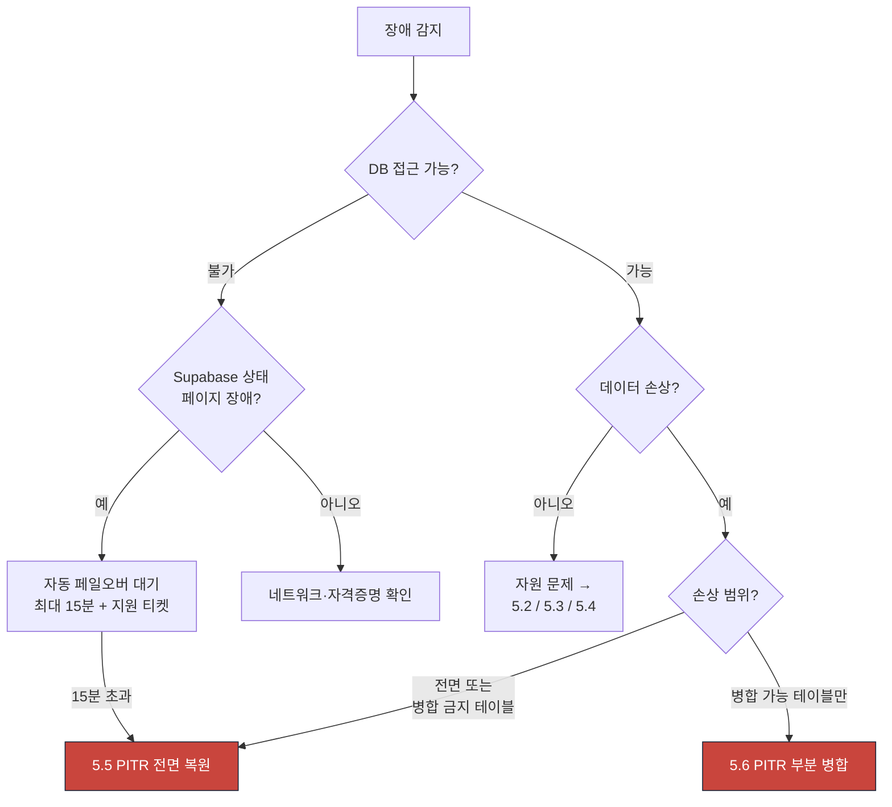

# RB-05 DB 장애와 시점 복구

| 항목 | 값 |
|---|---|
| 심각도 | **SEV1** |
| 1차 담당 | 운영 엔지니어(OE) |
| 에스컬레이션 | 5분 미확인 → IC 자동 호출 / 15분 → 경영진 / 30분 → 고객 공지 / 60분(RTO) 초과 → 대체 운영 방안 결정 |
| 관련 SLO | **RPO 5분 / RTO 60분** · O-01 가용성 99.9% · O-08 접수 완료 작업 유실 0건 |
| 관련 kill switch | 없음 (kill switch로 해결되지 않는다) |
| 관련 문서 | [../phase0/backup-recovery.md](../phase0/backup-recovery.md) · [../phase0/failure-modes.md](../phase0/failure-modes.md) F-05 · [../adr/0004-database-and-object-storage.md](../adr/0004-database-and-object-storage.md) |

---

## 1. 탐지 조건

| 알림 | 메트릭 | 임계값 | 관측 창 | 심각도 |
|---|---|---|---|---|
| `db_connection_saturation` | 커넥션 사용률 | > 85% | 5분 | SEV2 |
| `db_connection_exhausted` | 커넥션 획득 실패 | > 10건 | 1분 | **SEV1** |
| `db_commit_failure` | 커밋 실패율 | > 0.1% | 5분 | **SEV1** |
| `db_replication_lag` | `pg_stat_replication` 지연 | > 30 s | 5분 | SEV2 |
| `db_unreachable` | 헬스체크 실패 | 연속 3회 | 90초 | **SEV1** |
| `db_disk_pressure` | 디스크 사용률 | > 85% | 15분 | SEV2 |
| | | > 92% | 5분 | **SEV1** |
| `db_lock_wait` | 잠금 대기 최장 시간 | > 30 s | 5분 | SEV2 |
| `invariant_violation_critical` | I-01·I-02·I-15 위반 | > 0 | 일 배치 | **SEV1** |
| `data_corruption_report` | 사용자 신고 "데이터가 이상하다" | 2건 이상 | 30분 | **SEV1** |
| Supabase 상태 페이지 | 외부 공지 | 장애 선언 | — | SEV1 |

---

## 2. 심각도 판정

| 조건 | 심각도 | 복구 경로 |
|---|---|---|
| DB 완전 접근 불가 | **SEV1** | R-1 페일오버 대기 → 안 되면 R-4 |
| 쓰기 불가, 읽기 가능 | **SEV1** | R-1 |
| 데이터 손상 확인 (잘못된 마이그레이션·대량 삭제) | **SEV1** | **R-2 PITR** |
| 특정 테이블만 오염 | **SEV1** | R-3 부분 병합 |
| 커넥션 고갈 | **SEV1** | 5.2 (PITR 불필요) |
| 디스크 92% 초과 | **SEV1** | 5.3 (PITR 불필요) |
| 복제 지연 30초 초과, 쓰기 정상 | SEV2 | 5.4 |
| 잠금 대기 30초 초과 | SEV2 | 5.2 |
| 리전 전체 장애 | **SEV1** | R-4 |

**핵심 판단**: PITR은 되돌릴 수 없다. **커넥션·잠금·디스크 문제는 PITR로 해결하지 않는다.**

---

## 3. 즉시 중지할 기능

### 3.1 쓰기 차단 (데이터 손상 확인 시)

손상이 진행 중이면 **더 이상 오염되지 않게** 쓰기를 막는다.

```bash
# 애플리케이션 읽기 전용 모드 (환경변수 + 재배포)
APP_READ_ONLY=true
```

읽기 전용 모드에서:

- 모든 쓰기 API가 `503 SERVICE_DEGRADED` + `Retry-After: 300`
- 조회·오늘 운영실·성적 열람은 정상
- 워커는 새 클레임을 중단하고 진행 중 작업만 완료

### 3.2 부하 경감 (커넥션 고갈 시)

```bash
pnpm --filter @su-maek/db kill-switch enable ai_provider:anthropic --reason "RB-05 DB 부하 경감" --actor <이메일>
pnpm --filter @su-maek/db kill-switch enable document_export --reason "RB-05 DB 부하 경감" --actor <이메일>
pnpm --filter @su-maek/db kill-switch enable auto_schedule_recalc --reason "RB-05 DB 부하 경감" --actor <이메일>
```

**중지해도 반드시 되는 것** (DB가 살아 있는 한):

- 로그인·조회·오늘 운영실
- 시험 응시·답안 저장·제출
- 자동 채점(`realtime` 큐)
- 수동 채점

**절대 하지 않는 것**: **쓰기를 성공으로 응답하지 않는다.** 커밋을 확인하지 못하면 실패로 응답한다. 200을 준 것은 반드시 살아 있어야 한다.

---

## 4. 진단

### 4-1. DB 접근성과 기본 상태

```sql
SELECT now() AS db_time, version(), pg_is_in_recovery() AS is_replica;

SELECT count(*) FILTER (WHERE state = 'active')               AS active,
       count(*) FILTER (WHERE state = 'idle')                 AS idle,
       count(*) FILTER (WHERE state = 'idle in transaction')  AS idle_in_tx,
       count(*)                                               AS total,
       max(now() - query_start) FILTER (WHERE state = 'active') AS longest_query,
       max(now() - xact_start)  FILTER (WHERE xact_start IS NOT NULL) AS longest_tx
FROM pg_stat_activity WHERE datname = current_database();
```

### 4-2. 잠금 대기

```sql
SELECT bl.pid          AS blocked_pid,
       bl.usename      AS blocked_user,
       left(bl.query, 120) AS blocked_query,
       kl.pid          AS blocking_pid,
       left(kl.query, 120) AS blocking_query,
       now() - bl.query_start AS blocked_for
FROM pg_stat_activity bl
JOIN pg_locks blk ON blk.pid = bl.pid AND NOT blk.granted
JOIN pg_locks klk ON klk.locktype = blk.locktype
                 AND klk.relation IS NOT DISTINCT FROM blk.relation
                 AND klk.granted
JOIN pg_stat_activity kl ON kl.pid = klk.pid
ORDER BY blocked_for DESC LIMIT 20;
```

### 4-3. 디스크·테이블 크기

```sql
SELECT pg_size_pretty(pg_database_size(current_database())) AS db_size;

SELECT c.relname,
       pg_size_pretty(pg_total_relation_size(c.oid)) AS total,
       pg_size_pretty(pg_relation_size(c.oid))       AS heap,
       c.reltuples::bigint                           AS approx_rows
FROM pg_class c JOIN pg_namespace n ON n.oid = c.relnamespace
WHERE n.nspname = 'public' AND c.relkind IN ('r','p')
ORDER BY pg_total_relation_size(c.oid) DESC LIMIT 20;

-- 기본 파티션에 쌓인 행 (선행 생성 실패 신호)
SELECT c.relname, c.reltuples::bigint
FROM pg_class c JOIN pg_namespace n ON n.oid = c.relnamespace
WHERE n.nspname = 'public' AND c.relname LIKE '%\_default'
  AND c.reltuples > 0;
```

### 4-4. 손상 시점 역추적 (PITR 판단의 핵심)

```sql
-- 감사 로그로 무엇이 언제 일어났는지 (audit_events는 불변 — 신뢰 가능)
SELECT occurred_at, organization_id, actor_user_id, actor_kind, action,
       target_type, target_id, reason, permission_basis
FROM audit_events
WHERE occurred_at > now() - interval '6 hours'
  AND action IN ('route.publish','schedule.proposal_applied','grading.regrade',
                 'content.quarantine','rights.suspend','organization.purge')
ORDER BY occurred_at DESC
LIMIT 100;

-- 최근 마이그레이션 실행 이력
SELECT * FROM schema_migrations ORDER BY applied_at DESC LIMIT 10;

-- 대량 변경 감지 (테이블별 최근 수정)
SELECT 'sessions' AS tbl, count(*), min(updated_at), max(updated_at)
FROM sessions WHERE updated_at > now() - interval '6 hours'
UNION ALL SELECT 'attempts', count(*), min(updated_at), max(updated_at)
FROM attempts WHERE updated_at > now() - interval '6 hours'
UNION ALL SELECT 'grade_decisions', count(*), min(created_at), max(created_at)
FROM grade_decisions WHERE created_at > now() - interval '6 hours'
UNION ALL SELECT 'question_versions', count(*), min(updated_at), max(updated_at)
FROM question_versions WHERE updated_at > now() - interval '6 hours';
```

### 4-5. 불변 조건 검증 (손상 범위 확정)

```bash
psql "$DATABASE_URL" -f packages/db/src/checks/invariants.sql
```

전부 0행이어야 정상. 위반 항목이 손상 범위를 알려준다.

### 4-6. 복제 지연

```sql
SELECT client_addr, state, sent_lsn, write_lsn, flush_lsn, replay_lsn,
       write_lag, flush_lag, replay_lag
FROM pg_stat_replication;
```

---

## 5. 복구 절차

### 5.1 경로 선택



### 5.2 커넥션·잠금 (PITR 불필요)

```sql
-- 장기 유휴 트랜잭션 종료 (10분 초과)
SELECT pg_terminate_backend(pid), pid, usename, now() - xact_start AS age,
       left(query, 100)
FROM pg_stat_activity
WHERE datname = current_database()
  AND state = 'idle in transaction'
  AND now() - xact_start > interval '10 minutes';

-- 차단 유발 쿼리 종료 (4-2에서 확인한 blocking_pid)
SELECT pg_terminate_backend($1);
```

후속: web 인스턴스 수 축소, 인스턴스당 `pool max` 10 확인, transaction pooler 모드 확인.

### 5.3 디스크 압박 (PITR 불필요)

| # | 조치 | 회수량 예상 |
|---|---|---|
| 1 | 보존 기간 초과 파티션 DETACH + DROP | 큼 |
| 2 | `outbox_events` sent 7일 초과 정리 | 68 GB |
| 3 | `job_runs` 90일 초과 정리 | 72 GB |
| 4 | `idempotency_keys` 24시간 초과 정리 | 작음 |
| 5 | 대형 테이블 `VACUUM (ANALYZE)` | 팽창분 |
| 6 | Supabase 디스크 확장 | 즉시 |

```sql
DELETE FROM idempotency_keys WHERE expires_at < now();
-- 파티션 정리는 scripts로
```

```bash
node scripts/partition-maintenance.mjs --mode=purge --dry-run
node scripts/partition-maintenance.mjs --mode=purge
```

### 5.4 복제 지연 (PITR 불필요)

원인 대부분은 대량 쓰기다. 부하 경감(3.2) 후 자연 회복을 기다린다. 30분 이상 지속되면 Supabase 지원 티켓.

### 5.5 PITR 전면 복원

**절대 규칙: 운영 DB를 직접 PITR 하지 않는다.** 별도 프로젝트로 복원해 검증한 뒤 전환한다.

| # | 단계 | 명령·절차 | 예상 소요 |
|---|---|---|---|
| 1 | **쓰기 차단** — `APP_READ_ONLY=true` 배포 | 3.1 | 5분 |
| 2 | 손상 시점 확정 — 4-4로 첫 손상 시각 특정 | 4-4 | 10분 |
| 3 | **복원 대상 시점 = 첫 손상 시각 − 60초** | 기록 | 2분 |
| 4 | 별도 Supabase 프로젝트로 PITR 복원 | Supabase 콘솔 또는 API | 20~40분 |
| 5 | 복원본 검증 | 5.7 | 15분 |
| 6 | 전면/부분 결정 (IC + 도메인 소유자) | — | 5분 |
| 7 | 트래픽 전환 — `DATABASE_URL` 교체 + 재배포 | 배포 | 5분 |
| 8 | 복구 후 검증 (6장) | — | 15분 |
| 9 | 쓰기 재개 — `APP_READ_ONLY=false` | 배포 | 5분 |
| 10 | 큐 재개 (지터) | 5.8 | 2분 |
| 11 | 미처리 삭제 요청 재실행 | 5.9 | 10분 |

**손실 계산**: 복원 시점 T와 장애 인지 시점 T+n 사이의 모든 데이터가 사라진다. 6장 V-11로 손실 목록을 산출해 조직별로 공지한다.

### 5.6 PITR 부분 병합

**병합 가능 테이블만** 허용한다.

| 병합 가능 | 근거 |
|---|---|
| `responses` (특정 파티션) | `attempts`가 살아 있으면 FK 유지 |
| `mastery_evidences` | append-only, `grade_decisions` 참조만 |
| `question_versions` 본문 | 참조 방향 단방향 |
| `curriculum_*` (릴리스 단위) | 원자적 발행 단위 |

| 병합 금지 | 근거 |
|---|---|
| `attempts` 단독 | `assessment_instances`·`assignments`와 상태 불일치 |
| `sessions` 단독 | EXCLUDE 제약과 충돌 |
| `route_versions` 단독 | `active_version_id` 포인터 불일치 |
| `outbox_events`·`inbox_messages` | 중복 처리·순서 붕괴 |
| `idempotency_keys` | 중복 실행 유발 |

절차:

```bash
# 1. 복원본에서 대상 테이블만 덤프
pg_dump "$RESTORED_URL" -Fc -t responses_2026_08 -f /tmp/responses_2026_08.dump

# 2. 운영에 임시 스키마로 복원
psql "$DATABASE_URL" -c "CREATE SCHEMA IF NOT EXISTS recovery;"
pg_restore -d "$DATABASE_URL" --schema=recovery /tmp/responses_2026_08.dump

# 3. 차이 확인 후 병합 (2인 승인 필수)
```

```sql
-- 3-1. 차이 확인
SELECT count(*) AS missing_in_prod
FROM recovery.responses r
WHERE NOT EXISTS (SELECT 1 FROM public.responses p WHERE p.id = r.id);

-- 3-2. 병합 (UPSERT — 운영의 최신 데이터를 덮지 않는다)
INSERT INTO public.responses
SELECT * FROM recovery.responses r
WHERE NOT EXISTS (SELECT 1 FROM public.responses p WHERE p.id = r.id);

-- 3-3. 정리
DROP SCHEMA recovery CASCADE;
```

### 5.7 복원본 검증 (전환 전 필수)

```bash
node scripts/verify-recovery.mjs --target="$RESTORED_URL"
```

| # | 검증 | 통과 조건 |
|---|---|---|
| V-1 | 불변 조건 20개 | 전부 0행 |
| V-2 | 테넌트 격리 (RLS) | 교차 테넌트 0행 (`SET LOCAL ROLE authenticated` 필수) |
| V-3 | 참조 무결성 | FK 위반 0건 |
| V-4 | 활성 일정 버전 | 포인터가 `published`를 가리킴 |
| V-5 | 제출·채점 수 | 복원 시점 기준 예상값과 일치 |
| V-6 | 파일 체크섬 | Storage 표본 1,000건 100% 일치 |

### 5.8 큐 재개

```sql
-- lease 정리
UPDATE jobs SET status='queued', lease_until=NULL, locked_by=NULL,
       run_after = now() + (random() * interval '600 seconds'), updated_at = now()
WHERE status = 'running';

-- Outbox 릴레이 lease 정리
UPDATE outbox_events SET relay_lease_until = NULL, relay_holder = NULL
WHERE status = 'pending';
```

**`inbox_messages`와 `idempotency_keys`가 함께 복원됐는지 반드시 확인한다.** 없으면 전 이벤트가 재처리되어 중복 반영이 일어난다.

### 5.9 미처리 삭제 요청 재실행

PITR로 되돌리면 삭제한 데이터가 살아난다.

```sql
SELECT * FROM data_deletion_requests
WHERE processed_at > $restore_point
ORDER BY requested_at;
```

이 목록의 삭제 요청을 **다시 실행**한다.

---

## 6. 검증

| # | 항목 | 검증 명령·쿼리 | 통과 조건 |
|---|---|---|---|
| V-1 | 불변 조건 20개 | `psql -f packages/db/src/checks/invariants.sql` | 전부 0행 |
| V-2 | 테넌트 격리 | `pnpm --filter @su-maek/db test:rls` | 교차 테넌트 0행 |
| V-3 | 참조 무결성 | `node scripts/verify-recovery.mjs` | FK 위반 0 |
| V-4 | 활성 일정 버전 | 아래 쿼리 | 0행 |
| V-5 | 제출·채점 수 | 아래 쿼리 | 예상값 일치 |
| V-6 | 파일 체크섬 | `node scripts/checksum-snapshot.mjs --verify` | 100% 일치 |
| V-7 | 미완료 작업 재클레임 | 4-1 + 큐 상태 | `running` lease 만료 0건 |
| V-8 | 이벤트 워터마크 | `inbox_messages` 행 수 ≥ 복원 시점 값 | 통과 |
| V-9 | 읽기 모델 | `node scripts/rebuild-read-models.mjs` 후 표본 100건 | 원본과 일치 |
| V-10 | 합성 모니터링 | SYN-1·SYN-2·SYN-3·SYN-4 | 전부 성공 |
| V-11 | **손실 범위 산출** | 아래 쿼리 | 조직별 목록 확보 |
| V-12 | 삭제 요청 재실행 | 5.9 | 0건 남음 |

```sql
-- V-4
SELECT rp.id, rp.active_version_id, rv.status
FROM route_plans rp LEFT JOIN route_versions rv ON rv.id = rp.active_version_id
WHERE rp.active_version_id IS NOT NULL AND (rv.id IS NULL OR rv.status <> 'published');

-- V-5
SELECT date_trunc('day', submitted_at) AS day, count(*) AS submitted
FROM attempts WHERE submitted_at < $restore_point
GROUP BY 1 ORDER BY 1 DESC LIMIT 14;

-- V-11: 손실 범위 (복원 시점 이후 접수분 — 조직별)
-- 장애 전 스냅샷(모니터링 카운터)과 대조해 산출한다.
SELECT organization_id,
       count(*) FILTER (WHERE submitted_at > $restore_point) AS lost_submissions_est
FROM attempts GROUP BY 1 HAVING count(*) > 0;
```

---

## 7. 고객 공지

### 공지 필요 여부

| 조건 | 공지 |
|---|---|
| SEV1 (DB 장애) | **필수.** 30분 이내 |
| PITR 수행 (데이터 손실 발생) | **필수** + 손실 범위 명시 + 법률 검토 |
| 읽기 전용 모드 진입 | **필수** |
| 커넥션·디스크 문제로 일시 지연, 손실 없음 | 필요 시 |

### 초기 공지

> **[수맥] 서비스 장애 안내**
>
> 안녕하세요. 수맥 운영팀입니다.
>
> {UTC 시각} (한국 시각 {KST})부터 데이터베이스 장애로 **서비스 이용에 문제**가 발생하고 있습니다.
>
> - 현재 상태: {전체 이용 불가 / 조회만 가능 (읽기 전용 모드)}
> - 영향 범위: 전체 조직
> - 복구 목표: 60분 이내
>
> **중요**
> - **저장에 성공했다고 표시된 데이터는 보존됩니다.** 실패로 표시된 작업은 다시 시도해 주세요.
> - 학생이 작성 중이던 답안은 브라우저에 임시 보관되어 있습니다. 창을 닫지 않도록 안내해 주세요.
>
> **지금 하실 일**
> - 진행 중인 시험이 있으면 학생에게 "창을 닫지 말고 대기"를 안내해 주세요.
> - 복구 후 마감 시각을 연장해 드립니다.
>
> 다음 안내는 {30분 후 시각}에 드리겠습니다.

### 진행 중 공지

> **[수맥] 서비스 장애 — 진행 상황 ({N}차)**
>
> - 원인: {확인된 사실만}
> - 조치: {수행한 것}
> - 현재: {조회 가능 / 복원 진행 중 ({N}% 완료)}
> - 복구 예상: {시각}
>
> {PITR 수행 시: "데이터 복원 작업을 진행 중이며, {복원 시점} 이후에 저장된 일부 데이터가 영향받을 수 있습니다. 정확한 범위는 복구 완료 후 개별 안내드리겠습니다."}
>
> 다음 안내: {시각}

### 해소 공지 (손실 없음)

> **[수맥] 서비스 정상화 안내**
>
> {UTC 시각}부로 서비스가 정상 복구되었습니다.
>
> | 항목 | 내용 |
> |---|---|
> | 장애 시간 | {시작} ~ {종료} (총 {N}분) |
> | 데이터 손실 | **없음** |
> | 영향 | 서비스 이용 불가 |
>
> **확인 부탁드립니다**
> - 장애 시간에 진행하려던 작업이 정상 반영되었는지 확인해 주세요.
> - 영향받은 시험의 마감 시각을 연장해 드렸습니다.

### 해소 공지 (PITR — 손실 있음)

> **[수맥] 서비스 정상화 및 데이터 복원 안내**
>
> {UTC 시각}부로 서비스가 복구되었습니다. **일부 데이터가 복원 시점 상태로 되돌아갔습니다.**
>
> | 항목 | 내용 |
> |---|---|
> | 장애 시간 | {시작} ~ {종료} |
> | 데이터 복원 시점 | {복원 시점} (한국 시각) |
> | **영향 데이터** | 복원 시점 이후 ~ 장애 발생 사이에 저장된 데이터 |
> | 귀 조직 영향 | 응시 {N}건, 채점 {N}건, 일정 변경 {N}건 |
>
> **첨부 파일**에 영향받은 항목 목록을 담았습니다.
>
> **지금 하실 일**
> 1. 첨부 목록의 응시 건은 학생에게 재응시를 안내해 주세요. 마감을 연장해 두었습니다.
> 2. 수업 진도 기록은 다시 입력이 필요합니다.
> 3. 반입 중이던 문제집은 자동으로 재처리됩니다.
>
> 데이터 손실이 발생한 점 깊이 사과드립니다. 원인과 재발 방지 대책을 영업일 5일 이내에 안내드리겠습니다.
> 추가 확인이 필요하시면 회신해 주세요.

---

## 8. 법률·규제 검토

| 조건 | 검토 필요 | 사유 |
|---|---|---|
| **PITR로 데이터 손실 발생** | **필요 (필수)** | 계약상 데이터 보전 의무. 손실 범위와 통지 문안 검토 |
| 성적·평가 기록 손실 | **필요** | 학사 기록. 조직-학부모 분쟁 가능 |
| 개인정보가 복원으로 되살아남 (삭제 요청분) | **필요** | 삭제 요청 재실행 확인. 5.9 |
| 백업 접근 과정에서 권한 문제 | **필요** | 접근 통제 |
| RTO 60분 초과 | **필요** (계약 검토) | SLA 조항 |
| 커넥션·디스크 문제, 손실 없음 | 불필요 | — |

**PITR 수행 시 공지 문안은 반드시 법률 검토 후 발송한다.**

---

## 9. 사후 조치

- [ ] 사후 분석 작성 (영업일 5일 이내)
- [ ] **RTO 60분을 지켰는가.** 못 지켰다면 어느 단계가 병목이었나
- [ ] **RPO 5분을 지켰는가.** 실제 손실 시간을 기록
- [ ] 월별 자동 복구 검증에서 이 시나리오가 잡혔는가. 안 잡혔다면 검증 항목 추가
- [ ] 분기 복구 훈련의 시나리오에 이번 유형을 추가했는가
- [ ] 손상 시점 역추적(4-4)이 충분했는가. 감사 로그로 특정 가능했는가
- [ ] 복원본 검증(5.7)이 실제 문제를 잡았는가
- [ ] `inbox_messages`·`idempotency_keys`가 함께 복원되어 중복 처리가 없었는가
- [ ] 미처리 삭제 요청 재실행(5.9)을 수행했는가
- [ ] 읽기 전용 모드가 실제로 쓰기를 전부 막았는가. 누수 경로가 있었나
- [ ] 커넥션 풀 설정(인스턴스당 10, 총 180)을 재검토했는가
- [ ] 파티션 선행 생성이 실패해 디스크 압박이 왔다면 스케줄러를 점검했는가
- [ ] 오류 예산 소진율 기록. 50% 초과 시 배포 제동 적용
