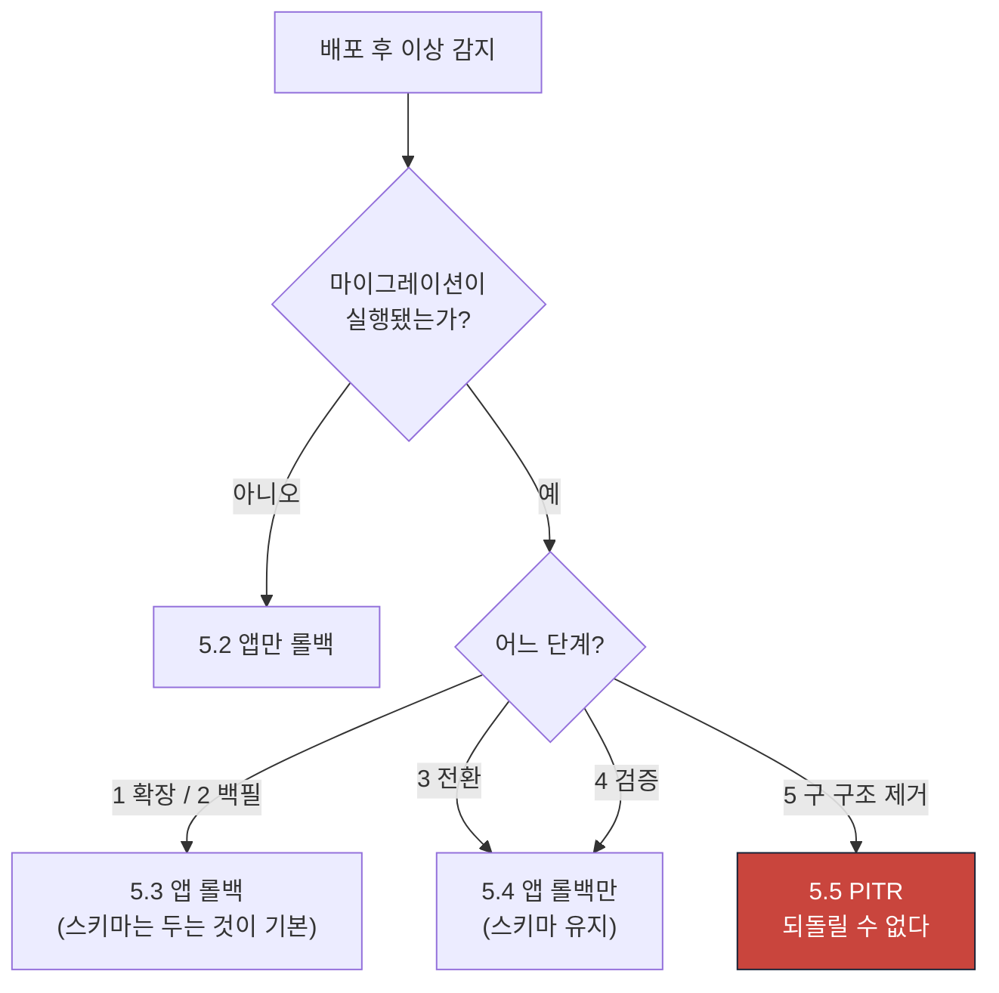

# RB-14 배포 실패와 DB 마이그레이션 롤백

| 항목 | 값 |
|---|---|
| 심각도 | **SEV1** (배포 후 SLO·불변 위반) / SEV2 (마이그레이션 실패, 서비스 정상) |
| 1차 담당 | 운영 엔지니어(OE) |
| 에스컬레이션 | 5분 미확인 → IC / 롤백 실패 → 경영진 + [RB-05](./05-db-failure-pitr.md) 병행 |
| 관련 SLO | O-01 가용성 99.9% · 전 불변 조건 |
| 관련 kill switch | 없음 (배포 롤백이 해결책) |
| 관련 문서 | [../phase0/backup-recovery.md](../phase0/backup-recovery.md) 8장 · [../phase0/failure-modes.md](../phase0/failure-modes.md) F-18 |

---

## 0. 정정 기록 (2026-08-01)

이 런북은 **실행하면 실패하는 명령과 사실이 아닌 서술**을 담고 있었다. 인수 35가
📋에서 🟡로 강등된 직접 원인이다. 장애 중에 읽는 문서가 틀리면 런북이 없는 것보다
나쁘다 — 담당자가 그 서술을 믿고 시간을 쓰기 때문이다. 아래는 무엇이 왜 틀렸는지의
전체 목록이다. 각 지점에도 `정정:` 주석을 남겼다.

| # | 틀렸던 서술 | 실제 | 왜 틀렸나 |
|---|---|---|---|
| 1 | 원장 테이블 `schema_migrations`, 컬럼 `version·checksum·execution_ms·applied_by` | `su_maek_migrations`, 컬럼은 `name`·`applied_at` **둘뿐** | 일반적인 마이그레이션 도구의 스키마를 그대로 적었다. 자체 러너(`packages/db/src/migrate.ts:25`)는 훨씬 단순하다 |
| 2 | Inbox 테이블 `inbox_messages`, 컬럼 `outcome`·`processed_at` | `inbox_events`, 컬럼은 `consumer_name`·`event_id`·`processed_at` **셋뿐**. `outcome` 없음 | 4-7 쿼리 전체가 실행 불가였다. `outcome`이 없으므로 `skipped_unknown` 판정은 **애초에 불가능**하다 |
| 3 | "역방향 스크립트는 각 마이그레이션에 **필수 첨부**되어 있다" + `0042_add_column.down.sql` | 저장소의 `*.down.sql` **0건**. `0042_*` 파일도 없다(현재 0000~0005a) | 규약 문서(backup-recovery 8.2 규칙 3)의 *하려던 것*을 *되어 있는 것*으로 적었다. 롤백은 **런북 절차로만** 존재한다 |
| 4 | `migrate --dry-run` | `migrate.ts`는 **argv를 읽지 않는다**. 플래그는 조용히 무시되고 **그대로 실행된다** | 장애 중 "확인만" 하려다 운영에 적용하게 되는 위험한 오기였다 |
| 5 | `test:rls` · `test:smoke` · `test:compat` | 셋 다 `package.json`에 **없다** | 검증 단계 V-4·V-12·V-13이 전부 실행 불가였다 |
| 6 | "전 SQL `if not exists` 가드로 멱등" | `CREATE TABLE` 89건·`CREATE INDEX` 141건 중 가드 **0건**. 멱등성의 실제 출처는 `su_maek_migrations` 원장이 적용된 파일명을 건너뛰는 것 | Drizzle 생성물(`NNNN_*.sql`)에는 가드가 없다. 수기 파일(`NNNNa_*.sql`)만 `drop … if exists` + `create`로 재실행 가능하다 |
| 7 | 트리거 `audit_events_no_update`·`audit_events_no_delete`·`assessment_questions_immutable`·`sessions_immutable_when_locked` | 넷 다 **존재하지 않는 이름**. 실제는 `audit_events_immutable`(update·delete 한 트리거)·`mastery_evidences_immutable`·`progress_events_immutable`·`grade_decisions_immutable` | 5.7의 `ALTER TABLE … ENABLE TRIGGER`가 전부 오류로 끝난다. 4-4는 `progress_events`를 **빠뜨린 채** 트리거 없는 테이블 6개를 넣고 있었다 |
| 8 | `jobs.run_after`·`jobs.queue IN ('ai','render','schedule','default')` | 컬럼은 `run_at`·`topic`. `queue` 컬럼 없고 토픽은 `schedule.recalculate` 꼴의 점 표기 | 5.9의 UPDATE가 실행 불가였다 |
| 9 | "이벤트는 Outbox에 남아 있다 … 소비자 배포 후 자동 해소" | **거짓.** 디스패처(`queue.ts:315-345`)는 `EVENT_CONSUMERS`에 없는 `event_type`이면 작업을 하나도 만들지 않고 그 행을 **`delivered`로 표시한다**. 소비자를 나중에 배포해도 **재생되지 않는다** | 이 서술이 배포 순서 규칙의 위험도를 정반대로 알려주고 있었다. 발행자 선배포는 "무해"가 아니라 **이벤트 영구 유실**이다 |
| 10 | 워커 SIGTERM "진행 작업 최대 120초 완료 대기" | 드레인 타이머 **없음**. 현재 배치만 끝내고 종료하며, 클레임된 채 미완료인 작업은 **lease 300초 만료 후** 다른 워커가 다시 집는다 | 없는 우아한 종료를 있다고 적었다 |
| 11 | V-14 kill switch "전부 `false`" | 정반대. `kill_switches.enabled = false`가 **중지 중**이라는 뜻이다. 정상 복구 상태는 `enabled = true` 또는 **행 없음** | 이대로 검증하면 "전 기능 중지"를 통과로 판정한다 |

**고치지 않고 남긴 것** — 이것도 정직한 회계다:

- **`*.down.sql`을 만들지 않았다.** 이 과제는 문서만 고친다. 역방향 스크립트가 필요하다는
  판단 자체는 유효하므로 규약(backup-recovery 8.2 규칙 3)은 남기고, 런북에는 **지금
  없다**는 사실과 그래서 5.3이 어떻게 달라지는지를 적었다.
- **합성 모니터링 SYN-1~SYN-5는 구현이 없다.** [../phase0/slo.md](../phase0/slo.md) 4.2의
  설계만 있고 프로버 코드는 0건이다. V-11을 지울 게 아니라 "미구현"으로 표시했다.
- **롤링 배포의 실체(Dockerfile·health 엔드포인트)가 없다.** 3.1·3.2의 블루·그린 절차는
  아직 플랫폼 명령의 자리 표시자다.
- **CI 게이트 2종(역방향 스크립트 존재·스키마 드리프트)이 없다.** `.github/workflows/ci.yml`은
  `boundary:check`·`lint`·`typecheck`·`test`·`build`만 돈다. 9장 체크리스트에 그대로 남겼다.

---

## 1. 탐지 조건

| 알림 | 조건 | 임계값 | 관측 창 | 심각도 |
|---|---|---|---|---|
| `deploy_slo_breach` | 배포 후 SLO 위반 | O-01·O-02·L-01·L-02 중 하나 | 배포 후 15분 | **SEV1** |
| `deploy_error_spike` | 5xx 응답률 | 배포 전 대비 3배 | 배포 후 10분 | **SEV1** |
| `deploy_invariant_violation` | 불변 조건 위반 | > 0 | 배포 후 즉시 검증 | **SEV1** |
| `deploy_smoke_failure` | 배포 스모크 테스트 | 실패 | 전환 전 | SEV2 (자동 차단) |
| `migration_failure` | 마이그레이션 러너 실패 | 1건 | 실행 시 | SEV2 |
| `migration_lock_timeout` | ACCESS EXCLUSIVE 잠금 대기 | > 5 s | 실행 중 | SEV2 |
| `migration_drift` | Drizzle 스키마 vs 실제 DB 차이 | > 0 | 수동(4-3) | SEV2 |
| `rolling_incompatibility` | 소비자 없는 `event_type` 발행 (4-7) | > 0 | 롤링 중 | **SEV1** |
| `trigger_disabled` | 트리거 `tgenabled='D'` | > 0 | 배포 후 검증 | **SEV1** |
| `rls_policy_missing_after_deploy` | RLS 정책 누락 | > 0 | 배포 후 검증 | **SEV1** (→ [RB-06](./06-cross-tenant-exposure.md)) |

---

## 2. 심각도 판정

| 조건 | 심각도 |
|---|---|
| 배포 후 불변 조건 위반 (특히 I-01·I-02·I-15) | **SEV1** |
| 배포 후 RLS 정책·트리거 소실 | **SEV1** (→ [RB-06](./06-cross-tenant-exposure.md)) |
| 배포 후 시험 시간대 SLO 위반 | **SEV1** (→ [RB-01](./01-exam-start-submit-failure.md)) |
| 배포 후 5xx 급증 | **SEV1** |
| 마이그레이션이 대형 테이블을 장시간 잠금 | **SEV1** (쓰기 중단) |
| 마이그레이션 실패, 트랜잭션 롤백됨, 서비스 정상 | SEV2 |
| 스모크 테스트 실패로 전환 차단 (정상 동작) | SEV2 |
| 스키마 드리프트 (CI에서 차단) | SEV3 |
| 롤링 중 일시적 계약 불일치, 자동 해소 | SEV3 |

---

## 3. 즉시 중지할 기능

**배포 롤백이 해결책이다. kill switch는 보조 수단이다.**

### 3.1 즉시 롤백 (블루·그린)

```bash
# 트래픽을 이전 버전으로 즉시 전환
# (배포 플랫폼 명령. 예: Vercel promote, 컨테이너 이전 리비전 활성화)
```

전환 시간 목표: **2분 이내.**

### 3.2 워커 롤백

```bash
# 워커는 별도 배포 단위. 함께 롤백한다.
# SIGTERM → 새 클레임 중단 → 현재 배치 종료 후 프로세스 종료 → 이전 이미지 기동
```

> **정정(2026-08-01)**: 여기에 "진행 작업 최대 120초 완료 대기"라고 적혀 있었으나
> **드레인 타이머는 없다**. `apps/worker/src/main.ts:64-69`의 SIGTERM 핸들러는
> `shuttingDown = true`만 세우고, 루프는 **이미 클레임한 배치를 끝낸 뒤** 종료한다.
> 그 시점에 끝나지 않은 작업은 `running` 상태로 남았다가 **lease 300초**
> (`queue.ts:79`)가 만료되면 다른 워커가 다시 집는다. 즉 유실은 없지만 **최대 5분
> 지연**된다. 롤백 직후 큐가 5분간 조용한 것은 정상이다 — 이것을 장애로 오판하지 말 것.

### 3.3 부하 경감 (롤백 중)

```bash
pnpm kill-switch stop ai_provider:anthropic --reason "RB-14 배포 롤백 중" --actor <이메일>
pnpm kill-switch stop document_export --reason "RB-14 배포 롤백 중" --actor <이메일>
```

> **정정**: 표준 동사는 `stop`/`resume`이다(`scripts/kill-switch.mts:135-143`). 예전 런북
> 표현인 `enable`/`disable`도 아직 받아주지만 경고를 찍는다 — `enable`이 "기능 켜기"로
> 읽히는데 실제로는 **중지**이기 때문이다. 헷갈릴 여지를 남기지 않으려 표준 동사로 바꿨다.

**롤백해도 반드시 되는 것**:

- 시험 응시·답안 저장·제출
- 자동·수동 채점
- 오늘 운영실·일정 조회
- 기존 확정 데이터 전체

**절대 하지 않는 것**:

- 마이그레이션을 되돌리려고 `DROP COLUMN`을 성급히 실행 — 데이터가 사라진다
- 5단계(구 구조 제거) 마이그레이션을 롤백 시도 — **되돌릴 수 없다.** PITR만이 경로

---

## 4. 진단

### 4-1. 배포 전후 지표 비교

```sql
-- 배포 시각을 $deploy_at으로 두고 전후 30분 비교 (메트릭 백엔드에서도 확인)
SELECT CASE WHEN a.submitted_at < $deploy_at THEN 'before' ELSE 'after' END AS phase,
       count(*)                                    AS submissions,
       count(*) FILTER (WHERE a.status = 'finalized') AS finalized
FROM attempts a
WHERE a.submitted_at BETWEEN $deploy_at - interval '30 minutes'
                         AND $deploy_at + interval '30 minutes'
GROUP BY 1;
```

### 4-2. 마이그레이션 이력

```sql
SELECT name, applied_at
FROM su_maek_migrations
ORDER BY applied_at DESC, name DESC
LIMIT 15;
```

> **정정**: 테이블명은 `schema_migrations`가 아니라 **`su_maek_migrations`**이고,
> 컬럼은 **`name`·`applied_at` 둘뿐**이다(`packages/db/src/migrate.ts:24-29`).
> `version`·`checksum`·`execution_ms`·`applied_by`는 **없다**.

이 원장이 이 시스템의 **멱등성 그 자체**다. 러너는 `migrations/*.sql`을 파일명 순으로
읽고 **원장에 이름이 있는 파일을 건너뛴다**. SQL 안의 `if not exists` 가드 때문이 아니다
(정정 기록 6번).

원장에 checksum이 없다는 사실의 실제 결과 — **장애 중에 이걸 알아야 한다**:

- 이미 적용된 파일을 나중에 **수정해도 아무도 알아채지 못한다.** 러너는 이름만 보고
  건너뛴다. 코드와 DB가 조용히 갈라진다.
- 그래서 **적용된 마이그레이션 파일은 절대 수정하지 않는다.** 고칠 것이 있으면
  새 번호의 파일을 추가한다.
- 드리프트 의심 시 원장을 믿지 말고 **4-3으로 실제 스키마를 대조**한다.

### 4-3. 스키마 드리프트

```bash
pnpm --filter @su-maek/db generate
git diff --exit-code packages/db/migrations/
```

diff가 비어야 정상. 비어 있지 않으면 **Drizzle 스키마 정의와 마이그레이션 파일**이
어긋난 것이다.

> **정정**: 이것은 *코드 대 실제 DB*가 아니라 *코드 대 마이그레이션 파일* 비교다.
> `drizzle-kit generate`는 DB에 접속하지 않는다. 운영 DB가 파일과 같은지는 이 명령으로
> 알 수 없다 — 4-2의 원장과 실제 `information_schema`를 함께 봐야 한다.
> **이 검사를 도는 CI 게이트는 없다**(`.github/workflows/ci.yml` 확인). 사람이 돌려야 한다.

### 4-4. 트리거 상태 (불변성의 최종 방어선)

**append-only 가드는 정확히 4개다.** 이름을 직접 지정해 확인한다 — 테이블명으로
훑으면 `_set_updated_at` 트리거까지 섞여 판정이 흐려진다.

```sql
SELECT t.tgname, c.relname AS table_name, t.tgenabled,
       CASE t.tgenabled
         WHEN 'O' THEN '활성'
         WHEN 'D' THEN '비활성 (위험)'
         WHEN 'R' THEN 'replica only'
         WHEN 'A' THEN 'always'
       END AS status
FROM pg_trigger t
JOIN pg_class c ON c.oid = t.tgrelid
JOIN pg_namespace n ON n.oid = c.relnamespace
WHERE n.nspname = 'public' AND NOT t.tgisinternal
  AND t.tgname IN ('audit_events_immutable',
                   'mastery_evidences_immutable',
                   'progress_events_immutable',
                   'grade_decisions_immutable')
ORDER BY 1;
```

**통과 조건: 정확히 4행, 전부 `tgenabled='O'`.** 행이 4개 미만이면 트리거가 사라진
것이고, `'D'`가 하나라도 있으면 비활성이다. **둘 다 SEV1이다.**

> **정정**: 이 쿼리는 `assessment_questions`·`route_versions`·`question_versions`·
> `sessions`·`responses`·`attempts`를 훑고 있었는데 **이 테이블들에는 불변성 트리거가
> 없다**(있는 것은 `<테이블>_set_updated_at`뿐이다). 정작 트리거가 있는
> **`progress_events`는 목록에서 빠져 있었다.** 실제 4종은
> `0001a_rls_core.sql:220-233`(audit_events·mastery_evidences·progress_events)과
> `0005a_integrity_guard_repair.sql:44-47`(grade_decisions)에서 만들어진다.

이와 별개로 **비활성 트리거가 어디에도 없는지**를 한 번 훑는다. 마이그레이션이
`disable trigger` 후 복구를 잊으면 여기 걸린다:

```sql
SELECT c.relname AS table_name, t.tgname, t.tgenabled
FROM pg_trigger t
JOIN pg_class c ON c.oid = t.tgrelid
JOIN pg_namespace n ON n.oid = c.relnamespace
WHERE n.nspname = 'public' AND NOT t.tgisinternal AND t.tgenabled <> 'O'
ORDER BY 1, 2;
```

**0행이어야 한다.**

### 4-5. RLS 정책 상태

```sql
SELECT c.relname AS table_without_rls
FROM pg_class c JOIN pg_namespace n ON n.oid = c.relnamespace
WHERE n.nspname = 'public' AND c.relkind IN ('r','p')
  AND EXISTS (SELECT 1 FROM pg_attribute a
              WHERE a.attrelid = c.oid AND a.attname = 'organization_id' AND a.attnum > 0)
  AND NOT c.relrowsecurity;
```

### 4-6. 진행 중인 잠금 (마이그레이션 중)

```sql
SELECT a.pid, a.state, now() - a.query_start AS duration,
       l.locktype, l.mode, c.relname,
       left(a.query, 150) AS query
FROM pg_locks l
JOIN pg_stat_activity a ON a.pid = l.pid
LEFT JOIN pg_class c ON c.oid = l.relation
WHERE l.mode IN ('AccessExclusiveLock','ExclusiveLock','ShareRowExclusiveLock')
  AND a.datname = current_database()
ORDER BY duration DESC;
```

### 4-7. 롤링 배포 중 계약 불일치

> **정정 — 이 절은 통째로 다시 썼다.** 원래 쿼리는 `inbox_messages` 테이블의 `outcome`
> 컬럼에서 `skipped_unknown` 값을 세고 있었다. 셋 다 존재하지 않는다:
> 테이블은 **`inbox_events`**이고, 컬럼은 **`consumer_name`·`event_id`·`processed_at`
> 셋뿐**이며(`0000_*.sql:193-198`), `skipped_unknown`이라는 문자열은 코드베이스
> 어디에도 없다. Inbox는 **"이 소비자가 이 이벤트를 이미 봤는가"만 기록하는 멱등 표시**다
> (`queue.ts:351-359`). 성공·실패·건너뜀을 구분하지 않는다.

**먼저 알아야 할 것 — 미지의 `event_type`은 조용히 버려진다.**

디스패처(`queue.ts:315-345`)는 `EVENT_CONSUMERS` 맵에서 `event_type`을 찾는다.
맵에 없으면 소비자 목록이 빈 배열이 되어 **작업을 하나도 만들지 않고, 그 행을 그대로
`delivered`로 표시한다.** 재시도 대상이 아니게 되므로 **소비자를 나중에 배포해도
재생되지 않는다. 그 이벤트는 영구히 사라진다.**

```sql
-- (a) 소비자가 하나도 매칭되지 않은 채 delivered 처리된 이벤트 — 유실이다
SELECT oe.event_type, oe.schema_version, count(*) AS lost
FROM outbox_events oe
WHERE oe.status = 'delivered'
  AND oe.delivered_at > $deploy_at
  AND NOT EXISTS (
    SELECT 1 FROM jobs j WHERE j.payload->>'eventId' = oe.id::text
  )
GROUP BY 1, 2
ORDER BY 3 DESC;
```

**0행이 아니면 SEV1이다.** 발행자가 소비자보다 먼저 배포됐고, 그 사이 발행된 이벤트가
사라졌다는 뜻이다. (인덱스가 없어 순차 스캔이다. `delivered_at` 범위를 좁게 잡을 것.)

```sql
-- (b) 작업은 만들어졌으나 아무도 집어가지 않는 토픽
--     — 워커에 핸들러가 등록되지 않은 경우다. 유실은 아니고 적체다.
SELECT topic, status, count(*), min(run_at) AS oldest_run_at
FROM jobs
WHERE created_at > $deploy_at
GROUP BY 1, 2
ORDER BY 3 DESC;
```

`queued`가 계속 쌓이는데 `running`·`succeeded`로 넘어가지 않는 토픽이 범인이다.
작업은 큐에 남아 있으므로 **해당 워커를 배포하면 그대로 처리된다.**

> 라우팅표(`EVENT_CONSUMERS`, packages/db/src/queue.ts)의 모든 토픽에 핸들러가
> 등록되어 있는지는 `apps/worker/test/wiring/event-wiring.test.ts`가 CI에서
> 검사한다. 그러므로 (b)에서 아무도 집어가지 않는 토픽이 보이면 **그건 진짜
> 배포 결손이다** — 해당 워커가 안 떠 있거나 구버전이다. `pnpm worker:status`로
> 워커 생존부터 확인한다.
>
> (예전에는 `curriculum.impact-analysis`·`assessment.exclude-question`이 핸들러
> 없이 라우팅표에만 있어 상시 적체의 정상 원인이었다. 지금은 라우팅표에서
> 뺐다 — 근거는 queue.ts 주석.)

```sql
-- (c) 소비 진행 확인 — Inbox는 "봤다"만 기록한다
SELECT ie.consumer_name, count(*) AS consumed, max(ie.processed_at) AS latest
FROM inbox_events ie
WHERE ie.processed_at > $deploy_at
GROUP BY 1
ORDER BY 2 DESC;
```

특정 소비자만 `latest`가 배포 시각에서 멈춰 있으면 그 소비자가 죽었거나 배포되지 않았다.

### 4-8. 불변 조건 전체

```bash
psql "$DATABASE_URL" -f packages/db/src/checks/invariants.sql
```

I-01~I-20(불변 조건) + R-01~R-09(참조 무결성·테넌시·시각·큐 위생) = **29건**. 각 검사는
**위반 행만 반환**하므로 정상이면 전부 0행이다.

> 이 파일은 **실행 가능한 정본**이다. 헤더(16-19행)가 스스로 밝히듯, 런북 본문의 예시
> SQL 중 일부는 Phase 0 시점의 가칭 컬럼명을 쓰고 있어 그대로 돌지 않는다. 0장의 정정은
> 이 런북에 남아 있던 그런 흔적들을 걷어낸 것이다. **런북 SQL과 이 파일이 어긋나면
> 이 파일이 옳다.**

---

## 5. 복구 절차

### 5.1 결정 흐름



### 5.2 앱만 롤백 (마이그레이션 없음)

| # | 조치 | 예상 소요 |
|---|---|---|
| 1 | 트래픽을 이전 리비전으로 전환 | 2분 |
| 2 | 워커 이전 이미지로 전환 | 3분 |
| 3 | 지표 회복 확인 (4-1) | 10분 |
| 4 | 부하 경감 kill switch 해제 | 2분 |

가장 흔하고 가장 안전한 경로다.

### 5.3 앱 롤백 (1·2단계 — 역방향 스크립트는 없다)

확장(`ADD COLUMN`)과 백필은 **무해**하다. 급하게 되돌릴 필요가 없다.

| # | 조치 | 예상 소요 |
|---|---|---|
| 1 | 앱 롤백 (5.2) | 5분 |
| 2 | 지표 회복 확인 | 10분 |
| 3 | 원인 분석. 되돌려야만 한다면 아래 절차 | 10분 |

> **정정 — 여기에 가장 위험한 거짓이 있었다.** 원문은 "역방향 스크립트는 각
> 마이그레이션에 **필수 첨부**되어 있다"고 단언하고
> `psql -f packages/db/migrations/0042_add_column.down.sql`을 실행하라고 했다.
>
> **저장소의 `*.down.sql` 파일은 0건이다.** `0042_*`라는 마이그레이션도 없다
> (현재 `0000`~`0005a`). `find packages/db -name "*.down.sql"` → 결과 없음.
>
> "필수 첨부"는 **규약의 의도**([../phase0/backup-recovery.md](../phase0/backup-recovery.md)
> 8.2 규칙 3)이지 저장소의 상태가 아니었다. 그 규약을 강제하는 **CI 게이트도 없다.**
> 장애 중에 이 문서를 믿고 `.down.sql`을 찾다가 시간을 버리는 일이 없도록 사실을 적는다.

**롤백은 지금 이 런북의 절차로만 존재한다.** 되돌려야 한다면 손으로 SQL을 작성한다:

```bash
# 1) 무엇이 적용됐는지 확인 (4-2)
psql "$DATABASE_URL" -c "select name, applied_at from su_maek_migrations order by applied_at desc limit 5"

# 2) 해당 파일을 열어 역방향 SQL을 직접 작성한다. 파일은 없다 — 사람이 읽고 쓴다.
#    ADD COLUMN → DROP COLUMN, CREATE INDEX → DROP INDEX, ADD CONSTRAINT → DROP CONSTRAINT

# 3) 실행 전 반드시 두 사람이 읽는다. DROP은 되돌릴 수 없다.
psql "$DATABASE_URL" -c "begin; <역방향 SQL>; -- 결과 확인 후 commit"

# 4) 원장에서 해당 행을 지운다. 지우지 않으면 러너가 영영 건너뛴다.
psql "$DATABASE_URL" -c "delete from su_maek_migrations where name = '<파일명>'"
```

4번을 잊는 것이 흔한 실수다. 러너는 **원장의 파일명만 보고** 건너뛰므로, 스키마를
되돌려 놓고 원장 행을 남겨두면 다음 배포에서 그 마이그레이션이 **다시 적용되지 않는다.**

**권장: 확장 단계는 되돌리지 않고 그대로 둔다.** 새 컬럼이 NULL로 남아도 구 버전 앱은
무시한다. 위 절차는 되돌릴 이유가 분명할 때만 쓴다 — 손으로 쓰는 DROP이 회귀보다 위험하다.

### 5.4 앱 롤백만 (3·4단계 — 스키마 유지)

전환·검증 단계에서 문제가 생기면 **스키마는 그대로 두고 앱만 되돌린다.**

| # | 조치 | 예상 소요 |
|---|---|---|
| 1 | 앱 롤백 | 5분 |
| 2 | 구 버전이 새 스키마에서 정상 동작하는지 확인 | 10분 |
| 3 | 트리거·RLS 상태 확인 (4-4·4-5) | 5분 |
| 4 | 불변 조건 검증 (4-8) | 5분 |

**구 버전은 새 컬럼을 무시해도 동작해야 한다**(5단계 규약). 이것이 지켜졌다면 롤백이 안전하다.

### 5.5 PITR (5단계 — 구 구조 제거 후)

**되돌릴 수 없다.** 컬럼을 되살려도 데이터가 없다.

[RB-05](./05-db-failure-pitr.md) 5.5 절차를 따른다. 복원 시점은 **마이그레이션 실행 직전 − 60초**.

### 5.6 마이그레이션 실패 (트랜잭션 롤백됨)

자체 러너는 마이그레이션을 트랜잭션 단위로 실행하므로 **부분 적용이 없다.**

```bash
# 실패 원인 확인 — 러너 로그에 "[migrate] 적용: <파일명>" 다음 줄이 실패 지점이다.
# 어디까지 갔는지는 원장으로 본다 (4-2).
psql "$DATABASE_URL" -c "select name, applied_at from su_maek_migrations order by applied_at desc limit 5"

# 수정 후 재실행 — 원장에 없는 파일만 다시 시도한다
pnpm db:migrate
```

> **정정 — `--dry-run`은 없다. 붙여도 그냥 실행된다.**
> `packages/db/src/migrate.ts`는 `process.argv`를 **읽지 않는다**(파일 전체 55줄, argv 참조 0건).
> 알 수 없는 플래그를 거부하지도 않으므로 `migrate --dry-run`은 조용히 무시되고
> **운영 DB에 그대로 적용된다.** 장애 중 "확인만 해보자"가 실제 변경이 되는 오기였다.
> 미리 보려면 원장과 `migrations/` 디렉터리를 비교한다:
>
> ```bash
> # 다음 실행에서 적용될 파일 = 디렉터리에는 있고 원장에는 없는 것
> psql "$DATABASE_URL" -tAc "select name from su_maek_migrations order by name" > /tmp/applied.txt
> ls packages/db/migrations/*.sql | xargs -n1 basename | sort | comm -23 - /tmp/applied.txt
> ```

**"멱등하므로 안전"의 실제 근거**: SQL에 `if not exists` 가드가 있어서가 아니라
(`CREATE TABLE` 89건·`CREATE INDEX` 141건 중 가드 0건), 러너가 **원장에 이름이 있는
파일을 건너뛰기** 때문이다. 트랜잭션 안에서 파일 적용과 원장 기록이 함께 커밋되므로
(`migrate.ts:41-44`) 실패한 파일은 원장에도 남지 않는다 — 그래서 재실행이 안전하다.
**같은 파일을 강제로 다시 돌리면 대부분 "이미 존재합니다" 오류로 죽는다.**

실패 원인 분류:

| 원인 | 조치 |
|---|---|
| 문법 오류 | 수정 후 재실행 |
| 잠금 타임아웃 | 트래픽이 적은 시간대에 재실행. 또는 `CONCURRENTLY`로 전환 |
| 제약 위반 (기존 데이터가 새 제약 미충족) | 데이터 정리 배치 먼저 실행 → 제약 추가 |
| 의존 객체 부재 | 마이그레이션 순서 확인 |

### 5.7 트리거·RLS 복구

마이그레이션에서 트리거를 임시 비활성화한 뒤 복구를 잊으면 불변성이 깨진다.

```sql
-- 트리거 재활성 (실제 이름 4종)
ALTER TABLE audit_events       ENABLE TRIGGER audit_events_immutable;
ALTER TABLE mastery_evidences  ENABLE TRIGGER mastery_evidences_immutable;
ALTER TABLE progress_events    ENABLE TRIGGER progress_events_immutable;
ALTER TABLE grade_decisions    ENABLE TRIGGER grade_decisions_immutable;
```

> **정정**: 원문의 네 이름(`audit_events_no_update`·`audit_events_no_delete`·
> `assessment_questions_immutable`·`sessions_immutable_when_locked`)은 **하나도 존재하지
> 않는다.** 그대로 실행하면 전부 `trigger ... does not exist` 오류다.
> `audit_events`의 가드는 **update와 delete를 한 트리거가 함께** 막는다
> (`before update or delete`, `0001a_rls_core.sql:220-223`) — 두 개로 나뉘어 있지 않다.
> `assessment_questions`·`sessions`에는 불변성 트리거 자체가 없다.

트리거가 **아예 없으면**(4-4가 4행 미만) 해당 수기 마이그레이션을 다시 돌린다:

```bash
psql "$DATABASE_URL" -f packages/db/migrations/0001a_rls_core.sql              # 3종 + RLS
psql "$DATABASE_URL" -f packages/db/migrations/0005a_integrity_guard_repair.sql # grade_decisions
```

**`pnpm db:migrate`로는 안 된다** — 원장에 이름이 있으면 러너가 건너뛴다. `psql`로
직접 실행해야 한다. 이 `NNNNa_*.sql` 파일들은 `drop … if exists` + `create` 및
`create or replace function` 형태라 **재실행해도 안전하다**(Drizzle 생성물인
`NNNN_*.sql`은 그렇지 않다 — 정정 기록 6번).

RLS는 [RB-06](./06-cross-tenant-exposure.md) 5.3의 DO 루프로 일괄 재적용한다.

### 5.8 롤링 중 계약 불일치 (4-7)

| 증상 | 원인 | 조치 |
|---|---|---|
| 4-7 (a)가 0행이 아님 | **새 `event_type`을 아는 발행자가, 그것을 모르는 디스패처보다 먼저 배포됨** | **SEV1. 자동 해소되지 않는다.** 해당 이벤트는 `delivered`로 표시된 채 작업이 만들어지지 않았다 — 영구 유실이다. 5.8.1로 |
| 4-7 (b)에서 특정 토픽만 `queued` 적체 | 소비자 워커가 아직 배포되지 않음 | **정상.** 작업은 큐에 남아 있다. 워커 배포 후 그대로 처리된다 |
| 4-7 (c)에서 특정 소비자의 `latest`가 멈춤 | 그 워커가 죽었거나 kill switch로 중지됨 | `pnpm kill-switch list`로 중지 여부 확인 → 워커 상태 확인 |
| API 404·400 급증 | 클라이언트가 새 경로를 호출하는데 서버가 구 버전 | 서버를 먼저 배포하는 순서로 수정 |

> **정정 — 원문은 위험도를 정반대로 알려주고 있었다.** "정상. 소비자 배포 후 자동 해소.
> 이벤트는 Outbox에 남아 있다"는 **거짓이다.** 디스패처는 `EVENT_CONSUMERS`에 없는
> `event_type`을 만나면 작업을 만들지 않고도 그 행을 **`delivered`로 갱신한다**
> (`queue.ts:340-344` — 이 UPDATE는 소비자 매칭 여부와 무관하게 실행된다).
> `pending`으로 남지 않으므로 다시 집히지 않는다. **소비자를 나중에 배포해도 재생되지
> 않는다.** 이 오해 때문에 배포 순서 규칙의 근거가 통째로 뒤집혀 있었다.

**배포 순서 규칙**: **디스패처·소비자를 먼저, 새 이벤트를 발행하는 코드를 나중에.**
서버는 클라이언트보다 먼저.

원문의 "발행자를 먼저"는 이벤트가 안전하게 대기한다는 전제 위에 있었다. 그 전제가
사실이 아니므로 **순서를 뒤집는다.** 새 `event_type`을 추가하는 배포는 반드시
`EVENT_CONSUMERS` 등록이 먼저 나가야 한다.

#### 5.8.1 유실된 이벤트 복구

4-7 (a)에 잡힌 행은 **자동으로 되살아나지 않는다.** 소비자를 배포한 뒤 손으로 되돌린다:

```sql
-- 소비자 배포를 확인한 다음에 실행할 것. 먼저 실행하면 같은 일이 반복된다.
UPDATE outbox_events
SET status = 'pending', delivered_at = NULL, next_attempt_at = now()
WHERE status = 'delivered'
  AND delivered_at BETWEEN $deploy_at AND $rollback_at
  AND event_type = '<유실된 event_type>'
  AND NOT EXISTS (SELECT 1 FROM jobs j WHERE j.payload->>'eventId' = outbox_events.id::text);
```

소비자는 Inbox `(consumer_name, event_id)`로 멱등하므로(`queue.ts:351-359`) 이미 처리된
이벤트가 섞여 들어가도 중복 반영되지 않는다. 그래도 `event_type`과 시각 범위는 좁게 잡는다.

### 5.9 큐 재개

```sql
-- 적체된 작업이 한꺼번에 몰리지 않도록 10분에 걸쳐 흩뿌린다
UPDATE jobs
SET run_at = now() + (random() * interval '600 seconds'), updated_at = now()
WHERE status = 'queued'
  AND topic IN ('schedule.recalculate', 'schedule.materialize', 'notification.dispatch',
                'grading.auto', 'mastery.update', 'review.plan', 'readmodel.refresh',
                'content.rights-impact');
```

> **정정**: `jobs`에는 **`run_after`도 `queue`도 없다.** 컬럼은 `run_at`·`topic`이고
> (`packages/db/src/schema/infra.ts:95-127`), 토픽은 `'ai'`·`'render'`·`'default'` 같은
> 큐 이름이 아니라 `schedule.recalculate` 꼴의 점 표기 작업 이름이다. 위 목록은 워커가
> **실제로 등록한 8개**다(`apps/worker/src/main.ts:42-50`). 원문 쿼리는 컬럼 부재로
> 실행조차 되지 않았다.
>
> 채점(`grading.auto`)은 우선순위 10으로 들어오므로(`queue.ts:323`) 지연을 주면 시험
> 시간대 SLO를 해칠 수 있다. **시험 시간대라면 `grading.auto`를 목록에서 빼고 돌린다.**

```bash
pnpm kill-switch resume ai_provider:anthropic --actor <이메일>
pnpm kill-switch resume document_export --actor <이메일>
```

---

## 6. 검증

| # | 항목 | 검증 명령·쿼리 | 통과 조건 |
|---|---|---|---|
| V-1 | **검사 29건** (불변 I-01~I-20 + 참조·위생 R-01~R-09) | `psql "$DATABASE_URL" -f packages/db/src/checks/invariants.sql` | 전부 0행 |
| V-2 | **트리거 활성** | 4-4 | 첫 쿼리 **정확히 4행·전부 `'O'`**, 둘째 쿼리 **0행** |
| V-3 | **RLS 정책** | 4-5 | **0행** |
| V-4 | RLS 격리 하네스 | `DATABASE_URL=… pnpm --filter @su-maek/db test` | 통과. **`rls-isolation.test.ts`가 skip이 아닌지 확인** |
| V-5 | 스키마 드리프트 | 4-3 | diff 없음 |
| V-6 | 5xx 응답률 | 메트릭 대시보드 | 배포 전 수준 |
| V-7 | 지연 SLO | L-01·L-02 | 목표 이내 |
| V-8 | 제출·채점 | 4-1 | 배포 전후 처리율 동등 |
| V-9 | 이벤트 유실 | 4-7 (a) | **0행** (유실은 자동 해소되지 않는다 — 5.8.1) |
| V-10 | 큐 정상 | 4-7 (b) · [RB-04](./04-queue-backlog-dlq.md) 4-1 | 등록된 토픽의 `queued`가 감소 추세 |
| V-11 | 합성 모니터링 | — | **미구현.** 사람이 V-12로 대신한다 |
| V-12 | 전체 순환 E2E | `pnpm --filter @su-maek/e2e test full-loop.spec.ts` | 학생 응시 → 자동 채점 → 복습 배치 → 교사 확인 |
| V-13 | 계약 하위 호환 | — | **없음.** 구·신 공존 계약 테스트가 존재하지 않는다 |
| V-14 | kill switch | `pnpm kill-switch list` | 전부 **`정상`** (= `enabled=true` 또는 행 없음) |

**정정 — V-4·V-11·V-12·V-13·V-14가 전부 틀려 있었다.**

| # | 틀렸던 것 | 실제 |
|---|---|---|
| V-4 | `pnpm --filter @su-maek/db test:rls` | **그런 스크립트가 없다.** RLS 검증은 `packages/db/test/rls-isolation.test.ts`이고 일반 `test`로 돈다. `DATABASE_URL`이 없으면 **skip으로 집계된다 — skip은 통과가 아니다.** 로그에서 skip 표시를 반드시 확인할 것 |
| V-11 | "SYN-1~SYN-4 전부 성공" | **프로버가 없다.** [../phase0/slo.md](../phase0/slo.md) 4.2에 시나리오 설계만 있고 구현 코드는 0건이다. 없는 검증을 통과 조건으로 두면 아무도 확인하지 않는 칸이 된다 |
| V-12 | `pnpm test:smoke` | **그런 스크립트가 없다.** `e2e/tests/smoke.spec.ts`는 존재하지만 **랜딩 문구 하나만 확인**한다 — "로그인 → 오늘 운영실 → 답안 제출 → 채점 확정"을 실제로 도는 것은 `full-loop.spec.ts`다. 시드된 라이브 DB가 필요하다 |
| V-13 | `pnpm --filter @su-maek/contracts test:compat` | **그런 스크립트가 없다.** `@su-maek/contracts`에는 `test`(`--passWithNoTests`)뿐이다. 구·신 버전 공존 계약 테스트는 **아직 존재하지 않는다** — 9장 체크리스트에 남겼다 |
| V-14 | "전부 `false`" | **정반대다.** `kill_switches.enabled = false`가 **중지 중**이라는 뜻이다(`scripts/kill-switch.mts:141-142`). 이대로 검증하면 전 기능이 꺼진 상태를 통과로 판정한다 |

---

## 7. 고객 공지

### 공지 필요 여부

| 조건 | 공지 |
|---|---|
| 배포로 5분 이상 서비스 중단 | **필수** |
| 배포로 데이터 손상·손실 | **필수** + 법률 검토 |
| 시험 시간대 배포로 응시 영향 | **필수** (영향 조직) |
| 롤백으로 5분 이내 복구, 사용자 영향 미미 | 불필요 |
| 마이그레이션 실패, 서비스 정상 | 불필요 |
| 스모크 실패로 전환 차단 (사용자 미노출) | 불필요 |

### 초기 공지

> **[수맥] 서비스 일시 오류 안내**
>
> 안녕하세요. 수맥 운영팀입니다.
>
> {UTC 시각}부터 약 {N}분간 **서비스 이용에 오류**가 발생했습니다.
>
> - 원인: 시스템 업데이트 중 발생한 문제
> - 영향: {구체적으로. 예: "일부 페이지 접속 오류, 답안 제출 실패"}
> - 조치: 이전 버전으로 즉시 되돌렸습니다.
>
> **현재 정상 동작 중입니다.**
>
> **확인 부탁드립니다**
> - 오류 시간에 시도하신 작업이 정상 반영되었는지 확인해 주세요.
> - 답안 제출이 실패한 학생이 있다면 다시 제출하도록 안내해 주세요. **임시 저장된 답안은 보존되어 있습니다.**
>
> {시험 시간대였다면: "영향받은 시험의 마감 시각을 {N}분 연장했습니다."}

### 해소 공지 (별도 필요 시)

> **[수맥] 서비스 정상화 확인 안내**
>
> | 항목 | 내용 |
> |---|---|
> | 오류 시간 | {시작} ~ {종료} (총 {N}분) |
> | 원인 | 시스템 업데이트 회귀 |
> | 데이터 손실 | 없음 |
> | 조치 | 이전 버전으로 롤백 후 전체 검증 완료 |
>
> 배포 절차를 보완해 재발을 방지하겠습니다. 불편을 드려 죄송합니다.

---

## 8. 법률·규제 검토

| 조건 | 검토 필요 | 사유 |
|---|---|---|
| 배포로 데이터 손실·손상 | **필요** | 계약상 데이터 보전 의무 |
| RLS·트리거 소실로 격리·불변성이 깨진 시간 존재 | **필요** | [RB-06](./06-cross-tenant-exposure.md) 병행. 노출 여부 판단 |
| 시험 중 배포로 응시 기회 상실 | **필요** | 평가 공정성 |
| 5분 이내 롤백, 손실 없음 | 불필요 | — |
| 마이그레이션 실패, 서비스 정상 | 불필요 | — |

---

## 9. 사후 조치

- [ ] 사후 분석 작성 (SEV1 기준, 영업일 5일)
- [ ] **배포 전 E2E가 이 문제를 왜 못 잡았는가.** `full-loop.spec.ts`에 케이스를 추가했는가
- [ ] 카나리·블루그린 자동 롤백이 작동했는가. 임계값(SLO 위반 15분)이 적절했는가
- [ ] **배포 후 불변 조건 검증이 자동으로 실행되는가.** 없으면 배포 파이프라인에 추가
- [ ] **배포 후 트리거·RLS 존재 검증이 자동인가** (V-2·V-3). 없으면 추가
- [ ] 대형 테이블 잠금 시간을 스테이징에서 사전 측정했는가 (1/10 규모 × 10)
- [ ] 5단계 규약(확장 → 백필 → 전환 → 검증 → 제거)을 건너뛰지 않았는가
- [ ] 4단계 검증 관찰 기간(7일)을 지켰는가
- [ ] 배포 순서(**디스패처·소비자 먼저**, 새 이벤트 발행 나중 / 서버 먼저, 클라이언트 나중)를 지켰는가
- [ ] 새 `event_type`을 추가했다면 `EVENT_CONSUMERS`(`queue.ts:263`) 등록이 **먼저** 나갔는가
- [ ] **시험 시간대에 배포하지 않는 규칙**이 있는가. 없으면 배포 창을 정의
- [ ] 롤백 소요 시간이 목표(2분)를 지켰는가
- [ ] 오류 예산 소진율 기록. 50% 초과 시 배포 제동 적용

### 9.1 아직 없는 것 — 만들어야 할 목록

원문 체크리스트는 이것들을 **있는 것처럼** 물었다("CI 게이트가 확인하는가",
"드리프트 CI 게이트가 작동했는가"). 없는 것을 있다고 물으면 체크만 되고 아무것도
고쳐지지 않는다. 상태를 분리해 적는다.

| 항목 | 현재 | 필요한 것 |
|---|---|---|
| `*.down.sql` 역방향 스크립트 | **0건**. 규약(backup-recovery 8.2 규칙 3)만 존재 | 규약을 지키거나, 지키지 않기로 하고 규약을 고치거나. 지금은 둘 다 아니다 |
| 역방향 스크립트 존재 CI 게이트 | **없음** | 위가 정해진 뒤에 의미가 있다 |
| 스키마 드리프트 CI 게이트 | **없음**. `ci.yml`은 `boundary:check`·`lint`·`typecheck`·`test`·`build`만 | `pnpm db:generate && git diff --exit-code packages/db/migrations/` 잡 추가 |
| 롤링 배포 계약 테스트(구·신 공존) | **없음** | 구 버전 소비자가 새 `event_type`을 만났을 때의 동작을 고정하는 테스트 |
| 마이그레이션 checksum | **없음**. 원장은 `name`·`applied_at`뿐 | 적용된 파일 수정 감지. 없으면 규율로만 막힌다 (4-2) |
| 합성 모니터링 SYN-1~SYN-5 | **없음**. slo.md 4.2에 설계만 | SEV1 5분 탐지(O-13)의 주 수단으로 설계됐으나 프로버가 없다 |
| 블루·그린 배포 실체 | **없음**. Dockerfile·health 엔드포인트 0건 | 3.1·3.2의 절차는 아직 자리 표시자다 |
