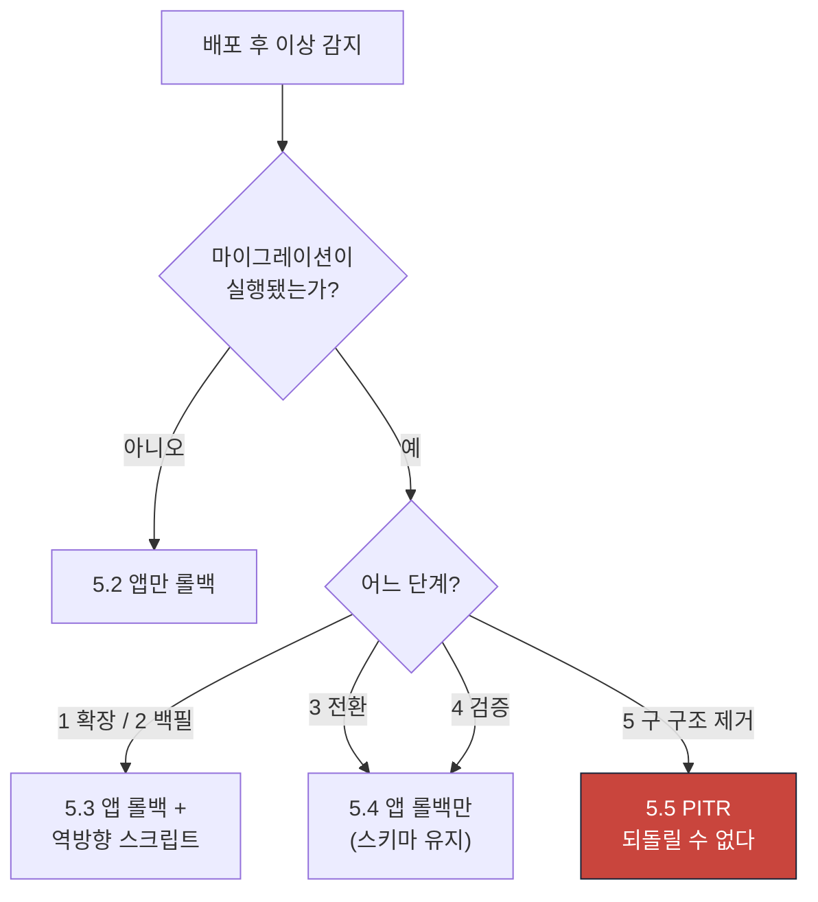

# RB-14 배포 실패와 DB 마이그레이션 롤백

| 항목 | 값 |
|---|---|
| 심각도 | **SEV1** (배포 후 SLO·불변 위반) / SEV2 (마이그레이션 실패, 서비스 정상) |
| 1차 담당 | 운영 엔지니어(OE) |
| 에스컬레이션 | 5분 미확인 → IC / 롤백 실패 → 경영진 + [RB-05](./05-db-failure-pitr.md) 병행 |
| 관련 SLO | O-01 가용성 99.9% · 전 불변 조건 |
| 관련 kill switch | 없음 (배포 롤백이 해결책) |
| 관련 문서 | [../phase0/backup-recovery.md](../phase0/backup-recovery.md) 8장 · [../phase0/failure-modes.md](../phase0/failure-modes.md) F-18 |

---

## 1. 탐지 조건

| 알림 | 조건 | 임계값 | 관측 창 | 심각도 |
|---|---|---|---|---|
| `deploy_slo_breach` | 배포 후 SLO 위반 | O-01·O-02·L-01·L-02 중 하나 | 배포 후 15분 | **SEV1** |
| `deploy_error_spike` | 5xx 응답률 | 배포 전 대비 3배 | 배포 후 10분 | **SEV1** |
| `deploy_invariant_violation` | 불변 조건 위반 | > 0 | 배포 후 즉시 검증 | **SEV1** |
| `deploy_smoke_failure` | 배포 스모크 테스트 | 실패 | 전환 전 | SEV2 (자동 차단) |
| `migration_failure` | 마이그레이션 러너 실패 | 1건 | 실행 시 | SEV2 |
| `migration_lock_timeout` | ACCESS EXCLUSIVE 잠금 대기 | > 5 s | 실행 중 | SEV2 |
| `migration_drift` | Drizzle 스키마 vs 실제 DB 차이 | > 0 | CI | SEV2 (배포 차단) |
| `rolling_incompatibility` | 구·신 버전 공존 중 계약 오류 | > 0 | 롤링 중 | **SEV1** |
| `trigger_disabled` | 트리거 `tgenabled='D'` | > 0 | 배포 후 검증 | **SEV1** |
| `rls_policy_missing_after_deploy` | RLS 정책 누락 | > 0 | 배포 후 검증 | **SEV1** (→ [RB-06](./06-cross-tenant-exposure.md)) |

---

## 2. 심각도 판정

| 조건 | 심각도 |
|---|---|
| 배포 후 불변 조건 위반 (특히 I-01·I-02·I-15) | **SEV1** |
| 배포 후 RLS 정책·트리거 소실 | **SEV1** (→ [RB-06](./06-cross-tenant-exposure.md)) |
| 배포 후 시험 시간대 SLO 위반 | **SEV1** (→ [RB-01](./01-exam-start-submit-failure.md)) |
| 배포 후 5xx 급증 | **SEV1** |
| 마이그레이션이 대형 테이블을 장시간 잠금 | **SEV1** (쓰기 중단) |
| 마이그레이션 실패, 트랜잭션 롤백됨, 서비스 정상 | SEV2 |
| 스모크 테스트 실패로 전환 차단 (정상 동작) | SEV2 |
| 스키마 드리프트 (CI에서 차단) | SEV3 |
| 롤링 중 일시적 계약 불일치, 자동 해소 | SEV3 |

---

## 3. 즉시 중지할 기능

**배포 롤백이 해결책이다. kill switch는 보조 수단이다.**

### 3.1 즉시 롤백 (블루·그린)

```bash
# 트래픽을 이전 버전으로 즉시 전환
# (배포 플랫폼 명령. 예: Vercel promote, 컨테이너 이전 리비전 활성화)
```

전환 시간 목표: **2분 이내.**

### 3.2 워커 롤백

```bash
# 워커는 별도 배포 단위. 함께 롤백한다.
# SIGTERM → 새 클레임 중단, 진행 작업 최대 120초 완료 대기 → 이전 이미지 기동
```

### 3.3 부하 경감 (롤백 중)

```bash
pnpm --filter @su-maek/db kill-switch enable ai_provider:anthropic --reason "RB-14 배포 롤백 중" --actor <이메일>
pnpm --filter @su-maek/db kill-switch enable document_export --reason "RB-14 배포 롤백 중" --actor <이메일>
```

**롤백해도 반드시 되는 것**:

- 시험 응시·답안 저장·제출
- 자동·수동 채점
- 오늘 운영실·일정 조회
- 기존 확정 데이터 전체

**절대 하지 않는 것**:

- 마이그레이션을 되돌리려고 `DROP COLUMN`을 성급히 실행 — 데이터가 사라진다
- 5단계(구 구조 제거) 마이그레이션을 롤백 시도 — **되돌릴 수 없다.** PITR만이 경로

---

## 4. 진단

### 4-1. 배포 전후 지표 비교

```sql
-- 배포 시각을 $deploy_at으로 두고 전후 30분 비교 (메트릭 백엔드에서도 확인)
SELECT CASE WHEN a.submitted_at < $deploy_at THEN 'before' ELSE 'after' END AS phase,
       count(*)                                    AS submissions,
       count(*) FILTER (WHERE a.status = 'finalized') AS finalized
FROM attempts a
WHERE a.submitted_at BETWEEN $deploy_at - interval '30 minutes'
                         AND $deploy_at + interval '30 minutes'
GROUP BY 1;
```

### 4-2. 마이그레이션 이력

```sql
SELECT version, name, applied_at, checksum, execution_ms, applied_by
FROM schema_migrations
ORDER BY applied_at DESC
LIMIT 15;
```

### 4-3. 스키마 드리프트

```bash
pnpm --filter @su-maek/db generate
git diff --exit-code packages/db/migrations/
```

diff가 비어야 정상. 비어 있지 않으면 코드와 DB가 어긋난 것이다.

### 4-4. 트리거 상태 (불변성의 최종 방어선)

```sql
SELECT c.relname AS table_name, t.tgname, t.tgenabled,
       CASE t.tgenabled
         WHEN 'O' THEN '활성'
         WHEN 'D' THEN '비활성 (위험)'
         WHEN 'R' THEN 'replica only'
         WHEN 'A' THEN 'always'
       END AS status
FROM pg_trigger t
JOIN pg_class c ON c.oid = t.tgrelid
JOIN pg_namespace n ON n.oid = c.relnamespace
WHERE n.nspname = 'public' AND NOT t.tgisinternal
  AND c.relname IN ('audit_events','mastery_evidences','grade_decisions',
                    'assessment_questions','route_versions','question_versions',
                    'sessions','responses','attempts')
ORDER BY 1, 2;
```

**`tgenabled='D'`가 하나라도 있으면 SEV1이다.**

### 4-5. RLS 정책 상태

```sql
SELECT c.relname AS table_without_rls
FROM pg_class c JOIN pg_namespace n ON n.oid = c.relnamespace
WHERE n.nspname = 'public' AND c.relkind IN ('r','p')
  AND EXISTS (SELECT 1 FROM pg_attribute a
              WHERE a.attrelid = c.oid AND a.attname = 'organization_id' AND a.attnum > 0)
  AND NOT c.relrowsecurity;
```

### 4-6. 진행 중인 잠금 (마이그레이션 중)

```sql
SELECT a.pid, a.state, now() - a.query_start AS duration,
       l.locktype, l.mode, c.relname,
       left(a.query, 150) AS query
FROM pg_locks l
JOIN pg_stat_activity a ON a.pid = l.pid
LEFT JOIN pg_class c ON c.oid = l.relation
WHERE l.mode IN ('AccessExclusiveLock','ExclusiveLock','ShareRowExclusiveLock')
  AND a.datname = current_database()
ORDER BY duration DESC;
```

### 4-7. 롤링 배포 중 계약 불일치

```sql
-- 구 버전이 이해하지 못하는 이벤트 스키마 버전
SELECT im.consumer_name, oe.event_type, oe.schema_version,
       im.outcome, count(*)
FROM inbox_messages im
JOIN outbox_events oe ON oe.id = im.event_id
WHERE im.processed_at > $deploy_at
GROUP BY 1,2,3,4
ORDER BY 5 DESC
LIMIT 30;
```

`outcome` 중 `skipped_unknown`이 급증하면 소비자가 새 `event_type`을 모르는 것이다(배포 순서 문제).

### 4-8. 불변 조건 전체

```bash
psql "$DATABASE_URL" -f packages/db/src/checks/invariants.sql
```

---

## 5. 복구 절차

### 5.1 결정 흐름



### 5.2 앱만 롤백 (마이그레이션 없음)

| # | 조치 | 예상 소요 |
|---|---|---|
| 1 | 트래픽을 이전 리비전으로 전환 | 2분 |
| 2 | 워커 이전 이미지로 전환 | 3분 |
| 3 | 지표 회복 확인 (4-1) | 10분 |
| 4 | 부하 경감 kill switch 해제 | 2분 |

가장 흔하고 가장 안전한 경로다.

### 5.3 앱 롤백 + 역방향 마이그레이션 (1·2단계)

확장(`ADD COLUMN`)과 백필은 **무해**하다. 급하게 되돌릴 필요가 없다.

| # | 조치 | 예상 소요 |
|---|---|---|
| 1 | 앱 롤백 (5.2) | 5분 |
| 2 | 지표 회복 확인 | 10분 |
| 3 | 원인 분석 후 필요하면 역방향 실행 | 10분 |

```bash
# 역방향 스크립트는 각 마이그레이션에 필수 첨부되어 있다
psql "$DATABASE_URL" -f packages/db/migrations/0042_add_column.down.sql
```

**권장**: 확장 단계는 되돌리지 않고 그대로 둔다. 새 컬럼이 NULL로 남아도 구 버전 앱은 무시한다.

### 5.4 앱 롤백만 (3·4단계 — 스키마 유지)

전환·검증 단계에서 문제가 생기면 **스키마는 그대로 두고 앱만 되돌린다.**

| # | 조치 | 예상 소요 |
|---|---|---|
| 1 | 앱 롤백 | 5분 |
| 2 | 구 버전이 새 스키마에서 정상 동작하는지 확인 | 10분 |
| 3 | 트리거·RLS 상태 확인 (4-4·4-5) | 5분 |
| 4 | 불변 조건 검증 (4-8) | 5분 |

**구 버전은 새 컬럼을 무시해도 동작해야 한다**(5단계 규약). 이것이 지켜졌다면 롤백이 안전하다.

### 5.5 PITR (5단계 — 구 구조 제거 후)

**되돌릴 수 없다.** 컬럼을 되살려도 데이터가 없다.

[RB-05](./05-db-failure-pitr.md) 5.5 절차를 따른다. 복원 시점은 **마이그레이션 실행 직전 − 60초**.

### 5.6 마이그레이션 실패 (트랜잭션 롤백됨)

자체 러너는 마이그레이션을 트랜잭션 단위로 실행하므로 **부분 적용이 없다.**

```bash
# 실패 원인 확인
pnpm --filter @su-maek/db migrate --dry-run

# 수정 후 재실행 (멱등하므로 안전)
pnpm --filter @su-maek/db migrate
```

실패 원인 분류:

| 원인 | 조치 |
|---|---|
| 문법 오류 | 수정 후 재실행 |
| 잠금 타임아웃 | 트래픽이 적은 시간대에 재실행. 또는 `CONCURRENTLY`로 전환 |
| 제약 위반 (기존 데이터가 새 제약 미충족) | 데이터 정리 배치 먼저 실행 → 제약 추가 |
| 의존 객체 부재 | 마이그레이션 순서 확인 |

### 5.7 트리거·RLS 복구

마이그레이션에서 트리거를 임시 비활성화한 뒤 복구를 잊으면 불변성이 깨진다.

```sql
-- 트리거 재활성
ALTER TABLE audit_events ENABLE TRIGGER audit_events_no_update;
ALTER TABLE audit_events ENABLE TRIGGER audit_events_no_delete;
ALTER TABLE assessment_questions ENABLE TRIGGER assessment_questions_immutable;
ALTER TABLE sessions ENABLE TRIGGER sessions_immutable_when_locked;
```

트리거가 아예 없으면 해당 `NNNNa_*.sql`을 재실행한다(멱등).

RLS는 [RB-06](./06-cross-tenant-exposure.md) 5.3의 DO 루프로 일괄 재적용한다.

### 5.8 롤링 중 계약 불일치 (4-7)

| 증상 | 원인 | 조치 |
|---|---|---|
| `skipped_unknown` 급증 | 발행자가 소비자보다 먼저 배포됨 | **정상.** 소비자 배포 후 자동 해소. 이벤트는 Outbox에 남아 있다 |
| 소비자 실패 (더 높은 `schema_version`) | 동일 | 동일. 재시도로 해소 |
| API 404·400 급증 | 클라이언트가 새 경로를 호출하는데 서버가 구 버전 | 서버를 먼저 배포하는 순서로 수정 |

**배포 순서 규칙**: 발행자·서버를 먼저, 소비자·클라이언트를 나중에.

### 5.9 큐 재개

```sql
UPDATE jobs
SET run_after = now() + (random() * interval '600 seconds')
WHERE status = 'queued' AND queue IN ('ai','render','schedule','default');
```

```bash
pnpm --filter @su-maek/db kill-switch disable ai_provider:anthropic --actor <이메일>
pnpm --filter @su-maek/db kill-switch disable document_export --actor <이메일>
```

---

## 6. 검증

| # | 항목 | 검증 명령·쿼리 | 통과 조건 |
|---|---|---|---|
| V-1 | **불변 조건 20개** | `psql -f packages/db/src/checks/invariants.sql` | 전부 0행 |
| V-2 | **트리거 활성** | 4-4 | 전부 `tgenabled='O'` |
| V-3 | **RLS 정책** | 4-5 | **0행** |
| V-4 | RLS 하네스 | `pnpm --filter @su-maek/db test:rls` | 통과 |
| V-5 | 스키마 드리프트 | 4-3 | diff 없음 |
| V-6 | 5xx 응답률 | 메트릭 대시보드 | 배포 전 수준 |
| V-7 | 지연 SLO | L-01·L-02 | 목표 이내 |
| V-8 | 제출·채점 | 4-1 | 배포 전후 처리율 동등 |
| V-9 | 이벤트 소비 | 4-7 | `skipped_unknown` 감소 추세 |
| V-10 | 큐 정상 | [RB-04](./04-queue-backlog-dlq.md) 4-1 | 전 큐 정상 |
| V-11 | 합성 모니터링 | SYN-1·SYN-2·SYN-3·SYN-4 | 전부 성공 |
| V-12 | 스모크 | `pnpm test:smoke` | 로그인 → 오늘 운영실 → 답안 제출 → 채점 확정 |
| V-13 | 계약 하위 호환 | `pnpm --filter @su-maek/contracts test:compat` | 통과 |
| V-14 | kill switch | `kill-switch list` | 전부 `false` |

---

## 7. 고객 공지

### 공지 필요 여부

| 조건 | 공지 |
|---|---|
| 배포로 5분 이상 서비스 중단 | **필수** |
| 배포로 데이터 손상·손실 | **필수** + 법률 검토 |
| 시험 시간대 배포로 응시 영향 | **필수** (영향 조직) |
| 롤백으로 5분 이내 복구, 사용자 영향 미미 | 불필요 |
| 마이그레이션 실패, 서비스 정상 | 불필요 |
| 스모크 실패로 전환 차단 (사용자 미노출) | 불필요 |

### 초기 공지

> **[수맥] 서비스 일시 오류 안내**
>
> 안녕하세요. 수맥 운영팀입니다.
>
> {UTC 시각}부터 약 {N}분간 **서비스 이용에 오류**가 발생했습니다.
>
> - 원인: 시스템 업데이트 중 발생한 문제
> - 영향: {구체적으로. 예: "일부 페이지 접속 오류, 답안 제출 실패"}
> - 조치: 이전 버전으로 즉시 되돌렸습니다.
>
> **현재 정상 동작 중입니다.**
>
> **확인 부탁드립니다**
> - 오류 시간에 시도하신 작업이 정상 반영되었는지 확인해 주세요.
> - 답안 제출이 실패한 학생이 있다면 다시 제출하도록 안내해 주세요. **임시 저장된 답안은 보존되어 있습니다.**
>
> {시험 시간대였다면: "영향받은 시험의 마감 시각을 {N}분 연장했습니다."}

### 해소 공지 (별도 필요 시)

> **[수맥] 서비스 정상화 확인 안내**
>
> | 항목 | 내용 |
> |---|---|
> | 오류 시간 | {시작} ~ {종료} (총 {N}분) |
> | 원인 | 시스템 업데이트 회귀 |
> | 데이터 손실 | 없음 |
> | 조치 | 이전 버전으로 롤백 후 전체 검증 완료 |
>
> 배포 절차를 보완해 재발을 방지하겠습니다. 불편을 드려 죄송합니다.

---

## 8. 법률·규제 검토

| 조건 | 검토 필요 | 사유 |
|---|---|---|
| 배포로 데이터 손실·손상 | **필요** | 계약상 데이터 보전 의무 |
| RLS·트리거 소실로 격리·불변성이 깨진 시간 존재 | **필요** | [RB-06](./06-cross-tenant-exposure.md) 병행. 노출 여부 판단 |
| 시험 중 배포로 응시 기회 상실 | **필요** | 평가 공정성 |
| 5분 이내 롤백, 손실 없음 | 불필요 | — |
| 마이그레이션 실패, 서비스 정상 | 불필요 | — |

---

## 9. 사후 조치

- [ ] 사후 분석 작성 (SEV1 기준, 영업일 5일)
- [ ] **배포 전 스모크 테스트가 이 문제를 왜 못 잡았는가.** 스모크에 케이스를 추가했는가
- [ ] 카나리·블루그린 자동 롤백이 작동했는가. 임계값(SLO 위반 15분)이 적절했는가
- [ ] **배포 후 불변 조건 검증이 자동으로 실행되는가.** 없으면 배포 파이프라인에 추가
- [ ] **배포 후 트리거·RLS 존재 검증이 자동인가** (V-2·V-3). 없으면 추가
- [ ] 마이그레이션에 **역방향 스크립트가 첨부**되어 있었는가. CI 게이트가 확인하는가
- [ ] 대형 테이블 잠금 시간을 스테이징에서 사전 측정했는가 (1/10 규모 × 10)
- [ ] 5단계 규약(확장 → 백필 → 전환 → 검증 → 제거)을 건너뛰지 않았는가
- [ ] 4단계 검증 관찰 기간(7일)을 지켰는가
- [ ] 롤링 배포 계약 테스트(구·신 공존)가 CI에 있는가
- [ ] 배포 순서(발행자·서버 먼저, 소비자·클라이언트 나중)를 지켰는가
- [ ] **시험 시간대에 배포하지 않는 규칙**이 있는가. 없으면 배포 창을 정의
- [ ] 롤백 소요 시간이 목표(2분)를 지켰는가
- [ ] 스키마 드리프트 CI 게이트가 작동했는가
- [ ] 오류 예산 소진율 기록. 50% 초과 시 배포 제동 적용
