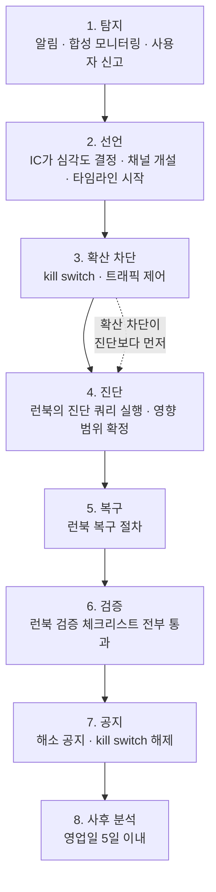

# 수맥 운영 런북

> 골프롬프트 28장(운영 런북 14종) 이행 문서.
> 관련: [../phase0/failure-modes.md](../phase0/failure-modes.md) · [../phase0/slo.md](../phase0/slo.md) · [../phase0/backup-recovery.md](../phase0/backup-recovery.md)

---

## 1. 런북 색인

| # | 런북 | 기본 심각도 | 주 kill switch |
|---|---|---|---|
| RB-01 | [시험 시작·제출 장애](./01-exam-start-submit-failure.md) | SEV1 | 없음 (기능 유지가 목표) |
| RB-02 | [잘못된 일정 대량 생성](./02-mass-wrong-schedule.md) | SEV1 | `auto_reschedule` |
| RB-03 | [AI·OCR 중단과 비용 폭주](./03-ai-ocr-outage-cost.md) | SEV2 | `ai_provider:<name>` |
| RB-04 | [큐 적체·워커·DLQ](./04-queue-backlog-dlq.md) | SEV2 | `ai_provider:<name>`, `document_export` |
| RB-05 | [DB 장애와 시점 복구](./05-db-failure-pitr.md) | SEV1 | 없음 |
| RB-06 | [교차 테넌트 노출 의심](./06-cross-tenant-exposure.md) | SEV1 | 없음 (증거 보존 우선) |
| RB-07 | [계정 탈취·비밀 유출·악성 업로드](./07-account-takeover-malicious-upload.md) | SEV1 | `ai_provider:<name>`, `auto_publish_questions` |
| RB-08 | [콘텐츠 권한 만료·긴급 게시 중단](./08-content-rights-emergency-stop.md) | SEV2 | `auto_publish_questions` |
| RB-09 | [잘못된 교육과정 매핑·릴리스 롤백](./09-curriculum-mapping-rollback.md) | SEV2 | `curriculum_release` |
| RB-10 | [학생 화면 수식 깨짐·렌더러 긴급 롤백](./10-formula-render-rollback.md) | SEV1 | `formula_autofix`, `auto_publish_questions` |
| RB-11 | [PDF·HWPX 대량 출력 오류](./11-document-export-failure.md) | SEV3 | `document_export` |
| RB-12 | [잘못된 자동 채점과 재처리](./12-wrong-autograding-reprocess.md) | SEV1 | `auto_grading` |
| RB-13 | [알림 제공자 장애](./13-notification-provider-outage.md) | SEV3 | `external_notifications` |
| RB-14 | [배포 실패와 마이그레이션 롤백](./14-deploy-migration-rollback.md) | SEV1 | 없음 |

### 1.1 평시 절차 (장애 아님)

| # | 절차 | 주 kill switch |
|---|---|---|
| RB-15 | [교육과정 릴리스 발행·원문 대조·차이 계산](./15-curriculum-release-publish.md) | `curriculum_release` |

---

## 2. 심각도 정의

| 등급 | 정의 | 탐지 목표 | 대응 착수 | 통지 |
|---|---|---|---|---|
| **SEV1** | 학습·평가의 핵심 기능이 중단되었거나, 데이터 무결성·테넌트 격리가 깨졌을 가능성이 있다 | **5분 이내** | 즉시(24시간) | 30분 내 고객 공지 |
| **SEV2** | 일부 기능이 중단되었거나 SLO를 명백히 위반하고 있다. 우회 수단이 있다 | 15분 이내 | 30분 이내(업무 시간) / 2시간(야간) | 2시간 내 영향 조직 공지 |
| **SEV3** | 성능 저하 또는 비핵심 기능 장애. 사용자가 업무를 계속할 수 있다 | 1시간 이내 | 다음 영업일 | 필요 시 |
| **SEV4** | 관측·위생 문제. 사용자 영향 없음 | — | 백로그 | 없음 |

### 2.1 SEV1 자동 승격 조건

다음 중 하나라도 참이면 초기 심각도와 무관하게 **SEV1**이다.

- 시험 시간대에 제출 실패율 > 0.05% (5분 창, 최소 100건)
- 불변 조건 I-01(테넌트 격리) 또는 I-15(감사 불변) 위반 > 0
- 게시 콘텐츠에서 `katex-error`·원시 LaTeX 노출 > 0
- 성공 응답한 답안 제출의 유실 의심
- 자동 채점 골드셋 정확도 < 99.99%
- 1시간 내 `sessions` 변경 > 5,000건
- 개인정보 또는 시험 전 문항·정답의 외부 노출 의심

---

## 3. 대응 역할

| 역할 | 책임 | 하지 않는 것 |
|---|---|---|
| **인시던트 지휘자 (IC)** | 심각도 선언, 역할 배정, 타임라인 기록, 종료 선언, 에스컬레이션 판단 | 직접 손을 대지 않는다 (판단에 집중) |
| **운영 엔지니어 (OE)** | 진단 쿼리 실행, kill switch 전환, 복구 절차 수행, 검증 | 심각도·공지 여부를 혼자 결정하지 않는다 |
| **도메인 소유자 (DO)** | 해당 도메인(일정·채점·콘텐츠·교육과정)의 영향 판단, 재채점·롤백 승인 | 인프라 조작 |
| **공지 담당 (COM)** | 고객 공지 작성·발송, 문의 대응, 상태 페이지 갱신 | 기술 판단 |

1인이 여러 역할을 겸할 수 있으나 **IC와 OE는 반드시 분리**한다. 손을 대는 사람과 판단하는 사람이 같으면 터널 비전에 빠진다.

---

## 4. 공통 진입 절차



### 4.1 선언 시 기록할 것

```
[SEV_] <한 줄 요약>
탐지: <알림 이름 또는 신고 경로> / <시각 UTC>
IC: <이름>  OE: <이름>  DO: <이름>  COM: <이름>
영향 추정: <조직 수> / <학생 수> / <기능>
관련 런북: RB-__
```

이후 모든 조치를 **시각과 함께** 같은 채널에 남긴다. 사후 분석의 타임라인이 된다.

### 4.2 확산 차단이 진단보다 먼저다

원인을 모르더라도 **피해가 커지는 것을 먼저 멈춘다.** kill switch를 켜는 것은 되돌리기 쉽고, 잘못 켰을 때의 비용이 낮다. 진단하느라 10분 더 잘못된 일정을 생성하는 것보다 낫다.

예외: **RB-06(교차 테넌트 노출)은 증거 보존이 우선**이다. 자동 삭제·정리를 하지 않는다.

---

## 5. Kill switch 9종

> **키 이름 주의**: 아래 5개(`auto_reschedule`·`auto_publish_questions`·`curriculum_release`·`formula_autofix`·`external_notifications`)는 코드의 실제 키 이름과 다르다. CLI가 별칭으로 받아 주므로 이 표에서 복사한 명령도 동작한다(`packages/db/scripts/kill-switch.mts`의 `RUNBOOK_ALIASES`). 이름 통일은 T6.4의 몫이다. `auto_assessment_generation`은 코드와 같은 이름이다.

| 키 | 중지 대상 | **중지해도 반드시 되는 것** |
|---|---|---|
| `auto_reschedule` | 일정 변경안 자동 생성·자동 적용 | 수동 일정 편집, 기존 활성 일정 조회·운영, 수동 preview·apply |
| `auto_publish_questions` | 문항 자동 게시 | 수동 게시, 문제은행 조회, 이미 게시된 문항의 출제 |
| `auto_grading` | 자동 채점 워커 | 답안 제출·저장, 수동 채점, 예외 처리, 기존 확정 점수 조회 |
| `auto_assessment_generation` | 일일·확인테스트 **자동** 생성 (워커 생산자·`assessment.generate`) | 교사가 화면에서 직접 누르는 생성, 이미 생성된 테스트의 응시·채점·조회. 중지 중 만들어진 작업은 없고, 이미 큐에 있던 작업은 **버리지 않고** 재개 후 실행된다 |
| `curriculum_release` | 교육과정 릴리스 발행 | 활성 릴리스 읽기, 개념 그래프 탐색, 매핑 검수 |
| `formula_autofix` | 무손실 자동 보정 규칙 | 수식 파싱·KaTeX 검증, 수동 수정, 이미 정규화된 수식 렌더 |
| `document_export` | PDF·HWPX 출력 | **온라인 응시**, 웹 미리보기, 이미 생성된 산출물 다운로드 |
| `external_notifications` | 외부 알림 발송 | 앱 내 업무함 전체, 알림 생성·조회·처리 |
| `ai_provider:<name>` | 해당 AI 공급자 호출 | 게시 콘텐츠, 검수 완료 문제은행, 응시, 수동 채점, 다른 공급자 |

### 5.1 전환 명령

```bash
# 켜기
pnpm --filter @su-maek/db kill-switch enable auto_grading \
  --reason "RB-12 SEV1 자동 채점 정확도 하락" --actor ops@example.com

# 끄기
pnpm --filter @su-maek/db kill-switch disable auto_grading --actor ops@example.com

# 현재 상태
pnpm --filter @su-maek/db kill-switch list
```

SQL 직접 실행(도구를 쓸 수 없을 때):

```sql
UPDATE kill_switches
SET enabled = true, enabled_by = $1, reason = $2, enabled_at = now(), updated_at = now()
WHERE key = $3;
```

### 5.2 사용 규약

| # | 규약 |
|---|---|
| 1 | 전환은 즉시 반영(워커·web 5초 캐시). **캐시 조회 실패 시 안전 방향(ON으로 간주)** |
| 2 | 전환 시 `audit_events`에 `action='ops.kill_switch'` 자동 기록 |
| 3 | ON인 kill switch가 있으면 **오늘 운영실 상단에 상시 배너**. 켜둔 채 잊는 것을 막는다 |
| 4 | 관련 API는 `403 KILL_SWITCH_ENABLED` + 사유와 재개 예정 시각 |
| 5 | 큐에 있던 작업은 **삭제하지 않는다.** `queued` 유지, `run_after` 연기 |
| 6 | 재개 시 `run_after`에 0~600초 지터를 주어 몰림 방지 |
| 7 | 전역이다. 조직별 제어가 필요하면 `feature_flags` |
| 8 | 전환 권한: 워크스페이스 소유자 + 재인증. 운영자는 break-glass 경로 |

---

## 6. 에스컬레이션 시간표

| 경과 | SEV1 | SEV2 | SEV3 |
|---|---|---|---|
| 0분 | 알림 발화 | 알림 발화 | 알림 발화 |
| 5분 | 미확인 시 IC 자동 호출 | — | — |
| 15분 | 진전 없으면 도메인 소유자 소집 | 미확인 시 담당자 호출 | — |
| 30분 | **고객 공지 발송.** 진전 없으면 SEV1 유지 재확인 | 도메인 소유자 소집 | — |
| 1시간 | 경영진 통지. 외부 지원(Supabase 지원 티켓) 검토 | **영향 조직 공지** | 담당자 확인 |
| 2시간 | 전면 대응 체제. 교대 인원 투입 | 경영진 통지 | — |
| 4시간 | RTO(60분) 대폭 초과 — 대체 운영 방안 결정 | SEV1 승격 검토 | 다음 영업일 처리 |

**알림 5분 미확인 시 자동 에스컬레이션.** 동일 조건 재발화는 30분 억제한다.

---

## 7. 고객 공지 원칙

| # | 원칙 |
|---|---|
| 1 | **추측하지 않는다.** 확인된 사실만 쓴다 |
| 2 | 영향 범위를 구체적으로 (어떤 기능, 어느 시간대, 어떤 조직) |
| 3 | **사용자가 지금 할 수 있는 일**을 반드시 포함 |
| 4 | 다음 갱신 시각을 약속하고 지킨다 |
| 5 | 데이터 유실이 있으면 숨기지 않는다 |
| 6 | 원인 설명은 해소 공지 또는 사후 분석에서 |
| 7 | 개인정보·시험 문항이 관련되면 **발송 전 법률 검토** |

공통 템플릿은 각 런북 7장에 있다.

---

## 8. 사후 분석

SEV1·SEV2는 **영업일 5일 이내** 비난 없는 사후 분석을 작성한다.

```markdown
# 사후 분석 — <제목>

## 요약
<3문장 이내. 무슨 일이, 누구에게, 얼마나>

## 영향
| 항목 | 값 |
|---|---|
| 기간 | UTC ~ |
| 영향 조직 | 개 |
| 영향 학생 | 명 |
| 손실 데이터 | (없으면 "없음") |
| SLO 오류 예산 소진 | % |

## 타임라인 (UTC)
| 시각 | 사건 |
|---|---|

## 실제 원인
<기여 요인을 전부. "사람의 실수"에서 멈추지 않고 왜 그 실수가 가능했는지까지>

## 탐지 실패
<더 빨리 알 수 있었는가. 왜 못 알았는가>

## 복구
<무엇이 효과가 있었나. 런북이 맞았나>

## 재발 방지
| # | 조치 | 담당 | 기한 | 유형 |
|---|---|---|---|---|
| 1 | | | | 탐지 / 방지 / 완화 / 런북 |

## 잘 된 것
<의도적으로 기록한다. 좋은 관행을 강화하기 위해>
```

**재발 방지 항목은 반드시 담당자와 기한을 가진다.** 기한 없는 항목은 실행되지 않는다.

---

## 9. 상시 참조 값

| 항목 | 값 |
|---|---|
| RPO / RTO(핵심) / RTO(OCR·AI) | 5분 / 60분 / 4시간 |
| 교사용 핵심 API 가용성 | 99.9% (오류 예산 43분 12초 / 30일) |
| 시험 시간대 시작·제출 | 99.95% |
| 답안 제출 접수 | p95 1초 / p99 2.5초 |
| 오늘 운영실 | p95 1.5초 / p99 3초 |
| 일반 조회 / 명령 | p95 400ms / 800ms |
| 반 재계산(50명·1,000건) | 95% 60초 / 99% 5분 |
| 30문항 테스트 생성 | 95% 2분 / 99% 10분 |
| 100페이지 OCR 초벌 | 95% 20분 |
| 30문항 KaTeX 검증 | 95% 5초 / 99% 15초 |
| 30문항 PDF·HWPX 출력 | 95% 2분 / 99% 10분 |
| 접수 완료 비동기 작업 유실 | 0건 |
| 자동 채점 정확도(골드셋) | 99.99% |
| 게시 콘텐츠 원시 LaTeX·katex-error | 0건 |
| SEV1 탐지 | 5분 |
| 답안 쓰기 피크 / 설계 수용 | 875 RPS / 1,000 RPS |
| 워크스페이스 / 활성 학생 / 피크 동시 응시 | 2,500 / 200,000 / 20,000 |
| AI 예산 (조직 / 전체) | 1일 USD 20 / USD 4,000 |
| PITR 보존 | 35일 |

---

## 10. 진단 공통 명령

```bash
# 워커 상태
pnpm --filter @su-maek/worker status

# kill switch 현황
pnpm --filter @su-maek/db kill-switch list

# 검사 31건 일괄 검증 — 불변 I-01~I-22 + 참조·위생 R-01~R-09 (전부 0행이어야 정상)
psql "$DATABASE_URL" -f packages/db/src/checks/invariants.sql

# 복구 후 검증
node scripts/verify-recovery.mjs

# 읽기 모델 재생성
node scripts/rebuild-read-models.mjs
```

```sql
-- 큐 전반 상태
SELECT queue, status, count(*),
       max(now() - created_at) AS oldest_wait
FROM jobs
WHERE created_at > now() - interval '6 hours'
GROUP BY 1, 2 ORDER BY 1, 2;

-- Outbox 적체
SELECT status, count(*), max(now() - created_at) AS oldest
FROM outbox_events
WHERE status IN ('pending','failed')
GROUP BY 1;

-- 조직별 활성 작업 (공정성 확인)
SELECT organization_id, queue, count(*) AS running
FROM jobs WHERE status = 'running'
GROUP BY 1, 2 ORDER BY 3 DESC LIMIT 20;
```
